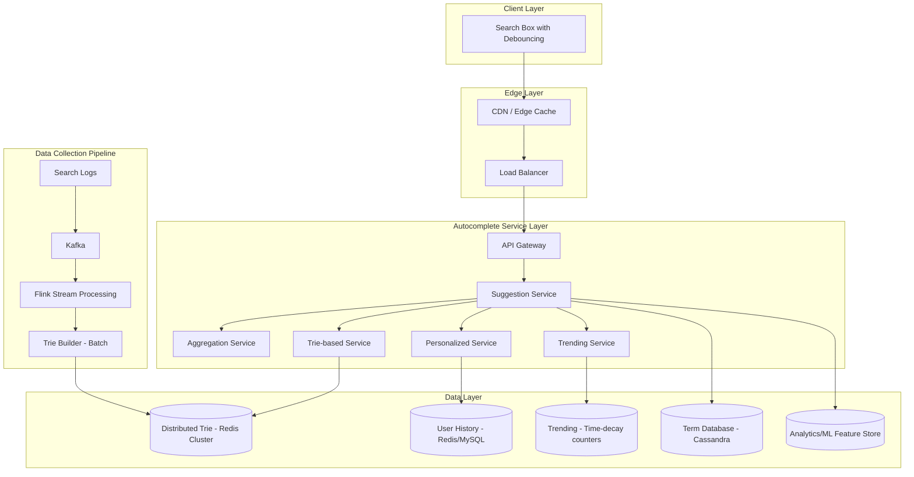

# Design Search Autocomplete / Typeahead

## Problem Statement

Design a search autocomplete system (typeahead) that provides real-time suggestions as users type in a search box.

## Requirements

### Functional Requirements
1. Return top suggestions as user types each character
2. Suggestions ranked by popularity/relevance
3. Support prefix matching
4. Handle misspellings (fuzzy matching)
5. Personalized suggestions based on user history
6. Trending searches
7. Real-time updates for new popular queries

### Non-Functional Requirements
- **Latency**: < 100ms per keystroke
- **Availability**: 99.99% uptime
- **Scale**: 10B queries/day, 100K QPS peak
- **Freshness**: New trending terms within minutes

## Capacity Estimation

### Traffic
- 10B queries/day = 115K queries/second
- Each query: average 4 keystrokes = 460K autocomplete requests/second
- Peak: 2x average = 920K requests/second

### Storage
- 100M unique search terms
- Average term length: 20 characters
- Terms: 100M × 20 bytes = 2 GB
- With metadata (counts, timestamps): 10 GB
- Trie index: ~50 GB (with all prefixes)

## High-Level Architecture




## Core Components

### 1. Trie Data Structure

Efficient prefix-based suggestion retrieval.

```python
class TrieNode:
    def __init__(self):
        self.children = {}
        self.is_end = False
        self.term = None
        self.frequency = 0
        self.top_suggestions = []  # Pre-computed top-k for this prefix

class Trie:
    def __init__(self, k: int = 10):
        self.root = TrieNode()
        self.k = k  # Number of top suggestions to store

    def insert(self, term: str, frequency: int):
        """Insert term with frequency."""
        node = self.root
        prefix = ""

        for char in term.lower():
            prefix += char

            if char not in node.children:
                node.children[char] = TrieNode()

            node = node.children[char]

            # Update top suggestions for this prefix
            self._update_top_suggestions(node, term, frequency)

        node.is_end = True
        node.term = term
        node.frequency = frequency

    def _update_top_suggestions(self, node: TrieNode,
                                term: str, frequency: int):
        """Maintain top-k suggestions at each node."""
        # Remove existing entry for this term if present
        node.top_suggestions = [
            s for s in node.top_suggestions if s[1] != term
        ]

        # Add new entry
        node.top_suggestions.append((frequency, term))

        # Sort by frequency (descending) and keep top k
        node.top_suggestions.sort(reverse=True)
        node.top_suggestions = node.top_suggestions[:self.k]

    def get_suggestions(self, prefix: str) -> List[str]:
        """Get top suggestions for a prefix."""
        node = self._find_prefix_node(prefix.lower())

        if node is None:
            return []

        return [term for _, term in node.top_suggestions]

    def _find_prefix_node(self, prefix: str) -> Optional[TrieNode]:
        """Find the node corresponding to a prefix."""
        node = self.root

        for char in prefix:
            if char not in node.children:
                return None
            node = node.children[char]

        return node

    def update_frequency(self, term: str, delta: int = 1):
        """Increment frequency for a term."""
        node = self.root
        path = []  # Track nodes for updating suggestions

        for char in term.lower():
            if char not in node.children:
                # Term doesn't exist, insert it
                self.insert(term, delta)
                return

            node = node.children[char]
            path.append(node)

        if node.is_end:
            node.frequency += delta

            # Update all prefix nodes
            for prefix_node in path:
                self._update_top_suggestions(prefix_node, term, node.frequency)
```

### 2. Distributed Trie Service

Redis-based distributed trie implementation.

```python
class DistributedTrieService:
    """Redis-based distributed trie for autocomplete."""

    def __init__(self):
        self.redis = RedisCluster()
        self.local_cache = LRUCache(maxsize=10000)

    async def get_suggestions(self, prefix: str,
                             limit: int = 10) -> List[Suggestion]:
        """Get autocomplete suggestions for prefix."""
        prefix = prefix.lower().strip()

        if not prefix:
            return []

        # Check local cache
        cache_key = f"ac:{prefix}"
        if cache_key in self.local_cache:
            return self.local_cache[cache_key]

        # Query Redis sorted set
        suggestions = await self.redis.zrevrange(
            f"suggestions:{prefix}",
            0,
            limit - 1,
            withscores=True
        )

        if suggestions:
            result = [
                Suggestion(term=term, score=score)
                for term, score in suggestions
            ]
            self.local_cache[cache_key] = result
            return result

        # Fallback: find suggestions from shorter prefixes
        # and filter client-side
        result = await self._fallback_search(prefix, limit)
        self.local_cache[cache_key] = result
        return result

    async def _fallback_search(self, prefix: str,
                              limit: int) -> List[Suggestion]:
        """Search from shorter prefix if exact prefix not found."""
        # Try progressively shorter prefixes
        for i in range(len(prefix) - 1, 0, -1):
            shorter = prefix[:i]
            suggestions = await self.redis.zrevrange(
                f"suggestions:{shorter}",
                0,
                limit * 5,  # Get more to filter
                withscores=True
            )

            if suggestions:
                # Filter to matching prefix
                filtered = [
                    Suggestion(term=term, score=score)
                    for term, score in suggestions
                    if term.lower().startswith(prefix)
                ][:limit]

                if filtered:
                    return filtered

        return []

    async def index_term(self, term: str, score: float):
        """Index a term for autocomplete."""
        term_lower = term.lower()

        # Add to sorted set for each prefix
        pipeline = self.redis.pipeline()

        for i in range(1, len(term_lower) + 1):
            prefix = term_lower[:i]
            pipeline.zadd(f"suggestions:{prefix}", {term: score})

            # Keep only top 100 per prefix
            pipeline.zremrangebyrank(f"suggestions:{prefix}", 0, -101)

        await pipeline.execute()

    async def update_score(self, term: str, delta: float):
        """Update term's score (e.g., after a search)."""
        term_lower = term.lower()

        pipeline = self.redis.pipeline()

        for i in range(1, len(term_lower) + 1):
            prefix = term_lower[:i]
            pipeline.zincrby(f"suggestions:{prefix}", delta, term)

        await pipeline.execute()

        # Invalidate local cache for affected prefixes
        for i in range(1, len(term_lower) + 1):
            cache_key = f"ac:{term_lower[:i]}"
            self.local_cache.pop(cache_key, None)
```

### 3. Suggestion Service

Orchestrates multiple suggestion sources.

```python
class SuggestionService:
    def __init__(self):
        self.trie_service = DistributedTrieService()
        self.personalization = PersonalizationService()
        self.trending = TrendingService()
        self.spell_checker = SpellChecker()

    async def get_suggestions(self, request: SuggestionRequest) -> SuggestionResponse:
        """Get aggregated suggestions from multiple sources."""
        prefix = request.prefix
        user_id = request.user_id
        limit = request.limit or 10

        # Parallel fetch from all sources
        tasks = [
            self.trie_service.get_suggestions(prefix, limit),
            self.trending.get_trending_with_prefix(prefix, limit // 2),
        ]

        # Add personalized suggestions if user is logged in
        if user_id:
            tasks.append(
                self.personalization.get_user_suggestions(user_id, prefix, limit)
            )

        results = await asyncio.gather(*tasks, return_exceptions=True)

        # Aggregate and rank
        trie_suggestions = results[0] if not isinstance(results[0], Exception) else []
        trending_suggestions = results[1] if not isinstance(results[1], Exception) else []
        personal_suggestions = results[2] if len(results) > 2 and not isinstance(results[2], Exception) else []

        # Merge with scoring
        merged = self._merge_suggestions(
            trie=trie_suggestions,
            trending=trending_suggestions,
            personal=personal_suggestions,
            limit=limit
        )

        # Check for spelling suggestions if few results
        if len(merged) < 3:
            corrections = await self.spell_checker.suggest(prefix)
            merged = self._add_spell_suggestions(merged, corrections)

        return SuggestionResponse(
            suggestions=merged[:limit],
            query_time_ms=(time.time() - start) * 1000
        )

    def _merge_suggestions(self, trie: List, trending: List,
                          personal: List, limit: int) -> List[Suggestion]:
        """Merge suggestions with weighted scoring."""
        seen = set()
        merged = []

        # Weight factors
        PERSONAL_BOOST = 2.0
        TRENDING_BOOST = 1.5
        TRIE_BASE = 1.0

        # Add personalized first (highest priority)
        for sugg in personal:
            if sugg.term.lower() not in seen:
                sugg.score *= PERSONAL_BOOST
                sugg.source = 'personal'
                merged.append(sugg)
                seen.add(sugg.term.lower())

        # Add trending
        for sugg in trending:
            if sugg.term.lower() not in seen:
                sugg.score *= TRENDING_BOOST
                sugg.source = 'trending'
                merged.append(sugg)
                seen.add(sugg.term.lower())

        # Add trie-based
        for sugg in trie:
            if sugg.term.lower() not in seen:
                sugg.score *= TRIE_BASE
                sugg.source = 'popular'
                merged.append(sugg)
                seen.add(sugg.term.lower())

        # Sort by final score
        merged.sort(key=lambda x: x.score, reverse=True)

        return merged[:limit]
```

### 4. Trending Service

Tracks trending searches in real-time.

```python
class TrendingService:
    """Tracks and serves trending search terms."""

    def __init__(self):
        self.redis = RedisClient()
        self.decay_factor = 0.9  # Hourly decay

    async def record_search(self, term: str):
        """Record a search for trending calculation."""
        term_lower = term.lower()
        hour_bucket = self._get_hour_bucket()

        # Increment count in current hour bucket
        await self.redis.zincrby(
            f"trending:{hour_bucket}",
            1.0,
            term_lower
        )

        # Set expiry (keep 24 hours of data)
        await self.redis.expire(f"trending:{hour_bucket}", 86400)

    async def get_trending(self, limit: int = 10) -> List[Suggestion]:
        """Get current trending searches with time decay."""
        current_hour = self._get_hour_bucket()

        # Get last 24 hours of data with decay
        scores = {}

        for hours_ago in range(24):
            bucket = current_hour - hours_ago
            decay = self.decay_factor ** hours_ago

            terms = await self.redis.zrevrange(
                f"trending:{bucket}",
                0, 100,
                withscores=True
            )

            for term, count in terms:
                if term not in scores:
                    scores[term] = 0
                scores[term] += count * decay

        # Sort by decayed score
        sorted_terms = sorted(scores.items(), key=lambda x: x[1], reverse=True)

        return [
            Suggestion(term=term, score=score, source='trending')
            for term, score in sorted_terms[:limit]
        ]

    async def get_trending_with_prefix(self, prefix: str,
                                       limit: int) -> List[Suggestion]:
        """Get trending searches matching a prefix."""
        # Get all trending, then filter
        all_trending = await self.get_trending(limit * 10)

        matching = [
            s for s in all_trending
            if s.term.startswith(prefix.lower())
        ]

        return matching[:limit]

    def _get_hour_bucket(self) -> int:
        """Get current hour bucket (Unix hour)."""
        return int(time.time() / 3600)


class TrendingAggregator:
    """Aggregates trending data in real-time using Flink/Spark Streaming."""

    def __init__(self):
        self.kafka_consumer = KafkaConsumer('search-queries')
        self.redis = RedisClient()

    async def process_stream(self):
        """Process search query stream for trending."""
        # Window: 1 minute tumbling windows
        window_counts = {}
        window_start = time.time()
        WINDOW_SIZE = 60  # seconds

        async for message in self.kafka_consumer:
            query = message.value['query']
            timestamp = message.value['timestamp']

            # Check if window has passed
            if time.time() - window_start > WINDOW_SIZE:
                await self._flush_window(window_counts)
                window_counts = {}
                window_start = time.time()

            # Increment count
            query_lower = query.lower()
            window_counts[query_lower] = window_counts.get(query_lower, 0) + 1

    async def _flush_window(self, counts: dict):
        """Flush window aggregates to trending service."""
        hour_bucket = int(time.time() / 3600)

        pipeline = self.redis.pipeline()

        for term, count in counts.items():
            pipeline.zincrby(f"trending:{hour_bucket}", count, term)

        await pipeline.execute()
```

### 5. Personalization Service

Provides personalized suggestions based on user history.

```python
class PersonalizationService:
    def __init__(self):
        self.redis = RedisClient()
        self.db = DatabaseClient()

    async def get_user_suggestions(self, user_id: str, prefix: str,
                                   limit: int) -> List[Suggestion]:
        """Get personalized suggestions based on user history."""
        # Get user's recent searches
        recent = await self.redis.zrevrange(
            f"user:{user_id}:searches",
            0, 99,
            withscores=True
        )

        if not recent:
            return []

        # Filter by prefix
        matching = [
            Suggestion(term=term, score=score, source='history')
            for term, score in recent
            if term.lower().startswith(prefix.lower())
        ]

        return matching[:limit]

    async def record_search(self, user_id: str, query: str):
        """Record user's search for personalization."""
        query_lower = query.lower()
        timestamp = time.time()

        # Add to user's search history with timestamp as score
        await self.redis.zadd(
            f"user:{user_id}:searches",
            {query_lower: timestamp}
        )

        # Keep only recent 1000 searches
        await self.redis.zremrangebyrank(
            f"user:{user_id}:searches",
            0, -1001
        )

        # Also increment frequency for repeated searches
        await self.redis.zincrby(
            f"user:{user_id}:search_freq",
            1,
            query_lower
        )

    async def get_user_history(self, user_id: str,
                              limit: int = 10) -> List[str]:
        """Get user's recent unique searches."""
        recent = await self.redis.zrevrange(
            f"user:{user_id}:searches",
            0, limit - 1
        )
        return recent
```

### 6. Trie Builder Service

Batch process to rebuild trie from search logs.

```python
class TrieBuilderService:
    """Batch job to rebuild autocomplete trie."""

    def __init__(self):
        self.db = DatabaseClient()
        self.redis = RedisCluster()
        self.s3 = S3Client()

    async def build_trie(self):
        """Build complete trie from aggregated search data."""
        # Read aggregated search counts
        search_counts = await self._load_search_counts()

        # Build in-memory trie
        trie = Trie(k=100)

        for term, count in search_counts.items():
            trie.insert(term, count)

        # Export to Redis
        await self._export_to_redis(trie)

        # Save snapshot to S3
        await self._save_snapshot(trie)

    async def _load_search_counts(self) -> Dict[str, int]:
        """Load aggregated search counts from data warehouse."""
        # Query last 30 days of search data
        result = await self.db.execute("""
            SELECT query, COUNT(*) as count
            FROM search_logs
            WHERE timestamp > NOW() - INTERVAL 30 DAY
            GROUP BY query
            HAVING count > 10
            ORDER BY count DESC
            LIMIT 10000000
        """)

        return {row['query']: row['count'] for row in result}

    async def _export_to_redis(self, trie: Trie):
        """Export trie to Redis for serving."""
        # Use new key prefix for atomic swap
        new_prefix = f"suggestions_new:{int(time.time())}"

        def traverse(node: TrieNode, prefix: str):
            """DFS traversal to export each prefix."""
            if node.top_suggestions:
                # Store top suggestions for this prefix
                yield (
                    f"{new_prefix}:{prefix}",
                    {term: score for score, term in node.top_suggestions}
                )

            for char, child in node.children.items():
                yield from traverse(child, prefix + char)

        # Export in batches
        batch = []
        for key, members in traverse(trie.root, ""):
            batch.append((key, members))

            if len(batch) >= 1000:
                await self._write_batch(batch)
                batch = []

        if batch:
            await self._write_batch(batch)

        # Atomic key swap
        await self._swap_keys(new_prefix, "suggestions")

    async def _write_batch(self, batch: List[Tuple[str, Dict]]):
        """Write batch of prefix -> suggestions mappings."""
        pipeline = self.redis.pipeline()

        for key, members in batch:
            pipeline.zadd(key, members)

        await pipeline.execute()

    async def _swap_keys(self, new_prefix: str, old_prefix: str):
        """Atomically swap key prefixes."""
        # Use Redis Lua script for atomic swap
        script = """
        local keys = redis.call('keys', ARGV[1] .. ':*')
        for i, key in ipairs(keys) do
            local suffix = string.sub(key, #ARGV[1] + 1)
            redis.call('rename', key, ARGV[2] .. suffix)
        end
        return #keys
        """
        await self.redis.eval(script, 0, new_prefix, old_prefix)
```

### 7. Spell Checker

Fuzzy matching for misspelled queries.

```python
class SpellChecker:
    def __init__(self):
        self.redis = RedisClient()
        self.dictionary = set()

    async def load_dictionary(self, terms: List[str]):
        """Load terms into dictionary for spell checking."""
        self.dictionary = set(term.lower() for term in terms)

    async def suggest(self, query: str, limit: int = 3) -> List[str]:
        """Suggest corrections for potentially misspelled query."""
        query_lower = query.lower()

        if query_lower in self.dictionary:
            return []  # Not misspelled

        # Find candidates within edit distance 2
        candidates = self._find_candidates(query_lower)

        # Rank by frequency
        ranked = []
        for candidate in candidates:
            score = await self.redis.zscore("term_frequencies", candidate)
            if score:
                ranked.append((candidate, score))

        ranked.sort(key=lambda x: x[1], reverse=True)

        return [term for term, _ in ranked[:limit]]

    def _find_candidates(self, word: str) -> Set[str]:
        """Find dictionary words within edit distance 2."""
        # Edit distance 1
        edits1 = self._edits1(word)
        candidates = edits1 & self.dictionary

        # Edit distance 2
        edits2 = set(e2 for e1 in edits1 for e2 in self._edits1(e1))
        candidates |= edits2 & self.dictionary

        return candidates

    def _edits1(self, word: str) -> Set[str]:
        """Generate all strings with edit distance 1."""
        letters = 'abcdefghijklmnopqrstuvwxyz'
        splits = [(word[:i], word[i:]) for i in range(len(word) + 1)]

        deletes = [L + R[1:] for L, R in splits if R]
        transposes = [L + R[1] + R[0] + R[2:] for L, R in splits if len(R) > 1]
        replaces = [L + c + R[1:] for L, R in splits if R for c in letters]
        inserts = [L + c + R for L, R in splits for c in letters]

        return set(deletes + transposes + replaces + inserts)
```

## Data Pipeline

### Search Log Processing

```python
class SearchLogProcessor:
    """Processes search logs for autocomplete data."""

    def __init__(self):
        self.kafka = KafkaConsumer('search-events')
        self.trending = TrendingService()
        self.personalization = PersonalizationService()
        self.trie = DistributedTrieService()

    async def process(self):
        """Main processing loop."""
        async for message in self.kafka:
            event = message.value

            if event['type'] == 'search':
                await self._process_search(event)
            elif event['type'] == 'click':
                await self._process_click(event)

    async def _process_search(self, event: dict):
        """Process search event."""
        query = event['query']
        user_id = event.get('user_id')

        # Update trending
        await self.trending.record_search(query)

        # Update personalization if user logged in
        if user_id:
            await self.personalization.record_search(user_id, query)

        # Update trie score (small increment for searches)
        await self.trie.update_score(query, 0.1)

    async def _process_click(self, event: dict):
        """Process search result click."""
        query = event['query']

        # Clicks are stronger signal than searches
        await self.trie.update_score(query, 1.0)
```

## Database Schema

```sql
-- Aggregated search terms
CREATE TABLE search_terms (
    term VARCHAR(255) PRIMARY KEY,
    frequency BIGINT DEFAULT 0,
    click_count BIGINT DEFAULT 0,
    last_searched TIMESTAMP,
    category VARCHAR(50),
    is_trending BOOLEAN DEFAULT false,
    created_at TIMESTAMP DEFAULT CURRENT_TIMESTAMP,
    INDEX idx_frequency (frequency DESC),
    INDEX idx_trending (is_trending, frequency DESC)
);

-- Search logs (for analytics, stored in data warehouse)
CREATE TABLE search_logs (
    id BIGINT AUTO_INCREMENT PRIMARY KEY,
    query VARCHAR(255) NOT NULL,
    user_id VARCHAR(36),
    session_id VARCHAR(36),
    timestamp TIMESTAMP DEFAULT CURRENT_TIMESTAMP,
    results_count INT,
    click_position INT,
    device_type VARCHAR(20),
    INDEX idx_timestamp (timestamp),
    INDEX idx_query (query)
) PARTITION BY RANGE (UNIX_TIMESTAMP(timestamp)) (
    PARTITION p_current VALUES LESS THAN (UNIX_TIMESTAMP(CURRENT_DATE + INTERVAL 1 DAY)),
    PARTITION p_old VALUES LESS THAN MAXVALUE
);

-- User search history (for personalization)
CREATE TABLE user_search_history (
    user_id VARCHAR(36),
    query VARCHAR(255),
    count INT DEFAULT 1,
    last_searched TIMESTAMP DEFAULT CURRENT_TIMESTAMP,
    PRIMARY KEY (user_id, query),
    INDEX idx_user_recent (user_id, last_searched DESC)
);
```

## Optimization Techniques

### 1. Prefix Sampling

```python
class PrefixSampler:
    """Sample and pre-compute popular prefixes."""

    def __init__(self, trie_service: DistributedTrieService):
        self.trie = trie_service
        self.popular_prefixes = set()

    async def identify_popular_prefixes(self):
        """Identify prefixes that should be pre-computed."""
        # Analyze search logs to find common prefixes
        result = await self.db.execute("""
            SELECT LEFT(query, 1) as p1,
                   LEFT(query, 2) as p2,
                   LEFT(query, 3) as p3,
                   COUNT(*) as freq
            FROM search_logs
            WHERE timestamp > NOW() - INTERVAL 7 DAY
            GROUP BY p1, p2, p3
            HAVING freq > 1000
        """)

        for row in result:
            for prefix in [row['p1'], row['p2'], row['p3']]:
                if prefix:
                    self.popular_prefixes.add(prefix)

    async def warm_cache(self):
        """Pre-warm cache with popular prefixes."""
        for prefix in self.popular_prefixes:
            await self.trie.get_suggestions(prefix, limit=10)
```

### 2. Client-Side Caching

```javascript
class AutocompleteClient {
    constructor() {
        this.cache = new Map();
        this.pendingRequest = null;
        this.debounceMs = 50;
    }

    async getSuggestions(prefix) {
        // Check cache first
        if (this.cache.has(prefix)) {
            return this.cache.get(prefix);
        }

        // Cancel pending request
        if (this.pendingRequest) {
            this.pendingRequest.cancel();
        }

        // Debounce
        await this.debounce();

        // Make request
        this.pendingRequest = this.fetchSuggestions(prefix);
        const suggestions = await this.pendingRequest;

        // Cache result
        this.cache.set(prefix, suggestions);

        // Also cache for all prefixes of returned terms
        for (const suggestion of suggestions) {
            for (let i = 1; i <= prefix.length; i++) {
                const subPrefix = suggestion.term.substring(0, i);
                if (!this.cache.has(subPrefix)) {
                    // Filter existing suggestions that match
                    this.cache.set(
                        subPrefix,
                        suggestions.filter(s =>
                            s.term.toLowerCase().startsWith(subPrefix.toLowerCase())
                        )
                    );
                }
            }
        }

        return suggestions;
    }
}
```

## Interview Discussion Points

### Why Use a Trie Over Other Data Structures?
- O(p) lookup where p is prefix length
- Natural prefix matching
- Space-efficient for common prefixes
- Can store top-k at each node for O(1) retrieval

### How to Handle Billions of Unique Terms?
- Only index terms above frequency threshold
- Shard by first character or hash
- Use sampling for tail terms
- Compress trie with PATRICIA/Radix tree

### How to Rank Suggestions?
- Base popularity (search frequency)
- Recency (time-decay)
- Click-through rate
- Personalization boost
- Query-specific context

### How to Handle Real-Time Updates?
- Streaming aggregation (Flink/Spark)
- Incremental trie updates
- Eventually consistent between builds
- Hot path: update trending separately

## Related Topics

- [[../Core_Components/01_load_balancers|Load Balancers]] - Request distribution
- [[10_design_distributed_cache|Distributed Cache]] - Caching strategies
- [[../Architecture_Patterns/02_event_driven|Event-Driven Architecture]] - Log processing

---

**Tags**: #system-design #hld #search #autocomplete #trie #case-study
