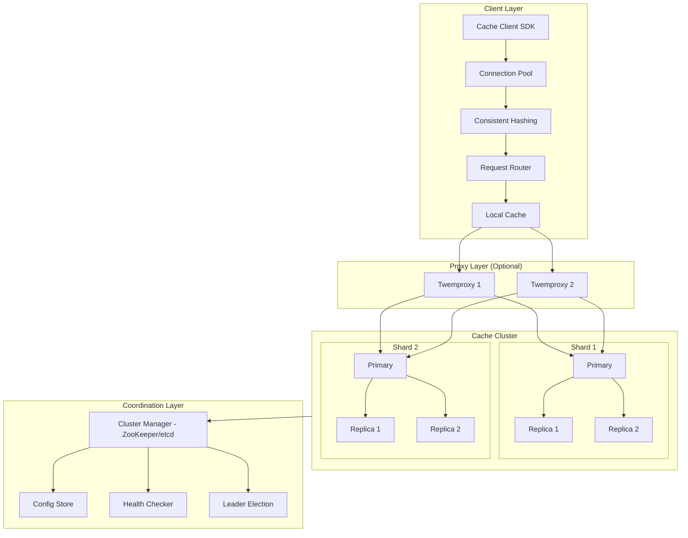

# Design Distributed Cache

## Problem Statement

Design a distributed caching system like Redis or Memcached that provides:
- High-performance key-value storage
- Horizontal scalability
- High availability
- Consistent data access across nodes

## Requirements

### Functional Requirements
1. Basic operations: GET, SET, DELETE
2. TTL (time-to-live) support
3. Multiple data types (strings, lists, sets, hashes)
4. Atomic operations (increment, compare-and-swap)
5. Pub/Sub messaging
6. Data persistence options

### Non-Functional Requirements
- **Latency**: < 1ms for cache hits
- **Throughput**: 1M+ operations/second per node
- **Availability**: 99.99% uptime
- **Consistency**: Configurable (strong or eventual)
- **Scalability**: Linear scaling with nodes

## Capacity Estimation

### Traffic
- 10M users, 1000 requests/second/user at peak
- 10B cache operations/day
- Read:Write ratio = 10:1

### Storage
- 100M keys, average value size 1KB
- Total data: 100GB
- With replication (3x): 300GB

### Memory per Node
- 16-64GB RAM per node
- 10-50 nodes for 100GB dataset

## High-Level Architecture




## Core Components

### 1. Cache Node

Individual cache server with data storage and operations.

```python
class CacheNode:
    def __init__(self, node_id: str, max_memory: int):
        self.node_id = node_id
        self.max_memory = max_memory
        self.data = {}  # key -> CacheEntry
        self.ttl_heap = []  # Min-heap for TTL expiration
        self.lru_list = LinkedList()  # For LRU eviction
        self.memory_used = 0
        self.lock = threading.RLock()

    def get(self, key: str) -> Optional[bytes]:
        """Get value by key."""
        with self.lock:
            if key not in self.data:
                return None

            entry = self.data[key]

            # Check TTL
            if entry.expires_at and entry.expires_at < time.time():
                self._delete_entry(key)
                return None

            # Update LRU
            self.lru_list.move_to_front(entry.lru_node)

            return entry.value

    def set(self, key: str, value: bytes, ttl: int = None) -> bool:
        """Set key-value pair with optional TTL."""
        with self.lock:
            value_size = len(value)

            # Check if we need to evict
            while self.memory_used + value_size > self.max_memory:
                if not self._evict_one():
                    return False  # Cannot make space

            # Remove existing entry if present
            if key in self.data:
                self._delete_entry(key)

            # Create new entry
            expires_at = time.time() + ttl if ttl else None
            lru_node = self.lru_list.push_front(key)

            entry = CacheEntry(
                value=value,
                expires_at=expires_at,
                lru_node=lru_node,
                size=value_size
            )

            self.data[key] = entry
            self.memory_used += value_size

            # Add to TTL heap if expirable
            if expires_at:
                heapq.heappush(self.ttl_heap, (expires_at, key))

            return True

    def delete(self, key: str) -> bool:
        """Delete a key."""
        with self.lock:
            if key not in self.data:
                return False
            self._delete_entry(key)
            return True

    def _delete_entry(self, key: str):
        """Internal delete without lock."""
        entry = self.data.pop(key)
        self.memory_used -= entry.size
        self.lru_list.remove(entry.lru_node)

    def _evict_one(self) -> bool:
        """Evict one entry using LRU policy."""
        # First, try to expire entries
        while self.ttl_heap:
            expires_at, key = self.ttl_heap[0]

            if expires_at > time.time():
                break

            heapq.heappop(self.ttl_heap)
            if key in self.data and self.data[key].expires_at == expires_at:
                self._delete_entry(key)
                return True

        # LRU eviction
        if self.lru_list.tail:
            key = self.lru_list.tail.value
            self._delete_entry(key)
            return True

        return False

    def expire_entries(self):
        """Background task to expire entries."""
        while True:
            with self.lock:
                now = time.time()
                while self.ttl_heap and self.ttl_heap[0][0] <= now:
                    expires_at, key = heapq.heappop(self.ttl_heap)
                    if key in self.data and self.data[key].expires_at == expires_at:
                        self._delete_entry(key)

            time.sleep(0.1)  # Check every 100ms


@dataclass
class CacheEntry:
    value: bytes
    expires_at: Optional[float]
    lru_node: LinkedListNode
    size: int
```

### 2. Consistent Hashing

Distributes keys across nodes with minimal redistribution on changes.

```python
class ConsistentHash:
    def __init__(self, nodes: List[str] = None, virtual_nodes: int = 150):
        self.virtual_nodes = virtual_nodes
        self.ring = SortedDict()  # hash -> node_id
        self.nodes = set()

        if nodes:
            for node in nodes:
                self.add_node(node)

    def _hash(self, key: str) -> int:
        """Generate hash for key using MD5."""
        return int(hashlib.md5(key.encode()).hexdigest(), 16)

    def add_node(self, node_id: str):
        """Add a node with virtual nodes to the ring."""
        if node_id in self.nodes:
            return

        self.nodes.add(node_id)

        for i in range(self.virtual_nodes):
            virtual_key = f"{node_id}:v{i}"
            hash_val = self._hash(virtual_key)
            self.ring[hash_val] = node_id

    def remove_node(self, node_id: str):
        """Remove a node and its virtual nodes."""
        if node_id not in self.nodes:
            return

        self.nodes.remove(node_id)

        for i in range(self.virtual_nodes):
            virtual_key = f"{node_id}:v{i}"
            hash_val = self._hash(virtual_key)
            del self.ring[hash_val]

    def get_node(self, key: str) -> str:
        """Get the node responsible for a key."""
        if not self.ring:
            return None

        hash_val = self._hash(key)

        # Find first node with hash >= key hash
        idx = self.ring.bisect_left(hash_val)

        if idx == len(self.ring):
            idx = 0  # Wrap around

        return list(self.ring.values())[idx]

    def get_nodes(self, key: str, count: int = 3) -> List[str]:
        """Get multiple nodes for replication."""
        if not self.ring or count > len(self.nodes):
            return list(self.nodes)

        hash_val = self._hash(key)
        idx = self.ring.bisect_left(hash_val)

        nodes = []
        seen = set()

        while len(nodes) < count:
            if idx >= len(self.ring):
                idx = 0

            node_id = list(self.ring.values())[idx]

            if node_id not in seen:
                nodes.append(node_id)
                seen.add(node_id)

            idx += 1

        return nodes
```

### 3. Cache Client

Smart client with connection pooling and request routing.

```python
class CacheClient:
    def __init__(self, nodes: List[str], pool_size: int = 10):
        self.consistent_hash = ConsistentHash()
        self.connections = {}  # node_id -> ConnectionPool
        self.local_cache = LRUCache(maxsize=1000)  # L1 cache

        for node in nodes:
            self.add_node(node)

    def add_node(self, node_address: str):
        """Add a cache node."""
        node_id = node_address
        self.consistent_hash.add_node(node_id)
        self.connections[node_id] = ConnectionPool(node_address)

    def remove_node(self, node_id: str):
        """Remove a cache node."""
        self.consistent_hash.remove_node(node_id)
        if node_id in self.connections:
            self.connections[node_id].close()
            del self.connections[node_id]

    async def get(self, key: str, use_local: bool = True) -> Optional[bytes]:
        """Get value, checking local cache first."""
        # Check local cache
        if use_local and key in self.local_cache:
            return self.local_cache[key]

        # Get from remote cache
        node_id = self.consistent_hash.get_node(key)
        pool = self.connections.get(node_id)

        if not pool:
            return None

        try:
            conn = await pool.acquire()
            value = await conn.get(key)
            pool.release(conn)

            if value and use_local:
                self.local_cache[key] = value

            return value

        except ConnectionError:
            # Try replica
            return await self._get_from_replica(key)

    async def set(self, key: str, value: bytes,
                  ttl: int = None, replicate: bool = True) -> bool:
        """Set value with optional replication."""
        nodes = self.consistent_hash.get_nodes(key, 3) if replicate else \
                [self.consistent_hash.get_node(key)]

        success_count = 0

        for node_id in nodes:
            pool = self.connections.get(node_id)
            if not pool:
                continue

            try:
                conn = await pool.acquire()
                result = await conn.set(key, value, ttl)
                pool.release(conn)

                if result:
                    success_count += 1
            except ConnectionError:
                continue

        # Invalidate local cache
        self.local_cache.pop(key, None)

        # Consider success if majority replicated
        return success_count > len(nodes) // 2

    async def delete(self, key: str) -> bool:
        """Delete key from all replicas."""
        nodes = self.consistent_hash.get_nodes(key, 3)

        success = False
        for node_id in nodes:
            pool = self.connections.get(node_id)
            if pool:
                try:
                    conn = await pool.acquire()
                    result = await conn.delete(key)
                    pool.release(conn)
                    success = success or result
                except ConnectionError:
                    continue

        self.local_cache.pop(key, None)
        return success

    async def _get_from_replica(self, key: str) -> Optional[bytes]:
        """Try to get from replica nodes."""
        nodes = self.consistent_hash.get_nodes(key, 3)

        for node_id in nodes[1:]:  # Skip primary
            pool = self.connections.get(node_id)
            if not pool:
                continue

            try:
                conn = await pool.acquire()
                value = await conn.get(key)
                pool.release(conn)
                if value:
                    return value
            except ConnectionError:
                continue

        return None
```

### 4. Cluster Manager

Manages cluster topology and coordinates nodes.

```python
class ClusterManager:
    def __init__(self, zk_hosts: str):
        self.zk = KazooClient(hosts=zk_hosts)
        self.zk.start()
        self.nodes = {}  # node_id -> NodeInfo
        self.slot_map = {}  # slot -> node_id
        self.total_slots = 16384  # Like Redis Cluster

    async def initialize_cluster(self, nodes: List[str]):
        """Initialize cluster with nodes and slot assignment."""
        slots_per_node = self.total_slots // len(nodes)

        for i, node_address in enumerate(nodes):
            node_id = self._generate_node_id()
            start_slot = i * slots_per_node
            end_slot = (i + 1) * slots_per_node - 1

            if i == len(nodes) - 1:
                end_slot = self.total_slots - 1

            node_info = NodeInfo(
                id=node_id,
                address=node_address,
                slots=range(start_slot, end_slot + 1),
                role='primary'
            )

            self.nodes[node_id] = node_info

            # Assign slots
            for slot in range(start_slot, end_slot + 1):
                self.slot_map[slot] = node_id

            # Store in ZooKeeper
            await self._register_node(node_info)

    async def add_node(self, node_address: str):
        """Add new node and rebalance slots."""
        node_id = self._generate_node_id()

        # Calculate slots to migrate
        slots_per_node = self.total_slots // (len(self.nodes) + 1)
        slots_to_migrate = []

        for existing_node in self.nodes.values():
            excess = len(existing_node.slots) - slots_per_node
            if excess > 0:
                slots_to_migrate.extend(
                    list(existing_node.slots)[:excess]
                )

        # Create new node
        new_node = NodeInfo(
            id=node_id,
            address=node_address,
            slots=[],
            role='primary'
        )

        self.nodes[node_id] = new_node

        # Migrate slots
        for slot in slots_to_migrate[:slots_per_node]:
            await self._migrate_slot(slot, node_id)

    async def _migrate_slot(self, slot: int, target_node_id: str):
        """Migrate slot data to new node."""
        source_node_id = self.slot_map[slot]
        source = self.nodes[source_node_id]
        target = self.nodes[target_node_id]

        # Set importing/migrating state
        await self._set_slot_state(slot, 'migrating', source_node_id)
        await self._set_slot_state(slot, 'importing', target_node_id)

        # Get all keys for slot
        keys = await self._get_keys_in_slot(source.address, slot)

        # Migrate each key
        for key in keys:
            value = await self._get_key(source.address, key)
            await self._set_key(target.address, key, value)
            await self._delete_key(source.address, key)

        # Update slot assignment
        self.slot_map[slot] = target_node_id
        source.slots = [s for s in source.slots if s != slot]
        target.slots.append(slot)

        # Clear slot state
        await self._set_slot_state(slot, 'stable', target_node_id)

    async def handle_node_failure(self, node_id: str):
        """Handle primary node failure."""
        failed_node = self.nodes[node_id]

        # Find replica for this node
        replica = self._find_replica(node_id)

        if replica:
            # Promote replica to primary
            replica.role = 'primary'
            replica.slots = failed_node.slots

            for slot in failed_node.slots:
                self.slot_map[slot] = replica.id

            await self._update_cluster_config()

            # Notify clients
            await self._broadcast_config_update()
        else:
            # No replica - cluster is degraded
            await self._mark_slots_unavailable(failed_node.slots)

    def get_slot(self, key: str) -> int:
        """Calculate slot for key using CRC16."""
        # Handle hash tags for multi-key operations
        if '{' in key and '}' in key:
            start = key.index('{') + 1
            end = key.index('}')
            if start < end:
                key = key[start:end]

        return crc16(key.encode()) % self.total_slots

    def get_node_for_key(self, key: str) -> NodeInfo:
        """Get node responsible for key."""
        slot = self.get_slot(key)
        node_id = self.slot_map[slot]
        return self.nodes[node_id]
```

### 5. Replication Manager

Handles data replication between primary and replicas.

```python
class ReplicationManager:
    def __init__(self, node: CacheNode, role: str = 'primary'):
        self.node = node
        self.role = role
        self.replicas = []  # For primary
        self.primary = None  # For replica
        self.repl_offset = 0
        self.repl_backlog = CircularBuffer(size=1_000_000)

    async def start(self):
        """Start replication."""
        if self.role == 'replica':
            await self._sync_with_primary()
            await self._start_replication_stream()

    async def _sync_with_primary(self):
        """Full sync with primary."""
        # Request full dump from primary
        snapshot = await self._request_full_sync(self.primary)

        # Load snapshot
        await self.node.load_snapshot(snapshot)

        # Record sync offset
        self.repl_offset = snapshot.offset

    async def _start_replication_stream(self):
        """Start receiving replication stream."""
        while True:
            try:
                conn = await self._connect_to_primary()

                # Send PSYNC with current offset
                await conn.send(f"PSYNC {self.node.node_id} {self.repl_offset}")

                # Process replication stream
                async for command in conn.stream():
                    await self._apply_command(command)
                    self.repl_offset = command.offset

            except ConnectionError:
                await asyncio.sleep(1)
                continue

    async def _apply_command(self, command: ReplicationCommand):
        """Apply replicated command to local data."""
        if command.type == 'SET':
            self.node.set(command.key, command.value, command.ttl)
        elif command.type == 'DELETE':
            self.node.delete(command.key)
        elif command.type == 'EXPIRE':
            self.node.expire(command.key, command.ttl)

    async def replicate_write(self, command: str, key: str,
                              value: bytes = None, ttl: int = None):
        """Replicate write operation to all replicas (primary only)."""
        if self.role != 'primary':
            return

        # Add to replication backlog
        repl_cmd = ReplicationCommand(
            type=command,
            key=key,
            value=value,
            ttl=ttl,
            offset=self.repl_offset
        )

        self.repl_backlog.append(repl_cmd)
        self.repl_offset += 1

        # Send to all replicas
        for replica in self.replicas:
            try:
                await replica.send(repl_cmd.serialize())
            except ConnectionError:
                # Mark replica as disconnected
                replica.connected = False

    async def _request_full_sync(self, primary_address: str) -> Snapshot:
        """Request full data sync from primary."""
        conn = await self._connect_to_node(primary_address)

        await conn.send("FULLSYNC")

        # Receive snapshot
        size = await conn.recv_int()
        data = await conn.recv_exact(size)

        return Snapshot.deserialize(data)
```

### 6. Persistence Manager

Handles data persistence for durability.

```python
class PersistenceManager:
    def __init__(self, node: CacheNode, data_dir: str):
        self.node = node
        self.data_dir = data_dir
        self.aof_file = None
        self.rdb_file = f"{data_dir}/dump.rdb"
        self.aof_path = f"{data_dir}/appendonly.aof"

    async def start_aof(self):
        """Start append-only file persistence."""
        self.aof_file = open(self.aof_path, 'ab', buffering=0)

    async def log_command(self, command: str, key: str,
                         value: bytes = None, ttl: int = None):
        """Log command to AOF."""
        if not self.aof_file:
            return

        # RESP format
        parts = [command, key]
        if value:
            parts.append(value)
        if ttl:
            parts.append(str(ttl))

        line = self._encode_resp(parts)
        self.aof_file.write(line)

        # fsync based on policy
        if self.fsync_policy == 'always':
            os.fsync(self.aof_file.fileno())

    async def create_rdb_snapshot(self):
        """Create RDB snapshot of current data."""
        temp_file = f"{self.rdb_file}.tmp"

        with open(temp_file, 'wb') as f:
            # Write header
            f.write(b'REDIS0011')

            # Write database
            f.write(struct.pack('B', 0xFE))  # SELECT DB
            f.write(struct.pack('B', 0))     # DB 0

            # Write all key-value pairs
            for key, entry in self.node.data.items():
                if entry.expires_at:
                    # Write expiry
                    f.write(struct.pack('B', 0xFC))  # MS expiry
                    f.write(struct.pack('<Q', int(entry.expires_at * 1000)))

                # Write type
                f.write(struct.pack('B', 0x00))  # String type

                # Write key
                self._write_string(f, key)

                # Write value
                self._write_string(f, entry.value)

            # Write EOF
            f.write(struct.pack('B', 0xFF))

            # Write CRC
            f.seek(0)
            crc = crc64(f.read())
            f.write(struct.pack('<Q', crc))

        # Atomic rename
        os.rename(temp_file, self.rdb_file)

    async def load_from_persistence(self):
        """Load data from RDB or AOF."""
        # Try RDB first
        if os.path.exists(self.rdb_file):
            await self._load_rdb()

        # Replay AOF if exists
        if os.path.exists(self.aof_path):
            await self._replay_aof()

    async def _load_rdb(self):
        """Load data from RDB file."""
        with open(self.rdb_file, 'rb') as f:
            # Verify header
            header = f.read(9)
            if not header.startswith(b'REDIS'):
                raise ValueError("Invalid RDB file")

            while True:
                type_byte = f.read(1)
                if not type_byte:
                    break

                type_val = struct.unpack('B', type_byte)[0]

                if type_val == 0xFF:  # EOF
                    break
                elif type_val == 0xFE:  # SELECT DB
                    db = struct.unpack('B', f.read(1))[0]
                elif type_val == 0xFC:  # MS expiry
                    expiry = struct.unpack('<Q', f.read(8))[0]
                elif type_val == 0x00:  # String
                    key = self._read_string(f)
                    value = self._read_string(f)

                    ttl = None
                    if expiry:
                        ttl = int((expiry / 1000) - time.time())
                        if ttl > 0:
                            self.node.set(key, value, ttl)

    async def rewrite_aof(self):
        """Compact AOF by rewriting from current data."""
        temp_file = f"{self.aof_path}.tmp"

        with open(temp_file, 'wb') as f:
            for key, entry in self.node.data.items():
                # Write SET command
                cmd = ['SET', key, entry.value]
                if entry.expires_at:
                    ttl = int(entry.expires_at - time.time())
                    if ttl > 0:
                        cmd.extend(['EX', str(ttl)])

                f.write(self._encode_resp(cmd))

        # Atomic switch
        os.rename(temp_file, self.aof_path)
```

## Advanced Features

### 1. Distributed Locking

```python
class DistributedLock:
    """Redis-like distributed lock (Redlock algorithm)."""

    def __init__(self, cache_client: CacheClient, lock_name: str,
                 ttl_ms: int = 10000):
        self.client = cache_client
        self.lock_name = f"lock:{lock_name}"
        self.ttl_ms = ttl_ms
        self.lock_value = str(uuid.uuid4())

    async def acquire(self, wait_ms: int = 5000) -> bool:
        """Try to acquire lock."""
        start = time.time() * 1000

        while (time.time() * 1000) - start < wait_ms:
            # Try to acquire on majority of nodes
            acquired_count = 0
            start_time = time.time() * 1000

            for node in self.client.get_all_nodes():
                try:
                    result = await node.set(
                        self.lock_name,
                        self.lock_value.encode(),
                        px=self.ttl_ms,
                        nx=True  # Only set if not exists
                    )
                    if result:
                        acquired_count += 1
                except:
                    continue

            elapsed = time.time() * 1000 - start_time

            # Check if majority acquired within validity time
            validity_time = self.ttl_ms - elapsed - 2  # 2ms clock drift

            if acquired_count >= len(self.client.get_all_nodes()) // 2 + 1:
                if validity_time > 0:
                    return True
                else:
                    # Lock may have expired during acquisition
                    await self.release()

            # Wait before retry
            await asyncio.sleep(0.05)

        return False

    async def release(self):
        """Release lock if we own it."""
        # Use Lua script for atomic check-and-delete
        script = """
        if redis.call("GET", KEYS[1]) == ARGV[1] then
            return redis.call("DEL", KEYS[1])
        else
            return 0
        end
        """

        for node in self.client.get_all_nodes():
            try:
                await node.eval(script, 1, self.lock_name, self.lock_value)
            except:
                continue
```

### 2. Cache Aside Pattern

```python
class CacheAside:
    """Cache-aside pattern implementation."""

    def __init__(self, cache: CacheClient, db: DatabaseClient,
                 default_ttl: int = 3600):
        self.cache = cache
        self.db = db
        self.default_ttl = default_ttl

    async def get(self, key: str, loader: Callable = None) -> Optional[bytes]:
        """Get with cache-aside pattern."""
        # Try cache first
        value = await self.cache.get(key)

        if value is not None:
            return value

        # Cache miss - load from database
        if loader:
            value = await loader(key)
        else:
            value = await self.db.get(key)

        if value is not None:
            # Store in cache
            await self.cache.set(key, value, ttl=self.default_ttl)

        return value

    async def invalidate(self, key: str):
        """Invalidate cache entry."""
        await self.cache.delete(key)

    async def update(self, key: str, value: bytes):
        """Update database and invalidate cache."""
        await self.db.set(key, value)
        await self.cache.delete(key)

    async def refresh(self, key: str, loader: Callable):
        """Refresh cache entry."""
        value = await loader(key)
        if value is not None:
            await self.cache.set(key, value, ttl=self.default_ttl)
        return value
```

### 3. Read-Through / Write-Through

```python
class ReadThroughCache:
    """Read-through cache implementation."""

    def __init__(self, cache: CacheClient, loader: DataLoader):
        self.cache = cache
        self.loader = loader
        self.loading_locks = {}

    async def get(self, key: str) -> Optional[bytes]:
        """Get with read-through."""
        value = await self.cache.get(key)

        if value is not None:
            return value

        # Prevent thundering herd with single-flight
        if key not in self.loading_locks:
            self.loading_locks[key] = asyncio.Lock()

        async with self.loading_locks[key]:
            # Double-check after acquiring lock
            value = await self.cache.get(key)
            if value is not None:
                return value

            # Load from source
            value = await self.loader.load(key)

            if value is not None:
                await self.cache.set(key, value)

            return value


class WriteThroughCache:
    """Write-through cache implementation."""

    def __init__(self, cache: CacheClient, store: DataStore):
        self.cache = cache
        self.store = store

    async def set(self, key: str, value: bytes) -> bool:
        """Set with write-through."""
        # Write to persistent store first
        success = await self.store.set(key, value)

        if success:
            # Then update cache
            await self.cache.set(key, value)

        return success


class WriteBehindCache:
    """Write-behind (write-back) cache implementation."""

    def __init__(self, cache: CacheClient, store: DataStore,
                 batch_size: int = 100, flush_interval: float = 1.0):
        self.cache = cache
        self.store = store
        self.write_queue = asyncio.Queue()
        self.batch_size = batch_size
        self.flush_interval = flush_interval

    async def start(self):
        """Start background writer."""
        asyncio.create_task(self._flush_loop())

    async def set(self, key: str, value: bytes):
        """Set with write-behind."""
        # Write to cache immediately
        await self.cache.set(key, value)

        # Queue for async write to store
        await self.write_queue.put((key, value))

    async def _flush_loop(self):
        """Background loop to flush writes."""
        while True:
            batch = []

            try:
                # Collect batch
                while len(batch) < self.batch_size:
                    try:
                        item = await asyncio.wait_for(
                            self.write_queue.get(),
                            timeout=self.flush_interval
                        )
                        batch.append(item)
                    except asyncio.TimeoutError:
                        break

                if batch:
                    # Batch write to store
                    await self.store.batch_set(batch)

            except Exception as e:
                # Re-queue failed items
                for item in batch:
                    await self.write_queue.put(item)
                await asyncio.sleep(1)
```

## Eviction Policies

```python
class EvictionPolicy(Enum):
    LRU = "lru"           # Least Recently Used
    LFU = "lfu"           # Least Frequently Used
    FIFO = "fifo"         # First In First Out
    RANDOM = "random"     # Random eviction
    TTL = "ttl"          # Evict expired first


class LFUCache:
    """LFU eviction implementation."""

    def __init__(self, max_size: int):
        self.max_size = max_size
        self.data = {}
        self.freq_map = defaultdict(OrderedDict)  # freq -> {key: value}
        self.key_freq = {}  # key -> frequency
        self.min_freq = 0

    def get(self, key: str) -> Optional[bytes]:
        if key not in self.data:
            return None

        # Increment frequency
        self._update_frequency(key)

        return self.data[key]

    def set(self, key: str, value: bytes):
        if self.max_size <= 0:
            return

        if key in self.data:
            self.data[key] = value
            self._update_frequency(key)
            return

        # Evict if needed
        if len(self.data) >= self.max_size:
            self._evict()

        # Add new entry
        self.data[key] = value
        self.freq_map[1][key] = value
        self.key_freq[key] = 1
        self.min_freq = 1

    def _update_frequency(self, key: str):
        freq = self.key_freq[key]

        # Remove from current frequency list
        del self.freq_map[freq][key]

        if not self.freq_map[freq]:
            del self.freq_map[freq]
            if self.min_freq == freq:
                self.min_freq += 1

        # Add to new frequency list
        new_freq = freq + 1
        self.freq_map[new_freq][key] = self.data[key]
        self.key_freq[key] = new_freq

    def _evict(self):
        # Get least frequently used
        lfu_keys = self.freq_map[self.min_freq]

        # FIFO among same frequency (OrderedDict)
        key, _ = lfu_keys.popitem(last=False)

        if not lfu_keys:
            del self.freq_map[self.min_freq]

        del self.data[key]
        del self.key_freq[key]
```

## Interview Discussion Points

### How to Handle Cache Stampede?
- Single-flight pattern (coalesce concurrent requests)
- Probabilistic early expiration
- Background refresh before expiry
- Lock on cache miss

### Why Consistent Hashing?
- Minimal key redistribution when nodes change
- Virtual nodes for better distribution
- Handles node failures gracefully

### How to Ensure Data Consistency?
- Synchronous replication (write to all)
- Quorum reads/writes (majority)
- Version vectors for conflict resolution

### How to Handle Network Partitions?
- Detect via gossip protocol
- Configure partition behavior (AP vs CP)
- Merge resolution when partition heals

## Related Topics

- [[../Core_Components/04_databases|Databases]] - Persistence options
- [[../Architecture_Patterns/03_cqrs|CQRS]] - Read/write separation
- [[05_design_whatsapp|WhatsApp Design]] - Session caching
- [[01_design_url_shortener|URL Shortener]] - Caching short URLs

---

**Tags**: #system-design #hld #caching #distributed-systems #case-study #redis
