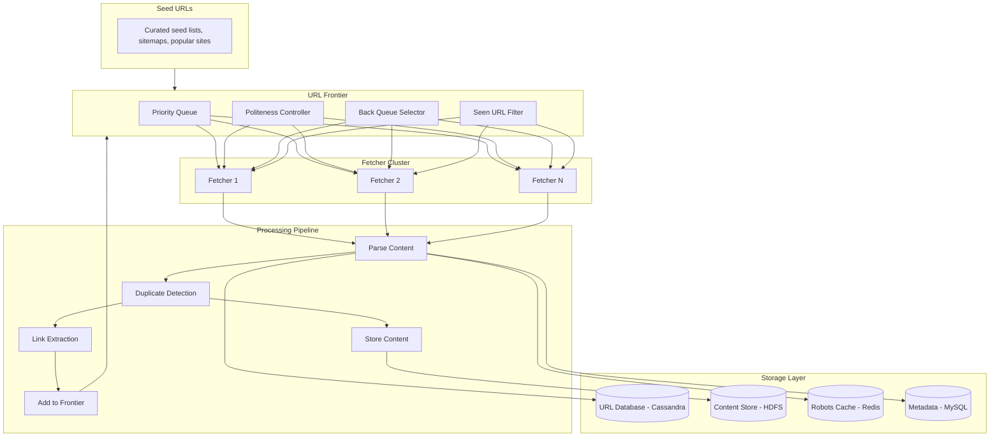

# Design Web Crawler

## Problem Statement

Design a web crawler that can efficiently crawl the web to index pages for a search engine.

## Requirements

### Functional Requirements
1. Crawl billions of web pages
2. Handle various content types (HTML, PDF, images)
3. Respect robots.txt and crawl politeness
4. Detect and handle duplicate content
5. Prioritize important/fresh pages
6. Extract links and metadata
7. Store content for indexing

### Non-Functional Requirements
- **Scale**: Crawl 1B pages/day
- **Politeness**: Max 1 request/second per domain
- **Freshness**: Re-crawl popular pages frequently
- **Robustness**: Handle failures gracefully
- **Extensibility**: Easy to add new content processors

## Capacity Estimation

### Traffic
- 1B pages/day = 11,574 pages/second
- Average page size: 100KB
- Total download: 100 PB/day

### Storage
- Raw HTML: 100KB × 1B = 100 PB/day
- Processed/compressed: ~10 PB/day
- URL database: 10B URLs × 200 bytes = 2 TB

### Bandwidth
- Download: 100 PB/day = 9.25 Gbps average
- Peak: 50+ Gbps

## High-Level Architecture




## Core Components

### 1. URL Frontier

Manages URLs to be crawled with prioritization and politeness.

```python
class URLFrontier:
    def __init__(self, num_back_queues: int = 10000):
        self.priority_queue = PriorityQueue()  # (priority, url)
        self.back_queues = {}  # domain -> deque of URLs
        self.domain_heap = []  # (next_crawl_time, domain)
        self.seen_urls = BloomFilter(capacity=10_000_000_000)
        self.url_db = CassandraClient()
        self.robots_cache = {}
        self.num_back_queues = num_back_queues

    async def add_url(self, url: str, priority: int = 5,
                      depth: int = 0) -> bool:
        """Add URL to frontier if not seen."""
        # Normalize URL
        normalized = self._normalize_url(url)

        # Check if already seen (Bloom filter)
        if normalized in self.seen_urls:
            return False

        # Check if URL exists in database
        exists = await self.url_db.exists(normalized)
        if exists:
            return False

        # Add to seen filter
        self.seen_urls.add(normalized)

        # Parse domain
        domain = urlparse(normalized).netloc

        # Check robots.txt
        if not await self._is_allowed(normalized, domain):
            return False

        # Calculate priority based on multiple factors
        adjusted_priority = self._calculate_priority(
            url=normalized,
            base_priority=priority,
            depth=depth,
            domain=domain
        )

        # Add to domain's back queue
        if domain not in self.back_queues:
            self.back_queues[domain] = deque()
            # Schedule domain for crawling
            heapq.heappush(self.domain_heap, (time.time(), domain))

        self.back_queues[domain].append((adjusted_priority, normalized))

        return True

    async def get_next_url(self) -> Optional[str]:
        """Get next URL respecting politeness."""
        while self.domain_heap:
            next_time, domain = self.domain_heap[0]

            # Wait if needed for politeness
            wait_time = next_time - time.time()
            if wait_time > 0:
                await asyncio.sleep(min(wait_time, 0.1))
                continue

            heapq.heappop(self.domain_heap)

            if domain not in self.back_queues or not self.back_queues[domain]:
                continue

            # Get URL from domain's queue
            _, url = self.back_queues[domain].popleft()

            # Reschedule domain for next crawl
            crawl_delay = await self._get_crawl_delay(domain)
            next_crawl = time.time() + crawl_delay

            if self.back_queues[domain]:
                heapq.heappush(self.domain_heap, (next_crawl, domain))
            else:
                del self.back_queues[domain]

            return url

        return None

    def _calculate_priority(self, url: str, base_priority: int,
                           depth: int, domain: str) -> int:
        """Calculate URL priority."""
        priority = base_priority

        # Decrease priority with depth
        priority += depth * 2

        # Boost priority for important domains
        if self._is_important_domain(domain):
            priority -= 3

        # Boost for homepage
        path = urlparse(url).path
        if path in ['/', '', '/index.html']:
            priority -= 2

        return max(0, min(priority, 10))

    async def _get_crawl_delay(self, domain: str) -> float:
        """Get crawl delay for domain from robots.txt."""
        robots = await self._get_robots(domain)

        if robots and robots.crawl_delay:
            return max(robots.crawl_delay, 1.0)

        return 1.0  # Default: 1 second

    async def _is_allowed(self, url: str, domain: str) -> bool:
        """Check if URL is allowed by robots.txt."""
        robots = await self._get_robots(domain)

        if robots:
            return robots.can_fetch("*", url)

        return True

    async def _get_robots(self, domain: str) -> Optional[RobotFileParser]:
        """Get and cache robots.txt for domain."""
        if domain in self.robots_cache:
            return self.robots_cache[domain]

        try:
            robots_url = f"https://{domain}/robots.txt"
            response = await self._fetch_with_timeout(robots_url, timeout=5)

            if response.status_code == 200:
                parser = RobotFileParser()
                parser.parse(response.text.split('\n'))
                self.robots_cache[domain] = parser
                return parser

        except Exception:
            pass

        self.robots_cache[domain] = None
        return None
```

### 2. Fetcher Service

Fetches web pages with retry and error handling.

```python
class Fetcher:
    def __init__(self, fetcher_id: str):
        self.fetcher_id = fetcher_id
        self.session = aiohttp.ClientSession(
            timeout=aiohttp.ClientTimeout(total=30),
            headers={'User-Agent': 'MyBot/1.0 (+http://mybot.com)'}
        )
        self.dns_cache = TTLCache(maxsize=100000, ttl=3600)

    async def fetch(self, url: str) -> FetchResult:
        """Fetch a URL and return result."""
        try:
            # Custom DNS resolution for caching
            resolved_url = await self._resolve_dns(url)

            async with self.session.get(
                resolved_url,
                allow_redirects=True,
                max_redirects=5
            ) as response:

                # Check content type
                content_type = response.headers.get('Content-Type', '')
                if not self._is_supported_type(content_type):
                    return FetchResult(
                        url=url,
                        status='skipped',
                        reason=f'Unsupported content type: {content_type}'
                    )

                # Check content length
                content_length = int(response.headers.get('Content-Length', 0))
                if content_length > 10_000_000:  # 10MB limit
                    return FetchResult(
                        url=url,
                        status='skipped',
                        reason='Content too large'
                    )

                # Read content
                content = await response.read()

                # Detect encoding
                encoding = response.charset or 'utf-8'
                try:
                    text = content.decode(encoding)
                except:
                    text = content.decode('utf-8', errors='ignore')

                return FetchResult(
                    url=url,
                    final_url=str(response.url),
                    status='success',
                    status_code=response.status,
                    content=text,
                    content_type=content_type,
                    headers=dict(response.headers),
                    fetch_time=time.time()
                )

        except asyncio.TimeoutError:
            return FetchResult(url=url, status='timeout')
        except aiohttp.ClientError as e:
            return FetchResult(url=url, status='error', reason=str(e))
        except Exception as e:
            return FetchResult(url=url, status='error', reason=str(e))

    def _is_supported_type(self, content_type: str) -> bool:
        """Check if content type is supported."""
        supported = [
            'text/html',
            'application/xhtml+xml',
            'text/plain',
            'application/pdf'
        ]
        return any(ct in content_type for ct in supported)

    async def _resolve_dns(self, url: str) -> str:
        """Resolve DNS with caching."""
        parsed = urlparse(url)
        host = parsed.netloc

        if host in self.dns_cache:
            ip = self.dns_cache[host]
        else:
            try:
                ip = socket.gethostbyname(host.split(':')[0])
                self.dns_cache[host] = ip
            except socket.gaierror:
                raise

        return url  # Return original, actual resolution handled by aiohttp


class FetcherPool:
    """Pool of fetchers for parallel crawling."""

    def __init__(self, num_fetchers: int = 100):
        self.fetchers = [Fetcher(f"fetcher-{i}") for i in range(num_fetchers)]
        self.url_queue = asyncio.Queue()
        self.result_queue = asyncio.Queue()

    async def start(self, frontier: URLFrontier):
        """Start fetcher workers."""
        # Producer: get URLs from frontier
        asyncio.create_task(self._url_producer(frontier))

        # Workers: fetch URLs
        workers = [
            asyncio.create_task(self._worker(fetcher))
            for fetcher in self.fetchers
        ]

        await asyncio.gather(*workers)

    async def _url_producer(self, frontier: URLFrontier):
        """Produce URLs from frontier."""
        while True:
            url = await frontier.get_next_url()
            if url:
                await self.url_queue.put(url)
            else:
                await asyncio.sleep(0.1)

    async def _worker(self, fetcher: Fetcher):
        """Worker that fetches URLs."""
        while True:
            url = await self.url_queue.get()
            result = await fetcher.fetch(url)
            await self.result_queue.put(result)
```

### 3. Content Processor

Parses and processes fetched content.

```python
class ContentProcessor:
    def __init__(self):
        self.duplicate_detector = DuplicateDetector()
        self.link_extractor = LinkExtractor()
        self.content_store = HDFSClient()
        self.metadata_db = MySQLClient()

    async def process(self, result: FetchResult) -> ProcessedPage:
        """Process fetched content."""
        if result.status != 'success':
            return ProcessedPage(url=result.url, status=result.status)

        # Parse HTML
        soup = BeautifulSoup(result.content, 'lxml')

        # Extract metadata
        metadata = self._extract_metadata(soup)

        # Check for duplicates
        content_hash = self._hash_content(result.content)
        is_duplicate = await self.duplicate_detector.check(content_hash)

        if is_duplicate:
            return ProcessedPage(
                url=result.url,
                status='duplicate',
                canonical_url=await self.duplicate_detector.get_canonical(content_hash)
            )

        # Extract text content
        text_content = self._extract_text(soup)

        # Extract links
        links = self.link_extractor.extract(result.final_url, soup)

        # Store content
        content_id = await self._store_content(result, text_content, metadata)

        # Record in metadata database
        await self._store_metadata(result, metadata, content_id)

        # Register content hash
        await self.duplicate_detector.register(content_hash, result.url)

        return ProcessedPage(
            url=result.url,
            final_url=result.final_url,
            status='processed',
            content_id=content_id,
            links=links,
            metadata=metadata
        )

    def _extract_metadata(self, soup: BeautifulSoup) -> dict:
        """Extract page metadata."""
        metadata = {}

        # Title
        title_tag = soup.find('title')
        metadata['title'] = title_tag.get_text().strip() if title_tag else None

        # Meta description
        meta_desc = soup.find('meta', attrs={'name': 'description'})
        metadata['description'] = meta_desc.get('content') if meta_desc else None

        # Meta keywords
        meta_keywords = soup.find('meta', attrs={'name': 'keywords'})
        metadata['keywords'] = meta_keywords.get('content') if meta_keywords else None

        # Canonical URL
        canonical = soup.find('link', attrs={'rel': 'canonical'})
        metadata['canonical'] = canonical.get('href') if canonical else None

        # Language
        html_tag = soup.find('html')
        metadata['language'] = html_tag.get('lang') if html_tag else None

        # Open Graph
        og_tags = soup.find_all('meta', attrs={'property': lambda x: x and x.startswith('og:')})
        metadata['og'] = {
            tag.get('property'): tag.get('content')
            for tag in og_tags
        }

        return metadata

    def _extract_text(self, soup: BeautifulSoup) -> str:
        """Extract clean text content."""
        # Remove script and style elements
        for tag in soup(['script', 'style', 'noscript', 'header', 'footer', 'nav']):
            tag.decompose()

        # Get text
        text = soup.get_text(separator=' ')

        # Clean up whitespace
        lines = (line.strip() for line in text.splitlines())
        chunks = (phrase.strip() for line in lines for phrase in line.split("  "))
        text = ' '.join(chunk for chunk in chunks if chunk)

        return text

    def _hash_content(self, content: str) -> str:
        """Generate content hash for duplicate detection."""
        # Use SimHash for near-duplicate detection
        return simhash(content)


class LinkExtractor:
    """Extracts and normalizes links from HTML."""

    def extract(self, base_url: str, soup: BeautifulSoup) -> List[str]:
        """Extract all links from page."""
        links = []

        for a_tag in soup.find_all('a', href=True):
            href = a_tag.get('href')

            # Skip non-http links
            if href.startswith(('javascript:', 'mailto:', 'tel:', '#')):
                continue

            # Resolve relative URLs
            absolute_url = urljoin(base_url, href)

            # Normalize
            normalized = self._normalize(absolute_url)

            if normalized and self._is_valid(normalized):
                links.append(normalized)

        return list(set(links))  # Deduplicate

    def _normalize(self, url: str) -> Optional[str]:
        """Normalize URL."""
        try:
            parsed = urlparse(url)

            # Only http/https
            if parsed.scheme not in ['http', 'https']:
                return None

            # Remove fragments
            normalized = urlunparse((
                parsed.scheme,
                parsed.netloc.lower(),
                parsed.path,
                parsed.params,
                parsed.query,
                ''  # No fragment
            ))

            # Remove trailing slash for non-root paths
            if normalized.endswith('/') and parsed.path != '/':
                normalized = normalized[:-1]

            return normalized

        except:
            return None

    def _is_valid(self, url: str) -> bool:
        """Check if URL should be crawled."""
        parsed = urlparse(url)

        # Skip certain file types
        skip_extensions = [
            '.jpg', '.jpeg', '.png', '.gif', '.bmp',
            '.pdf', '.doc', '.docx', '.xls', '.xlsx',
            '.zip', '.rar', '.tar', '.gz',
            '.mp3', '.mp4', '.avi', '.mov',
            '.css', '.js'
        ]

        path_lower = parsed.path.lower()
        if any(path_lower.endswith(ext) for ext in skip_extensions):
            return False

        return True
```

### 4. Duplicate Detector

Detects duplicate and near-duplicate content.

```python
class DuplicateDetector:
    """Detects duplicate content using SimHash."""

    def __init__(self):
        self.redis = RedisClient()
        self.db = CassandraClient()
        self.hamming_threshold = 3  # Bits different for near-duplicate

    async def check(self, simhash: int) -> bool:
        """Check if content is duplicate."""
        # Check exact match
        if await self.redis.exists(f"simhash:{simhash}"):
            return True

        # Check near-duplicates using LSH
        near_matches = await self._find_near_duplicates(simhash)
        return len(near_matches) > 0

    async def _find_near_duplicates(self, simhash: int) -> List[str]:
        """Find near-duplicate content using LSH."""
        # Split hash into bands for LSH
        bands = self._split_into_bands(simhash, num_bands=16)
        near_duplicates = []

        for i, band in enumerate(bands):
            # Check if any document has same band value
            key = f"lsh:{i}:{band}"
            candidates = await self.redis.smembers(key)

            for candidate in candidates:
                candidate_hash = int(candidate)
                distance = self._hamming_distance(simhash, candidate_hash)

                if distance <= self.hamming_threshold:
                    near_duplicates.append(candidate)

        return near_duplicates

    async def register(self, simhash: int, url: str):
        """Register content hash."""
        # Store exact hash
        await self.redis.set(f"simhash:{simhash}", url)

        # Store in LSH buckets
        bands = self._split_into_bands(simhash, num_bands=16)
        for i, band in enumerate(bands):
            await self.redis.sadd(f"lsh:{i}:{band}", str(simhash))

        # Store in database for persistence
        await self.db.execute("""
            INSERT INTO content_hashes (simhash, url, created_at)
            VALUES (?, ?, ?)
        """, [simhash, url, time.time()])

    async def get_canonical(self, simhash: int) -> Optional[str]:
        """Get canonical URL for content hash."""
        url = await self.redis.get(f"simhash:{simhash}")
        return url

    def _hamming_distance(self, hash1: int, hash2: int) -> int:
        """Calculate Hamming distance between two hashes."""
        xor = hash1 ^ hash2
        return bin(xor).count('1')

    def _split_into_bands(self, simhash: int, num_bands: int) -> List[int]:
        """Split hash into bands for LSH."""
        bits_per_band = 64 // num_bands
        bands = []

        for i in range(num_bands):
            mask = (1 << bits_per_band) - 1
            band = (simhash >> (i * bits_per_band)) & mask
            bands.append(band)

        return bands


def simhash(text: str, hash_bits: int = 64) -> int:
    """Calculate SimHash for text."""
    # Tokenize
    tokens = text.lower().split()

    # Initialize vector
    v = [0] * hash_bits

    for token in tokens:
        # Hash the token
        token_hash = int(hashlib.md5(token.encode()).hexdigest(), 16) % (2 ** hash_bits)

        # Update vector
        for i in range(hash_bits):
            bit = (token_hash >> i) & 1
            if bit == 1:
                v[i] += 1
            else:
                v[i] -= 1

    # Generate final hash
    fingerprint = 0
    for i in range(hash_bits):
        if v[i] > 0:
            fingerprint |= (1 << i)

    return fingerprint
```

### 5. URL Prioritizer

Determines crawl priority for URLs.

```python
class URLPrioritizer:
    """Prioritizes URLs for crawling."""

    def __init__(self):
        self.pagerank_scores = {}  # domain -> score
        self.freshness_model = FreshnessModel()

    def calculate_priority(self, url: str, context: dict) -> float:
        """Calculate overall priority score."""
        parsed = urlparse(url)
        domain = parsed.netloc

        scores = {
            'pagerank': self._get_pagerank_score(domain),
            'freshness': self._get_freshness_score(url, context),
            'depth': self._get_depth_score(context.get('depth', 0)),
            'path': self._get_path_score(parsed.path),
            'content_type': self._get_content_score(url)
        }

        # Weighted combination
        weights = {
            'pagerank': 0.3,
            'freshness': 0.25,
            'depth': 0.2,
            'path': 0.15,
            'content_type': 0.1
        }

        priority = sum(
            scores[key] * weights[key]
            for key in scores
        )

        return priority

    def _get_pagerank_score(self, domain: str) -> float:
        """Get domain's PageRank-like score."""
        return self.pagerank_scores.get(domain, 0.5)

    def _get_freshness_score(self, url: str, context: dict) -> float:
        """Score based on expected content freshness."""
        # News sites, blogs get higher freshness priority
        if any(keyword in url for keyword in ['news', 'blog', 'article']):
            return 0.9

        # Check last modified time if known
        last_modified = context.get('last_modified')
        if last_modified:
            age_days = (time.time() - last_modified) / 86400
            if age_days < 1:
                return 0.95
            elif age_days < 7:
                return 0.8
            elif age_days < 30:
                return 0.6

        return 0.5

    def _get_depth_score(self, depth: int) -> float:
        """Penalize deep URLs."""
        return max(0, 1 - (depth * 0.1))

    def _get_path_score(self, path: str) -> float:
        """Score based on URL path characteristics."""
        if path in ['/', '', '/index.html']:
            return 1.0

        # Count path segments
        segments = [s for s in path.split('/') if s]

        if len(segments) <= 2:
            return 0.8
        elif len(segments) <= 4:
            return 0.6
        else:
            return 0.4

    def _get_content_score(self, url: str) -> float:
        """Score based on expected content quality."""
        # Prefer HTML over other types
        if url.endswith('.html') or '.' not in url.split('/')[-1]:
            return 1.0
        elif url.endswith('.pdf'):
            return 0.7
        else:
            return 0.5
```

### 6. Crawl Scheduler

Manages recrawl scheduling.

```python
class CrawlScheduler:
    """Schedules page recrawling based on change frequency."""

    def __init__(self):
        self.db = CassandraClient()
        self.redis = RedisClient()

    async def schedule_recrawl(self, url: str, page_info: dict):
        """Schedule next recrawl based on page characteristics."""
        # Calculate recrawl interval
        interval = self._calculate_interval(page_info)

        next_crawl = time.time() + interval

        # Store in scheduled set
        await self.redis.zadd(
            'recrawl_schedule',
            {url: next_crawl}
        )

        # Update page info in database
        await self.db.execute("""
            INSERT INTO crawl_schedule (url, last_crawl, next_crawl, interval)
            VALUES (?, ?, ?, ?)
        """, [url, time.time(), next_crawl, interval])

    def _calculate_interval(self, page_info: dict) -> int:
        """Calculate recrawl interval in seconds."""
        # Base interval: 1 week
        interval = 7 * 24 * 3600

        # Adjust based on change frequency
        change_rate = page_info.get('change_rate', 0.1)

        if change_rate > 0.5:  # Changes frequently
            interval = 1 * 24 * 3600  # 1 day
        elif change_rate > 0.2:
            interval = 3 * 24 * 3600  # 3 days
        elif change_rate > 0.05:
            interval = 7 * 24 * 3600  # 1 week
        else:
            interval = 30 * 24 * 3600  # 1 month

        # Adjust based on importance
        importance = page_info.get('importance', 0.5)
        interval = int(interval * (1.5 - importance))

        # Bounds
        return max(3600, min(interval, 90 * 24 * 3600))

    async def get_urls_due(self, limit: int = 1000) -> List[str]:
        """Get URLs due for recrawling."""
        now = time.time()

        urls = await self.redis.zrangebyscore(
            'recrawl_schedule',
            0,
            now,
            start=0,
            num=limit
        )

        # Remove from schedule
        if urls:
            await self.redis.zrem('recrawl_schedule', *urls)

        return urls
```

## Database Schema

```sql
-- URL Database (Cassandra)
CREATE TABLE urls (
    url_hash TEXT PRIMARY KEY,
    url TEXT,
    domain TEXT,
    last_crawl_time TIMESTAMP,
    last_modified TIMESTAMP,
    status TEXT,
    content_hash TEXT,
    priority FLOAT,
    depth INT,
    discovered_from TEXT
);

CREATE INDEX ON urls (domain);
CREATE INDEX ON urls (status);

-- Crawl Schedule
CREATE TABLE crawl_schedule (
    url TEXT PRIMARY KEY,
    last_crawl TIMESTAMP,
    next_crawl TIMESTAMP,
    interval INT,
    change_rate FLOAT,
    crawl_count INT
);

-- Page Metadata (MySQL)
CREATE TABLE pages (
    id BIGINT AUTO_INCREMENT PRIMARY KEY,
    url VARCHAR(2048) NOT NULL,
    url_hash CHAR(64) NOT NULL,
    title VARCHAR(500),
    description TEXT,
    language VARCHAR(10),
    content_length INT,
    content_type VARCHAR(100),
    last_crawl TIMESTAMP,
    status_code INT,
    INDEX idx_url_hash (url_hash),
    INDEX idx_domain (domain)
);

-- Link Graph
CREATE TABLE links (
    source_url_hash CHAR(64),
    target_url_hash CHAR(64),
    anchor_text VARCHAR(500),
    discovered_at TIMESTAMP,
    PRIMARY KEY (source_url_hash, target_url_hash)
);

-- Content Hashes for Duplicate Detection
CREATE TABLE content_hashes (
    simhash BIGINT PRIMARY KEY,
    url TEXT,
    created_at TIMESTAMP
);
```

## Scaling Strategies

### 1. Distributed Crawling

```python
class DistributedCrawler:
    """Coordinator for distributed crawling."""

    def __init__(self, num_workers: int):
        self.num_workers = num_workers
        self.kafka = KafkaClient()
        self.redis = RedisClient()

    async def distribute_urls(self, frontier: URLFrontier):
        """Distribute URLs to worker partitions."""
        while True:
            url = await frontier.get_next_url()
            if not url:
                await asyncio.sleep(0.1)
                continue

            # Partition by domain for politeness
            domain = urlparse(url).netloc
            partition = hash(domain) % self.num_workers

            await self.kafka.send(
                topic='crawl_tasks',
                key=domain,
                value={'url': url},
                partition=partition
            )

    async def collect_results(self):
        """Collect results from workers."""
        async for message in self.kafka.consume('crawl_results'):
            result = message.value

            if result['status'] == 'success':
                # Add discovered links to frontier
                for link in result.get('links', []):
                    await self.frontier.add_url(link)

                # Store content
                await self.store_content(result)
```

## Interview Discussion Points

### How to Respect Politeness?
- Per-domain request rate limiting
- Honor robots.txt Crawl-delay
- Use separate queues per domain
- Back-off on errors

### How to Handle Traps?
- Limit crawl depth
- Detect URL patterns (session IDs, calendars)
- Monitor per-domain page count
- Checksum-based duplicate detection

### How to Prioritize URLs?
- PageRank for domain importance
- Content freshness signals
- URL depth/structure
- Historical change frequency

### How to Scale to Billions of Pages?
- Distributed frontier with partitioning
- Domain-based sharding
- Hierarchical storage (hot/cold)
- Incremental/delta crawling

## Related Topics

- [[09_design_search_autocomplete|Search Autocomplete]] - Search indexing
- [[10_design_distributed_cache|Distributed Cache]] - URL deduplication
- [[../Core_Components/05_message_queues|Message Queues]] - Task distribution

---

**Tags**: #system-design #hld #web-crawler #distributed-systems #case-study
