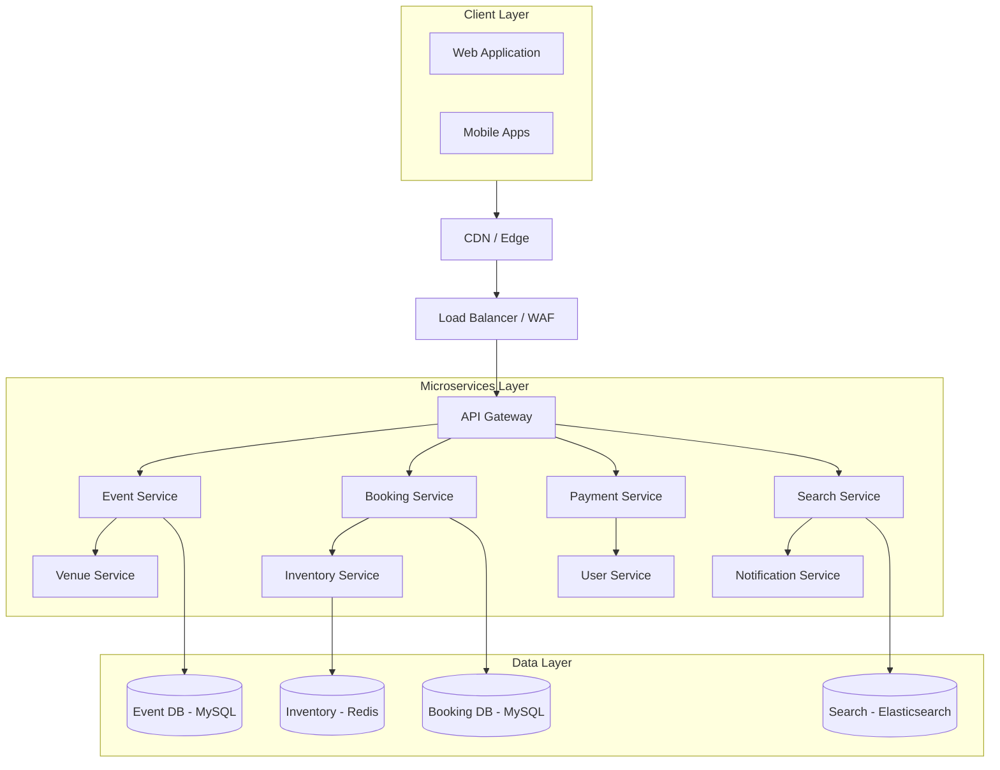

# Design Ticket Booking System

## Problem Statement

Design a ticket booking system (like BookMyShow or Ticketmaster) for movies, concerts, and events that handles high-demand scenarios.

## Requirements

### Functional Requirements
1. Browse events by city, category, date
2. View venue layout and seat availability
3. Select and temporarily hold seats
4. Complete booking with payment
5. Handle concurrent bookings (seat conflicts)
6. Send booking confirmations
7. Support cancellations and refunds
8. Handle waitlist for sold-out events

### Non-Functional Requirements
- **Consistency**: No double bookings
- **Latency**: < 100ms for seat availability
- **Throughput**: Handle 10K+ bookings/min for popular events
- **Availability**: 99.99% uptime
- **Scalability**: Handle flash sales (100x normal traffic)

## Capacity Estimation

### Traffic
- 100M monthly users
- 10M bookings/month = 4 bookings/second (average)
- Peak: 10K bookings/minute for popular events
- Seat views: 100x bookings = 400/second

### Storage
- Events: 100K active events × 10KB = 1 GB
- Bookings: 10M/month × 2KB = 20 GB/month
- Seat inventory: 100K events × 1000 seats × 100 bytes = 10 GB

## High-Level Architecture



## Core Components

### 1. Inventory Service

Manages seat availability with distributed locking.

```python
class InventoryService:
    def __init__(self):
        self.redis = RedisCluster()
        self.db = MySQLClient()
        self.lock_ttl = 600  # 10 minutes hold

    async def get_availability(self, show_id: str) -> SeatMap:
        """Get real-time seat availability."""
        # Try cache first
        cache_key = f"seats:{show_id}"
        cached = await self.redis.get(cache_key)

        if cached:
            return SeatMap.from_json(cached)

        # Load from database
        seats = await self.db.fetchall("""
            SELECT seat_id, row, number, category, price, status
            FROM seats
            WHERE show_id = ?
        """, [show_id])

        # Get current holds
        holds = await self.redis.hgetall(f"holds:{show_id}")

        seat_map = SeatMap(show_id=show_id)
        for seat in seats:
            status = seat['status']

            # Check if seat is held
            if seat['seat_id'] in holds:
                hold_info = json.loads(holds[seat['seat_id']])
                if hold_info['expires_at'] > time.time():
                    status = 'held'

            seat_map.add_seat(Seat(
                id=seat['seat_id'],
                row=seat['row'],
                number=seat['number'],
                category=seat['category'],
                price=seat['price'],
                status=status
            ))

        # Cache for 30 seconds
        await self.redis.setex(cache_key, 30, seat_map.to_json())

        return seat_map

    async def hold_seats(self, show_id: str, seat_ids: List[str],
                        user_id: str, session_id: str) -> HoldResult:
        """Temporarily hold seats for user."""
        # Use distributed lock for atomic operation
        lock_key = f"lock:show:{show_id}"

        async with self._distributed_lock(lock_key, timeout=5):
            # Check all seats are available
            available = await self._check_seats_available(show_id, seat_ids)

            if not available:
                return HoldResult(success=False, reason='seats_unavailable')

            # Create holds
            hold_id = generate_uuid()
            expires_at = time.time() + self.lock_ttl

            hold_data = {
                'hold_id': hold_id,
                'user_id': user_id,
                'session_id': session_id,
                'expires_at': expires_at
            }

            pipeline = self.redis.pipeline()

            for seat_id in seat_ids:
                pipeline.hset(
                    f"holds:{show_id}",
                    seat_id,
                    json.dumps(hold_data)
                )

            # Set overall hold record
            pipeline.setex(
                f"hold:{hold_id}",
                self.lock_ttl,
                json.dumps({
                    'show_id': show_id,
                    'seat_ids': seat_ids,
                    'user_id': user_id,
                    'expires_at': expires_at
                })
            )

            await pipeline.execute()

            # Invalidate cache
            await self.redis.delete(f"seats:{show_id}")

            return HoldResult(
                success=True,
                hold_id=hold_id,
                expires_at=expires_at,
                seats=seat_ids
            )

    async def release_hold(self, hold_id: str):
        """Release seat hold."""
        hold_data = await self.redis.get(f"hold:{hold_id}")

        if not hold_data:
            return

        hold = json.loads(hold_data)
        show_id = hold['show_id']
        seat_ids = hold['seat_ids']

        pipeline = self.redis.pipeline()

        for seat_id in seat_ids:
            pipeline.hdel(f"holds:{show_id}", seat_id)

        pipeline.delete(f"hold:{hold_id}")

        await pipeline.execute()

        # Invalidate cache
        await self.redis.delete(f"seats:{show_id}")

    async def confirm_booking(self, hold_id: str,
                              booking_id: str) -> bool:
        """Confirm booking and mark seats as sold."""
        hold_data = await self.redis.get(f"hold:{hold_id}")

        if not hold_data:
            return False

        hold = json.loads(hold_data)

        # Check hold hasn't expired
        if hold['expires_at'] < time.time():
            return False

        show_id = hold['show_id']
        seat_ids = hold['seat_ids']

        # Update database
        async with self.db.transaction():
            for seat_id in seat_ids:
                await self.db.execute("""
                    UPDATE seats SET status = 'sold', booking_id = ?
                    WHERE seat_id = ? AND show_id = ? AND status = 'available'
                """, [booking_id, seat_id, show_id])

            # Verify all seats were updated
            result = await self.db.fetchone("""
                SELECT COUNT(*) as count FROM seats
                WHERE booking_id = ? AND show_id = ?
            """, [booking_id, show_id])

            if result['count'] != len(seat_ids):
                raise BookingConflictError("Some seats were already sold")

        # Clear hold
        await self.release_hold(hold_id)

        return True

    async def _check_seats_available(self, show_id: str,
                                     seat_ids: List[str]) -> bool:
        """Check if seats are available (not sold or held)."""
        # Check database for sold status
        placeholders = ','.join(['?'] * len(seat_ids))
        result = await self.db.fetchall(f"""
            SELECT seat_id, status FROM seats
            WHERE show_id = ? AND seat_id IN ({placeholders})
        """, [show_id] + seat_ids)

        for row in result:
            if row['status'] != 'available':
                return False

        # Check Redis for holds
        holds = await self.redis.hmget(f"holds:{show_id}", *seat_ids)

        for hold in holds:
            if hold:
                hold_info = json.loads(hold)
                if hold_info['expires_at'] > time.time():
                    return False

        return True

    @asynccontextmanager
    async def _distributed_lock(self, key: str, timeout: float):
        """Distributed lock using Redis."""
        lock_value = str(uuid.uuid4())
        acquired = False

        try:
            # Try to acquire lock
            acquired = await self.redis.set(
                key, lock_value,
                nx=True,
                ex=int(timeout)
            )

            if not acquired:
                raise LockError("Could not acquire lock")

            yield

        finally:
            if acquired:
                # Release lock only if we own it
                script = """
                if redis.call("GET", KEYS[1]) == ARGV[1] then
                    return redis.call("DEL", KEYS[1])
                else
                    return 0
                end
                """
                await self.redis.eval(script, 1, key, lock_value)
```

### 2. Booking Service

Orchestrates the booking flow.

```python
class BookingService:
    def __init__(self):
        self.inventory = InventoryService()
        self.payment = PaymentService()
        self.notification = NotificationService()
        self.db = MySQLClient()
        self.kafka = KafkaProducer()

    async def create_booking(self, request: BookingRequest) -> BookingResponse:
        """Create a new booking (after hold)."""
        # Verify hold exists and belongs to user
        hold = await self.inventory.get_hold(request.hold_id)

        if not hold or hold['user_id'] != request.user_id:
            return BookingResponse(
                success=False,
                error='Invalid or expired hold'
            )

        # Calculate total price
        seats = await self._get_seats(hold['show_id'], hold['seat_ids'])
        total = sum(s.price for s in seats)

        # Apply any discounts
        discount = await self._calculate_discount(
            request.user_id,
            request.promo_code,
            total
        )
        final_amount = total - discount

        # Create booking record
        booking_id = generate_uuid()
        booking = Booking(
            id=booking_id,
            user_id=request.user_id,
            show_id=hold['show_id'],
            seats=hold['seat_ids'],
            total_amount=total,
            discount=discount,
            final_amount=final_amount,
            status='pending_payment'
        )

        await self._save_booking(booking)

        # Process payment
        payment_result = await self.payment.process(
            booking_id=booking_id,
            user_id=request.user_id,
            amount=final_amount,
            payment_method=request.payment_method
        )

        if payment_result.success:
            # Confirm seat booking
            confirmed = await self.inventory.confirm_booking(
                request.hold_id,
                booking_id
            )

            if confirmed:
                booking.status = 'confirmed'
                await self._update_booking(booking)

                # Send confirmation
                await self.notification.send_confirmation(booking)

                # Publish event
                await self.kafka.send('booking-events', {
                    'type': 'booking_confirmed',
                    'booking_id': booking_id,
                    'timestamp': time.time()
                })

                return BookingResponse(
                    success=True,
                    booking_id=booking_id,
                    confirmation_code=self._generate_confirmation_code(booking_id)
                )
            else:
                # Refund payment
                await self.payment.refund(payment_result.transaction_id)
                booking.status = 'failed'
                await self._update_booking(booking)

                return BookingResponse(
                    success=False,
                    error='Seats no longer available'
                )
        else:
            # Release hold
            await self.inventory.release_hold(request.hold_id)
            booking.status = 'payment_failed'
            await self._update_booking(booking)

            return BookingResponse(
                success=False,
                error=f'Payment failed: {payment_result.error}'
            )

    async def cancel_booking(self, booking_id: str,
                            user_id: str) -> CancelResult:
        """Cancel a booking and process refund."""
        booking = await self._get_booking(booking_id)

        if not booking or booking.user_id != user_id:
            return CancelResult(success=False, error='Booking not found')

        if booking.status != 'confirmed':
            return CancelResult(success=False, error='Cannot cancel this booking')

        # Check cancellation policy
        show = await self._get_show(booking.show_id)
        refund_amount = self._calculate_refund(booking, show)

        # Update booking status
        booking.status = 'cancelled'
        await self._update_booking(booking)

        # Release seats
        await self.db.execute("""
            UPDATE seats SET status = 'available', booking_id = NULL
            WHERE booking_id = ?
        """, [booking_id])

        # Process refund
        if refund_amount > 0:
            await self.payment.refund(
                booking.payment_transaction_id,
                amount=refund_amount
            )

        # Notify waitlist
        await self._notify_waitlist(booking.show_id, len(booking.seats))

        # Send cancellation confirmation
        await self.notification.send_cancellation(booking, refund_amount)

        return CancelResult(
            success=True,
            refund_amount=refund_amount
        )

    def _calculate_refund(self, booking: Booking, show: Show) -> float:
        """Calculate refund based on cancellation policy."""
        hours_until_show = (show.start_time - time.time()) / 3600

        if hours_until_show > 48:
            return booking.final_amount  # Full refund
        elif hours_until_show > 24:
            return booking.final_amount * 0.75  # 75% refund
        elif hours_until_show > 12:
            return booking.final_amount * 0.50  # 50% refund
        else:
            return 0  # No refund
```

### 3. Queue System for High Demand

Handles traffic spikes for popular events.

```python
class VirtualQueueService:
    """Virtual waiting room for high-demand events."""

    def __init__(self):
        self.redis = RedisClient()
        self.kafka = KafkaProducer()

    async def join_queue(self, event_id: str, user_id: str,
                        session_id: str) -> QueuePosition:
        """Add user to virtual queue."""
        queue_key = f"queue:{event_id}"
        position_key = f"queue_pos:{event_id}"

        # Check if already in queue
        existing = await self.redis.zscore(queue_key, user_id)
        if existing:
            position = await self._get_position(queue_key, user_id)
            return QueuePosition(
                position=position,
                estimated_wait=self._estimate_wait(position)
            )

        # Get next position
        position = await self.redis.incr(position_key)

        # Add to queue with position as score
        await self.redis.zadd(queue_key, {user_id: position})

        # Store session info
        await self.redis.hset(
            f"queue_sessions:{event_id}",
            user_id,
            json.dumps({
                'session_id': session_id,
                'joined_at': time.time(),
                'position': position
            })
        )

        return QueuePosition(
            position=position,
            estimated_wait=self._estimate_wait(position)
        )

    async def check_turn(self, event_id: str, user_id: str) -> TurnStatus:
        """Check if it's user's turn to book."""
        queue_key = f"queue:{event_id}"
        active_key = f"active:{event_id}"

        # Check if user is in active window
        is_active = await self.redis.sismember(active_key, user_id)

        if is_active:
            # Get remaining time
            ttl = await self.redis.ttl(f"active_session:{event_id}:{user_id}")
            return TurnStatus(
                is_turn=True,
                time_remaining=max(0, ttl)
            )

        # Check position
        position = await self._get_position(queue_key, user_id)

        if position is None:
            return TurnStatus(is_turn=False, error='Not in queue')

        # Check if we can admit more users
        active_count = await self.redis.scard(active_key)
        max_concurrent = await self._get_max_concurrent(event_id)

        if active_count < max_concurrent and position == 1:
            # Admit user
            await self._admit_user(event_id, user_id)
            return TurnStatus(is_turn=True, time_remaining=300)

        return TurnStatus(
            is_turn=False,
            position=position,
            estimated_wait=self._estimate_wait(position)
        )

    async def _admit_user(self, event_id: str, user_id: str):
        """Move user from queue to active."""
        queue_key = f"queue:{event_id}"
        active_key = f"active:{event_id}"
        session_key = f"active_session:{event_id}:{user_id}"

        pipeline = self.redis.pipeline()

        # Remove from queue
        pipeline.zrem(queue_key, user_id)

        # Add to active set
        pipeline.sadd(active_key, user_id)

        # Set session with TTL (5 minutes to complete booking)
        pipeline.setex(session_key, 300, "1")

        await pipeline.execute()

        # Notify user
        await self.kafka.send('queue-notifications', {
            'event_id': event_id,
            'user_id': user_id,
            'type': 'turn_ready'
        })

    async def release_slot(self, event_id: str, user_id: str):
        """Release active slot when user completes or times out."""
        active_key = f"active:{event_id}"
        session_key = f"active_session:{event_id}:{user_id}"

        await self.redis.srem(active_key, user_id)
        await self.redis.delete(session_key)

        # Admit next user
        await self._admit_next(event_id)

    async def _admit_next(self, event_id: str):
        """Admit next user in queue."""
        queue_key = f"queue:{event_id}"
        active_key = f"active:{event_id}"
        max_concurrent = await self._get_max_concurrent(event_id)

        active_count = await self.redis.scard(active_key)

        if active_count < max_concurrent:
            # Get next in queue
            next_users = await self.redis.zrange(queue_key, 0, 0)

            if next_users:
                await self._admit_user(event_id, next_users[0])

    def _estimate_wait(self, position: int) -> int:
        """Estimate wait time in seconds."""
        # Assume each user takes ~2 minutes, 50 concurrent slots
        return max(0, ((position - 1) // 50) * 120)

    async def _get_max_concurrent(self, event_id: str) -> int:
        """Get max concurrent users for event."""
        # Could be dynamic based on event popularity
        return 50
```

### 4. Waitlist Service

Manages waitlist for sold-out shows.

```python
class WaitlistService:
    def __init__(self):
        self.redis = RedisClient()
        self.db = MySQLClient()
        self.notification = NotificationService()

    async def join_waitlist(self, show_id: str, user_id: str,
                           seat_count: int,
                           preferences: dict = None) -> WaitlistEntry:
        """Add user to waitlist."""
        entry_id = generate_uuid()

        entry = WaitlistEntry(
            id=entry_id,
            show_id=show_id,
            user_id=user_id,
            seat_count=seat_count,
            preferences=preferences or {},
            joined_at=time.time(),
            status='waiting'
        )

        # Add to Redis sorted set (by join time)
        await self.redis.zadd(
            f"waitlist:{show_id}",
            {entry_id: time.time()}
        )

        # Store entry details
        await self.redis.hset(
            f"waitlist_entries:{show_id}",
            entry_id,
            json.dumps(entry.to_dict())
        )

        # Store in database for persistence
        await self.db.execute("""
            INSERT INTO waitlist (id, show_id, user_id, seat_count,
                                preferences, joined_at, status)
            VALUES (?, ?, ?, ?, ?, ?, ?)
        """, [entry_id, show_id, user_id, seat_count,
              json.dumps(preferences), time.time(), 'waiting'])

        position = await self._get_position(show_id, entry_id)

        return WaitlistEntry(
            **entry.to_dict(),
            position=position
        )

    async def notify_availability(self, show_id: str, available_seats: int):
        """Notify waitlist when seats become available."""
        # Get waitlist entries that can be fulfilled
        entries = await self._get_fulfillable_entries(show_id, available_seats)

        for entry in entries:
            # Create temporary hold offer
            offer_id = generate_uuid()
            offer_expires = time.time() + 900  # 15 minutes

            await self.redis.setex(
                f"waitlist_offer:{offer_id}",
                900,
                json.dumps({
                    'entry_id': entry['id'],
                    'show_id': show_id,
                    'seat_count': entry['seat_count'],
                    'expires_at': offer_expires
                })
            )

            # Update entry status
            entry['status'] = 'offer_sent'
            await self.redis.hset(
                f"waitlist_entries:{show_id}",
                entry['id'],
                json.dumps(entry)
            )

            # Send notification
            await self.notification.send_waitlist_offer(
                user_id=entry['user_id'],
                show_id=show_id,
                offer_id=offer_id,
                expires_at=offer_expires
            )

            available_seats -= entry['seat_count']
            if available_seats <= 0:
                break

    async def accept_offer(self, offer_id: str, user_id: str) -> dict:
        """Accept waitlist offer and get seats held."""
        offer_data = await self.redis.get(f"waitlist_offer:{offer_id}")

        if not offer_data:
            return {'success': False, 'error': 'Offer expired'}

        offer = json.loads(offer_data)

        # Verify user
        entry = await self.redis.hget(
            f"waitlist_entries:{offer['show_id']}",
            offer['entry_id']
        )
        entry = json.loads(entry)

        if entry['user_id'] != user_id:
            return {'success': False, 'error': 'Invalid offer'}

        # Try to hold seats
        inventory = InventoryService()
        available_seats = await inventory.find_available_seats(
            offer['show_id'],
            count=offer['seat_count'],
            preferences=entry.get('preferences', {})
        )

        if len(available_seats) < offer['seat_count']:
            return {'success': False, 'error': 'Seats no longer available'}

        # Create hold
        hold_result = await inventory.hold_seats(
            show_id=offer['show_id'],
            seat_ids=available_seats,
            user_id=user_id,
            session_id=generate_uuid()
        )

        if hold_result.success:
            # Remove from waitlist
            await self._remove_from_waitlist(offer['show_id'], offer['entry_id'])

            # Delete offer
            await self.redis.delete(f"waitlist_offer:{offer_id}")

            return {
                'success': True,
                'hold_id': hold_result.hold_id,
                'seats': available_seats,
                'expires_at': hold_result.expires_at
            }

        return {'success': False, 'error': 'Could not hold seats'}
```

### 5. Seat Selection Algorithm

Optimizes seat allocation.

```python
class SeatSelector:
    """Intelligent seat selection algorithm."""

    def __init__(self):
        self.venue_layouts = {}

    async def find_best_seats(self, show_id: str, count: int,
                             preferences: dict = None) -> List[Seat]:
        """Find best available seats based on preferences."""
        available = await self._get_available_seats(show_id)

        if len(available) < count:
            return []

        preferences = preferences or {}
        preferred_category = preferences.get('category')
        prefer_aisle = preferences.get('aisle', False)
        prefer_center = preferences.get('center', True)

        # Score each possible group of consecutive seats
        candidates = []

        for row in self._group_by_row(available):
            consecutive_groups = self._find_consecutive(row, count)

            for group in consecutive_groups:
                score = self._score_seats(
                    group,
                    preferred_category=preferred_category,
                    prefer_aisle=prefer_aisle,
                    prefer_center=prefer_center
                )
                candidates.append((score, group))

        if not candidates:
            # No consecutive seats, find best scattered seats
            return self._find_best_scattered(available, count, preferences)

        # Return highest scoring group
        candidates.sort(reverse=True)
        return candidates[0][1]

    def _score_seats(self, seats: List[Seat], **preferences) -> float:
        """Score a group of seats."""
        score = 0.0

        # Base score from seat value
        avg_price = sum(s.price for s in seats) / len(seats)
        max_price = max(s.price for s in seats)
        score += (avg_price / max_price) * 30  # 0-30 points

        # Category match
        if preferences.get('preferred_category'):
            if all(s.category == preferences['preferred_category'] for s in seats):
                score += 20

        # Row preference (front rows generally better)
        avg_row = sum(s.row_number for s in seats) / len(seats)
        score += max(0, (20 - avg_row))  # 0-20 points

        # Center preference
        if preferences.get('prefer_center', True):
            center_distance = self._distance_from_center(seats)
            score += max(0, (15 - center_distance * 2))  # 0-15 points

        # Aisle preference
        if preferences.get('prefer_aisle'):
            if any(s.is_aisle for s in seats):
                score += 10

        # Penalty for split (non-consecutive)
        if not self._are_consecutive(seats):
            score -= 25

        return score

    def _find_consecutive(self, row: List[Seat], count: int) -> List[List[Seat]]:
        """Find all groups of consecutive seats in a row."""
        groups = []
        current_group = []

        for seat in sorted(row, key=lambda s: s.number):
            if not current_group:
                current_group = [seat]
            elif seat.number == current_group[-1].number + 1:
                current_group.append(seat)
            else:
                if len(current_group) >= count:
                    # Find all valid windows
                    for i in range(len(current_group) - count + 1):
                        groups.append(current_group[i:i + count])
                current_group = [seat]

        if len(current_group) >= count:
            for i in range(len(current_group) - count + 1):
                groups.append(current_group[i:i + count])

        return groups

    def _distance_from_center(self, seats: List[Seat]) -> float:
        """Calculate average distance from center of row."""
        if not seats:
            return 0

        row = seats[0].row
        row_width = self._get_row_width(row)
        center = row_width / 2

        return sum(abs(s.number - center) for s in seats) / len(seats)
```

## Database Schema

```sql
-- Events
CREATE TABLE events (
    id VARCHAR(36) PRIMARY KEY,
    name VARCHAR(255) NOT NULL,
    category ENUM('movie', 'concert', 'sports', 'theater') NOT NULL,
    description TEXT,
    duration_minutes INT,
    language VARCHAR(50),
    rating VARCHAR(10),
    poster_url VARCHAR(500),
    created_at TIMESTAMP DEFAULT CURRENT_TIMESTAMP,
    INDEX idx_category (category)
);

-- Venues
CREATE TABLE venues (
    id VARCHAR(36) PRIMARY KEY,
    name VARCHAR(255) NOT NULL,
    city VARCHAR(100) NOT NULL,
    address TEXT,
    capacity INT,
    layout JSON,
    INDEX idx_city (city)
);

-- Shows (Event + Venue + Time)
CREATE TABLE shows (
    id VARCHAR(36) PRIMARY KEY,
    event_id VARCHAR(36) NOT NULL,
    venue_id VARCHAR(36) NOT NULL,
    start_time TIMESTAMP NOT NULL,
    end_time TIMESTAMP,
    status ENUM('scheduled', 'selling', 'sold_out', 'cancelled') DEFAULT 'scheduled',
    pricing JSON,
    FOREIGN KEY (event_id) REFERENCES events(id),
    FOREIGN KEY (venue_id) REFERENCES venues(id),
    INDEX idx_event_time (event_id, start_time),
    INDEX idx_venue_time (venue_id, start_time)
);

-- Seats
CREATE TABLE seats (
    id VARCHAR(36) PRIMARY KEY,
    show_id VARCHAR(36) NOT NULL,
    row VARCHAR(10) NOT NULL,
    number INT NOT NULL,
    category ENUM('platinum', 'gold', 'silver', 'bronze') NOT NULL,
    price DECIMAL(10, 2) NOT NULL,
    status ENUM('available', 'sold', 'blocked') DEFAULT 'available',
    booking_id VARCHAR(36),
    FOREIGN KEY (show_id) REFERENCES shows(id),
    INDEX idx_show_status (show_id, status),
    UNIQUE KEY uk_seat (show_id, row, number)
);

-- Bookings
CREATE TABLE bookings (
    id VARCHAR(36) PRIMARY KEY,
    user_id VARCHAR(36) NOT NULL,
    show_id VARCHAR(36) NOT NULL,
    seats JSON NOT NULL,
    total_amount DECIMAL(10, 2) NOT NULL,
    discount DECIMAL(10, 2) DEFAULT 0,
    final_amount DECIMAL(10, 2) NOT NULL,
    status ENUM('pending', 'confirmed', 'cancelled', 'refunded') NOT NULL,
    payment_transaction_id VARCHAR(100),
    confirmation_code VARCHAR(20),
    booked_at TIMESTAMP DEFAULT CURRENT_TIMESTAMP,
    FOREIGN KEY (show_id) REFERENCES shows(id),
    INDEX idx_user (user_id),
    INDEX idx_show (show_id),
    INDEX idx_confirmation (confirmation_code)
);

-- Waitlist
CREATE TABLE waitlist (
    id VARCHAR(36) PRIMARY KEY,
    show_id VARCHAR(36) NOT NULL,
    user_id VARCHAR(36) NOT NULL,
    seat_count INT NOT NULL,
    preferences JSON,
    joined_at TIMESTAMP DEFAULT CURRENT_TIMESTAMP,
    status ENUM('waiting', 'offer_sent', 'converted', 'expired') DEFAULT 'waiting',
    FOREIGN KEY (show_id) REFERENCES shows(id),
    INDEX idx_show_status (show_id, status)
);
```

## Handling Flash Sales

```python
class FlashSaleHandler:
    """Handles high-demand ticket sales."""

    def __init__(self):
        self.queue = VirtualQueueService()
        self.inventory = InventoryService()
        self.redis = RedisClient()

    async def prepare_flash_sale(self, show_id: str, start_time: float):
        """Prepare system for flash sale."""
        # Pre-warm caches
        await self._warm_caches(show_id)

        # Set up virtual queue
        await self.redis.set(f"flash_sale:{show_id}", json.dumps({
            'start_time': start_time,
            'status': 'pending'
        }))

        # Configure rate limits
        await self._configure_rate_limits(show_id)

    async def _warm_caches(self, show_id: str):
        """Pre-load data into caches."""
        # Load seat map
        await self.inventory.get_availability(show_id)

        # Load show details
        await self._cache_show_details(show_id)

    async def start_sale(self, show_id: str):
        """Start the flash sale."""
        await self.redis.set(f"flash_sale:{show_id}", json.dumps({
            'status': 'active',
            'started_at': time.time()
        }))

        # Start admitting users from queue
        asyncio.create_task(self._process_queue(show_id))

    async def _process_queue(self, show_id: str):
        """Continuously process queue during flash sale."""
        while True:
            # Check if still active
            sale_info = await self.redis.get(f"flash_sale:{show_id}")
            if not sale_info or json.loads(sale_info)['status'] != 'active':
                break

            # Admit users up to capacity
            await self.queue._admit_next(show_id)

            await asyncio.sleep(0.1)
```

## Interview Discussion Points

### How to Prevent Double Booking?
- Distributed locks during seat selection
- Optimistic locking with version numbers
- Temporary holds with TTL
- Database-level constraints

### How to Handle 10K+ Concurrent Users?
- Virtual waiting room / queue system
- Rate limiting at API gateway
- Pre-warmed caches
- Horizontal scaling of services

### How to Ensure Fair Access?
- FIFO queue system
- Time-limited booking windows
- Bot detection and CAPTCHA
- IP-based rate limiting

### How to Handle Payment Failures?
- Idempotent payment operations
- Hold seats during payment
- Automatic refund on failure
- Retry with exponential backoff

## Related Topics

- [[02_design_rate_limiter|Rate Limiter]] - Traffic control
- [[10_design_distributed_cache|Distributed Cache]] - Seat caching
- [[../Architecture_Patterns/04_saga_pattern|Saga Pattern]] - Booking workflow
- [[08_design_notification_system|Notification System]] - Confirmations

---

**Tags**: #system-design #hld #booking #concurrency #case-study #ticketmaster
