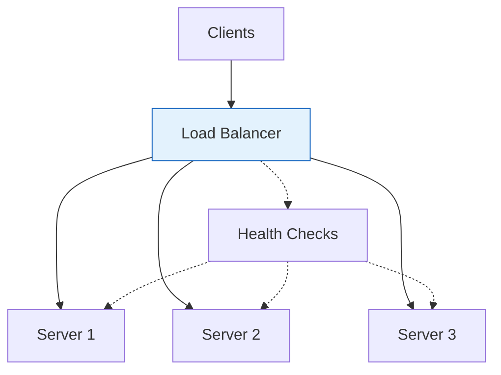

# Load Balancers

Load balancers distribute incoming traffic across multiple servers to ensure high availability and reliability.

## Visualization




---

## Why Load Balancers?

```
Without Load Balancer:
Client → Single Server (single point of failure)

With Load Balancer:
Client → Load Balancer → [Server 1, Server 2, Server 3]
```

### Benefits
- **High Availability**: Traffic continues if servers fail
- **Scalability**: Add more servers to handle load
- **Flexibility**: Perform maintenance without downtime

---

## Load Balancing Algorithms

### Round Robin
```
Request 1 → Server A
Request 2 → Server B
Request 3 → Server C
Request 4 → Server A
```
Simple rotation. Good when servers are identical.

### Weighted Round Robin
```
Weights: A=3, B=2, C=1
Traffic: A gets 50%, B gets 33%, C gets 17%
```
Use when servers have different capacities.

### Least Connections
```
Server A: 10 connections
Server B: 5 connections ← next request goes here
Server C: 8 connections
```
Good for varying request durations.

### IP Hash
```
hash(client_ip) % num_servers → determines server
```
Same client always hits same server (session affinity).

### Least Response Time
Routes to server with lowest latency.

---

## Layer 4 vs Layer 7

### Layer 4 (Transport)
- Operates on TCP/UDP
- Faster (no content inspection)
- Limited routing options

```
Client → [L4 LB] → Server
         (sees: IP, port)
```

### Layer 7 (Application)
- Operates on HTTP/HTTPS
- Can inspect content (URLs, headers, cookies)
- More intelligent routing

```
Client → [L7 LB] → Server
         (sees: URL, headers, cookies, body)
```

**L7 Routing Examples:**
```nginx
# Route by URL path
/api/users/* → User Service
/api/orders/* → Order Service
/static/* → CDN

# Route by header
User-Agent: *Mobile* → Mobile Backend
Accept-Language: es → Spanish Server
```

---

## Health Checks

```
Load Balancer periodically checks:

GET /health → 200 OK (healthy)
GET /health → 503 Service Unavailable (unhealthy)

Unhealthy servers removed from rotation
```

### Types
- **Active**: LB sends periodic health check requests
- **Passive**: LB monitors actual traffic responses

---

## Session Persistence (Sticky Sessions)

When you need requests from same user to hit same server:

```
Options:
1. IP Hash - route by client IP
2. Cookie-based - LB sets/reads cookie
3. URL parameter - session ID in URL
```

**Better alternative**: Externalize sessions to Redis/Memcached

---

## High Availability

### Active-Passive
```
┌────────────┐     ┌────────────┐
│ Primary LB │────→│ Backup LB  │
│  (active)  │     │ (standby)  │
└────────────┘     └────────────┘
      ↓ (heartbeat)
Backup takes over if primary fails
```

### Active-Active
```
┌────────────┐     ┌────────────┐
│    LB 1    │     │    LB 2    │
└────────────┘     └────────────┘
      ↓                 ↓
   Both active, DNS/anycast distributes
```

---

## Common Load Balancers

| Name | Type | Use Case |
|------|------|----------|
| Nginx | L4/L7 | Web serving, reverse proxy |
| HAProxy | L4/L7 | High-performance, TCP/HTTP |
| AWS ALB | L7 | HTTP/HTTPS, path-based routing |
| AWS NLB | L4 | Ultra-high performance, TCP/UDP |
| Envoy | L7 | Service mesh, microservices |

---

## Configuration Example (Nginx)

```nginx
upstream backend {
    least_conn;  # Algorithm

    server backend1.example.com:8080 weight=3;
    server backend2.example.com:8080 weight=2;
    server backend3.example.com:8080 weight=1;

    server backend4.example.com:8080 backup;  # Only if others fail
}

server {
    listen 80;

    location / {
        proxy_pass http://backend;
        proxy_set_header Host $host;
        proxy_set_header X-Real-IP $remote_addr;

        # Health check
        health_check interval=5s fails=3 passes=2;
    }
}
```

---

## Interview Talking Points

1. **L4 vs L7**: Know when to use each
2. **Algorithms**: Round robin, least connections, IP hash
3. **Health checks**: Active vs passive
4. **Session handling**: Sticky sessions vs external session store
5. **HA**: Active-passive, active-active configurations
