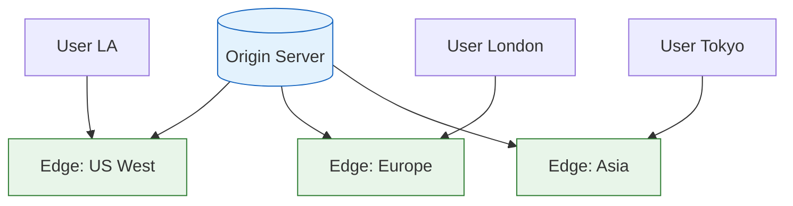

# Content Delivery Networks (CDN)

A CDN is a geographically distributed network of servers that delivers content to users from the nearest location.

## Visualization




---

## Why CDN?

```
Without CDN:
User in Tokyo → Origin Server in New York
Latency: 200ms+ per request

With CDN:
User in Tokyo → CDN Edge in Tokyo
Latency: 20ms per request
```

### Benefits
- **Reduced Latency**: Content served from nearby edge servers
- **Reduced Origin Load**: Origin handles fewer requests
- **High Availability**: Redundant edge locations
- **DDoS Protection**: Distributed infrastructure absorbs attacks

---

## How CDN Works

```
1. User requests content
   User → CDN Edge (cache miss) → Origin Server

2. Origin responds
   Origin → CDN Edge (caches response) → User

3. Subsequent requests
   User → CDN Edge (cache hit!) → User
```

### Architecture

```
                    ┌─────────────────────────────────────┐
                    │           Origin Server             │
                    └─────────────────────────────────────┘
                                      ↑
                    ┌─────────────────┴─────────────────┐
                    ↓                                   ↓
            ┌─────────────┐                     ┌─────────────┐
            │ CDN Edge    │                     │ CDN Edge    │
            │ (US West)   │                     │ (Europe)    │
            └─────────────┘                     └─────────────┘
                    ↑                                   ↑
            ┌───────┴───────┐               ┌───────────┴───────────┐
            ↓               ↓               ↓                       ↓
         Users           Users           Users                   Users
         (LA)            (SF)            (London)                (Paris)
```

---

## What to Cache on CDN

### Static Content (Always)
- Images, videos, audio
- CSS, JavaScript files
- Fonts, icons
- PDF documents

### Dynamic Content (Sometimes)
- API responses (with short TTL)
- Personalized content (with cache keys)
- Search results

### Never Cache
- User-specific sensitive data
- Real-time data
- Authenticated content (without proper cache keys)

---

## Cache Control

### Headers

```http
# Cache for 1 hour, public (CDN can cache)
Cache-Control: public, max-age=3600

# Cache for 1 day, but revalidate
Cache-Control: public, max-age=86400, must-revalidate

# Don't cache at all
Cache-Control: no-store, no-cache

# Cache privately (browser only, not CDN)
Cache-Control: private, max-age=3600
```

### Versioning

```
# URL-based versioning (best for static assets)
/static/app.v2.1.0.js
/static/app.abc123.js  # Content hash

# Query string (works but less efficient)
/static/app.js?v=2.1.0
```

---

## Cache Invalidation

### TTL-Based
Content expires after time-to-live.
```
Cache-Control: max-age=86400  # Expires in 24 hours
```

### Purge API
Explicitly invalidate cached content.
```bash
# CloudFront invalidation
aws cloudfront create-invalidation \
    --distribution-id E1234 \
    --paths "/images/*" "/css/*"
```

### Versioned URLs
Change URL to bypass cache.
```
Old: /static/app.v1.js
New: /static/app.v2.js
```

---

## Push vs Pull CDN

### Pull CDN (Most Common)
```
1. First request → CDN miss → fetch from origin
2. CDN caches response
3. Subsequent requests served from cache

Pros: Simple, automatic
Cons: First request is slow
```

### Push CDN
```
1. You upload content to CDN proactively
2. Content available immediately

Pros: No cold cache, more control
Cons: More complex, must manage uploads
```

---

## CDN Providers

| Provider | Strengths |
|----------|-----------|
| CloudFront | AWS integration, Lambda@Edge |
| Cloudflare | DDoS protection, Workers |
| Akamai | Enterprise, largest network |
| Fastly | Real-time purging, edge compute |

---

## Edge Computing

Modern CDNs can run code at the edge:

```javascript
// Cloudflare Workers example
addEventListener('fetch', event => {
    event.respondWith(handleRequest(event.request))
})

async function handleRequest(request) {
    // A/B testing at the edge
    const variant = Math.random() < 0.5 ? 'A' : 'B'

    const response = await fetch(request)
    const newResponse = new Response(response.body, response)
    newResponse.headers.set('X-Variant', variant)

    return newResponse
}
```

### Use Cases
- A/B testing
- Authentication
- Personalization
- Request/response transformation
- API gateway functions

---

## Multi-CDN Strategy

```
┌─────────────────────────────────────────────────────────────┐
│                    DNS Load Balancer                         │
│              (Route based on performance)                    │
└─────────────────────────────────────────────────────────────┘
                            │
            ┌───────────────┼───────────────┐
            ↓               ↓               ↓
      ┌───────────┐   ┌───────────┐   ┌───────────┐
      │CloudFront │   │Cloudflare │   │  Akamai   │
      └───────────┘   └───────────┘   └───────────┘
```

**Benefits**:
- Higher availability
- Better performance (route to fastest)
- Vendor redundancy

---

## Interview Talking Points

1. **Why CDN**: Latency reduction, origin offload
2. **What to cache**: Static always, dynamic sometimes
3. **Invalidation**: TTL, purge API, versioned URLs
4. **Push vs Pull**: Trade-offs
5. **Edge computing**: Modern CDN capabilities
