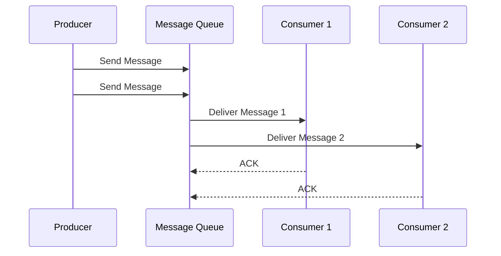

# Message Queues

Message queues enable asynchronous communication between services, decoupling producers from consumers.

## Visualization




---

## Why Message Queues?

### Synchronous (Without Queue)
```
User → API → Payment Service → Email Service → Response
       (all must succeed, high latency)
```

### Asynchronous (With Queue)
```
User → API → Response (fast!)
       ↓
    [Queue] → Payment Service
              ↓
           [Queue] → Email Service
```

### Benefits
- **Decoupling**: Services don't need to know about each other
- **Resilience**: Failed consumers can retry
- **Scalability**: Scale consumers independently
- **Load leveling**: Handle traffic spikes

---

## Messaging Patterns

### Point-to-Point (Queue)
```
Producer → [Queue] → Consumer

One message, one consumer
Used for: Task distribution, work queues
```

### Publish-Subscribe (Topic)
```
Producer → [Topic] → Consumer 1
                  → Consumer 2
                  → Consumer 3

One message, multiple consumers
Used for: Event broadcasting, notifications
```

---

## Message Queue vs Event Streaming

| Feature | Message Queue | Event Streaming |
|---------|--------------|-----------------|
| Example | RabbitMQ, SQS | Kafka, Kinesis |
| Message retention | Until consumed | Time/size based |
| Ordering | Per queue | Per partition |
| Consumer model | Competing consumers | Consumer groups |
| Replay | No | Yes |
| Use case | Task queues | Event sourcing, logs |

---

## Popular Message Queues

### Apache Kafka
High-throughput, distributed streaming platform.

```
Producer → [Partition 0] → Consumer Group A
        → [Partition 1] → Consumer Group A
        → [Partition 2] → Consumer Group B
                          (can replay)
```

**Features**:
- Persistent log storage
- High throughput (millions/sec)
- Replay capability
- Ordering per partition

**Use case**: Event streaming, log aggregation, real-time analytics

### RabbitMQ
Traditional message broker with flexible routing.

```
Producer → Exchange → Queue 1 → Consumer
                   → Queue 2 → Consumer
```

**Features**:
- Multiple protocols (AMQP, MQTT, STOMP)
- Complex routing (direct, topic, fanout)
- Message acknowledgment
- Priority queues

**Use case**: Task queues, RPC, microservices communication

### Amazon SQS
Fully managed, serverless queue service.

**Features**:
- No infrastructure management
- Automatic scaling
- Standard (at-least-once) or FIFO (exactly-once)
- Dead letter queues

**Use case**: Decoupling AWS services, serverless architectures

---

## Key Concepts

### Delivery Guarantees

| Guarantee | Description | Trade-off |
|-----------|-------------|-----------|
| At-most-once | May lose messages | Fastest |
| At-least-once | May duplicate | Safe default |
| Exactly-once | No loss, no duplicates | Most complex |

### Consumer Acknowledgment

```python
# RabbitMQ example
def callback(ch, method, properties, body):
    try:
        process_message(body)
        ch.basic_ack(delivery_tag=method.delivery_tag)
    except Exception:
        # Requeue or send to dead letter
        ch.basic_nack(delivery_tag=method.delivery_tag)
```

### Dead Letter Queue (DLQ)
```
Main Queue → Consumer (fails)
    ↓ (after N retries)
Dead Letter Queue → Manual inspection/retry
```

---

## Scaling Consumers

### Competing Consumers
```
[Queue] → Consumer 1
       → Consumer 2
       → Consumer 3

Each message processed by ONE consumer
Scales processing throughput
```

### Partitioning (Kafka)
```
Topic:
  Partition 0 → Consumer A
  Partition 1 → Consumer A
  Partition 2 → Consumer B
  Partition 3 → Consumer B

Max consumers = Number of partitions
```

---

## Message Ordering

### Single Queue
Messages processed in order (FIFO).

### Partitioned Queue
Order preserved within partition only.

```
Partition key = user_id
All messages for user_123 → Partition 2 → processed in order
All messages for user_456 → Partition 5 → processed in order
```

---

## Implementation Example

### Kafka Producer (Python)
```python
from kafka import KafkaProducer
import json

producer = KafkaProducer(
    bootstrap_servers=['localhost:9092'],
    value_serializer=lambda v: json.dumps(v).encode('utf-8')
)

# Send message
producer.send('orders', {
    'order_id': '12345',
    'user_id': 'user_789',
    'total': 99.99
})
producer.flush()
```

### Kafka Consumer (Python)
```python
from kafka import KafkaConsumer
import json

consumer = KafkaConsumer(
    'orders',
    bootstrap_servers=['localhost:9092'],
    group_id='order-processor',
    value_deserializer=lambda m: json.loads(m.decode('utf-8'))
)

for message in consumer:
    order = message.value
    process_order(order)
    # Offset committed automatically (at-least-once)
```

---

## Common Patterns

### Saga Pattern (Distributed Transactions)
```
Order Service → [Create Order Event] → Inventory Service
                                     → Payment Service
                                     → Shipping Service

If any fails → Compensating transactions
```

### Event Sourcing
```
Instead of storing current state:
{ "balance": 100 }

Store events:
{ "type": "deposit", "amount": 100 }
{ "type": "withdraw", "amount": 50 }
{ "type": "deposit", "amount": 75 }
Current balance: 100 - 50 + 75 = 125
```

---

## Interview Talking Points

1. **When to use**: Decoupling, async processing, load leveling
2. **Kafka vs RabbitMQ**: Streaming vs traditional messaging
3. **Delivery guarantees**: At-least-once is usually sufficient
4. **Ordering**: Partition key for related messages
5. **Dead letters**: Handle poison messages
