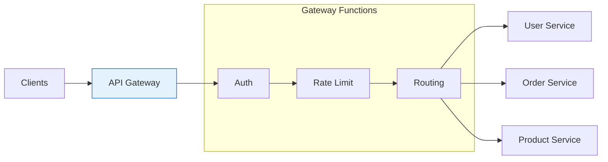

# API Gateway

An API Gateway is a server that acts as a single entry point for a group of microservices, handling cross-cutting concerns.

## Visualization




---

## Why API Gateway?

### Without Gateway
```
Client → Authentication → Service A
Client → Authentication → Service B
Client → Rate Limiting → Service C
         (duplicated logic in each service)
```

### With Gateway
```
Client → API Gateway → Service A
         (auth, rate limit, logging)
                    → Service B
                    → Service C
```

---

## Core Functions

### 1. Request Routing

```yaml
# Route configuration example
routes:
  - path: /api/users/*
    service: user-service
    methods: [GET, POST, PUT, DELETE]

  - path: /api/orders/*
    service: order-service
    methods: [GET, POST]

  - path: /api/products/*
    service: product-service
    methods: [GET]
```

### 2. Authentication & Authorization

```
Client → Gateway → Validate JWT → Forward to service
                → Extract user info → Add to headers
```

```python
# Gateway middleware
def authenticate(request):
    token = request.headers.get('Authorization')
    if not token:
        return Response(status=401)

    try:
        payload = jwt.decode(token, SECRET_KEY)
        request.user_id = payload['user_id']
        request.roles = payload['roles']
    except jwt.InvalidTokenError:
        return Response(status=401)
```

### 3. Rate Limiting

```python
# Token bucket per API key
class RateLimiter:
    def check(self, api_key, limit=100, window=60):
        key = f"rate:{api_key}"
        current = redis.incr(key)
        if current == 1:
            redis.expire(key, window)

        if current > limit:
            return False, {"retry_after": redis.ttl(key)}
        return True, {}
```

```
Response Headers:
X-RateLimit-Limit: 100
X-RateLimit-Remaining: 45
X-RateLimit-Reset: 1640995200
```

### 4. Request/Response Transformation

```yaml
# Transform request
- add_header: X-Request-ID: ${uuid}
- add_header: X-Forwarded-For: ${client_ip}
- remove_header: Cookie

# Transform response
- add_header: X-Response-Time: ${latency_ms}ms
- remove_header: Server
```

### 5. Load Balancing

```yaml
service: user-service
load_balancing:
  algorithm: round_robin
  health_check:
    path: /health
    interval: 10s
  targets:
    - host: user-1:8080
      weight: 3
    - host: user-2:8080
      weight: 2
```

### 6. Circuit Breaker

```python
class CircuitBreaker:
    def __init__(self, failure_threshold=5, timeout=30):
        self.failures = 0
        self.threshold = failure_threshold
        self.timeout = timeout
        self.state = 'CLOSED'
        self.last_failure = None

    def call(self, func):
        if self.state == 'OPEN':
            if time.time() - self.last_failure > self.timeout:
                self.state = 'HALF_OPEN'
            else:
                raise CircuitOpenError()

        try:
            result = func()
            self.on_success()
            return result
        except Exception as e:
            self.on_failure()
            raise e

    def on_success(self):
        self.failures = 0
        self.state = 'CLOSED'

    def on_failure(self):
        self.failures += 1
        self.last_failure = time.time()
        if self.failures >= self.threshold:
            self.state = 'OPEN'
```

---

## API Gateway Patterns

### Backend for Frontend (BFF)

```
Mobile App → Mobile Gateway → Services
Web App → Web Gateway → Services
Partner API → Partner Gateway → Services
```

Each client type has optimized gateway.

### API Composition

```
Client: GET /api/user-dashboard

Gateway:
  → User Service: GET /users/123
  → Orders Service: GET /users/123/orders
  → Recommendations: GET /users/123/recommendations

Gateway combines responses → Client
```

---

## Popular API Gateways

| Gateway | Type | Best For |
|---------|------|----------|
| Kong | Open source | Kubernetes, plugins |
| AWS API Gateway | Managed | AWS ecosystem, serverless |
| Nginx | Open source | High performance |
| Envoy | Open source | Service mesh |
| Apigee | Managed | Enterprise, analytics |

---

## Kong Configuration Example

```yaml
# Define service
services:
  - name: user-service
    url: http://user-service:8080
    routes:
      - name: user-routes
        paths:
          - /api/users

# Add plugins
plugins:
  - name: jwt
    config:
      secret_is_base64: false

  - name: rate-limiting
    config:
      minute: 100
      policy: local

  - name: request-transformer
    config:
      add:
        headers:
          - X-Request-ID:$(uuid)
```

---

## Security Considerations

### 1. TLS Termination
```
Client ──HTTPS──→ Gateway ──HTTP──→ Services
                  (TLS terminates here)
```

### 2. Input Validation
```python
def validate_request(request):
    # Check content length
    if len(request.body) > MAX_BODY_SIZE:
        return Response(status=413)

    # Validate content type
    if request.content_type not in ALLOWED_TYPES:
        return Response(status=415)

    # Sanitize inputs
    # Check for SQL injection, XSS, etc.
```

### 3. API Key Management
```
Headers:
  X-API-Key: abc123

Gateway validates and identifies client
Different rate limits per API key tier
```

---

## Interview Talking Points

1. **Purpose**: Single entry point, cross-cutting concerns
2. **Functions**: Routing, auth, rate limiting, transformation
3. **Patterns**: BFF, API composition
4. **Trade-offs**: Single point of failure, added latency
5. **Solutions**: Kong, AWS API Gateway (know one well)
