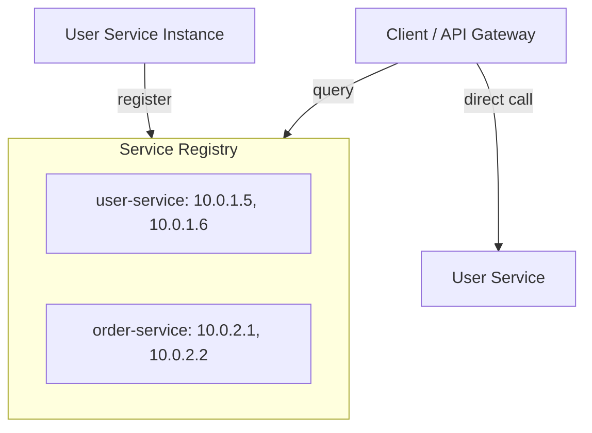
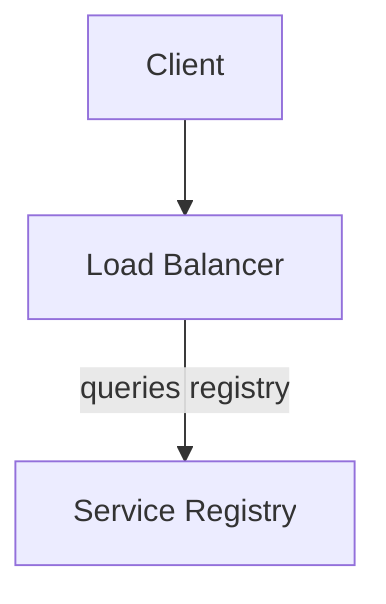

# Service Discovery

Service discovery enables services to find and communicate with each other dynamically, essential in microservices architectures.

---

## Why Service Discovery?

### Static Configuration Problem
```
# Old way: hardcoded
user-service:
  hosts:
    - 10.0.1.5:8080
    - 10.0.1.6:8080

What if:
- A host goes down?
- We add new instances?
- Hosts get new IPs?
```

### Dynamic Discovery Solution
```
Services register themselves
Clients query for available instances
Automatic updates when instances change
```

---

## Service Discovery Patterns

### Client-Side Discovery



**Pros**: No extra hop, client can do load balancing
**Cons**: Client needs discovery logic

### Server-Side Discovery



**Pros**: Simple clients, centralized logic
**Cons**: Extra hop, LB can be bottleneck

---

## Service Registry

### Registration

```python
# Service registers on startup
class ServiceRegistration:
    def __init__(self, registry_url):
        self.registry = registry_url
        self.service_id = f"{SERVICE_NAME}-{uuid.uuid4()}"

    def register(self):
        requests.put(
            f"{self.registry}/services/{self.service_id}",
            json={
                "name": SERVICE_NAME,
                "address": get_local_ip(),
                "port": PORT,
                "health_check": {
                    "http": f"http://{get_local_ip()}:{PORT}/health",
                    "interval": "10s"
                }
            }
        )

    def deregister(self):
        requests.delete(f"{self.registry}/services/{self.service_id}")
```

### Heartbeat

```
Service → Registry: "I'm alive" (every 10s)

If no heartbeat for 30s:
Registry removes service from list
```

---

## Popular Service Discovery Solutions

### Consul

```yaml
# Service registration
service {
  name = "user-service"
  id = "user-service-1"
  port = 8080

  check {
    http = "http://localhost:8080/health"
    interval = "10s"
    timeout = "2s"
  }
}
```

```bash
# Query services
curl http://consul:8500/v1/catalog/service/user-service
```

### etcd

```python
import etcd3

etcd = etcd3.client()

# Register
etcd.put('/services/user-service/instance-1', 'http://10.0.1.5:8080')

# Watch for changes
events, cancel = etcd.watch_prefix('/services/user-service/')
for event in events:
    print(f"Service change: {event}")
```

### Kubernetes (DNS-based)

```yaml
# Kubernetes Service
apiVersion: v1
kind: Service
metadata:
  name: user-service
spec:
  selector:
    app: user-service
  ports:
    - port: 8080
```

```python
# Access via DNS
response = requests.get("http://user-service:8080/users")
# Kubernetes DNS resolves user-service to pod IPs
```

### Zookeeper

```java
// Register ephemeral node
curator.create()
    .withMode(CreateMode.EPHEMERAL)
    .forPath("/services/user-service/instance-1",
             "http://10.0.1.5:8080".getBytes());

// Node automatically removed when connection lost
```

---

## DNS-Based Discovery

### Simple Approach

```
user-service.internal → [10.0.1.5, 10.0.1.6, 10.0.1.7]

Client uses DNS round-robin
Simple, works with any language
```

### Limitations
- DNS caching (stale entries)
- Limited health checking
- No load balancing intelligence

### SRV Records

```
_user-service._tcp.example.com. SRV 0 5 8080 user-1.example.com.
                                SRV 0 5 8080 user-2.example.com.

Includes port and priority information
```

---

## Health Checking

### Types

```
HTTP Check:
  GET /health → 200 OK

TCP Check:
  Connect to port, success if connection established

Script Check:
  Run custom script, check exit code

gRPC Check:
  Use gRPC health checking protocol
```

### Health Endpoint

```python
@app.route('/health')
def health():
    checks = {
        'database': check_database(),
        'cache': check_cache(),
        'dependencies': check_dependencies()
    }

    all_healthy = all(checks.values())

    return jsonify({
        'status': 'healthy' if all_healthy else 'unhealthy',
        'checks': checks
    }), 200 if all_healthy else 503
```

---

## Load Balancing with Discovery

```python
class ServiceClient:
    def __init__(self, service_name, registry):
        self.service_name = service_name
        self.registry = registry
        self.instances = []
        self.current = 0
        self.refresh_instances()

    def refresh_instances(self):
        self.instances = self.registry.get_healthy_instances(self.service_name)

    def get_instance(self):
        # Round-robin
        if not self.instances:
            self.refresh_instances()
        instance = self.instances[self.current % len(self.instances)]
        self.current += 1
        return instance

    def call(self, path):
        instance = self.get_instance()
        try:
            return requests.get(f"{instance}{path}")
        except Exception:
            self.refresh_instances()  # Instance may be dead
            raise
```

---

## Comparison

| Solution | Type | Best For |
|----------|------|----------|
| Consul | Service Discovery | Multi-datacenter, feature-rich |
| etcd | Key-Value | Kubernetes, simple |
| Zookeeper | Coordination | Kafka, Hadoop |
| Kubernetes DNS | Built-in | Kubernetes environments |
| Eureka | Service Discovery | Netflix/Spring ecosystem |

---

## Interview Talking Points

1. **Why needed**: Dynamic infrastructure, container orchestration
2. **Client vs server**: Trade-offs of each approach
3. **Health checks**: How to detect and handle failures
4. **Caching**: Balance between freshness and performance
5. **Solutions**: Know Consul or Kubernetes approach well
