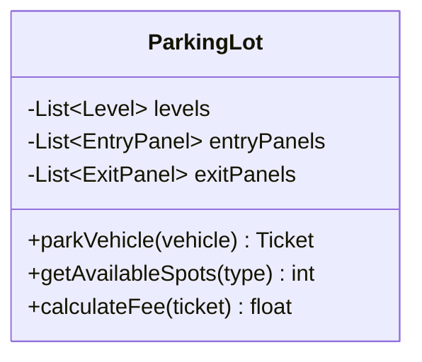
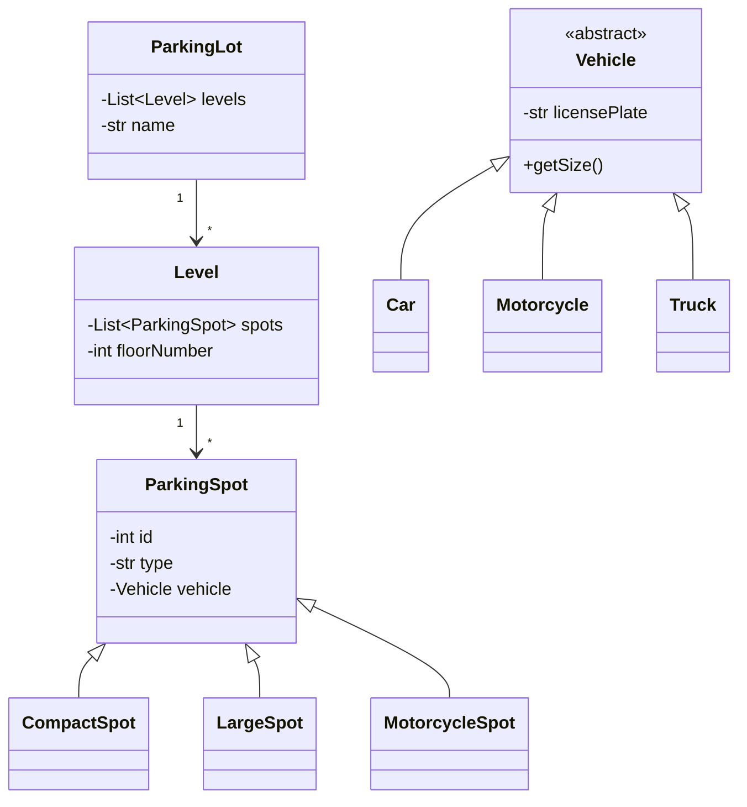

# LLD Case Studies

This section contains object-oriented design case studies commonly asked in interviews.

---

## Case Study List

### Classic Problems (Most Frequently Asked)
- [12.1 Design Parking Lot](01_design_parking_lot.md) - Core OOP concepts
- [12.2 Design Elevator System](02_design_elevator_system.md) - State machine
- [12.3 Design Library Management System](03_design_library_management.md) - CRUD operations
- [12.4 Design Vending Machine](04_design_vending_machine.md) - State pattern
- [12.5 Design Tic-Tac-Toe](05_design_tic_tac_toe.md) - Game logic

### Intermediate Problems
- [12.6 Design Chess Game](06_design_chess.md) - Complex game rules
- [12.7 Design Hotel Booking System](07_design_booking_system.md) - Reservations
- [12.8 Design LRU Cache](08_design_lru_cache.md) - Data structure design
- [12.9 Design Snake Game](09_design_snake_game.md) - Movement, collision
- [12.10 Design File System](10_design_file_system.md) - Composite pattern

---

## Approach Template

### 1. Clarify Requirements
```
"Design a parking lot"

Questions to ask:
- How many levels/floors?
- Types of vehicles?
- Pricing model?
- Entry/exit system?
```

### 2. Identify Use Cases
```
Actors: Driver, Admin, System

Use Cases:
1. Driver parks vehicle
2. Driver pays and exits
3. System tracks availability
4. Admin views reports
```

### 3. Identify Core Classes
```
Nouns → Classes:
- ParkingLot
- Level, ParkingSpot
- Vehicle, Car, Motorcycle, Truck
- Ticket, Payment
```

### 4. Define Relationships
```
- ParkingLot HAS-A Levels (composition)
- Level HAS-A ParkingSpots (composition)
- Car IS-A Vehicle (inheritance)
- Ticket USES Vehicle, ParkingSpot (association)
```

### 5. Apply Design Patterns
```
- Factory: Create different vehicle types
- Strategy: Different pricing strategies
- State: Parking spot states (available, occupied)
- Observer: Notify when spot available
```

### 6. Design Class Diagram


### 7. Write Key Methods
```python
class ParkingLot:
    def park_vehicle(self, vehicle: Vehicle) -> Ticket:
        spot = self.find_available_spot(vehicle.get_size())
        if spot:
            spot.assign_vehicle(vehicle)
            return Ticket(vehicle, spot)
        raise NoSpotAvailableError()
```

---

## Common Design Patterns by Problem

| Problem | Patterns |
|---------|----------|
| Parking Lot | Factory, Strategy, Observer |
| Elevator | State, Strategy, Observer |
| Vending Machine | State |
| Chess | Factory, Strategy, Command |
| Library | Repository, Factory |
| LRU Cache | (Data structure: HashMap + DoublyLinkedList) |
| File System | Composite |

---

## Evaluation Criteria

| Criteria | What They Look For |
|----------|-------------------|
| Requirements | Did you clarify before designing? |
| Use Cases | Complete coverage? |
| Class Design | Clear responsibilities, proper relationships |
| SOLID | Followed principles? |
| Design Patterns | Applied appropriately? |
| Extensibility | Easy to add features? |
| Code Quality | Clean, readable implementation |

---

## Quick Class Diagram for Parking Lot


