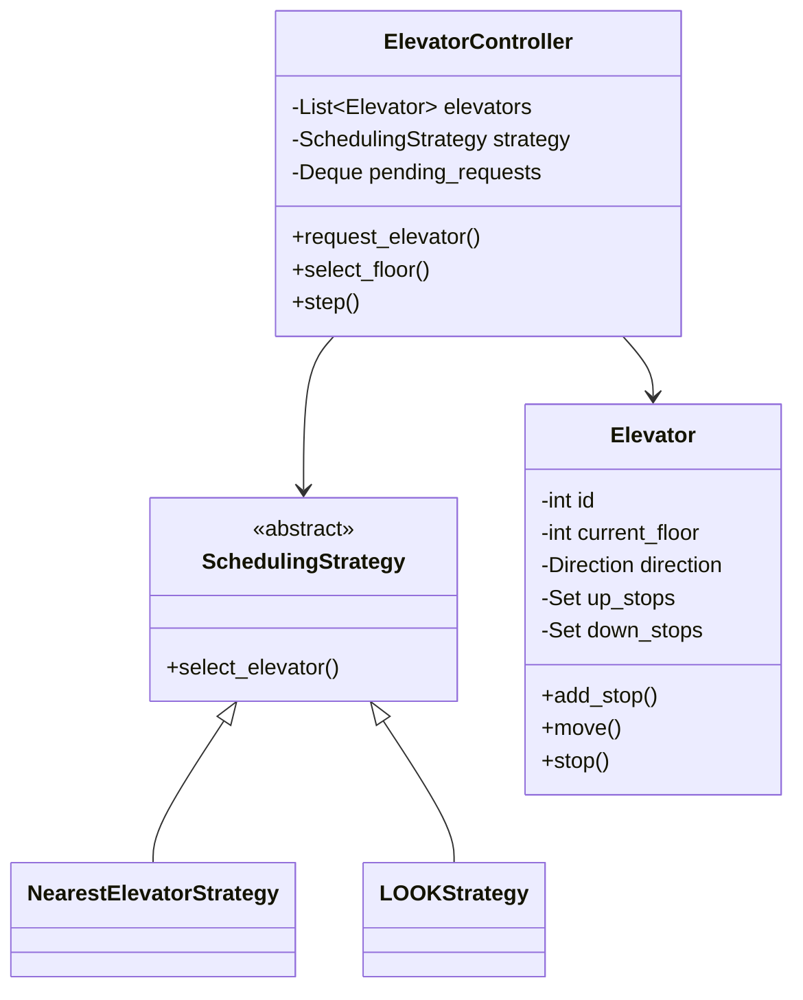

# Elevator System Design

## Problem Statement

Design an elevator system for a building with multiple elevators.

---

## Requirements

### Functional
- Multiple elevators in a building
- Users can request elevator from any floor
- Users can select destination floor
- Efficient scheduling of elevator requests

### Non-Functional
- Minimize wait time
- Energy efficient
- Handle concurrent requests
- Fair scheduling

---

## Core Classes

```python
from abc import ABC, abstractmethod
from enum import Enum
from typing import List, Optional
from dataclasses import dataclass, field
from collections import deque
import threading
import time

class Direction(Enum):
    UP = 1
    DOWN = -1
    IDLE = 0

class DoorState(Enum):
    OPEN = "open"
    CLOSED = "closed"

class ElevatorState(Enum):
    MOVING = "moving"
    STOPPED = "stopped"
    MAINTENANCE = "maintenance"

@dataclass
class Request:
    floor: int
    direction: Direction
    timestamp: float = field(default_factory=time.time)

@dataclass
class InternalRequest:
    destination: int
    timestamp: float = field(default_factory=time.time)
```

---

## Elevator Class

```python
class Elevator:
    def __init__(self, elevator_id: int, min_floor: int, max_floor: int):
        self.id = elevator_id
        self.min_floor = min_floor
        self.max_floor = max_floor
        self.current_floor = 0
        self.direction = Direction.IDLE
        self.state = ElevatorState.STOPPED
        self.door_state = DoorState.CLOSED

        # Separate queues for up and down requests
        self.up_stops: set = set()
        self.down_stops: set = set()

        self._lock = threading.Lock()

    def add_stop(self, floor: int, direction: Direction = None) -> bool:
        """Add a floor to the appropriate stop queue"""
        if floor < self.min_floor or floor > self.max_floor:
            return False

        with self._lock:
            if direction == Direction.UP or (direction is None and floor > self.current_floor):
                self.up_stops.add(floor)
            else:
                self.down_stops.add(floor)

            # Start moving if idle
            if self.direction == Direction.IDLE:
                self._determine_direction()

        return True

    def _determine_direction(self) -> None:
        """Determine which direction to move"""
        if self.up_stops and (not self.down_stops or
                              min(self.up_stops) <= self.current_floor or
                              not any(f < self.current_floor for f in self.down_stops)):
            self.direction = Direction.UP
        elif self.down_stops:
            self.direction = Direction.DOWN
        else:
            self.direction = Direction.IDLE

    def move(self) -> None:
        """Move one floor in current direction"""
        if self.direction == Direction.IDLE or self.state == ElevatorState.MAINTENANCE:
            return

        with self._lock:
            if self.direction == Direction.UP:
                self.current_floor += 1
            else:
                self.current_floor -= 1

            self.state = ElevatorState.MOVING

    def should_stop(self) -> bool:
        """Check if elevator should stop at current floor"""
        with self._lock:
            if self.direction == Direction.UP:
                return self.current_floor in self.up_stops
            elif self.direction == Direction.DOWN:
                return self.current_floor in self.down_stops
        return False

    def stop(self) -> None:
        """Stop at current floor"""
        with self._lock:
            self.state = ElevatorState.STOPPED

            # Remove current floor from stops
            self.up_stops.discard(self.current_floor)
            self.down_stops.discard(self.current_floor)

            # Open doors
            self.door_state = DoorState.OPEN

            # Check if we need to change direction
            self._check_direction_change()

    def _check_direction_change(self) -> None:
        """Check if we should change direction"""
        if self.direction == Direction.UP:
            # Continue up if there are stops above
            if not any(f > self.current_floor for f in self.up_stops):
                # No more stops above, check for down stops
                if self.down_stops:
                    self.direction = Direction.DOWN
                elif self.up_stops:
                    self.direction = Direction.UP
                else:
                    self.direction = Direction.IDLE
        elif self.direction == Direction.DOWN:
            if not any(f < self.current_floor for f in self.down_stops):
                if self.up_stops:
                    self.direction = Direction.UP
                elif self.down_stops:
                    self.direction = Direction.DOWN
                else:
                    self.direction = Direction.IDLE

    def close_doors(self) -> None:
        """Close doors and prepare to move"""
        with self._lock:
            self.door_state = DoorState.CLOSED

    def is_available(self) -> bool:
        """Check if elevator can take new requests"""
        return self.state != ElevatorState.MAINTENANCE

    def get_load(self) -> int:
        """Get current number of pending stops"""
        return len(self.up_stops) + len(self.down_stops)

    def __str__(self) -> str:
        return (f"Elevator {self.id}: Floor {self.current_floor}, "
                f"Direction: {self.direction.name}, State: {self.state.name}")
```

---

## Scheduling Algorithms

```python
class SchedulingStrategy(ABC):
    @abstractmethod
    def select_elevator(self, request: Request,
                       elevators: List[Elevator]) -> Optional[Elevator]:
        pass

class NearestElevatorStrategy(SchedulingStrategy):
    """Select the nearest available elevator"""

    def select_elevator(self, request: Request,
                       elevators: List[Elevator]) -> Optional[Elevator]:
        available = [e for e in elevators if e.is_available()]
        if not available:
            return None

        def distance(elevator: Elevator) -> int:
            return abs(elevator.current_floor - request.floor)

        return min(available, key=distance)

class LOOKStrategy(SchedulingStrategy):
    """
    LOOK algorithm: Like SCAN but reverses at the last request
    instead of going to the end.
    """

    def select_elevator(self, request: Request,
                       elevators: List[Elevator]) -> Optional[Elevator]:
        available = [e for e in elevators if e.is_available()]
        if not available:
            return None

        best_elevator = None
        best_score = float('inf')

        for elevator in available:
            score = self._calculate_score(elevator, request)
            if score < best_score:
                best_score = score
                best_elevator = elevator

        return best_elevator

    def _calculate_score(self, elevator: Elevator, request: Request) -> int:
        floor_diff = request.floor - elevator.current_floor

        # Elevator is idle
        if elevator.direction == Direction.IDLE:
            return abs(floor_diff)

        # Elevator moving toward request floor in same direction
        if elevator.direction == request.direction:
            if elevator.direction == Direction.UP and floor_diff > 0:
                return floor_diff
            elif elevator.direction == Direction.DOWN and floor_diff < 0:
                return abs(floor_diff)

        # Elevator will need to reverse
        # Calculate total travel distance
        if elevator.direction == Direction.UP:
            max_stop = max(elevator.up_stops) if elevator.up_stops else elevator.current_floor
            return (max_stop - elevator.current_floor) + (max_stop - request.floor)
        else:
            min_stop = min(elevator.down_stops) if elevator.down_stops else elevator.current_floor
            return (elevator.current_floor - min_stop) + (request.floor - min_stop)

class ZoneBasedStrategy(SchedulingStrategy):
    """
    Divide building into zones, each elevator handles specific zones.
    """

    def __init__(self, num_elevators: int, total_floors: int):
        self.floors_per_zone = total_floors // num_elevators

    def select_elevator(self, request: Request,
                       elevators: List[Elevator]) -> Optional[Elevator]:
        # Determine which zone the request is in
        zone = request.floor // self.floors_per_zone
        zone = min(zone, len(elevators) - 1)

        primary_elevator = elevators[zone]
        if primary_elevator.is_available():
            return primary_elevator

        # Fallback to nearest available
        return NearestElevatorStrategy().select_elevator(request, elevators)
```

---

## Elevator Controller

```python
class ElevatorController:
    """Central controller managing all elevators"""

    def __init__(self, num_elevators: int, num_floors: int,
                 strategy: SchedulingStrategy = None):
        self.num_floors = num_floors
        self.elevators = [
            Elevator(i, 0, num_floors - 1)
            for i in range(num_elevators)
        ]
        self.strategy = strategy or LOOKStrategy()
        self.pending_requests: deque = deque()
        self._lock = threading.Lock()

    def request_elevator(self, floor: int, direction: Direction) -> Optional[int]:
        """
        External request: User presses up/down button on a floor.
        Returns the elevator ID that will service the request.
        """
        request = Request(floor, direction)

        with self._lock:
            elevator = self.strategy.select_elevator(request, self.elevators)
            if elevator:
                elevator.add_stop(floor, direction)
                print(f"Elevator {elevator.id} assigned to floor {floor} "
                      f"going {direction.name}")
                return elevator.id
            else:
                self.pending_requests.append(request)
                print(f"No elevator available, request queued")
                return None

    def select_floor(self, elevator_id: int, floor: int) -> bool:
        """
        Internal request: User selects destination floor inside elevator.
        """
        if elevator_id < 0 or elevator_id >= len(self.elevators):
            return False

        elevator = self.elevators[elevator_id]
        return elevator.add_stop(floor)

    def step(self) -> None:
        """Simulate one time step for all elevators"""
        for elevator in self.elevators:
            if elevator.door_state == DoorState.OPEN:
                elevator.close_doors()
            elif elevator.should_stop():
                elevator.stop()
                print(f"Elevator {elevator.id} stopped at floor "
                      f"{elevator.current_floor}")
            elif elevator.direction != Direction.IDLE:
                elevator.move()

        # Process pending requests
        self._process_pending_requests()

    def _process_pending_requests(self) -> None:
        """Try to assign pending requests to available elevators"""
        with self._lock:
            remaining = deque()
            while self.pending_requests:
                request = self.pending_requests.popleft()
                elevator = self.strategy.select_elevator(request, self.elevators)
                if elevator:
                    elevator.add_stop(request.floor, request.direction)
                else:
                    remaining.append(request)
            self.pending_requests = remaining

    def get_status(self) -> str:
        """Get status of all elevators"""
        lines = ["=== Elevator System Status ==="]
        for elevator in self.elevators:
            lines.append(str(elevator))
        return "\n".join(lines)

    def set_maintenance(self, elevator_id: int, maintenance: bool) -> None:
        """Set elevator maintenance mode"""
        if 0 <= elevator_id < len(self.elevators):
            elevator = self.elevators[elevator_id]
            elevator.state = (ElevatorState.MAINTENANCE if maintenance
                            else ElevatorState.STOPPED)
```

---

## Usage Example

```python
def simulate_elevator_system():
    # Create system with 3 elevators, 20 floors
    controller = ElevatorController(
        num_elevators=3,
        num_floors=20,
        strategy=LOOKStrategy()
    )

    print("=== Initial Status ===")
    print(controller.get_status())

    # Simulate requests
    print("\n=== Processing Requests ===")

    # Person on floor 5 wants to go up
    controller.request_elevator(5, Direction.UP)

    # Person on floor 15 wants to go down
    controller.request_elevator(15, Direction.DOWN)

    # Person on floor 0 wants to go up
    controller.request_elevator(0, Direction.UP)

    # Simulate time steps
    for step in range(25):
        controller.step()
        if step % 5 == 0:
            print(f"\n--- Step {step} ---")
            print(controller.get_status())

    # Internal request: person in elevator 0 selects floor 10
    controller.select_floor(0, 10)

    for step in range(10):
        controller.step()

    print("\n=== Final Status ===")
    print(controller.get_status())

if __name__ == "__main__":
    simulate_elevator_system()
```

---

## Class Diagram



---

## Design Patterns Used

| Pattern | Usage |
|---------|-------|
| **Strategy** | Scheduling algorithms |
| **State** | Elevator states (Moving, Stopped, Maintenance) |
| **Singleton** | Controller instance |
| **Observer** | Floor displays monitoring elevator position |

---

## Interview Discussion Points

1. **How to handle peak hours?**
   - Pre-position elevators at busy floors
   - Use express elevators for high-traffic floors

2. **How to handle power failure?**
   - Battery backup for safe floor landing
   - Emergency stop procedures

3. **How to optimize for energy efficiency?**
   - Minimize total travel distance
   - Sleep mode for idle elevators

---

**Tags**: #lld #case-study #elevator #scheduling #state-pattern
