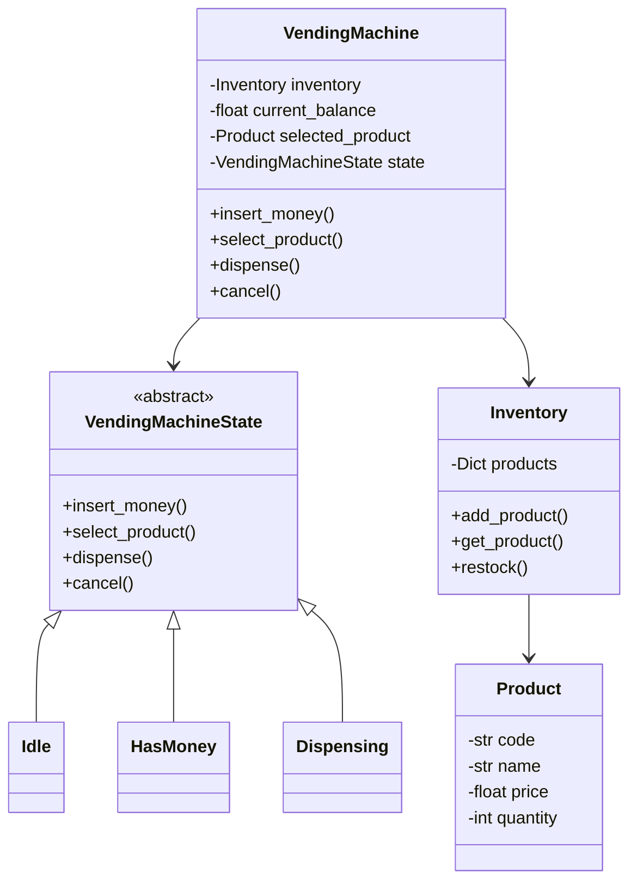

# Vending Machine Design

## Problem Statement

Design a vending machine that handles product selection, payment processing, and dispensing.

---

## Requirements

### Functional
- Display available products with prices
- Accept multiple payment methods (coins, cash, card)
- Dispense selected product
- Return change
- Handle refunds
- Admin operations (restock, collect money)

### Non-Functional
- Thread-safe operations
- Handle concurrent users
- Reliable transaction processing

---

## State Pattern Implementation

```python
from abc import ABC, abstractmethod
from enum import Enum
from typing import Dict, List, Optional
from dataclasses import dataclass, field
from datetime import datetime
import threading

class Coin(Enum):
    PENNY = 0.01
    NICKEL = 0.05
    DIME = 0.10
    QUARTER = 0.25
    DOLLAR = 1.00

@dataclass
class Product:
    code: str
    name: str
    price: float
    quantity: int = 0

    def is_available(self) -> bool:
        return self.quantity > 0

    def dispense(self) -> bool:
        if self.quantity > 0:
            self.quantity -= 1
            return True
        return False

@dataclass
class Inventory:
    products: Dict[str, Product] = field(default_factory=dict)

    def add_product(self, product: Product) -> None:
        self.products[product.code] = product

    def get_product(self, code: str) -> Optional[Product]:
        return self.products.get(code)

    def restock(self, code: str, quantity: int) -> bool:
        if code in self.products:
            self.products[code].quantity += quantity
            return True
        return False

    def get_available_products(self) -> List[Product]:
        return [p for p in self.products.values() if p.is_available()]
```

---

## State Pattern Classes

```python
class VendingMachineState(ABC):
    def __init__(self, machine: 'VendingMachine'):
        self.machine = machine

    @abstractmethod
    def insert_money(self, amount: float) -> None:
        pass

    @abstractmethod
    def select_product(self, code: str) -> None:
        pass

    @abstractmethod
    def dispense(self) -> Optional[Product]:
        pass

    @abstractmethod
    def cancel(self) -> float:
        pass

class IdleState(VendingMachineState):
    def insert_money(self, amount: float) -> None:
        self.machine.current_balance += amount
        print(f"Inserted ${amount:.2f}. Balance: ${self.machine.current_balance:.2f}")
        self.machine.set_state(self.machine.has_money_state)

    def select_product(self, code: str) -> None:
        print("Please insert money first")

    def dispense(self) -> Optional[Product]:
        print("Please insert money and select product first")
        return None

    def cancel(self) -> float:
        print("No transaction to cancel")
        return 0.0

class HasMoneyState(VendingMachineState):
    def insert_money(self, amount: float) -> None:
        self.machine.current_balance += amount
        print(f"Inserted ${amount:.2f}. Balance: ${self.machine.current_balance:.2f}")

    def select_product(self, code: str) -> None:
        product = self.machine.inventory.get_product(code)

        if not product:
            print(f"Product {code} not found")
            return

        if not product.is_available():
            print(f"{product.name} is out of stock")
            return

        if self.machine.current_balance < product.price:
            needed = product.price - self.machine.current_balance
            print(f"Insufficient funds. Please insert ${needed:.2f} more")
            return

        self.machine.selected_product = product
        print(f"Selected: {product.name} (${product.price:.2f})")
        self.machine.set_state(self.machine.dispensing_state)

    def dispense(self) -> Optional[Product]:
        print("Please select a product first")
        return None

    def cancel(self) -> float:
        refund = self.machine.current_balance
        self.machine.current_balance = 0
        self.machine.set_state(self.machine.idle_state)
        print(f"Transaction cancelled. Refunding ${refund:.2f}")
        return refund

class DispensingState(VendingMachineState):
    def insert_money(self, amount: float) -> None:
        print("Please wait, dispensing product...")

    def select_product(self, code: str) -> None:
        print("Please wait, dispensing product...")

    def dispense(self) -> Optional[Product]:
        product = self.machine.selected_product

        if product and product.dispense():
            # Calculate change
            change = self.machine.current_balance - product.price
            self.machine.total_sales += product.price

            # Reset machine
            self.machine.current_balance = 0
            self.machine.selected_product = None
            self.machine.set_state(self.machine.idle_state)

            print(f"Dispensing {product.name}")
            if change > 0:
                print(f"Change: ${change:.2f}")
                self._dispense_change(change)

            return product
        else:
            print("Failed to dispense product")
            self.machine.set_state(self.machine.has_money_state)
            return None

    def _dispense_change(self, amount: float) -> Dict[Coin, int]:
        """Calculate optimal change in coins"""
        change = {}
        remaining = round(amount * 100)  # Work in cents

        for coin in sorted(Coin, key=lambda c: c.value, reverse=True):
            coin_cents = int(coin.value * 100)
            if remaining >= coin_cents:
                count = remaining // coin_cents
                change[coin] = count
                remaining -= count * coin_cents

        if change:
            print("Change breakdown:",
                  ", ".join(f"{c.name}: {n}" for c, n in change.items()))
        return change

    def cancel(self) -> float:
        print("Cannot cancel during dispensing")
        return 0.0
```

---

## Vending Machine

```python
class VendingMachine:
    def __init__(self):
        self.inventory = Inventory()
        self.current_balance = 0.0
        self.selected_product: Optional[Product] = None
        self.total_sales = 0.0

        # Initialize states
        self.idle_state = IdleState(self)
        self.has_money_state = HasMoneyState(self)
        self.dispensing_state = DispensingState(self)

        self._state = self.idle_state
        self._lock = threading.Lock()

    def set_state(self, state: VendingMachineState) -> None:
        self._state = state

    def insert_money(self, amount: float) -> None:
        with self._lock:
            self._state.insert_money(amount)

    def insert_coin(self, coin: Coin) -> None:
        self.insert_money(coin.value)

    def select_product(self, code: str) -> None:
        with self._lock:
            self._state.select_product(code)

    def dispense(self) -> Optional[Product]:
        with self._lock:
            return self._state.dispense()

    def cancel(self) -> float:
        with self._lock:
            return self._state.cancel()

    def display_products(self) -> None:
        print("\n=== Available Products ===")
        for product in self.inventory.products.values():
            status = "✓" if product.is_available() else "✗"
            print(f"[{product.code}] {product.name}: ${product.price:.2f} "
                  f"({product.quantity} left) {status}")
        print("=" * 30)

    def get_balance(self) -> float:
        return self.current_balance

    # Admin operations
    def restock(self, code: str, quantity: int) -> bool:
        return self.inventory.restock(code, quantity)

    def add_product(self, product: Product) -> None:
        self.inventory.add_product(product)

    def collect_money(self) -> float:
        collected = self.total_sales
        self.total_sales = 0
        return collected

    def get_inventory_report(self) -> Dict[str, int]:
        return {p.code: p.quantity for p in self.inventory.products.values()}
```

---

## Payment Processing

```python
class PaymentMethod(ABC):
    @abstractmethod
    def process(self, amount: float) -> bool:
        pass

    @abstractmethod
    def refund(self, amount: float) -> bool:
        pass

class CashPayment(PaymentMethod):
    def __init__(self, machine: VendingMachine):
        self.machine = machine

    def process(self, amount: float) -> bool:
        self.machine.insert_money(amount)
        return True

    def refund(self, amount: float) -> bool:
        print(f"Refunding ${amount:.2f} in cash")
        return True

class CardPayment(PaymentMethod):
    def __init__(self, card_number: str, pin: str):
        self.card_number = card_number
        self.pin = pin

    def process(self, amount: float) -> bool:
        # Simulate card processing
        masked = f"****{self.card_number[-4:]}"
        print(f"Processing card {masked} for ${amount:.2f}")
        # In reality, would connect to payment gateway
        return True

    def refund(self, amount: float) -> bool:
        print(f"Refunding ${amount:.2f} to card")
        return True

class MobilePayment(PaymentMethod):
    def __init__(self, phone_number: str):
        self.phone_number = phone_number

    def process(self, amount: float) -> bool:
        print(f"Processing mobile payment for ${amount:.2f}")
        return True

    def refund(self, amount: float) -> bool:
        print(f"Refunding ${amount:.2f} to mobile wallet")
        return True
```

---

## Enhanced Vending Machine with Multiple Payment Methods

```python
class SmartVendingMachine(VendingMachine):
    def __init__(self):
        super().__init__()
        self.payment_methods: List[PaymentMethod] = []
        self.transaction_history: List[Dict] = []

    def add_payment_method(self, method: PaymentMethod) -> None:
        self.payment_methods.append(method)

    def process_payment(self, method: PaymentMethod, amount: float) -> bool:
        if method.process(amount):
            self.current_balance += amount
            self._log_transaction("PAYMENT", amount)
            return True
        return False

    def purchase(self, code: str, payment_method: PaymentMethod) -> Optional[Product]:
        """Complete purchase flow"""
        product = self.inventory.get_product(code)

        if not product:
            print(f"Product {code} not found")
            return None

        if not product.is_available():
            print(f"{product.name} is out of stock")
            return None

        # Process payment
        if not self.process_payment(payment_method, product.price):
            print("Payment failed")
            return None

        # Select and dispense
        self.select_product(code)
        dispensed = self.dispense()

        if dispensed:
            self._log_transaction("PURCHASE", product.price, product_code=code)

        return dispensed

    def _log_transaction(self, type: str, amount: float, **kwargs) -> None:
        self.transaction_history.append({
            "timestamp": datetime.now(),
            "type": type,
            "amount": amount,
            **kwargs
        })

    def get_sales_report(self) -> Dict:
        purchases = [t for t in self.transaction_history if t["type"] == "PURCHASE"]
        return {
            "total_transactions": len(purchases),
            "total_revenue": sum(t["amount"] for t in purchases),
            "products_sold": {}  # Could aggregate by product
        }
```

---

## Usage Example

```python
def demo_vending_machine():
    machine = VendingMachine()

    # Stock the machine
    machine.add_product(Product("A1", "Cola", 1.50, 10))
    machine.add_product(Product("A2", "Sprite", 1.50, 10))
    machine.add_product(Product("B1", "Chips", 2.00, 5))
    machine.add_product(Product("B2", "Candy", 1.00, 15))
    machine.add_product(Product("C1", "Water", 1.00, 20))

    print("=== Vending Machine Demo ===")
    machine.display_products()

    # Normal purchase flow
    print("\n--- Purchase Flow ---")
    machine.insert_coin(Coin.DOLLAR)
    machine.insert_coin(Coin.QUARTER)
    machine.insert_coin(Coin.QUARTER)
    machine.select_product("A1")
    machine.dispense()

    # Insufficient funds
    print("\n--- Insufficient Funds ---")
    machine.insert_coin(Coin.QUARTER)
    machine.select_product("B1")  # Needs $2.00

    # Add more money
    machine.insert_coin(Coin.DOLLAR)
    machine.insert_coin(Coin.DOLLAR)
    machine.select_product("B1")
    machine.dispense()

    # Cancel transaction
    print("\n--- Cancel Transaction ---")
    machine.insert_coin(Coin.DOLLAR)
    machine.cancel()

    # Out of stock scenario
    print("\n--- Restock ---")
    machine.restock("A1", 5)
    machine.display_products()

    # Admin report
    print(f"\nTotal Sales: ${machine.total_sales:.2f}")
    print(f"Inventory: {machine.get_inventory_report()}")

def demo_smart_vending():
    machine = SmartVendingMachine()

    machine.add_product(Product("A1", "Cola", 1.50, 10))
    machine.add_product(Product("B1", "Chips", 2.00, 5))

    # Card payment
    card = CardPayment("1234567890123456", "1234")
    machine.purchase("A1", card)

    # Mobile payment
    mobile = MobilePayment("555-1234")
    machine.purchase("B1", mobile)

    print(f"\nSales Report: {machine.get_sales_report()}")

if __name__ == "__main__":
    demo_vending_machine()
    print("\n" + "=" * 50 + "\n")
    demo_smart_vending()
```

---

## Class Diagram



---

## Design Patterns Used

| Pattern | Usage |
|---------|-------|
| **State** | Machine states (Idle, HasMoney, Dispensing) |
| **Strategy** | Payment methods |
| **Singleton** | Machine instance |
| **Command** | Transaction operations |

---

**Tags**: #lld #case-study #vending-machine #state-pattern #payment
