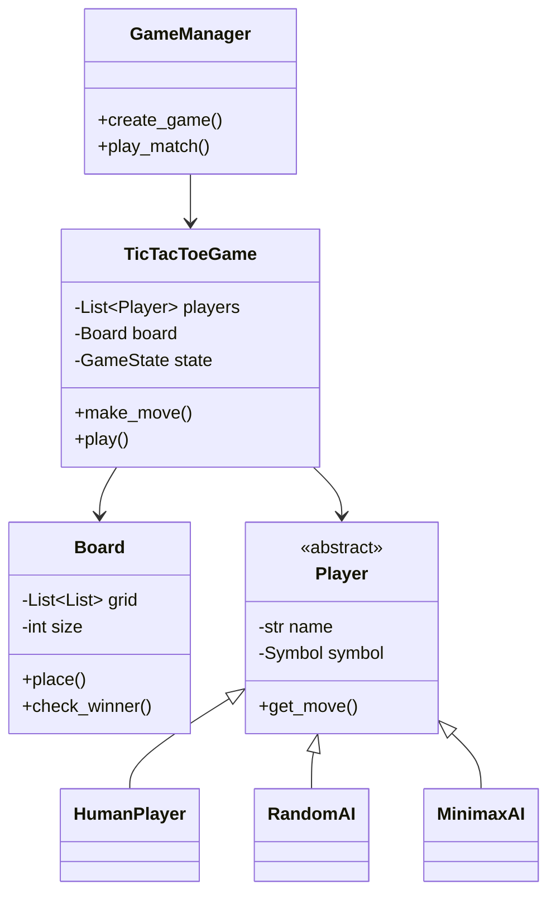

# Tic-Tac-Toe Game Design

## Problem Statement

Design a Tic-Tac-Toe game that supports two players on a 3x3 board.

---

## Requirements

### Functional
- Two players take turns (X and O)
- Detect win conditions (row, column, diagonal)
- Detect draw
- Reset game
- Support customizable board size (n x n)

### Non-Functional
- Clean, maintainable code
- Extensible for AI player
- Support different game modes

---

## Core Classes

```python
from abc import ABC, abstractmethod
from enum import Enum
from typing import List, Optional, Tuple
from dataclasses import dataclass

class Symbol(Enum):
    EMPTY = " "
    X = "X"
    O = "O"

class GameState(Enum):
    IN_PROGRESS = "in_progress"
    X_WON = "x_won"
    O_WON = "o_won"
    DRAW = "draw"

@dataclass
class Move:
    row: int
    col: int
    symbol: Symbol
```

---

## Board Class

```python
class Board:
    def __init__(self, size: int = 3):
        self.size = size
        self.grid: List[List[Symbol]] = [
            [Symbol.EMPTY for _ in range(size)]
            for _ in range(size)
        ]
        self.moves_count = 0

    def is_valid_move(self, row: int, col: int) -> bool:
        """Check if a move is valid"""
        if row < 0 or row >= self.size or col < 0 or col >= self.size:
            return False
        return self.grid[row][col] == Symbol.EMPTY

    def place(self, row: int, col: int, symbol: Symbol) -> bool:
        """Place a symbol on the board"""
        if not self.is_valid_move(row, col):
            return False
        self.grid[row][col] = symbol
        self.moves_count += 1
        return True

    def is_full(self) -> bool:
        """Check if board is completely filled"""
        return self.moves_count >= self.size * self.size

    def get_empty_cells(self) -> List[Tuple[int, int]]:
        """Get all empty cells"""
        cells = []
        for r in range(self.size):
            for c in range(self.size):
                if self.grid[r][c] == Symbol.EMPTY:
                    cells.append((r, c))
        return cells

    def check_winner(self) -> Optional[Symbol]:
        """Check if there's a winner"""
        # Check rows
        for row in self.grid:
            if row[0] != Symbol.EMPTY and all(cell == row[0] for cell in row):
                return row[0]

        # Check columns
        for col in range(self.size):
            if (self.grid[0][col] != Symbol.EMPTY and
                all(self.grid[row][col] == self.grid[0][col]
                    for row in range(self.size))):
                return self.grid[0][col]

        # Check main diagonal
        if (self.grid[0][0] != Symbol.EMPTY and
            all(self.grid[i][i] == self.grid[0][0] for i in range(self.size))):
            return self.grid[0][0]

        # Check anti-diagonal
        if (self.grid[0][self.size-1] != Symbol.EMPTY and
            all(self.grid[i][self.size-1-i] == self.grid[0][self.size-1]
                for i in range(self.size))):
            return self.grid[0][self.size-1]

        return None

    def reset(self) -> None:
        """Reset the board"""
        self.grid = [
            [Symbol.EMPTY for _ in range(self.size)]
            for _ in range(self.size)
        ]
        self.moves_count = 0

    def display(self) -> None:
        """Display the board"""
        print("\n")
        for i, row in enumerate(self.grid):
            row_str = " | ".join(cell.value for cell in row)
            print(f" {row_str} ")
            if i < self.size - 1:
                print("-" * (self.size * 4 - 1))
        print("\n")

    def __str__(self) -> str:
        lines = []
        for i, row in enumerate(self.grid):
            row_str = " | ".join(cell.value for cell in row)
            lines.append(f" {row_str} ")
            if i < self.size - 1:
                lines.append("-" * (self.size * 4 - 1))
        return "\n".join(lines)
```

---

## Player Classes

```python
class Player(ABC):
    def __init__(self, name: str, symbol: Symbol):
        self.name = name
        self.symbol = symbol
        self.wins = 0

    @abstractmethod
    def get_move(self, board: Board) -> Tuple[int, int]:
        """Get the next move from this player"""
        pass

    def __str__(self) -> str:
        return f"{self.name} ({self.symbol.value})"

class HumanPlayer(Player):
    def get_move(self, board: Board) -> Tuple[int, int]:
        """Get move from human input"""
        while True:
            try:
                move = input(f"{self.name}'s turn ({self.symbol.value}). "
                           f"Enter row,col (0-{board.size-1}): ")
                row, col = map(int, move.strip().split(","))
                if board.is_valid_move(row, col):
                    return (row, col)
                else:
                    print("Invalid move. Cell is occupied or out of bounds.")
            except ValueError:
                print("Invalid input. Enter as 'row,col' (e.g., '1,2')")

class RandomAIPlayer(Player):
    """AI player that makes random moves"""
    import random

    def get_move(self, board: Board) -> Tuple[int, int]:
        import random
        empty_cells = board.get_empty_cells()
        if empty_cells:
            move = random.choice(empty_cells)
            print(f"{self.name} ({self.symbol.value}) plays: {move}")
            return move
        raise ValueError("No valid moves available")

class MinimaxAIPlayer(Player):
    """AI player using Minimax algorithm"""

    def get_move(self, board: Board) -> Tuple[int, int]:
        best_move = self._find_best_move(board)
        print(f"{self.name} ({self.symbol.value}) plays: {best_move}")
        return best_move

    def _find_best_move(self, board: Board) -> Tuple[int, int]:
        best_score = float('-inf')
        best_move = None

        for row, col in board.get_empty_cells():
            board.grid[row][col] = self.symbol
            board.moves_count += 1

            score = self._minimax(board, 0, False)

            board.grid[row][col] = Symbol.EMPTY
            board.moves_count -= 1

            if score > best_score:
                best_score = score
                best_move = (row, col)

        return best_move

    def _minimax(self, board: Board, depth: int, is_maximizing: bool) -> int:
        winner = board.check_winner()

        if winner == self.symbol:
            return 10 - depth
        elif winner and winner != self.symbol:
            return depth - 10
        elif board.is_full():
            return 0

        opponent = Symbol.O if self.symbol == Symbol.X else Symbol.X

        if is_maximizing:
            best_score = float('-inf')
            for row, col in board.get_empty_cells():
                board.grid[row][col] = self.symbol
                board.moves_count += 1
                score = self._minimax(board, depth + 1, False)
                board.grid[row][col] = Symbol.EMPTY
                board.moves_count -= 1
                best_score = max(score, best_score)
            return best_score
        else:
            best_score = float('inf')
            for row, col in board.get_empty_cells():
                board.grid[row][col] = opponent
                board.moves_count += 1
                score = self._minimax(board, depth + 1, True)
                board.grid[row][col] = Symbol.EMPTY
                board.moves_count -= 1
                best_score = min(score, best_score)
            return best_score
```

---

## Game Class

```python
class TicTacToeGame:
    def __init__(self, player1: Player, player2: Player, board_size: int = 3):
        self.board = Board(board_size)
        self.players = [player1, player2]
        self.current_player_index = 0
        self.state = GameState.IN_PROGRESS
        self.move_history: List[Move] = []

    @property
    def current_player(self) -> Player:
        return self.players[self.current_player_index]

    def make_move(self, row: int, col: int) -> bool:
        """Make a move for the current player"""
        if self.state != GameState.IN_PROGRESS:
            print("Game is already over!")
            return False

        symbol = self.current_player.symbol

        if self.board.place(row, col, symbol):
            self.move_history.append(Move(row, col, symbol))
            self._update_game_state()

            if self.state == GameState.IN_PROGRESS:
                self._switch_player()
            return True
        return False

    def _switch_player(self) -> None:
        self.current_player_index = 1 - self.current_player_index

    def _update_game_state(self) -> None:
        winner = self.board.check_winner()

        if winner == Symbol.X:
            self.state = GameState.X_WON
            self.players[0 if self.players[0].symbol == Symbol.X else 1].wins += 1
        elif winner == Symbol.O:
            self.state = GameState.O_WON
            self.players[0 if self.players[0].symbol == Symbol.O else 1].wins += 1
        elif self.board.is_full():
            self.state = GameState.DRAW

    def play(self) -> GameState:
        """Play the game until completion"""
        print("\n=== Tic-Tac-Toe ===")
        self.board.display()

        while self.state == GameState.IN_PROGRESS:
            row, col = self.current_player.get_move(self.board)
            self.make_move(row, col)
            self.board.display()

        self._announce_result()
        return self.state

    def _announce_result(self) -> None:
        if self.state == GameState.X_WON:
            winner = next(p for p in self.players if p.symbol == Symbol.X)
            print(f"🎉 {winner.name} (X) wins!")
        elif self.state == GameState.O_WON:
            winner = next(p for p in self.players if p.symbol == Symbol.O)
            print(f"🎉 {winner.name} (O) wins!")
        else:
            print("It's a draw!")

    def reset(self) -> None:
        """Reset the game for a new round"""
        self.board.reset()
        self.state = GameState.IN_PROGRESS
        self.move_history.clear()
        # Swap who goes first
        self.current_player_index = 1 - self.current_player_index

    def undo(self) -> bool:
        """Undo the last move"""
        if not self.move_history:
            return False

        last_move = self.move_history.pop()
        self.board.grid[last_move.row][last_move.col] = Symbol.EMPTY
        self.board.moves_count -= 1
        self._switch_player()
        self.state = GameState.IN_PROGRESS
        return True

    def get_score(self) -> dict:
        """Get current score"""
        return {
            player.name: player.wins
            for player in self.players
        }
```

---

## Game Manager for Multiple Rounds

```python
class GameManager:
    def __init__(self):
        self.games_played = 0
        self.current_game: Optional[TicTacToeGame] = None

    def create_game(self, mode: str = "pvp", board_size: int = 3) -> TicTacToeGame:
        """Create a new game with specified mode"""
        if mode == "pvp":
            player1 = HumanPlayer("Player 1", Symbol.X)
            player2 = HumanPlayer("Player 2", Symbol.O)
        elif mode == "pve_easy":
            player1 = HumanPlayer("Player", Symbol.X)
            player2 = RandomAIPlayer("Computer", Symbol.O)
        elif mode == "pve_hard":
            player1 = HumanPlayer("Player", Symbol.X)
            player2 = MinimaxAIPlayer("Computer", Symbol.O)
        elif mode == "eve":
            player1 = MinimaxAIPlayer("AI 1", Symbol.X)
            player2 = MinimaxAIPlayer("AI 2", Symbol.O)
        else:
            raise ValueError(f"Unknown mode: {mode}")

        self.current_game = TicTacToeGame(player1, player2, board_size)
        return self.current_game

    def play_match(self, num_games: int = 3) -> dict:
        """Play a match of multiple games"""
        if not self.current_game:
            raise ValueError("No game created")

        for i in range(num_games):
            print(f"\n=== Game {i + 1} of {num_games} ===")
            self.current_game.play()
            self.games_played += 1

            if i < num_games - 1:
                self.current_game.reset()

        return self.current_game.get_score()
```

---

## Usage Example

```python
def demo_tic_tac_toe():
    # Human vs Human
    print("=== Human vs Human ===")
    player1 = HumanPlayer("Alice", Symbol.X)
    player2 = HumanPlayer("Bob", Symbol.O)
    game = TicTacToeGame(player1, player2)

    # Simulate some moves
    game.make_move(0, 0)  # X
    game.board.display()
    game.make_move(1, 1)  # O
    game.board.display()
    game.make_move(0, 1)  # X
    game.make_move(2, 2)  # O
    game.make_move(0, 2)  # X wins!
    game.board.display()

    print(f"Game state: {game.state}")
    print(f"Scores: {game.get_score()}")

def demo_ai_game():
    print("\n=== AI vs AI ===")
    ai1 = MinimaxAIPlayer("AI-X", Symbol.X)
    ai2 = MinimaxAIPlayer("AI-O", Symbol.O)
    game = TicTacToeGame(ai1, ai2)
    result = game.play()
    print(f"Result: {result}")

def demo_with_manager():
    print("\n=== Using Game Manager ===")
    manager = GameManager()
    game = manager.create_game(mode="eve")
    scores = manager.play_match(num_games=1)
    print(f"Final scores: {scores}")

if __name__ == "__main__":
    demo_tic_tac_toe()
    demo_ai_game()
```

---

## Class Diagram



---

## Design Patterns Used

| Pattern | Usage |
|---------|-------|
| **Strategy** | Different player types (Human, AI) |
| **State** | Game states |
| **Template Method** | Game flow |
| **Command** | Move history for undo |

---

**Tags**: #lld #case-study #tic-tac-toe #game #strategy-pattern
