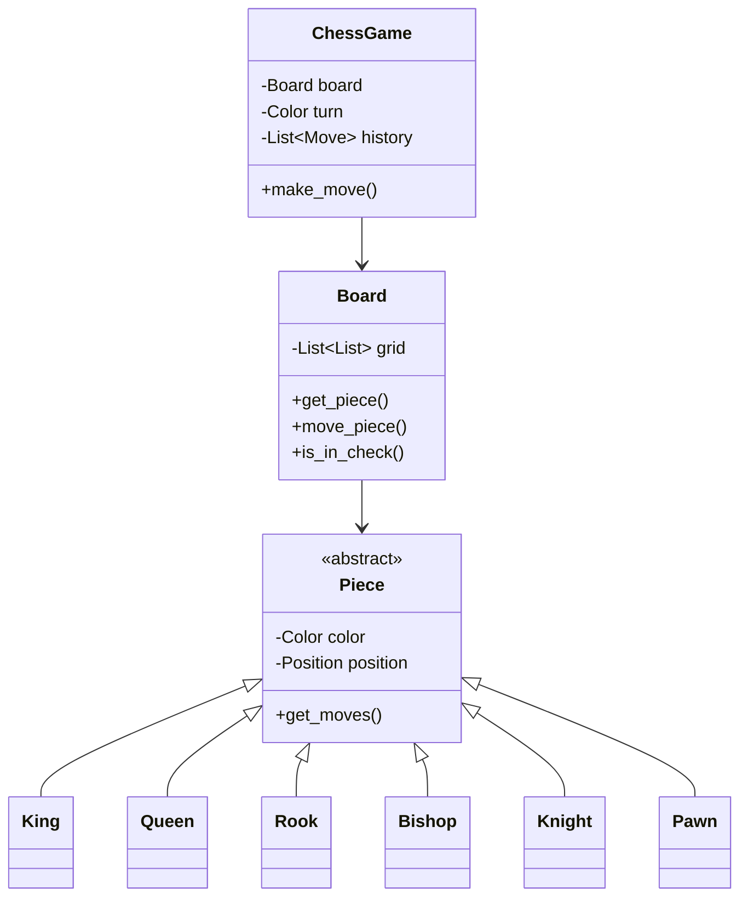

# Chess Game Design

## Problem Statement

Design a chess game with standard rules, move validation, and game state management.

---

## Requirements

### Functional
- Standard 8x8 chess board
- All six piece types with correct movement rules
- Move validation including check detection
- Castling, en passant, pawn promotion
- Checkmate and stalemate detection

### Non-Functional
- Extensible for different variants
- Support for move history and undo
- Clean separation of concerns

---

## Core Enums and Classes

```python
from abc import ABC, abstractmethod
from enum import Enum
from typing import List, Optional, Tuple, Set
from dataclasses import dataclass, field
from copy import deepcopy

class Color(Enum):
    WHITE = "white"
    BLACK = "black"

    def opposite(self) -> 'Color':
        return Color.BLACK if self == Color.WHITE else Color.WHITE

class PieceType(Enum):
    KING = "K"
    QUEEN = "Q"
    ROOK = "R"
    BISHOP = "B"
    KNIGHT = "N"
    PAWN = "P"

@dataclass
class Position:
    row: int  # 0-7 (1-8 in chess notation)
    col: int  # 0-7 (a-h in chess notation)

    def is_valid(self) -> bool:
        return 0 <= self.row < 8 and 0 <= self.col < 8

    def __hash__(self):
        return hash((self.row, self.col))

    def __eq__(self, other):
        return self.row == other.row and self.col == other.col

    def to_notation(self) -> str:
        """Convert to algebraic notation (e.g., 'e4')"""
        col_letter = chr(ord('a') + self.col)
        row_number = self.row + 1
        return f"{col_letter}{row_number}"

    @classmethod
    def from_notation(cls, notation: str) -> 'Position':
        """Parse algebraic notation"""
        col = ord(notation[0].lower()) - ord('a')
        row = int(notation[1]) - 1
        return cls(row, col)

@dataclass
class Move:
    start: Position
    end: Position
    piece: 'Piece'
    captured: Optional['Piece'] = None
    is_castling: bool = False
    is_en_passant: bool = False
    promotion_piece: Optional[PieceType] = None

    def to_notation(self) -> str:
        """Convert to algebraic notation"""
        piece_char = "" if self.piece.piece_type == PieceType.PAWN else self.piece.piece_type.value
        capture = "x" if self.captured else ""
        promo = f"={self.promotion_piece.value}" if self.promotion_piece else ""
        return f"{piece_char}{capture}{self.end.to_notation()}{promo}"
```

---

## Piece Classes

```python
class Piece(ABC):
    def __init__(self, color: Color, position: Position):
        self.color = color
        self.position = position
        self.has_moved = False

    @property
    @abstractmethod
    def piece_type(self) -> PieceType:
        pass

    @abstractmethod
    def get_possible_moves(self, board: 'Board') -> List[Position]:
        """Get all possible moves (may include illegal moves that leave king in check)"""
        pass

    def can_move_to(self, end: Position, board: 'Board') -> bool:
        """Check if piece can move to a position"""
        return end in self.get_possible_moves(board)

    def symbol(self) -> str:
        """Get display symbol"""
        symbols = {
            (Color.WHITE, PieceType.KING): "♔",
            (Color.WHITE, PieceType.QUEEN): "♕",
            (Color.WHITE, PieceType.ROOK): "♖",
            (Color.WHITE, PieceType.BISHOP): "♗",
            (Color.WHITE, PieceType.KNIGHT): "♘",
            (Color.WHITE, PieceType.PAWN): "♙",
            (Color.BLACK, PieceType.KING): "♚",
            (Color.BLACK, PieceType.QUEEN): "♛",
            (Color.BLACK, PieceType.ROOK): "♜",
            (Color.BLACK, PieceType.BISHOP): "♝",
            (Color.BLACK, PieceType.KNIGHT): "♞",
            (Color.BLACK, PieceType.PAWN): "♟",
        }
        return symbols.get((self.color, self.piece_type), "?")

class King(Piece):
    @property
    def piece_type(self) -> PieceType:
        return PieceType.KING

    def get_possible_moves(self, board: 'Board') -> List[Position]:
        moves = []
        directions = [(-1,-1), (-1,0), (-1,1), (0,-1), (0,1), (1,-1), (1,0), (1,1)]

        for dr, dc in directions:
            new_pos = Position(self.position.row + dr, self.position.col + dc)
            if new_pos.is_valid():
                target = board.get_piece(new_pos)
                if target is None or target.color != self.color:
                    moves.append(new_pos)

        # Castling
        if not self.has_moved and not board.is_in_check(self.color):
            moves.extend(self._get_castling_moves(board))

        return moves

    def _get_castling_moves(self, board: 'Board') -> List[Position]:
        moves = []
        row = 0 if self.color == Color.WHITE else 7

        # Kingside castling
        rook = board.get_piece(Position(row, 7))
        if (rook and isinstance(rook, Rook) and not rook.has_moved and
            all(board.get_piece(Position(row, c)) is None for c in [5, 6])):
            moves.append(Position(row, 6))

        # Queenside castling
        rook = board.get_piece(Position(row, 0))
        if (rook and isinstance(rook, Rook) and not rook.has_moved and
            all(board.get_piece(Position(row, c)) is None for c in [1, 2, 3])):
            moves.append(Position(row, 2))

        return moves

class Queen(Piece):
    @property
    def piece_type(self) -> PieceType:
        return PieceType.QUEEN

    def get_possible_moves(self, board: 'Board') -> List[Position]:
        # Queen moves like rook + bishop
        moves = []
        directions = [(-1,-1), (-1,0), (-1,1), (0,-1), (0,1), (1,-1), (1,0), (1,1)]

        for dr, dc in directions:
            moves.extend(self._get_line_moves(board, dr, dc))

        return moves

    def _get_line_moves(self, board: 'Board', dr: int, dc: int) -> List[Position]:
        moves = []
        r, c = self.position.row + dr, self.position.col + dc

        while 0 <= r < 8 and 0 <= c < 8:
            pos = Position(r, c)
            target = board.get_piece(pos)
            if target is None:
                moves.append(pos)
            elif target.color != self.color:
                moves.append(pos)
                break
            else:
                break
            r, c = r + dr, c + dc

        return moves

class Rook(Piece):
    @property
    def piece_type(self) -> PieceType:
        return PieceType.ROOK

    def get_possible_moves(self, board: 'Board') -> List[Position]:
        moves = []
        directions = [(-1,0), (1,0), (0,-1), (0,1)]

        for dr, dc in directions:
            r, c = self.position.row + dr, self.position.col + dc
            while 0 <= r < 8 and 0 <= c < 8:
                pos = Position(r, c)
                target = board.get_piece(pos)
                if target is None:
                    moves.append(pos)
                elif target.color != self.color:
                    moves.append(pos)
                    break
                else:
                    break
                r, c = r + dr, c + dc

        return moves

class Bishop(Piece):
    @property
    def piece_type(self) -> PieceType:
        return PieceType.BISHOP

    def get_possible_moves(self, board: 'Board') -> List[Position]:
        moves = []
        directions = [(-1,-1), (-1,1), (1,-1), (1,1)]

        for dr, dc in directions:
            r, c = self.position.row + dr, self.position.col + dc
            while 0 <= r < 8 and 0 <= c < 8:
                pos = Position(r, c)
                target = board.get_piece(pos)
                if target is None:
                    moves.append(pos)
                elif target.color != self.color:
                    moves.append(pos)
                    break
                else:
                    break
                r, c = r + dr, c + dc

        return moves

class Knight(Piece):
    @property
    def piece_type(self) -> PieceType:
        return PieceType.KNIGHT

    def get_possible_moves(self, board: 'Board') -> List[Position]:
        moves = []
        offsets = [(-2,-1), (-2,1), (-1,-2), (-1,2), (1,-2), (1,2), (2,-1), (2,1)]

        for dr, dc in offsets:
            pos = Position(self.position.row + dr, self.position.col + dc)
            if pos.is_valid():
                target = board.get_piece(pos)
                if target is None or target.color != self.color:
                    moves.append(pos)

        return moves

class Pawn(Piece):
    @property
    def piece_type(self) -> PieceType:
        return PieceType.PAWN

    def get_possible_moves(self, board: 'Board') -> List[Position]:
        moves = []
        direction = 1 if self.color == Color.WHITE else -1
        start_row = 1 if self.color == Color.WHITE else 6

        # Forward move
        forward = Position(self.position.row + direction, self.position.col)
        if forward.is_valid() and board.get_piece(forward) is None:
            moves.append(forward)

            # Double move from starting position
            if self.position.row == start_row:
                double = Position(self.position.row + 2 * direction, self.position.col)
                if board.get_piece(double) is None:
                    moves.append(double)

        # Captures
        for dc in [-1, 1]:
            capture_pos = Position(self.position.row + direction, self.position.col + dc)
            if capture_pos.is_valid():
                target = board.get_piece(capture_pos)
                if target and target.color != self.color:
                    moves.append(capture_pos)

                # En passant
                if board.en_passant_target == capture_pos:
                    moves.append(capture_pos)

        return moves
```

---

## Board Class

```python
class Board:
    def __init__(self):
        self.grid: List[List[Optional[Piece]]] = [[None] * 8 for _ in range(8)]
        self.en_passant_target: Optional[Position] = None
        self._setup_pieces()

    def _setup_pieces(self) -> None:
        """Set up initial piece positions"""
        # White pieces (row 0 and 1)
        self._place_back_row(0, Color.WHITE)
        for col in range(8):
            self.grid[1][col] = Pawn(Color.WHITE, Position(1, col))

        # Black pieces (row 6 and 7)
        self._place_back_row(7, Color.BLACK)
        for col in range(8):
            self.grid[6][col] = Pawn(Color.BLACK, Position(6, col))

    def _place_back_row(self, row: int, color: Color) -> None:
        pieces = [Rook, Knight, Bishop, Queen, King, Bishop, Knight, Rook]
        for col, piece_class in enumerate(pieces):
            self.grid[row][col] = piece_class(color, Position(row, col))

    def get_piece(self, pos: Position) -> Optional[Piece]:
        if pos.is_valid():
            return self.grid[pos.row][pos.col]
        return None

    def set_piece(self, pos: Position, piece: Optional[Piece]) -> None:
        self.grid[pos.row][pos.col] = piece
        if piece:
            piece.position = pos

    def move_piece(self, start: Position, end: Position) -> Optional[Piece]:
        """Move a piece, returns captured piece if any"""
        piece = self.get_piece(start)
        captured = self.get_piece(end)

        self.set_piece(end, piece)
        self.set_piece(start, None)

        if piece:
            piece.has_moved = True

        return captured

    def find_king(self, color: Color) -> Optional[Position]:
        """Find the position of a king"""
        for row in range(8):
            for col in range(8):
                piece = self.grid[row][col]
                if piece and piece.piece_type == PieceType.KING and piece.color == color:
                    return Position(row, col)
        return None

    def is_in_check(self, color: Color) -> bool:
        """Check if a king is in check"""
        king_pos = self.find_king(color)
        if not king_pos:
            return False

        # Check if any opponent piece can attack the king
        for row in range(8):
            for col in range(8):
                piece = self.grid[row][col]
                if piece and piece.color != color:
                    if king_pos in piece.get_possible_moves(self):
                        return True
        return False

    def get_all_pieces(self, color: Color) -> List[Piece]:
        """Get all pieces of a color"""
        pieces = []
        for row in range(8):
            for col in range(8):
                piece = self.grid[row][col]
                if piece and piece.color == color:
                    pieces.append(piece)
        return pieces

    def display(self) -> None:
        """Display the board"""
        print("\n  a b c d e f g h")
        print(" ┌─────────────────┐")
        for row in range(7, -1, -1):
            row_str = f"{row + 1}│"
            for col in range(8):
                piece = self.grid[row][col]
                symbol = piece.symbol() if piece else "·"
                row_str += f"{symbol} "
            print(f"{row_str}│{row + 1}")
        print(" └─────────────────┘")
        print("  a b c d e f g h\n")
```

---

## Game Class

```python
class ChessGame:
    def __init__(self):
        self.board = Board()
        self.current_turn = Color.WHITE
        self.move_history: List[Move] = []
        self.game_over = False
        self.winner: Optional[Color] = None

    def is_valid_move(self, start: Position, end: Position) -> bool:
        """Check if a move is valid"""
        piece = self.board.get_piece(start)

        if not piece or piece.color != self.current_turn:
            return False

        if end not in piece.get_possible_moves(self.board):
            return False

        # Check if move leaves own king in check
        return not self._would_be_in_check(start, end)

    def _would_be_in_check(self, start: Position, end: Position) -> bool:
        """Test if a move would leave the king in check"""
        # Make temporary move
        piece = self.board.get_piece(start)
        captured = self.board.get_piece(end)

        self.board.set_piece(end, piece)
        self.board.set_piece(start, None)

        in_check = self.board.is_in_check(self.current_turn)

        # Undo move
        self.board.set_piece(start, piece)
        self.board.set_piece(end, captured)

        return in_check

    def make_move(self, start: Position, end: Position,
                  promotion: PieceType = None) -> bool:
        """Make a move"""
        if not self.is_valid_move(start, end):
            return False

        piece = self.board.get_piece(start)
        captured = self.board.get_piece(end)

        # Handle castling
        is_castling = False
        if isinstance(piece, King) and abs(end.col - start.col) == 2:
            is_castling = True
            self._perform_castling(start, end)
        else:
            self.board.move_piece(start, end)

        # Handle en passant
        is_en_passant = False
        if isinstance(piece, Pawn) and end == self.board.en_passant_target:
            is_en_passant = True
            captured_pos = Position(start.row, end.col)
            captured = self.board.get_piece(captured_pos)
            self.board.set_piece(captured_pos, None)

        # Update en passant target
        self.board.en_passant_target = None
        if isinstance(piece, Pawn) and abs(end.row - start.row) == 2:
            direction = 1 if piece.color == Color.WHITE else -1
            self.board.en_passant_target = Position(start.row + direction, start.col)

        # Handle pawn promotion
        if isinstance(piece, Pawn) and end.row in [0, 7]:
            promotion = promotion or PieceType.QUEEN
            new_piece = self._create_piece(promotion, piece.color, end)
            self.board.set_piece(end, new_piece)

        # Record move
        move = Move(start, end, piece, captured, is_castling, is_en_passant, promotion)
        self.move_history.append(move)

        # Switch turns
        self.current_turn = self.current_turn.opposite()

        # Check game state
        self._check_game_over()

        return True

    def _perform_castling(self, king_start: Position, king_end: Position) -> None:
        """Perform castling move"""
        self.board.move_piece(king_start, king_end)

        # Move the rook
        row = king_start.row
        if king_end.col == 6:  # Kingside
            self.board.move_piece(Position(row, 7), Position(row, 5))
        else:  # Queenside
            self.board.move_piece(Position(row, 0), Position(row, 3))

    def _create_piece(self, piece_type: PieceType, color: Color,
                     pos: Position) -> Piece:
        """Create a piece for promotion"""
        piece_classes = {
            PieceType.QUEEN: Queen,
            PieceType.ROOK: Rook,
            PieceType.BISHOP: Bishop,
            PieceType.KNIGHT: Knight,
        }
        return piece_classes[piece_type](color, pos)

    def _check_game_over(self) -> None:
        """Check for checkmate or stalemate"""
        if not self._has_legal_moves(self.current_turn):
            self.game_over = True
            if self.board.is_in_check(self.current_turn):
                self.winner = self.current_turn.opposite()
                print(f"Checkmate! {self.winner.value.capitalize()} wins!")
            else:
                print("Stalemate! It's a draw.")

    def _has_legal_moves(self, color: Color) -> bool:
        """Check if a player has any legal moves"""
        for piece in self.board.get_all_pieces(color):
            for move in piece.get_possible_moves(self.board):
                if not self._would_be_in_check(piece.position, move):
                    return True
        return False

    def get_legal_moves(self, pos: Position) -> List[Position]:
        """Get all legal moves for a piece"""
        piece = self.board.get_piece(pos)
        if not piece or piece.color != self.current_turn:
            return []

        legal = []
        for move in piece.get_possible_moves(self.board):
            if not self._would_be_in_check(pos, move):
                legal.append(move)
        return legal
```

---

## Usage Example

```python
def demo_chess():
    game = ChessGame()
    game.board.display()

    # Scholar's mate demonstration
    moves = [
        ("e2", "e4"),  # White pawn
        ("e7", "e5"),  # Black pawn
        ("f1", "c4"),  # White bishop
        ("b8", "c6"),  # Black knight
        ("d1", "h5"),  # White queen
        ("g8", "f6"),  # Black knight
        ("h5", "f7"),  # White queen takes f7 - Checkmate!
    ]

    for start_notation, end_notation in moves:
        start = Position.from_notation(start_notation)
        end = Position.from_notation(end_notation)

        if game.make_move(start, end):
            print(f"{game.move_history[-1].to_notation()}")
            game.board.display()
        else:
            print(f"Invalid move: {start_notation} to {end_notation}")

        if game.game_over:
            break

if __name__ == "__main__":
    demo_chess()
```

---

## Class Diagram



---

## Design Patterns Used

| Pattern | Usage |
|---------|-------|
| **Template Method** | Piece movement patterns |
| **Command** | Move objects for undo |
| **Strategy** | Different piece movement rules |
| **State** | Game state management |

---

**Tags**: #lld #case-study #chess #game #strategy-pattern
