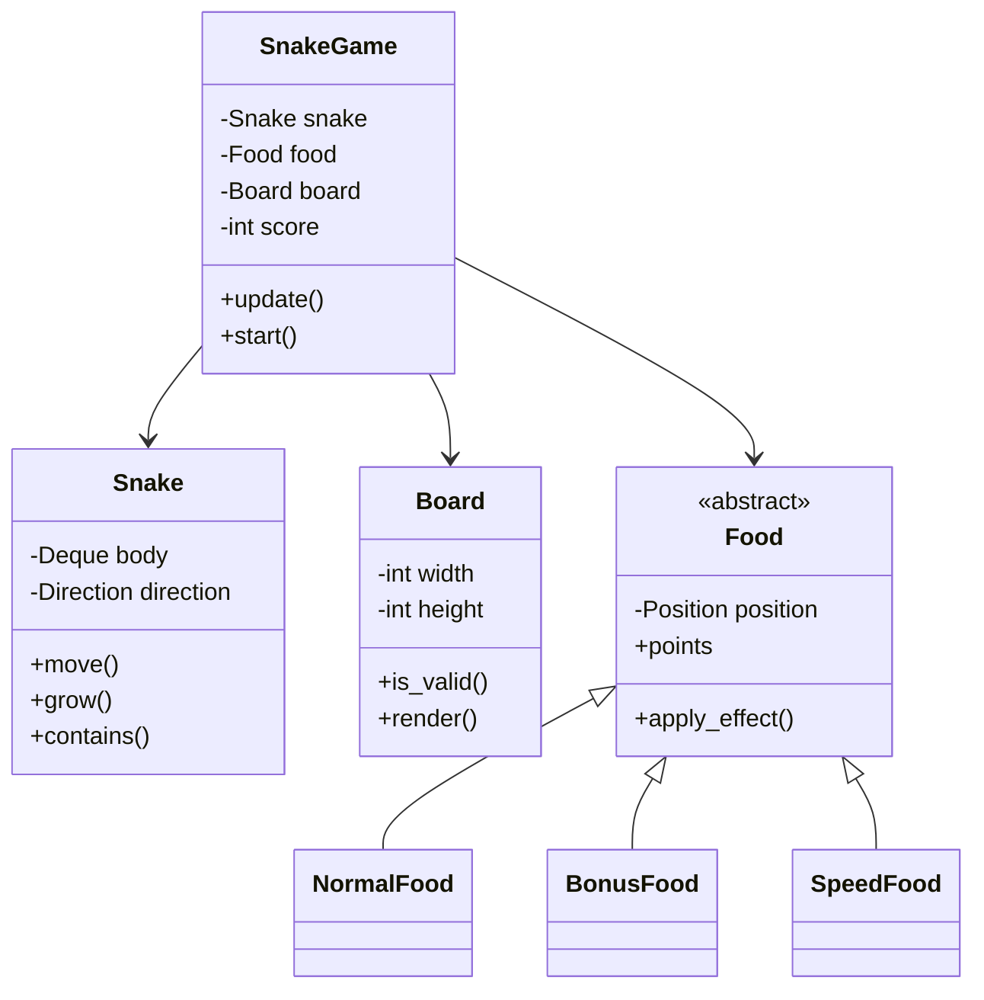

# Snake Game Design

## Problem Statement

Design the classic Snake game where a snake moves around eating food and growing longer.

---

## Requirements

### Functional
- Snake moves in four directions
- Eating food increases snake length
- Game ends when snake hits wall or itself
- Score tracking
- Increasing difficulty (optional speed increase)

### Non-Functional
- Smooth rendering
- Responsive controls
- Extensible for different game modes

---

## Core Classes

```python
from enum import Enum
from typing import List, Tuple, Optional, Deque
from dataclasses import dataclass, field
from collections import deque
import random
import time

class Direction(Enum):
    UP = (0, -1)
    DOWN = (0, 1)
    LEFT = (-1, 0)
    RIGHT = (1, 0)

    def opposite(self) -> 'Direction':
        opposites = {
            Direction.UP: Direction.DOWN,
            Direction.DOWN: Direction.UP,
            Direction.LEFT: Direction.RIGHT,
            Direction.RIGHT: Direction.LEFT
        }
        return opposites[self]

class GameState(Enum):
    READY = "ready"
    PLAYING = "playing"
    PAUSED = "paused"
    GAME_OVER = "game_over"

@dataclass(frozen=True)
class Position:
    x: int
    y: int

    def move(self, direction: Direction) -> 'Position':
        dx, dy = direction.value
        return Position(self.x + dx, self.y + dy)

    def __add__(self, other: 'Position') -> 'Position':
        return Position(self.x + other.x, self.y + other.y)
```

---

## Snake Class

```python
class Snake:
    def __init__(self, start_position: Position, initial_length: int = 3):
        self.body: Deque[Position] = deque()
        self.direction = Direction.RIGHT
        self._growing = False

        # Initialize snake body
        for i in range(initial_length):
            self.body.append(Position(start_position.x - i, start_position.y))

    @property
    def head(self) -> Position:
        return self.body[0]

    @property
    def tail(self) -> Position:
        return self.body[-1]

    @property
    def length(self) -> int:
        return len(self.body)

    def set_direction(self, direction: Direction) -> bool:
        """Change direction (cannot reverse)"""
        if direction == self.direction.opposite():
            return False
        self.direction = direction
        return True

    def move(self) -> Position:
        """Move snake in current direction, returns new head position"""
        new_head = self.head.move(self.direction)
        self.body.appendleft(new_head)

        if not self._growing:
            self.body.pop()
        else:
            self._growing = False

        return new_head

    def grow(self) -> None:
        """Mark snake to grow on next move"""
        self._growing = True

    def contains(self, position: Position) -> bool:
        """Check if position is part of snake body"""
        return position in self.body

    def collides_with_self(self) -> bool:
        """Check if head collides with body"""
        return self.head in list(self.body)[1:]

    def get_body_positions(self) -> List[Position]:
        """Get all body positions"""
        return list(self.body)
```

---

## Food Classes

```python
from abc import ABC, abstractmethod

class Food(ABC):
    def __init__(self, position: Position):
        self.position = position

    @property
    @abstractmethod
    def points(self) -> int:
        pass

    @property
    @abstractmethod
    def symbol(self) -> str:
        pass

    @abstractmethod
    def apply_effect(self, snake: Snake, game: 'SnakeGame') -> None:
        pass

class NormalFood(Food):
    @property
    def points(self) -> int:
        return 10

    @property
    def symbol(self) -> str:
        return "●"

    def apply_effect(self, snake: Snake, game: 'SnakeGame') -> None:
        snake.grow()

class BonusFood(Food):
    """Gives extra points"""
    @property
    def points(self) -> int:
        return 50

    @property
    def symbol(self) -> str:
        return "★"

    def apply_effect(self, snake: Snake, game: 'SnakeGame') -> None:
        snake.grow()
        snake.grow()  # Grow twice

class SpeedFood(Food):
    """Temporarily increases speed"""
    @property
    def points(self) -> int:
        return 25

    @property
    def symbol(self) -> str:
        return "⚡"

    def apply_effect(self, snake: Snake, game: 'SnakeGame') -> None:
        snake.grow()
        game.apply_speed_boost(duration=5.0)

class FoodFactory:
    """Factory for creating food items"""
    @staticmethod
    def create_random(position: Position) -> Food:
        roll = random.random()
        if roll < 0.7:
            return NormalFood(position)
        elif roll < 0.9:
            return BonusFood(position)
        else:
            return SpeedFood(position)
```

---

## Game Board

```python
class Board:
    def __init__(self, width: int, height: int):
        self.width = width
        self.height = height

    def is_valid_position(self, pos: Position) -> bool:
        """Check if position is within bounds"""
        return 0 <= pos.x < self.width and 0 <= pos.y < self.height

    def get_random_position(self, exclude: List[Position] = None) -> Position:
        """Get random position not in exclude list"""
        exclude = exclude or []
        while True:
            pos = Position(
                random.randint(0, self.width - 1),
                random.randint(0, self.height - 1)
            )
            if pos not in exclude:
                return pos

    def render(self, snake: Snake, food: Food) -> str:
        """Render board as string"""
        lines = []
        lines.append("┌" + "─" * (self.width * 2) + "┐")

        for y in range(self.height):
            row = "│"
            for x in range(self.width):
                pos = Position(x, y)
                if pos == snake.head:
                    row += "◆ "
                elif snake.contains(pos):
                    row += "○ "
                elif pos == food.position:
                    row += f"{food.symbol} "
                else:
                    row += "  "
            row += "│"
            lines.append(row)

        lines.append("└" + "─" * (self.width * 2) + "┘")
        return "\n".join(lines)
```

---

## Game Class

```python
class SnakeGame:
    def __init__(self, width: int = 20, height: int = 15):
        self.board = Board(width, height)
        self.snake: Optional[Snake] = None
        self.food: Optional[Food] = None
        self.state = GameState.READY
        self.score = 0
        self.level = 1
        self.base_speed = 0.2  # seconds per move
        self.speed_multiplier = 1.0
        self.speed_boost_end: Optional[float] = None
        self.moves: List[Direction] = []

    def start(self) -> None:
        """Start a new game"""
        center = Position(self.board.width // 2, self.board.height // 2)
        self.snake = Snake(center, initial_length=3)
        self.spawn_food()
        self.state = GameState.PLAYING
        self.score = 0
        self.level = 1
        self.moves.clear()

    def spawn_food(self) -> None:
        """Spawn new food at random location"""
        occupied = self.snake.get_body_positions()
        pos = self.board.get_random_position(exclude=occupied)
        self.food = FoodFactory.create_random(pos)

    def change_direction(self, direction: Direction) -> bool:
        """Change snake direction"""
        if self.state != GameState.PLAYING:
            return False
        return self.snake.set_direction(direction)

    def update(self) -> bool:
        """Update game state, returns False if game over"""
        if self.state != GameState.PLAYING:
            return self.state != GameState.GAME_OVER

        # Check speed boost expiry
        if self.speed_boost_end and time.time() > self.speed_boost_end:
            self.speed_multiplier = 1.0
            self.speed_boost_end = None

        # Move snake
        new_head = self.snake.move()
        self.moves.append(self.snake.direction)

        # Check wall collision
        if not self.board.is_valid_position(new_head):
            self.state = GameState.GAME_OVER
            return False

        # Check self collision
        if self.snake.collides_with_self():
            self.state = GameState.GAME_OVER
            return False

        # Check food collision
        if new_head == self.food.position:
            self.eat_food()

        return True

    def eat_food(self) -> None:
        """Handle eating food"""
        self.score += self.food.points
        self.food.apply_effect(self.snake, self)
        self.spawn_food()

        # Level up every 100 points
        new_level = (self.score // 100) + 1
        if new_level > self.level:
            self.level = new_level
            self.base_speed *= 0.9  # 10% faster

    def apply_speed_boost(self, duration: float) -> None:
        """Apply temporary speed boost"""
        self.speed_multiplier = 1.5
        self.speed_boost_end = time.time() + duration

    @property
    def current_speed(self) -> float:
        """Get current game speed (seconds per move)"""
        return self.base_speed / self.speed_multiplier

    def pause(self) -> None:
        if self.state == GameState.PLAYING:
            self.state = GameState.PAUSED

    def resume(self) -> None:
        if self.state == GameState.PAUSED:
            self.state = GameState.PLAYING

    def toggle_pause(self) -> None:
        if self.state == GameState.PLAYING:
            self.pause()
        elif self.state == GameState.PAUSED:
            self.resume()

    def render(self) -> str:
        """Render current game state"""
        if not self.snake or not self.food:
            return "Game not started"

        output = []
        output.append(f"Score: {self.score}  Level: {self.level}  "
                     f"Length: {self.snake.length}")
        output.append(self.board.render(self.snake, self.food))

        if self.state == GameState.GAME_OVER:
            output.append("\n*** GAME OVER ***")
        elif self.state == GameState.PAUSED:
            output.append("\n*** PAUSED ***")

        return "\n".join(output)

    def get_stats(self) -> dict:
        """Get game statistics"""
        return {
            "score": self.score,
            "level": self.level,
            "snake_length": self.snake.length if self.snake else 0,
            "total_moves": len(self.moves),
            "state": self.state.value
        }
```

---

## Game Controller (for Console)

```python
class GameController:
    """Handles input and game loop for console version"""

    KEY_MAPPINGS = {
        'w': Direction.UP,
        's': Direction.DOWN,
        'a': Direction.LEFT,
        'd': Direction.RIGHT,
        'up': Direction.UP,
        'down': Direction.DOWN,
        'left': Direction.LEFT,
        'right': Direction.RIGHT,
    }

    def __init__(self, game: SnakeGame):
        self.game = game
        self.running = False

    def handle_input(self, key: str) -> None:
        """Handle keyboard input"""
        key = key.lower()

        if key == 'q':
            self.running = False
        elif key == 'p':
            self.game.toggle_pause()
        elif key == 'r' and self.game.state == GameState.GAME_OVER:
            self.game.start()
        elif key in self.KEY_MAPPINGS:
            self.game.change_direction(self.KEY_MAPPINGS[key])

    def run_simulation(self, moves: List[Direction]) -> dict:
        """Run game with predefined moves (for testing)"""
        self.game.start()

        for direction in moves:
            if self.game.state != GameState.PLAYING:
                break
            self.game.change_direction(direction)
            self.game.update()

        return self.game.get_stats()
```

---

## High Score Manager

```python
from dataclasses import dataclass
import json
from pathlib import Path

@dataclass
class ScoreEntry:
    name: str
    score: int
    level: int
    length: int
    timestamp: float

class HighScoreManager:
    def __init__(self, max_entries: int = 10, file_path: str = "highscores.json"):
        self.max_entries = max_entries
        self.file_path = Path(file_path)
        self.scores: List[ScoreEntry] = []
        self._load()

    def _load(self) -> None:
        if self.file_path.exists():
            try:
                with open(self.file_path) as f:
                    data = json.load(f)
                    self.scores = [ScoreEntry(**entry) for entry in data]
            except:
                self.scores = []

    def _save(self) -> None:
        with open(self.file_path, 'w') as f:
            data = [vars(entry) for entry in self.scores]
            json.dump(data, f, indent=2)

    def add_score(self, name: str, stats: dict) -> int:
        """Add score, returns rank (0 = not ranked)"""
        entry = ScoreEntry(
            name=name,
            score=stats["score"],
            level=stats["level"],
            length=stats["snake_length"],
            timestamp=time.time()
        )

        self.scores.append(entry)
        self.scores.sort(key=lambda x: x.score, reverse=True)
        self.scores = self.scores[:self.max_entries]
        self._save()

        try:
            return self.scores.index(entry) + 1
        except ValueError:
            return 0

    def get_leaderboard(self) -> str:
        lines = ["=== HIGH SCORES ==="]
        for i, entry in enumerate(self.scores, 1):
            lines.append(f"{i}. {entry.name}: {entry.score} (Level {entry.level})")
        return "\n".join(lines)

    def is_high_score(self, score: int) -> bool:
        if len(self.scores) < self.max_entries:
            return True
        return score > self.scores[-1].score
```

---

## Usage Example

```python
def demo_snake_game():
    print("=== Snake Game Demo ===\n")

    game = SnakeGame(width=15, height=10)
    game.start()

    # Display initial state
    print(game.render())

    # Simulate some moves
    moves = [
        Direction.RIGHT, Direction.RIGHT, Direction.DOWN,
        Direction.DOWN, Direction.LEFT, Direction.LEFT,
        Direction.UP
    ]

    for move in moves:
        game.change_direction(move)
        if not game.update():
            break
        print(f"\nAfter moving {move.name}:")
        print(game.render())
        time.sleep(0.3)

    print(f"\nFinal Stats: {game.get_stats()}")

def demo_with_controller():
    print("\n=== Controller Demo ===\n")

    game = SnakeGame(width=10, height=8)
    controller = GameController(game)

    # Simulate a game with moves
    test_moves = [
        Direction.RIGHT, Direction.RIGHT, Direction.RIGHT,
        Direction.DOWN, Direction.DOWN,
        Direction.LEFT, Direction.LEFT,
        Direction.DOWN, Direction.DOWN
    ]

    stats = controller.run_simulation(test_moves)
    print(f"Simulation result: {stats}")

if __name__ == "__main__":
    demo_snake_game()
```

---

## Class Diagram



---

## Design Patterns Used

| Pattern | Usage |
|---------|-------|
| **Factory** | Food creation |
| **State** | Game states |
| **Strategy** | Different food effects |
| **Observer** | Score updates |

---

**Tags**: #lld #case-study #snake #game #factory-pattern
