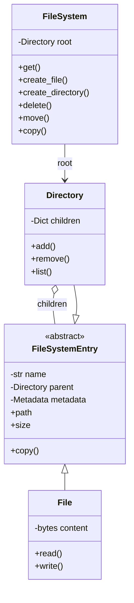

# File System Design

## Problem Statement

Design an in-memory file system supporting files, directories, and common operations.

---

## Requirements

### Functional
- Create/delete files and directories
- Read/write file contents
- Move and copy files
- List directory contents
- Search by name or pattern
- Support file permissions

### Non-Functional
- Thread-safe operations
- Efficient path resolution
- Memory efficient for large directories

---

## Core Classes

```python
from abc import ABC, abstractmethod
from enum import Enum, Flag, auto
from typing import Dict, List, Optional, Iterator
from dataclasses import dataclass, field
from datetime import datetime
import fnmatch
import threading
from pathlib import PurePosixPath

class Permission(Flag):
    NONE = 0
    READ = auto()
    WRITE = auto()
    EXECUTE = auto()
    ALL = READ | WRITE | EXECUTE

class FileType(Enum):
    FILE = "file"
    DIRECTORY = "directory"
    SYMLINK = "symlink"

@dataclass
class Metadata:
    created_at: datetime = field(default_factory=datetime.now)
    modified_at: datetime = field(default_factory=datetime.now)
    accessed_at: datetime = field(default_factory=datetime.now)
    owner: str = "root"
    permissions: Permission = Permission.ALL

    def touch(self) -> None:
        self.accessed_at = datetime.now()

    def modify(self) -> None:
        self.modified_at = datetime.now()
        self.accessed_at = datetime.now()
```

---

## File System Entry (Composite Pattern)

```python
class FileSystemEntry(ABC):
    def __init__(self, name: str, parent: Optional['Directory'] = None):
        self.name = name
        self.parent = parent
        self.metadata = Metadata()
        self._lock = threading.RLock()

    @property
    @abstractmethod
    def file_type(self) -> FileType:
        pass

    @property
    @abstractmethod
    def size(self) -> int:
        pass

    @property
    def path(self) -> str:
        """Get full path"""
        if self.parent is None:
            return "/" if self.name == "" else f"/{self.name}"
        parent_path = self.parent.path
        if parent_path == "/":
            return f"/{self.name}"
        return f"{parent_path}/{self.name}"

    def rename(self, new_name: str) -> None:
        """Rename this entry"""
        with self._lock:
            if "/" in new_name:
                raise ValueError("Name cannot contain '/'")
            self.name = new_name
            self.metadata.modify()

    def has_permission(self, perm: Permission) -> bool:
        """Check if operation is permitted"""
        return perm in self.metadata.permissions

    @abstractmethod
    def copy(self, new_name: str = None) -> 'FileSystemEntry':
        """Create a copy of this entry"""
        pass

    def get_info(self) -> Dict:
        """Get entry information"""
        return {
            "name": self.name,
            "type": self.file_type.value,
            "size": self.size,
            "path": self.path,
            "created": self.metadata.created_at.isoformat(),
            "modified": self.metadata.modified_at.isoformat(),
            "owner": self.metadata.owner,
            "permissions": str(self.metadata.permissions)
        }
```

---

## File Class

```python
class File(FileSystemEntry):
    def __init__(self, name: str, parent: Optional['Directory'] = None,
                 content: bytes = b""):
        super().__init__(name, parent)
        self._content = content

    @property
    def file_type(self) -> FileType:
        return FileType.FILE

    @property
    def size(self) -> int:
        return len(self._content)

    def read(self) -> bytes:
        """Read file content"""
        with self._lock:
            if not self.has_permission(Permission.READ):
                raise PermissionError("Read permission denied")
            self.metadata.touch()
            return self._content

    def read_text(self, encoding: str = "utf-8") -> str:
        """Read file content as text"""
        return self.read().decode(encoding)

    def write(self, content: bytes) -> int:
        """Write content to file"""
        with self._lock:
            if not self.has_permission(Permission.WRITE):
                raise PermissionError("Write permission denied")
            self._content = content
            self.metadata.modify()
            return len(content)

    def write_text(self, content: str, encoding: str = "utf-8") -> int:
        """Write text content to file"""
        return self.write(content.encode(encoding))

    def append(self, content: bytes) -> int:
        """Append content to file"""
        with self._lock:
            if not self.has_permission(Permission.WRITE):
                raise PermissionError("Write permission denied")
            self._content += content
            self.metadata.modify()
            return len(content)

    def truncate(self, size: int = 0) -> None:
        """Truncate file to specified size"""
        with self._lock:
            if not self.has_permission(Permission.WRITE):
                raise PermissionError("Write permission denied")
            self._content = self._content[:size]
            self.metadata.modify()

    def copy(self, new_name: str = None) -> 'File':
        """Create a copy of this file"""
        return File(
            name=new_name or self.name,
            content=self._content
        )
```

---

## Directory Class

```python
class Directory(FileSystemEntry):
    def __init__(self, name: str, parent: Optional['Directory'] = None):
        super().__init__(name, parent)
        self._children: Dict[str, FileSystemEntry] = {}

    @property
    def file_type(self) -> FileType:
        return FileType.DIRECTORY

    @property
    def size(self) -> int:
        """Total size of all contents"""
        return sum(child.size for child in self._children.values())

    def add(self, entry: FileSystemEntry) -> None:
        """Add entry to directory"""
        with self._lock:
            if not self.has_permission(Permission.WRITE):
                raise PermissionError("Write permission denied")
            if entry.name in self._children:
                raise FileExistsError(f"'{entry.name}' already exists")
            entry.parent = self
            self._children[entry.name] = entry
            self.metadata.modify()

    def remove(self, name: str) -> FileSystemEntry:
        """Remove entry from directory"""
        with self._lock:
            if not self.has_permission(Permission.WRITE):
                raise PermissionError("Write permission denied")
            if name not in self._children:
                raise FileNotFoundError(f"'{name}' not found")
            entry = self._children.pop(name)
            entry.parent = None
            self.metadata.modify()
            return entry

    def get(self, name: str) -> Optional[FileSystemEntry]:
        """Get child entry by name"""
        with self._lock:
            self.metadata.touch()
            return self._children.get(name)

    def contains(self, name: str) -> bool:
        """Check if directory contains entry"""
        return name in self._children

    def list(self) -> List[FileSystemEntry]:
        """List all children"""
        with self._lock:
            if not self.has_permission(Permission.READ):
                raise PermissionError("Read permission denied")
            self.metadata.touch()
            return list(self._children.values())

    def list_names(self) -> List[str]:
        """List child names"""
        return [child.name for child in self.list()]

    def create_file(self, name: str, content: bytes = b"") -> File:
        """Create a new file in this directory"""
        file = File(name, content=content)
        self.add(file)
        return file

    def create_directory(self, name: str) -> 'Directory':
        """Create a new subdirectory"""
        directory = Directory(name)
        self.add(directory)
        return directory

    def find(self, pattern: str, recursive: bool = True) -> List[FileSystemEntry]:
        """Find entries matching pattern"""
        results = []
        for child in self.list():
            if fnmatch.fnmatch(child.name, pattern):
                results.append(child)
            if recursive and isinstance(child, Directory):
                results.extend(child.find(pattern, recursive=True))
        return results

    def walk(self) -> Iterator[tuple]:
        """Walk directory tree (like os.walk)"""
        dirs = []
        files = []
        for child in self.list():
            if isinstance(child, Directory):
                dirs.append(child.name)
            else:
                files.append(child.name)

        yield (self.path, dirs, files)

        for child in self.list():
            if isinstance(child, Directory):
                yield from child.walk()

    def copy(self, new_name: str = None) -> 'Directory':
        """Create a deep copy of this directory"""
        new_dir = Directory(new_name or self.name)
        for child in self.list():
            child_copy = child.copy()
            new_dir.add(child_copy)
        return new_dir

    def get_tree(self, prefix: str = "") -> str:
        """Get directory tree as string"""
        lines = [f"{prefix}{self.name}/"]
        children = self.list()
        for i, child in enumerate(children):
            is_last = i == len(children) - 1
            connector = "└── " if is_last else "├── "
            if isinstance(child, Directory):
                sub_prefix = prefix + ("    " if is_last else "│   ")
                lines.append(f"{prefix}{connector}{child.name}/")
                for line in child.get_tree(sub_prefix).split('\n')[1:]:
                    if line:
                        lines.append(line)
            else:
                lines.append(f"{prefix}{connector}{child.name} ({child.size}b)")
        return "\n".join(lines)
```

---

## File System Class

```python
class FileSystem:
    def __init__(self):
        self.root = Directory("")
        self._lock = threading.RLock()

    def _resolve_path(self, path: str) -> tuple:
        """Resolve path to (parent_directory, entry_name)"""
        path = PurePosixPath(path)
        parts = list(path.parts)

        if not parts or parts[0] != "/":
            raise ValueError("Path must be absolute")

        parts = parts[1:]  # Remove root '/'

        if not parts:
            return (None, self.root)

        current = self.root
        for part in parts[:-1]:
            child = current.get(part)
            if child is None:
                raise FileNotFoundError(f"'{part}' not found in {current.path}")
            if not isinstance(child, Directory):
                raise NotADirectoryError(f"'{part}' is not a directory")
            current = child

        return (current, parts[-1])

    def get(self, path: str) -> FileSystemEntry:
        """Get entry at path"""
        with self._lock:
            parent, name = self._resolve_path(path)
            if parent is None:
                return name  # Root directory

            entry = parent.get(name)
            if entry is None:
                raise FileNotFoundError(f"'{path}' not found")
            return entry

    def exists(self, path: str) -> bool:
        """Check if path exists"""
        try:
            self.get(path)
            return True
        except (FileNotFoundError, NotADirectoryError):
            return False

    def create_file(self, path: str, content: bytes = b"") -> File:
        """Create a new file"""
        with self._lock:
            parent, name = self._resolve_path(path)
            if parent is None:
                raise ValueError("Cannot create file at root")
            return parent.create_file(name, content)

    def create_directory(self, path: str) -> Directory:
        """Create a new directory"""
        with self._lock:
            parent, name = self._resolve_path(path)
            if parent is None:
                raise ValueError("Root already exists")
            return parent.create_directory(name)

    def mkdir(self, path: str, parents: bool = False) -> Directory:
        """Create directory, optionally creating parents"""
        if not parents:
            return self.create_directory(path)

        parts = PurePosixPath(path).parts[1:]  # Skip root
        current = self.root
        for part in parts:
            child = current.get(part)
            if child is None:
                child = current.create_directory(part)
            elif not isinstance(child, Directory):
                raise NotADirectoryError(f"'{part}' exists and is not a directory")
            current = child
        return current

    def delete(self, path: str, recursive: bool = False) -> None:
        """Delete file or directory"""
        with self._lock:
            parent, name = self._resolve_path(path)
            if parent is None:
                raise ValueError("Cannot delete root")

            entry = parent.get(name)
            if entry is None:
                raise FileNotFoundError(f"'{path}' not found")

            if isinstance(entry, Directory) and entry.list() and not recursive:
                raise OSError("Directory not empty")

            parent.remove(name)

    def read(self, path: str) -> bytes:
        """Read file content"""
        entry = self.get(path)
        if not isinstance(entry, File):
            raise IsADirectoryError(f"'{path}' is a directory")
        return entry.read()

    def write(self, path: str, content: bytes) -> int:
        """Write to file (creates if not exists)"""
        try:
            entry = self.get(path)
            if not isinstance(entry, File):
                raise IsADirectoryError(f"'{path}' is a directory")
            return entry.write(content)
        except FileNotFoundError:
            self.create_file(path, content)
            return len(content)

    def move(self, src: str, dst: str) -> None:
        """Move file or directory"""
        with self._lock:
            # Get source
            src_parent, src_name = self._resolve_path(src)
            if src_parent is None:
                raise ValueError("Cannot move root")
            entry = src_parent.remove(src_name)

            # Get destination
            try:
                dst_entry = self.get(dst)
                if isinstance(dst_entry, Directory):
                    dst_entry.add(entry)
                else:
                    raise FileExistsError(f"'{dst}' exists")
            except FileNotFoundError:
                dst_parent, dst_name = self._resolve_path(dst)
                entry.name = dst_name
                dst_parent.add(entry)

    def copy(self, src: str, dst: str) -> FileSystemEntry:
        """Copy file or directory"""
        with self._lock:
            entry = self.get(src)
            entry_copy = entry.copy()

            try:
                dst_entry = self.get(dst)
                if isinstance(dst_entry, Directory):
                    dst_entry.add(entry_copy)
                else:
                    raise FileExistsError(f"'{dst}' exists")
            except FileNotFoundError:
                dst_parent, dst_name = self._resolve_path(dst)
                entry_copy.name = dst_name
                dst_parent.add(entry_copy)

            return entry_copy

    def list(self, path: str = "/") -> List[str]:
        """List directory contents"""
        entry = self.get(path)
        if not isinstance(entry, Directory):
            raise NotADirectoryError(f"'{path}' is not a directory")
        return entry.list_names()

    def find(self, pattern: str, path: str = "/") -> List[str]:
        """Find files matching pattern"""
        entry = self.get(path)
        if not isinstance(entry, Directory):
            raise NotADirectoryError(f"'{path}' is not a directory")
        return [e.path for e in entry.find(pattern)]

    def tree(self, path: str = "/") -> str:
        """Get directory tree"""
        entry = self.get(path)
        if isinstance(entry, Directory):
            return entry.get_tree()
        return f"{entry.name} ({entry.size}b)"

    def stat(self, path: str) -> Dict:
        """Get file/directory information"""
        return self.get(path).get_info()
```

---

## Usage Example

```python
def demo_file_system():
    fs = FileSystem()

    print("=== File System Demo ===\n")

    # Create directory structure
    fs.mkdir("/home", parents=True)
    fs.mkdir("/home/user/documents", parents=True)
    fs.mkdir("/home/user/downloads", parents=True)

    # Create files
    fs.write("/home/user/documents/readme.txt", b"Hello, World!")
    fs.write("/home/user/documents/notes.txt", b"Some notes here")
    fs.write("/home/user/downloads/file.zip", b"\x00" * 1000)

    # List directory
    print("Contents of /home/user:")
    print(fs.list("/home/user"))

    # Read file
    print("\nReading readme.txt:")
    print(fs.read("/home/user/documents/readme.txt").decode())

    # File info
    print("\nFile stats:")
    print(fs.stat("/home/user/documents/readme.txt"))

    # Find files
    print("\nFind *.txt files:")
    print(fs.find("*.txt"))

    # Copy file
    fs.copy("/home/user/documents/readme.txt",
            "/home/user/downloads/readme_copy.txt")

    # Move file
    fs.move("/home/user/documents/notes.txt",
            "/home/user/downloads/notes.txt")

    # Directory tree
    print("\nDirectory Tree:")
    print(fs.tree())

    # Delete
    fs.delete("/home/user/downloads/file.zip")
    print("\nAfter deleting file.zip:")
    print(fs.tree())

if __name__ == "__main__":
    demo_file_system()
```

---

## Class Diagram



---

## Design Patterns Used

| Pattern | Usage |
|---------|-------|
| **Composite** | Files and directories |
| **Iterator** | Directory traversal (walk) |
| **Factory** | File/directory creation |
| **Visitor** | Find operations |

---

**Tags**: #lld #case-study #file-system #composite-pattern #tree
