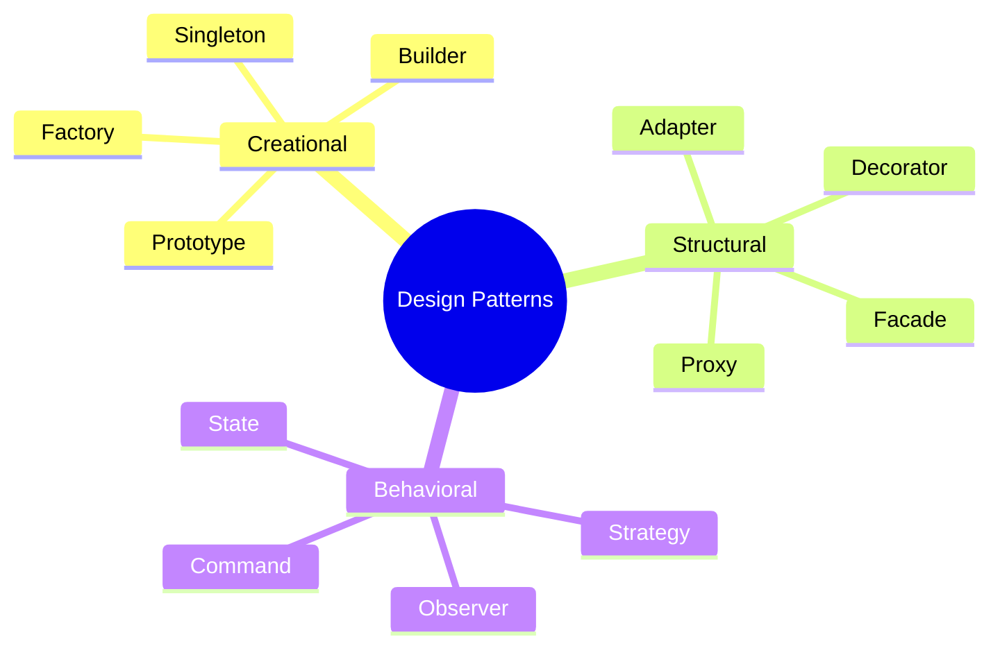

# Design Patterns

Design patterns are reusable solutions to common problems in software design. They provide a shared vocabulary and proven approaches.

## Visualization




---

## Pattern Categories

### Creational Patterns
Control object creation.

| Pattern | Purpose | When to Use |
|---------|---------|-------------|
| [Singleton](Creational/01_singleton.md) | Single instance | Config, logging, connection pool |
| [Factory](Creational/02_factory.md) | Create objects without specifying class | Multiple related types |
| [Abstract Factory](Creational/03_abstract_factory.md) | Create families of objects | UI themes, database drivers |
| [Builder](Creational/04_builder.md) | Construct complex objects step by step | Many optional parameters |
| [Prototype](Creational/05_prototype.md) | Clone existing objects | Expensive object creation |

### Structural Patterns
Compose objects into larger structures.

| Pattern | Purpose | When to Use |
|---------|---------|-------------|
| [Adapter](Structural/01_adapter.md) | Convert interface | Legacy integration |
| [Decorator](Structural/02_decorator.md) | Add behavior dynamically | Extend without subclassing |
| [Facade](Structural/03_facade.md) | Simplify complex subsystem | Complex library |
| [Proxy](Structural/04_proxy.md) | Control access | Lazy loading, caching |
| [Composite](Structural/05_composite.md) | Tree structures | File systems, UI components |

### Behavioral Patterns
Define object interaction.

| Pattern | Purpose | When to Use |
|---------|---------|-------------|
| [Strategy](Behavioral/01_strategy.md) | Interchangeable algorithms | Multiple algorithms |
| [Observer](Behavioral/02_observer.md) | Notify on state change | Event handling |
| [Command](Behavioral/03_command.md) | Encapsulate requests | Undo/redo, queuing |
| [State](Behavioral/04_state.md) | Behavior based on state | Finite state machines |
| [Chain of Responsibility](Behavioral/05_chain_of_responsibility.md) | Pass request along chain | Middleware, filters |
| [Template Method](Behavioral/06_template_method.md) | Define skeleton, subclasses fill in | Frameworks |

---

## Quick Reference

### Creational
```python
# Singleton
class Logger:
    _instance = None
    def __new__(cls):
        if cls._instance is None:
            cls._instance = super().__new__(cls)
        return cls._instance

# Factory
class VehicleFactory:
    def create(self, type):
        if type == "car": return Car()
        if type == "truck": return Truck()

# Builder
order = OrderBuilder().add_item("Pizza").add_item("Soda").set_delivery(True).build()
```

### Structural
```python
# Adapter
class LegacyAdapter(NewInterface):
    def __init__(self, legacy):
        self.legacy = legacy

    def new_method(self):
        return self.legacy.old_method()

# Decorator
class LoggingDecorator(Service):
    def __init__(self, service):
        self.service = service

    def execute(self):
        print("Before")
        result = self.service.execute()
        print("After")
        return result
```

### Behavioral
```python
# Strategy
class PriceCalculator:
    def __init__(self, strategy: PricingStrategy):
        self.strategy = strategy

    def calculate(self, order):
        return self.strategy.calculate(order)

# Observer
class Subject:
    def __init__(self):
        self.observers = []

    def notify(self, event):
        for observer in self.observers:
            observer.update(event)
```

---

## Choosing Patterns

```
Need to create objects?
├── Only one instance → Singleton
├── Multiple types → Factory
├── Families of objects → Abstract Factory
├── Complex construction → Builder
└── Clone existing → Prototype

Need to structure objects?
├── Convert interface → Adapter
├── Add behavior → Decorator
├── Simplify interface → Facade
├── Control access → Proxy
└── Tree structure → Composite

Need to define behavior?
├── Interchangeable algorithms → Strategy
├── Notify on change → Observer
├── Encapsulate request → Command
├── State-based behavior → State
└── Chain of handlers → Chain of Responsibility
```

---

## Common LLD Interview Patterns

| Problem | Likely Patterns |
|---------|-----------------|
| Parking Lot | Factory, Strategy |
| Elevator | State, Observer |
| Vending Machine | State |
| LRU Cache | (Data structure, not pattern) |
| File System | Composite |
| Logger | Singleton, Decorator |
| Payment System | Strategy, Factory |
| Notification | Observer, Factory |

---

## Anti-Patterns to Avoid

| Anti-Pattern | Problem | Solution |
|--------------|---------|----------|
| God Class | Does everything | Split by SRP |
| Singleton overuse | Hidden dependencies | Use DI |
| Inheritance abuse | Rigid hierarchy | Prefer composition |
| Pattern overload | Unnecessary complexity | Use only when needed |
