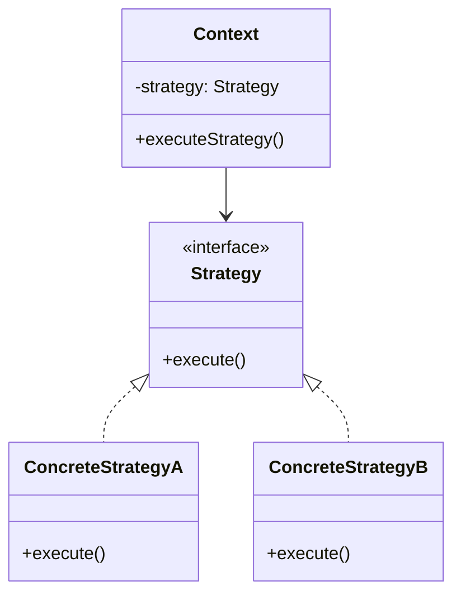

# Strategy Pattern

> Define a family of algorithms, encapsulate each one, and make them interchangeable.

## Visualization




---

## When to Use

- Multiple algorithms for the same task
- Need to switch algorithms at runtime
- Algorithms have different performance/accuracy trade-offs
- Avoid conditional statements for algorithm selection

---

## Implementation

### Python

```python
from abc import ABC, abstractmethod

# Strategy interface
class PaymentStrategy(ABC):
    @abstractmethod
    def pay(self, amount: float) -> bool:
        pass

# Concrete strategies
class CreditCardPayment(PaymentStrategy):
    def __init__(self, card_number: str, cvv: str):
        self.card_number = card_number
        self.cvv = cvv

    def pay(self, amount: float) -> bool:
        print(f"Paying ${amount} with credit card ending in {self.card_number[-4:]}")
        return True

class PayPalPayment(PaymentStrategy):
    def __init__(self, email: str):
        self.email = email

    def pay(self, amount: float) -> bool:
        print(f"Paying ${amount} via PayPal ({self.email})")
        return True

class CryptoPayment(PaymentStrategy):
    def __init__(self, wallet_address: str):
        self.wallet = wallet_address

    def pay(self, amount: float) -> bool:
        print(f"Paying ${amount} in crypto to {self.wallet[:10]}...")
        return True

# Context
class ShoppingCart:
    def __init__(self):
        self.items = []
        self.payment_strategy = None

    def add_item(self, item: str, price: float):
        self.items.append((item, price))

    def set_payment_strategy(self, strategy: PaymentStrategy):
        self.payment_strategy = strategy

    def checkout(self):
        total = sum(price for _, price in self.items)
        if self.payment_strategy:
            return self.payment_strategy.pay(total)
        raise ValueError("No payment method selected")


# Usage
cart = ShoppingCart()
cart.add_item("Laptop", 999.99)
cart.add_item("Mouse", 49.99)

# User selects payment method
cart.set_payment_strategy(CreditCardPayment("1234567890123456", "123"))
cart.checkout()  # "Paying $1049.98 with credit card ending in 3456"

# Or switch to PayPal
cart.set_payment_strategy(PayPalPayment("user@example.com"))
cart.checkout()  # "Paying $1049.98 via PayPal"
```

### Java

```java
// Strategy interface
interface SortStrategy {
    void sort(int[] array);
}

// Concrete strategies
class QuickSort implements SortStrategy {
    @Override
    public void sort(int[] array) {
        System.out.println("Sorting with QuickSort");
        // QuickSort implementation
    }
}

class MergeSort implements SortStrategy {
    @Override
    public void sort(int[] array) {
        System.out.println("Sorting with MergeSort");
        // MergeSort implementation
    }
}

class BubbleSort implements SortStrategy {
    @Override
    public void sort(int[] array) {
        System.out.println("Sorting with BubbleSort");
        // BubbleSort implementation
    }
}

// Context
class Sorter {
    private SortStrategy strategy;

    public void setStrategy(SortStrategy strategy) {
        this.strategy = strategy;
    }

    public void sort(int[] array) {
        strategy.sort(array);
    }
}

// Usage
Sorter sorter = new Sorter();

// Small array - use simple algorithm
sorter.setStrategy(new BubbleSort());
sorter.sort(smallArray);

// Large array - use efficient algorithm
sorter.setStrategy(new QuickSort());
sorter.sort(largeArray);
```

---

## Real-World Example: Pricing Strategy

```python
class PricingStrategy(ABC):
    @abstractmethod
    def calculate_price(self, base_price: float, quantity: int) -> float:
        pass

class RegularPricing(PricingStrategy):
    def calculate_price(self, base_price: float, quantity: int) -> float:
        return base_price * quantity

class BulkPricing(PricingStrategy):
    def calculate_price(self, base_price: float, quantity: int) -> float:
        if quantity >= 10:
            return base_price * quantity * 0.8  # 20% discount
        return base_price * quantity

class PremiumMemberPricing(PricingStrategy):
    def calculate_price(self, base_price: float, quantity: int) -> float:
        return base_price * quantity * 0.9  # 10% discount always


class Order:
    def __init__(self, pricing_strategy: PricingStrategy):
        self.pricing_strategy = pricing_strategy
        self.items = []

    def add_item(self, name: str, price: float, quantity: int):
        self.items.append((name, price, quantity))

    def get_total(self) -> float:
        return sum(
            self.pricing_strategy.calculate_price(price, qty)
            for _, price, qty in self.items
        )


# Usage
regular_order = Order(RegularPricing())
regular_order.add_item("Widget", 10.0, 5)
print(regular_order.get_total())  # 50.0

bulk_order = Order(BulkPricing())
bulk_order.add_item("Widget", 10.0, 15)
print(bulk_order.get_total())  # 120.0 (20% off)
```

---

## Real-World Example: Validation

```python
class ValidationStrategy(ABC):
    @abstractmethod
    def validate(self, value: str) -> bool:
        pass

class EmailValidator(ValidationStrategy):
    def validate(self, value: str) -> bool:
        return "@" in value and "." in value

class PhoneValidator(ValidationStrategy):
    def validate(self, value: str) -> bool:
        return value.isdigit() and len(value) >= 10

class ZipCodeValidator(ValidationStrategy):
    def validate(self, value: str) -> bool:
        return value.isdigit() and len(value) == 5


class FormField:
    def __init__(self, name: str, validator: ValidationStrategy):
        self.name = name
        self.validator = validator
        self.value = ""

    def set_value(self, value: str):
        if self.validator.validate(value):
            self.value = value
        else:
            raise ValueError(f"Invalid {self.name}")


# Usage
email_field = FormField("email", EmailValidator())
email_field.set_value("user@example.com")  # OK

phone_field = FormField("phone", PhoneValidator())
phone_field.set_value("1234567890")  # OK
```

---

## Strategy vs Conditionals

```python
# Bad: Lots of conditionals
def calculate_shipping(order, method):
    if method == "standard":
        return order.weight * 1.0
    elif method == "express":
        return order.weight * 2.5
    elif method == "overnight":
        return order.weight * 5.0
    elif method == "international":
        return order.weight * 10.0 + 15.0
    # More methods = more conditionals...

# Good: Strategy pattern
class StandardShipping(ShippingStrategy):
    def calculate(self, order): return order.weight * 1.0

class ExpressShipping(ShippingStrategy):
    def calculate(self, order): return order.weight * 2.5

# Add new shipping methods without modifying existing code
```

---

## Advantages

1. **Open/Closed**: Add new strategies without modifying context
2. **No conditionals**: Eliminate if/else chains
3. **Runtime switching**: Change algorithm dynamically
4. **Testable**: Each strategy tested independently

---

## Interview Tips

1. **Show interface + implementations** clearly
2. **Explain Open/Closed** principle benefit
3. **Real examples**: Payment, pricing, sorting, validation
4. **Compare to conditionals**: Show the before/after
