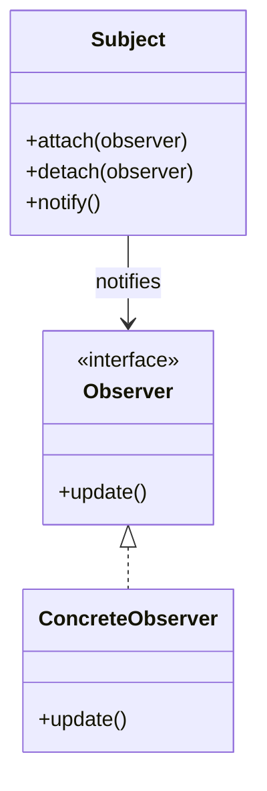
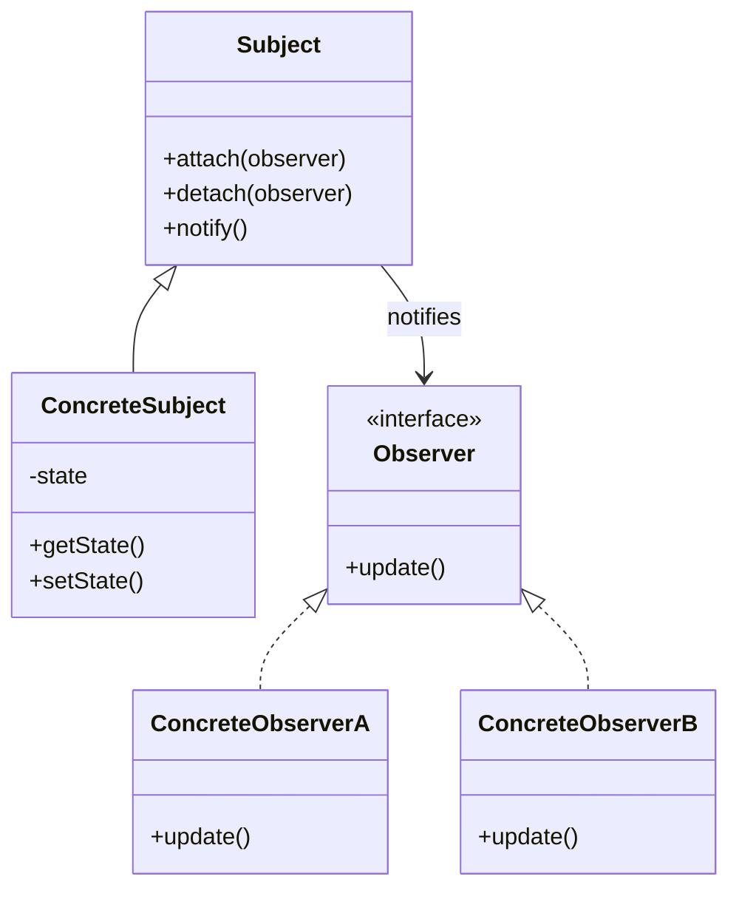

# Observer Pattern

> "Define a one-to-many dependency between objects so that when one object changes state, all its dependents are notified and updated automatically."

## Visualization



## Intent

- Establish publish-subscribe relationships
- Decouple subjects from their observers
- Support broadcast communication

---

## Structure




---

## Implementation

### Basic Example

```python
from abc import ABC, abstractmethod
from typing import List

class Observer(ABC):
    @abstractmethod
    def update(self, subject: 'Subject') -> None:
        pass

class Subject(ABC):
    def __init__(self):
        self._observers: List[Observer] = []

    def attach(self, observer: Observer) -> None:
        if observer not in self._observers:
            self._observers.append(observer)

    def detach(self, observer: Observer) -> None:
        self._observers.remove(observer)

    def notify(self) -> None:
        for observer in self._observers:
            observer.update(self)

class WeatherStation(Subject):
    def __init__(self):
        super().__init__()
        self._temperature = 0.0
        self._humidity = 0.0
        self._pressure = 0.0

    @property
    def temperature(self) -> float:
        return self._temperature

    @property
    def humidity(self) -> float:
        return self._humidity

    @property
    def pressure(self) -> float:
        return self._pressure

    def set_measurements(self, temp: float, humidity: float, pressure: float) -> None:
        self._temperature = temp
        self._humidity = humidity
        self._pressure = pressure
        self.notify()

class CurrentConditionsDisplay(Observer):
    def update(self, subject: Subject) -> None:
        if isinstance(subject, WeatherStation):
            print(f"Current: {subject.temperature}°F, "
                  f"{subject.humidity}% humidity")

class StatisticsDisplay(Observer):
    def __init__(self):
        self.temperatures: List[float] = []

    def update(self, subject: Subject) -> None:
        if isinstance(subject, WeatherStation):
            self.temperatures.append(subject.temperature)
            avg = sum(self.temperatures) / len(self.temperatures)
            print(f"Avg/Max/Min: {avg:.1f}/{max(self.temperatures)}/{min(self.temperatures)}")

class ForecastDisplay(Observer):
    def __init__(self):
        self.last_pressure = 0.0

    def update(self, subject: Subject) -> None:
        if isinstance(subject, WeatherStation):
            if subject.pressure > self.last_pressure:
                print("Forecast: Improving weather!")
            elif subject.pressure < self.last_pressure:
                print("Forecast: Cooler, rainy weather")
            else:
                print("Forecast: More of the same")
            self.last_pressure = subject.pressure

# Usage
station = WeatherStation()
station.attach(CurrentConditionsDisplay())
station.attach(StatisticsDisplay())
station.attach(ForecastDisplay())

station.set_measurements(80, 65, 30.4)
print()
station.set_measurements(82, 70, 29.2)
```

---

## Real-World Examples

### Example 1: Event System

```python
from abc import ABC, abstractmethod
from typing import Dict, List, Callable, Any
from dataclasses import dataclass
from datetime import datetime
from enum import Enum

class EventType(Enum):
    USER_CREATED = "user_created"
    USER_UPDATED = "user_updated"
    USER_DELETED = "user_deleted"
    ORDER_PLACED = "order_placed"
    ORDER_SHIPPED = "order_shipped"
    PAYMENT_RECEIVED = "payment_received"

@dataclass
class Event:
    type: EventType
    data: Dict[str, Any]
    timestamp: datetime = None

    def __post_init__(self):
        if self.timestamp is None:
            self.timestamp = datetime.now()

class EventListener(ABC):
    @abstractmethod
    def handle(self, event: Event) -> None:
        pass

class EventBus:
    """Central event dispatcher"""
    _instance = None

    def __new__(cls):
        if cls._instance is None:
            cls._instance = super().__new__(cls)
            cls._instance._listeners: Dict[EventType, List[EventListener]] = {}
            cls._instance._handlers: Dict[EventType, List[Callable]] = {}
        return cls._instance

    def subscribe(self, event_type: EventType, listener: EventListener) -> None:
        if event_type not in self._listeners:
            self._listeners[event_type] = []
        self._listeners[event_type].append(listener)

    def subscribe_handler(self, event_type: EventType, handler: Callable) -> None:
        """Subscribe with a function instead of class"""
        if event_type not in self._handlers:
            self._handlers[event_type] = []
        self._handlers[event_type].append(handler)

    def unsubscribe(self, event_type: EventType, listener: EventListener) -> None:
        if event_type in self._listeners:
            self._listeners[event_type].remove(listener)

    def publish(self, event: Event) -> None:
        print(f"\n[EventBus] Publishing {event.type.value}")

        # Notify class-based listeners
        for listener in self._listeners.get(event.type, []):
            try:
                listener.handle(event)
            except Exception as e:
                print(f"[EventBus] Error in listener: {e}")

        # Notify function handlers
        for handler in self._handlers.get(event.type, []):
            try:
                handler(event)
            except Exception as e:
                print(f"[EventBus] Error in handler: {e}")

# Concrete listeners
class EmailNotificationListener(EventListener):
    def handle(self, event: Event) -> None:
        if event.type == EventType.USER_CREATED:
            email = event.data.get("email")
            print(f"[Email] Sending welcome email to {email}")
        elif event.type == EventType.ORDER_PLACED:
            print(f"[Email] Sending order confirmation #{event.data.get('order_id')}")

class AnalyticsListener(EventListener):
    def __init__(self):
        self.event_counts: Dict[EventType, int] = {}

    def handle(self, event: Event) -> None:
        self.event_counts[event.type] = self.event_counts.get(event.type, 0) + 1
        print(f"[Analytics] Tracked {event.type.value} "
              f"(total: {self.event_counts[event.type]})")

class AuditLogListener(EventListener):
    def handle(self, event: Event) -> None:
        print(f"[Audit] {event.timestamp}: {event.type.value} - {event.data}")

class InventoryListener(EventListener):
    def handle(self, event: Event) -> None:
        if event.type == EventType.ORDER_PLACED:
            items = event.data.get("items", [])
            print(f"[Inventory] Reserving {len(items)} items")

# Usage
bus = EventBus()

# Subscribe listeners
bus.subscribe(EventType.USER_CREATED, EmailNotificationListener())
bus.subscribe(EventType.USER_CREATED, AnalyticsListener())
bus.subscribe(EventType.USER_CREATED, AuditLogListener())

bus.subscribe(EventType.ORDER_PLACED, EmailNotificationListener())
bus.subscribe(EventType.ORDER_PLACED, InventoryListener())
bus.subscribe(EventType.ORDER_PLACED, AnalyticsListener())

# Lambda handler
bus.subscribe_handler(EventType.PAYMENT_RECEIVED,
    lambda e: print(f"[Webhook] Payment ${e.data.get('amount')} received"))

# Publish events
bus.publish(Event(EventType.USER_CREATED, {"email": "john@example.com", "name": "John"}))
bus.publish(Event(EventType.ORDER_PLACED, {"order_id": "ORD-123", "items": ["item1", "item2"]}))
bus.publish(Event(EventType.PAYMENT_RECEIVED, {"order_id": "ORD-123", "amount": 99.99}))
```

### Example 2: Stock Price Monitor

```python
from abc import ABC, abstractmethod
from typing import Dict, List
from dataclasses import dataclass
from datetime import datetime
from enum import Enum

class AlertType(Enum):
    PRICE_UP = "price_up"
    PRICE_DOWN = "price_down"
    THRESHOLD = "threshold"

@dataclass
class StockPrice:
    symbol: str
    price: float
    change: float
    timestamp: datetime

class StockObserver(ABC):
    @abstractmethod
    def on_price_change(self, stock: StockPrice) -> None:
        pass

class StockMarket:
    """Subject - stock price publisher"""
    def __init__(self):
        self._observers: Dict[str, List[StockObserver]] = {}
        self._prices: Dict[str, float] = {}

    def subscribe(self, symbol: str, observer: StockObserver) -> None:
        if symbol not in self._observers:
            self._observers[symbol] = []
        self._observers[symbol].append(observer)
        print(f"Subscribed to {symbol}")

    def unsubscribe(self, symbol: str, observer: StockObserver) -> None:
        if symbol in self._observers:
            self._observers[symbol].remove(observer)

    def update_price(self, symbol: str, new_price: float) -> None:
        old_price = self._prices.get(symbol, new_price)
        change = ((new_price - old_price) / old_price * 100) if old_price else 0
        self._prices[symbol] = new_price

        stock = StockPrice(
            symbol=symbol,
            price=new_price,
            change=change,
            timestamp=datetime.now()
        )

        # Notify observers for this symbol
        for observer in self._observers.get(symbol, []):
            observer.on_price_change(stock)

class PriceAlertObserver(StockObserver):
    """Alert when price crosses threshold"""
    def __init__(self, threshold: float, alert_type: AlertType):
        self.threshold = threshold
        self.alert_type = alert_type
        self.triggered = False

    def on_price_change(self, stock: StockPrice) -> None:
        if self.alert_type == AlertType.PRICE_UP:
            if stock.price >= self.threshold and not self.triggered:
                print(f"🔔 ALERT: {stock.symbol} reached ${stock.price:.2f} "
                      f"(threshold: ${self.threshold:.2f})")
                self.triggered = True
        elif self.alert_type == AlertType.PRICE_DOWN:
            if stock.price <= self.threshold and not self.triggered:
                print(f"🔔 ALERT: {stock.symbol} dropped to ${stock.price:.2f} "
                      f"(threshold: ${self.threshold:.2f})")
                self.triggered = True

class PortfolioTracker(StockObserver):
    """Track portfolio value"""
    def __init__(self):
        self.holdings: Dict[str, int] = {}
        self.prices: Dict[str, float] = {}

    def add_holding(self, symbol: str, shares: int) -> None:
        self.holdings[symbol] = self.holdings.get(symbol, 0) + shares

    def on_price_change(self, stock: StockPrice) -> None:
        self.prices[stock.symbol] = stock.price

        if stock.symbol in self.holdings:
            shares = self.holdings[stock.symbol]
            value = shares * stock.price
            print(f"📊 {stock.symbol}: {shares} shares @ ${stock.price:.2f} = ${value:.2f}")

    def get_total_value(self) -> float:
        return sum(self.holdings.get(s, 0) * self.prices.get(s, 0)
                   for s in self.holdings)

class MovingAverageObserver(StockObserver):
    """Calculate moving average"""
    def __init__(self, window: int = 5):
        self.window = window
        self.prices: Dict[str, List[float]] = {}

    def on_price_change(self, stock: StockPrice) -> None:
        if stock.symbol not in self.prices:
            self.prices[stock.symbol] = []

        self.prices[stock.symbol].append(stock.price)
        if len(self.prices[stock.symbol]) > self.window:
            self.prices[stock.symbol].pop(0)

        avg = sum(self.prices[stock.symbol]) / len(self.prices[stock.symbol])
        trend = "↑" if stock.price > avg else "↓"
        print(f"📈 {stock.symbol} MA({self.window}): ${avg:.2f} {trend}")

class TradingBot(StockObserver):
    """Automated trading based on signals"""
    def __init__(self, buy_threshold: float, sell_threshold: float):
        self.buy_threshold = buy_threshold
        self.sell_threshold = sell_threshold
        self.position: Dict[str, int] = {}

    def on_price_change(self, stock: StockPrice) -> None:
        if stock.change <= -self.buy_threshold:
            print(f"🤖 BUY SIGNAL: {stock.symbol} dropped {stock.change:.1f}%")
            self.position[stock.symbol] = self.position.get(stock.symbol, 0) + 10
        elif stock.change >= self.sell_threshold:
            if self.position.get(stock.symbol, 0) > 0:
                print(f"🤖 SELL SIGNAL: {stock.symbol} up {stock.change:.1f}%")
                self.position[stock.symbol] = 0

# Usage
market = StockMarket()

# Create observers
portfolio = PortfolioTracker()
portfolio.add_holding("AAPL", 100)
portfolio.add_holding("GOOGL", 50)

# Subscribe
market.subscribe("AAPL", portfolio)
market.subscribe("AAPL", PriceAlertObserver(200, AlertType.PRICE_UP))
market.subscribe("AAPL", MovingAverageObserver(3))
market.subscribe("GOOGL", portfolio)
market.subscribe("GOOGL", TradingBot(buy_threshold=2.0, sell_threshold=3.0))

# Simulate price updates
print("\n=== Price Updates ===")
market.update_price("AAPL", 185.50)
market.update_price("AAPL", 190.00)
market.update_price("AAPL", 195.00)
market.update_price("AAPL", 205.00)  # Triggers alert

print()
market.update_price("GOOGL", 140.00)
market.update_price("GOOGL", 135.00)  # -3.6% drop

print(f"\n📊 Total Portfolio Value: ${portfolio.get_total_value():,.2f}")
```

### Example 3: Form Validation with Observers

```python
from abc import ABC, abstractmethod
from typing import Dict, List, Callable, Any, Optional
from dataclasses import dataclass
from enum import Enum

class ValidationState(Enum):
    VALID = "valid"
    INVALID = "invalid"
    PENDING = "pending"

@dataclass
class FieldState:
    name: str
    value: Any
    state: ValidationState
    error: Optional[str] = None

class FormObserver(ABC):
    @abstractmethod
    def on_field_change(self, field: FieldState) -> None:
        pass

    @abstractmethod
    def on_form_submit(self, data: Dict[str, Any], valid: bool) -> None:
        pass

class FormField:
    def __init__(self, name: str, validators: List[Callable] = None):
        self.name = name
        self.value: Any = None
        self.validators = validators or []
        self.state = ValidationState.PENDING
        self.error: Optional[str] = None

    def validate(self) -> bool:
        for validator in self.validators:
            error = validator(self.value)
            if error:
                self.state = ValidationState.INVALID
                self.error = error
                return False
        self.state = ValidationState.VALID
        self.error = None
        return True

    def get_state(self) -> FieldState:
        return FieldState(self.name, self.value, self.state, self.error)

class Form:
    def __init__(self, name: str):
        self.name = name
        self.fields: Dict[str, FormField] = {}
        self._observers: List[FormObserver] = []

    def add_field(self, field: FormField) -> 'Form':
        self.fields[field.name] = field
        return self

    def attach(self, observer: FormObserver) -> None:
        self._observers.append(observer)

    def detach(self, observer: FormObserver) -> None:
        self._observers.remove(observer)

    def set_value(self, field_name: str, value: Any) -> None:
        if field_name not in self.fields:
            raise ValueError(f"Unknown field: {field_name}")

        field = self.fields[field_name]
        field.value = value
        field.validate()

        # Notify observers of field change
        for observer in self._observers:
            observer.on_field_change(field.get_state())

    def submit(self) -> bool:
        # Validate all fields
        all_valid = all(field.validate() for field in self.fields.values())

        data = {name: field.value for name, field in self.fields.items()}

        # Notify observers of submission
        for observer in self._observers:
            observer.on_form_submit(data, all_valid)

        return all_valid

# Validators
def required(value: Any) -> Optional[str]:
    if value is None or value == "":
        return "This field is required"
    return None

def min_length(length: int) -> Callable:
    def validator(value: Any) -> Optional[str]:
        if value and len(str(value)) < length:
            return f"Must be at least {length} characters"
        return None
    return validator

def email_format(value: Any) -> Optional[str]:
    if value and "@" not in str(value):
        return "Invalid email format"
    return None

def matches_field(other_field: str, form: 'Form') -> Callable:
    def validator(value: Any) -> Optional[str]:
        other_value = form.fields.get(other_field, FormField("")).value
        if value != other_value:
            return f"Must match {other_field}"
        return None
    return validator

# Observers
class ValidationUIObserver(FormObserver):
    """Update UI based on validation state"""
    def on_field_change(self, field: FieldState) -> None:
        if field.state == ValidationState.VALID:
            print(f"✅ {field.name}: Valid")
        elif field.state == ValidationState.INVALID:
            print(f"❌ {field.name}: {field.error}")
        else:
            print(f"⏳ {field.name}: Pending")

    def on_form_submit(self, data: Dict[str, Any], valid: bool) -> None:
        if valid:
            print("✅ Form submitted successfully!")
        else:
            print("❌ Please fix validation errors")

class AnalyticsObserver(FormObserver):
    """Track form interactions"""
    def __init__(self):
        self.field_changes: Dict[str, int] = {}
        self.submissions = 0
        self.failed_submissions = 0

    def on_field_change(self, field: FieldState) -> None:
        self.field_changes[field.name] = self.field_changes.get(field.name, 0) + 1

    def on_form_submit(self, data: Dict[str, Any], valid: bool) -> None:
        self.submissions += 1
        if not valid:
            self.failed_submissions += 1
        print(f"[Analytics] Submissions: {self.submissions}, "
              f"Failed: {self.failed_submissions}")

class AutoSaveObserver(FormObserver):
    """Auto-save form data"""
    def __init__(self):
        self.saved_data: Dict[str, Any] = {}

    def on_field_change(self, field: FieldState) -> None:
        if field.state == ValidationState.VALID:
            self.saved_data[field.name] = field.value
            print(f"[AutoSave] Saved {field.name}")

    def on_form_submit(self, data: Dict[str, Any], valid: bool) -> None:
        if valid:
            self.saved_data.clear()
            print("[AutoSave] Cleared saved data")

# Usage
form = Form("registration")

# Add fields with validators
form.add_field(FormField("username", [required, min_length(3)]))
form.add_field(FormField("email", [required, email_format]))
form.add_field(FormField("password", [required, min_length(8)]))

# Attach observers
form.attach(ValidationUIObserver())
form.attach(AnalyticsObserver())
form.attach(AutoSaveObserver())

# Simulate user input
print("=== User fills form ===")
form.set_value("username", "jo")  # Too short
form.set_value("username", "john")  # Valid
form.set_value("email", "invalid")  # Invalid
form.set_value("email", "john@example.com")  # Valid
form.set_value("password", "123")  # Too short
form.set_value("password", "securepassword123")  # Valid

print("\n=== Submit Form ===")
form.submit()
```

---

## Push vs Pull Model

### Push Model
```python
class Subject:
    def notify(self):
        for observer in self._observers:
            observer.update(self.state)  # Push state to observer
```

### Pull Model
```python
class Subject:
    def notify(self):
        for observer in self._observers:
            observer.update(self)  # Observer pulls what it needs

class Observer:
    def update(self, subject):
        data = subject.get_state()  # Pull specific data
```

---

## When to Use

✅ **Use when:**
- Changes to one object require changing others
- Don't know how many objects need to change
- Objects should be loosely coupled
- Need broadcast communication

❌ **Don't use when:**
- Simple direct communication suffices
- Notification order matters critically
- Performance is critical (many observers)

---

## Related Topics

- [[../Creational/01_singleton|Singleton Pattern]] - Single event bus
- [[06_mediator|Mediator Pattern]] - Centralized communication
- [[../Structural/04_proxy|Proxy Pattern]] - Notify on access

---

**Tags**: #design-patterns #behavioral #observer #pub-sub #events
