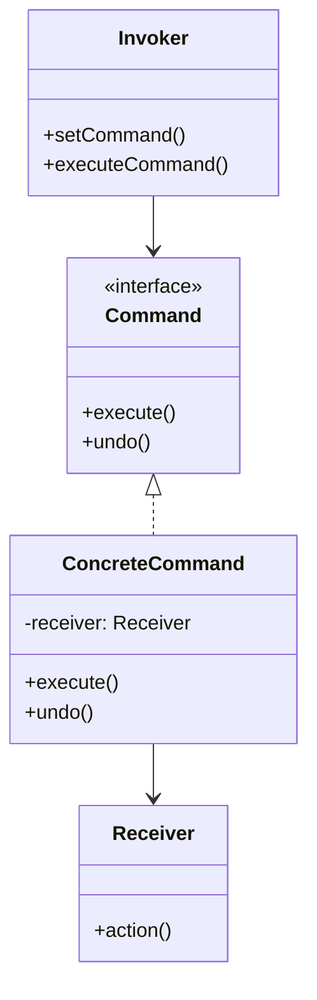

# Command Pattern

> "Encapsulate a request as an object, thereby letting you parameterize clients with different requests, queue or log requests, and support undoable operations."

## Intent

- Turn requests into stand-alone objects
- Parameterize objects with operations
- Queue, log, or schedule requests
- Support undo/redo operations

---

## Structure




---

## Implementation

### Basic Example

```python
from abc import ABC, abstractmethod
from typing import List

class Command(ABC):
    @abstractmethod
    def execute(self) -> None:
        pass

    @abstractmethod
    def undo(self) -> None:
        pass

class Light:
    """Receiver"""
    def __init__(self, location: str):
        self.location = location
        self.is_on = False

    def on(self) -> None:
        self.is_on = True
        print(f"{self.location} light is ON")

    def off(self) -> None:
        self.is_on = False
        print(f"{self.location} light is OFF")

class LightOnCommand(Command):
    def __init__(self, light: Light):
        self.light = light

    def execute(self) -> None:
        self.light.on()

    def undo(self) -> None:
        self.light.off()

class LightOffCommand(Command):
    def __init__(self, light: Light):
        self.light = light

    def execute(self) -> None:
        self.light.off()

    def undo(self) -> None:
        self.light.on()

class RemoteControl:
    """Invoker"""
    def __init__(self):
        self.command: Command = None
        self.history: List[Command] = []

    def set_command(self, command: Command) -> None:
        self.command = command

    def press_button(self) -> None:
        if self.command:
            self.command.execute()
            self.history.append(self.command)

    def press_undo(self) -> None:
        if self.history:
            command = self.history.pop()
            command.undo()

# Usage
living_room_light = Light("Living Room")
remote = RemoteControl()

remote.set_command(LightOnCommand(living_room_light))
remote.press_button()  # Living Room light is ON

remote.set_command(LightOffCommand(living_room_light))
remote.press_button()  # Living Room light is OFF

remote.press_undo()    # Living Room light is ON
```

---

## Real-World Examples

### Example 1: Text Editor with Undo/Redo

```python
from abc import ABC, abstractmethod
from typing import List, Optional
from dataclasses import dataclass
from copy import deepcopy

@dataclass
class TextState:
    content: str
    cursor_position: int

class Command(ABC):
    @abstractmethod
    def execute(self) -> None:
        pass

    @abstractmethod
    def undo(self) -> None:
        pass

    @property
    @abstractmethod
    def description(self) -> str:
        pass

class TextEditor:
    """Receiver"""
    def __init__(self):
        self.content = ""
        self.cursor = 0
        self.clipboard = ""

    def insert(self, text: str) -> None:
        self.content = (self.content[:self.cursor] +
                       text +
                       self.content[self.cursor:])
        self.cursor += len(text)

    def delete(self, length: int) -> str:
        deleted = self.content[self.cursor:self.cursor + length]
        self.content = (self.content[:self.cursor] +
                       self.content[self.cursor + length:])
        return deleted

    def delete_backward(self, length: int) -> str:
        start = max(0, self.cursor - length)
        deleted = self.content[start:self.cursor]
        self.content = self.content[:start] + self.content[self.cursor:]
        self.cursor = start
        return deleted

    def select(self, start: int, end: int) -> str:
        return self.content[start:end]

    def get_state(self) -> TextState:
        return TextState(self.content, self.cursor)

    def restore_state(self, state: TextState) -> None:
        self.content = state.content
        self.cursor = state.cursor_position

    def __str__(self) -> str:
        return f"'{self.content}' (cursor: {self.cursor})"

class InsertCommand(Command):
    def __init__(self, editor: TextEditor, text: str):
        self.editor = editor
        self.text = text
        self.previous_state: Optional[TextState] = None

    def execute(self) -> None:
        self.previous_state = self.editor.get_state()
        self.editor.insert(self.text)

    def undo(self) -> None:
        if self.previous_state:
            self.editor.restore_state(self.previous_state)

    @property
    def description(self) -> str:
        text_preview = self.text[:20] + "..." if len(self.text) > 20 else self.text
        return f"Insert '{text_preview}'"

class DeleteCommand(Command):
    def __init__(self, editor: TextEditor, length: int):
        self.editor = editor
        self.length = length
        self.deleted_text = ""
        self.previous_state: Optional[TextState] = None

    def execute(self) -> None:
        self.previous_state = self.editor.get_state()
        self.deleted_text = self.editor.delete(self.length)

    def undo(self) -> None:
        if self.previous_state:
            self.editor.restore_state(self.previous_state)

    @property
    def description(self) -> str:
        return f"Delete '{self.deleted_text}'"

class BackspaceCommand(Command):
    def __init__(self, editor: TextEditor, length: int = 1):
        self.editor = editor
        self.length = length
        self.deleted_text = ""
        self.previous_state: Optional[TextState] = None

    def execute(self) -> None:
        self.previous_state = self.editor.get_state()
        self.deleted_text = self.editor.delete_backward(self.length)

    def undo(self) -> None:
        if self.previous_state:
            self.editor.restore_state(self.previous_state)

    @property
    def description(self) -> str:
        return f"Backspace '{self.deleted_text}'"

class CopyCommand(Command):
    def __init__(self, editor: TextEditor, start: int, end: int):
        self.editor = editor
        self.start = start
        self.end = end
        self.previous_clipboard = ""

    def execute(self) -> None:
        self.previous_clipboard = self.editor.clipboard
        self.editor.clipboard = self.editor.select(self.start, self.end)

    def undo(self) -> None:
        self.editor.clipboard = self.previous_clipboard

    @property
    def description(self) -> str:
        return f"Copy ({self.start}:{self.end})"

class PasteCommand(Command):
    def __init__(self, editor: TextEditor):
        self.editor = editor
        self.previous_state: Optional[TextState] = None

    def execute(self) -> None:
        self.previous_state = self.editor.get_state()
        self.editor.insert(self.editor.clipboard)

    def undo(self) -> None:
        if self.previous_state:
            self.editor.restore_state(self.previous_state)

    @property
    def description(self) -> str:
        return f"Paste '{self.editor.clipboard[:20]}...'"

class MacroCommand(Command):
    """Composite command - execute multiple commands as one"""
    def __init__(self, commands: List[Command], name: str = "Macro"):
        self.commands = commands
        self.name = name

    def execute(self) -> None:
        for command in self.commands:
            command.execute()

    def undo(self) -> None:
        for command in reversed(self.commands):
            command.undo()

    @property
    def description(self) -> str:
        return f"{self.name} ({len(self.commands)} commands)"

class CommandManager:
    """Invoker with undo/redo support"""
    def __init__(self, max_history: int = 100):
        self.history: List[Command] = []
        self.redo_stack: List[Command] = []
        self.max_history = max_history

    def execute(self, command: Command) -> None:
        command.execute()
        self.history.append(command)
        self.redo_stack.clear()  # Clear redo on new command

        if len(self.history) > self.max_history:
            self.history.pop(0)

        print(f"Executed: {command.description}")

    def undo(self) -> bool:
        if not self.history:
            print("Nothing to undo")
            return False

        command = self.history.pop()
        command.undo()
        self.redo_stack.append(command)
        print(f"Undone: {command.description}")
        return True

    def redo(self) -> bool:
        if not self.redo_stack:
            print("Nothing to redo")
            return False

        command = self.redo_stack.pop()
        command.execute()
        self.history.append(command)
        print(f"Redone: {command.description}")
        return True

    def show_history(self) -> None:
        print("\n=== Command History ===")
        for i, cmd in enumerate(self.history, 1):
            print(f"{i}. {cmd.description}")
        print(f"Redo available: {len(self.redo_stack)}")

# Usage
editor = TextEditor()
manager = CommandManager()

print("=== Text Editor Demo ===\n")

# Type some text
manager.execute(InsertCommand(editor, "Hello"))
print(f"Editor: {editor}\n")

manager.execute(InsertCommand(editor, " World"))
print(f"Editor: {editor}\n")

manager.execute(InsertCommand(editor, "!"))
print(f"Editor: {editor}\n")

# Undo
manager.undo()
print(f"Editor: {editor}\n")

manager.undo()
print(f"Editor: {editor}\n")

# Redo
manager.redo()
print(f"Editor: {editor}\n")

# Show history
manager.show_history()
```

### Example 2: Transaction System

```python
from abc import ABC, abstractmethod
from typing import Dict, List, Optional
from dataclasses import dataclass
from datetime import datetime
from enum import Enum
import uuid

class TransactionStatus(Enum):
    PENDING = "pending"
    EXECUTED = "executed"
    ROLLED_BACK = "rolled_back"

@dataclass
class Account:
    id: str
    name: str
    balance: float

    def deposit(self, amount: float) -> None:
        self.balance += amount

    def withdraw(self, amount: float) -> bool:
        if self.balance >= amount:
            self.balance -= amount
            return True
        return False

class TransactionCommand(ABC):
    def __init__(self):
        self.id = str(uuid.uuid4())[:8]
        self.timestamp = datetime.now()
        self.status = TransactionStatus.PENDING

    @abstractmethod
    def execute(self) -> bool:
        pass

    @abstractmethod
    def rollback(self) -> bool:
        pass

    @property
    @abstractmethod
    def description(self) -> str:
        pass

class DepositCommand(TransactionCommand):
    def __init__(self, account: Account, amount: float):
        super().__init__()
        self.account = account
        self.amount = amount

    def execute(self) -> bool:
        self.account.deposit(self.amount)
        self.status = TransactionStatus.EXECUTED
        print(f"[{self.id}] Deposited ${self.amount:.2f} to {self.account.name}")
        return True

    def rollback(self) -> bool:
        if self.status == TransactionStatus.EXECUTED:
            self.account.withdraw(self.amount)
            self.status = TransactionStatus.ROLLED_BACK
            print(f"[{self.id}] Rolled back deposit of ${self.amount:.2f}")
            return True
        return False

    @property
    def description(self) -> str:
        return f"Deposit ${self.amount:.2f} to {self.account.name}"

class WithdrawCommand(TransactionCommand):
    def __init__(self, account: Account, amount: float):
        super().__init__()
        self.account = account
        self.amount = amount

    def execute(self) -> bool:
        if self.account.withdraw(self.amount):
            self.status = TransactionStatus.EXECUTED
            print(f"[{self.id}] Withdrew ${self.amount:.2f} from {self.account.name}")
            return True
        print(f"[{self.id}] Insufficient funds for withdrawal")
        return False

    def rollback(self) -> bool:
        if self.status == TransactionStatus.EXECUTED:
            self.account.deposit(self.amount)
            self.status = TransactionStatus.ROLLED_BACK
            print(f"[{self.id}] Rolled back withdrawal of ${self.amount:.2f}")
            return True
        return False

    @property
    def description(self) -> str:
        return f"Withdraw ${self.amount:.2f} from {self.account.name}"

class TransferCommand(TransactionCommand):
    """Composite transaction - atomic transfer between accounts"""
    def __init__(self, from_account: Account, to_account: Account, amount: float):
        super().__init__()
        self.from_account = from_account
        self.to_account = to_account
        self.amount = amount
        self.withdraw_cmd: Optional[WithdrawCommand] = None
        self.deposit_cmd: Optional[DepositCommand] = None

    def execute(self) -> bool:
        self.withdraw_cmd = WithdrawCommand(self.from_account, self.amount)
        self.deposit_cmd = DepositCommand(self.to_account, self.amount)

        # Execute withdrawal first
        if not self.withdraw_cmd.execute():
            return False

        # Execute deposit
        if not self.deposit_cmd.execute():
            # Rollback withdrawal if deposit fails
            self.withdraw_cmd.rollback()
            return False

        self.status = TransactionStatus.EXECUTED
        print(f"[{self.id}] Transfer complete")
        return True

    def rollback(self) -> bool:
        if self.status == TransactionStatus.EXECUTED:
            # Rollback in reverse order
            if self.deposit_cmd:
                self.deposit_cmd.rollback()
            if self.withdraw_cmd:
                self.withdraw_cmd.rollback()
            self.status = TransactionStatus.ROLLED_BACK
            return True
        return False

    @property
    def description(self) -> str:
        return (f"Transfer ${self.amount:.2f} from "
                f"{self.from_account.name} to {self.to_account.name}")

class TransactionQueue:
    """Invoker - manages transaction queue with batch processing"""
    def __init__(self):
        self.pending: List[TransactionCommand] = []
        self.executed: List[TransactionCommand] = []
        self.failed: List[TransactionCommand] = []

    def add(self, command: TransactionCommand) -> None:
        self.pending.append(command)
        print(f"Queued: {command.description}")

    def process_all(self) -> Dict[str, int]:
        """Process all pending transactions"""
        print("\n=== Processing Transactions ===")
        results = {"success": 0, "failed": 0}

        while self.pending:
            command = self.pending.pop(0)
            if command.execute():
                self.executed.append(command)
                results["success"] += 1
            else:
                self.failed.append(command)
                results["failed"] += 1

        return results

    def rollback_all(self) -> int:
        """Rollback all executed transactions"""
        print("\n=== Rolling Back All Transactions ===")
        count = 0
        while self.executed:
            command = self.executed.pop()
            if command.rollback():
                count += 1
        return count

    def show_status(self, accounts: List[Account]) -> None:
        print("\n=== Account Balances ===")
        for account in accounts:
            print(f"{account.name}: ${account.balance:.2f}")

# Usage
alice = Account("A001", "Alice", 1000.00)
bob = Account("A002", "Bob", 500.00)
charlie = Account("A003", "Charlie", 250.00)

queue = TransactionQueue()

# Queue transactions
queue.add(DepositCommand(alice, 200))
queue.add(WithdrawCommand(bob, 100))
queue.add(TransferCommand(alice, charlie, 300))
queue.add(WithdrawCommand(charlie, 1000))  # Will fail

# Process
results = queue.process_all()
print(f"\nResults: {results}")

queue.show_status([alice, bob, charlie])

# Rollback everything
rolled_back = queue.rollback_all()
print(f"\nRolled back {rolled_back} transactions")

queue.show_status([alice, bob, charlie])
```

### Example 3: Task Scheduler

```python
from abc import ABC, abstractmethod
from typing import Dict, List, Callable, Any, Optional
from dataclasses import dataclass, field
from datetime import datetime, timedelta
from enum import Enum
import time
import threading
from queue import PriorityQueue

class TaskPriority(Enum):
    LOW = 3
    MEDIUM = 2
    HIGH = 1
    CRITICAL = 0

class TaskStatus(Enum):
    PENDING = "pending"
    RUNNING = "running"
    COMPLETED = "completed"
    FAILED = "failed"
    CANCELLED = "cancelled"

@dataclass(order=True)
class ScheduledTask:
    priority: int
    scheduled_time: datetime
    command: 'TaskCommand' = field(compare=False)

class TaskCommand(ABC):
    def __init__(self, name: str, priority: TaskPriority = TaskPriority.MEDIUM):
        self.name = name
        self.priority = priority
        self.status = TaskStatus.PENDING
        self.result: Any = None
        self.error: Optional[str] = None
        self.started_at: Optional[datetime] = None
        self.completed_at: Optional[datetime] = None

    @abstractmethod
    def execute(self) -> Any:
        pass

    @abstractmethod
    def cancel(self) -> bool:
        pass

    @property
    def duration(self) -> Optional[timedelta]:
        if self.started_at and self.completed_at:
            return self.completed_at - self.started_at
        return None

class FunctionTask(TaskCommand):
    """Execute a function as a command"""
    def __init__(self, name: str, func: Callable, args: tuple = (),
                 kwargs: dict = None, priority: TaskPriority = TaskPriority.MEDIUM):
        super().__init__(name, priority)
        self.func = func
        self.args = args
        self.kwargs = kwargs or {}

    def execute(self) -> Any:
        self.status = TaskStatus.RUNNING
        self.started_at = datetime.now()
        try:
            self.result = self.func(*self.args, **self.kwargs)
            self.status = TaskStatus.COMPLETED
        except Exception as e:
            self.error = str(e)
            self.status = TaskStatus.FAILED
            raise
        finally:
            self.completed_at = datetime.now()
        return self.result

    def cancel(self) -> bool:
        if self.status == TaskStatus.PENDING:
            self.status = TaskStatus.CANCELLED
            return True
        return False

class BatchTask(TaskCommand):
    """Execute multiple tasks as one"""
    def __init__(self, name: str, tasks: List[TaskCommand],
                 stop_on_failure: bool = True):
        super().__init__(name, TaskPriority.MEDIUM)
        self.tasks = tasks
        self.stop_on_failure = stop_on_failure
        self.completed_tasks: List[TaskCommand] = []

    def execute(self) -> List[Any]:
        self.status = TaskStatus.RUNNING
        self.started_at = datetime.now()
        results = []

        try:
            for task in self.tasks:
                try:
                    result = task.execute()
                    results.append(result)
                    self.completed_tasks.append(task)
                except Exception as e:
                    if self.stop_on_failure:
                        self.error = f"Task '{task.name}' failed: {e}"
                        self.status = TaskStatus.FAILED
                        raise
                    results.append(None)

            self.status = TaskStatus.COMPLETED
            self.result = results
        finally:
            self.completed_at = datetime.now()

        return results

    def cancel(self) -> bool:
        if self.status == TaskStatus.PENDING:
            self.status = TaskStatus.CANCELLED
            for task in self.tasks:
                task.cancel()
            return True
        return False

class RetryTask(TaskCommand):
    """Retry a task on failure"""
    def __init__(self, task: TaskCommand, max_retries: int = 3,
                 delay: float = 1.0):
        super().__init__(f"Retry({task.name})", task.priority)
        self.task = task
        self.max_retries = max_retries
        self.delay = delay
        self.attempts = 0

    def execute(self) -> Any:
        self.status = TaskStatus.RUNNING
        self.started_at = datetime.now()

        while self.attempts < self.max_retries:
            self.attempts += 1
            try:
                result = self.task.execute()
                self.status = TaskStatus.COMPLETED
                self.result = result
                self.completed_at = datetime.now()
                return result
            except Exception as e:
                print(f"Attempt {self.attempts} failed: {e}")
                if self.attempts < self.max_retries:
                    time.sleep(self.delay)

        self.status = TaskStatus.FAILED
        self.error = f"Failed after {self.max_retries} attempts"
        self.completed_at = datetime.now()
        raise RuntimeError(self.error)

    def cancel(self) -> bool:
        return self.task.cancel()

class TaskScheduler:
    """Invoker - schedules and executes tasks"""
    def __init__(self):
        self.queue: PriorityQueue = PriorityQueue()
        self.completed: List[TaskCommand] = []
        self.running = False
        self._lock = threading.Lock()

    def schedule(self, command: TaskCommand,
                delay: timedelta = timedelta(0)) -> None:
        scheduled_time = datetime.now() + delay
        task = ScheduledTask(
            priority=command.priority.value,
            scheduled_time=scheduled_time,
            command=command
        )
        self.queue.put(task)
        print(f"Scheduled: {command.name} at {scheduled_time.strftime('%H:%M:%S')}")

    def schedule_at(self, command: TaskCommand, at: datetime) -> None:
        task = ScheduledTask(
            priority=command.priority.value,
            scheduled_time=at,
            command=command
        )
        self.queue.put(task)
        print(f"Scheduled: {command.name} at {at.strftime('%H:%M:%S')}")

    def run(self, blocking: bool = True) -> None:
        """Run the scheduler"""
        self.running = True
        print("\n=== Scheduler Started ===")

        def process():
            while self.running and not self.queue.empty():
                task = self.queue.get()

                # Wait until scheduled time
                now = datetime.now()
                if task.scheduled_time > now:
                    wait_time = (task.scheduled_time - now).total_seconds()
                    if wait_time > 0:
                        time.sleep(min(wait_time, 0.1))
                        if task.scheduled_time > datetime.now():
                            self.queue.put(task)
                            continue

                # Execute task
                try:
                    print(f"\nExecuting: {task.command.name}")
                    result = task.command.execute()
                    print(f"Completed: {task.command.name} -> {result}")
                except Exception as e:
                    print(f"Failed: {task.command.name} -> {e}")

                with self._lock:
                    self.completed.append(task.command)

        if blocking:
            process()
        else:
            thread = threading.Thread(target=process, daemon=True)
            thread.start()

    def stop(self) -> None:
        self.running = False

    def get_stats(self) -> Dict[str, Any]:
        stats = {
            "pending": self.queue.qsize(),
            "completed": len([t for t in self.completed if t.status == TaskStatus.COMPLETED]),
            "failed": len([t for t in self.completed if t.status == TaskStatus.FAILED]),
        }
        return stats

# Usage
def simulate_work(name: str, duration: float = 0.1) -> str:
    time.sleep(duration)
    return f"{name} done"

def failing_task() -> str:
    raise ValueError("Simulated failure")

scheduler = TaskScheduler()

# Schedule tasks with different priorities
scheduler.schedule(
    FunctionTask("High Priority", simulate_work, ("HP",), priority=TaskPriority.HIGH)
)
scheduler.schedule(
    FunctionTask("Low Priority", simulate_work, ("LP",), priority=TaskPriority.LOW)
)
scheduler.schedule(
    FunctionTask("Critical Task", simulate_work, ("CRIT",), priority=TaskPriority.CRITICAL)
)

# Schedule a batch task
batch = BatchTask("Batch Job", [
    FunctionTask("Step 1", simulate_work, ("S1",)),
    FunctionTask("Step 2", simulate_work, ("S2",)),
    FunctionTask("Step 3", simulate_work, ("S3",)),
])
scheduler.schedule(batch)

# Schedule with delay
scheduler.schedule(
    FunctionTask("Delayed Task", simulate_work, ("Delayed",)),
    delay=timedelta(seconds=1)
)

# Run scheduler
scheduler.run()

print(f"\n=== Stats: {scheduler.get_stats()} ===")
```

---

## When to Use

✅ **Use when:**
- Need to parameterize objects with operations
- Need to queue, schedule, or log operations
- Need undo/redo functionality
- Need to structure a system around transactions

❌ **Don't use when:**
- Simple direct method calls suffice
- No need for operation history
- Commands are trivial

---

## Related Topics

- [[06_memento|Memento Pattern]] - Save state for undo
- [[05_chain_of_responsibility|Chain of Responsibility]] - Pass commands
- [[../Structural/05_composite|Composite Pattern]] - Macro commands

---

**Tags**: #design-patterns #behavioral #command #undo-redo #transactions
