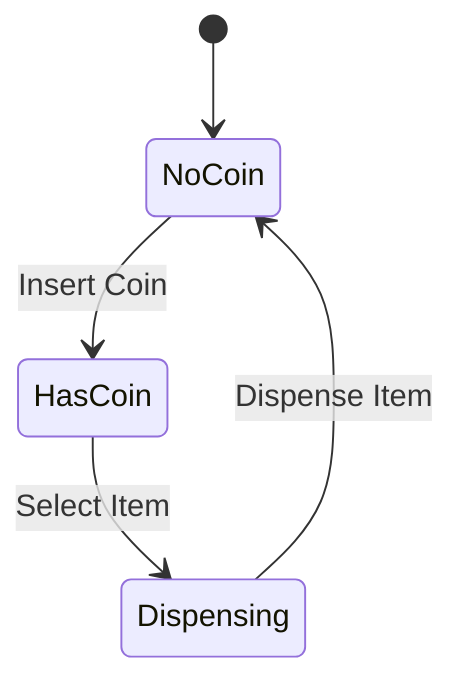
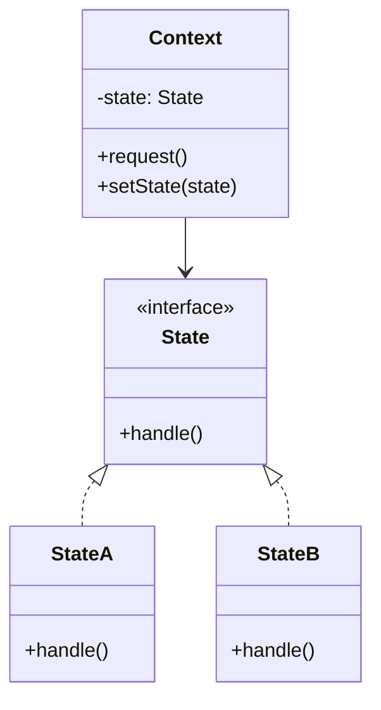

# State Pattern

> "Allow an object to alter its behavior when its internal state changes. The object will appear to change its class."

## Visualization



## Intent

- Encapsulate state-specific behavior
- Allow state transitions at runtime
- Eliminate complex conditionals based on state

---

## Structure




---

## Implementation

### Basic Example

```python
from abc import ABC, abstractmethod

class State(ABC):
    @abstractmethod
    def insert_coin(self, machine: 'VendingMachine') -> None:
        pass

    @abstractmethod
    def select_item(self, machine: 'VendingMachine') -> None:
        pass

    @abstractmethod
    def dispense(self, machine: 'VendingMachine') -> None:
        pass

class NoCoinState(State):
    def insert_coin(self, machine: 'VendingMachine') -> None:
        print("Coin inserted")
        machine.set_state(machine.has_coin_state)

    def select_item(self, machine: 'VendingMachine') -> None:
        print("Please insert coin first")

    def dispense(self, machine: 'VendingMachine') -> None:
        print("Please insert coin first")

class HasCoinState(State):
    def insert_coin(self, machine: 'VendingMachine') -> None:
        print("Coin already inserted")

    def select_item(self, machine: 'VendingMachine') -> None:
        print("Item selected")
        machine.set_state(machine.dispensing_state)

    def dispense(self, machine: 'VendingMachine') -> None:
        print("Please select item first")

class DispensingState(State):
    def insert_coin(self, machine: 'VendingMachine') -> None:
        print("Please wait, dispensing item")

    def select_item(self, machine: 'VendingMachine') -> None:
        print("Please wait, dispensing item")

    def dispense(self, machine: 'VendingMachine') -> None:
        print("Item dispensed!")
        machine.set_state(machine.no_coin_state)

class VendingMachine:
    def __init__(self):
        self.no_coin_state = NoCoinState()
        self.has_coin_state = HasCoinState()
        self.dispensing_state = DispensingState()
        self._state = self.no_coin_state

    def set_state(self, state: State) -> None:
        self._state = state

    def insert_coin(self) -> None:
        self._state.insert_coin(self)

    def select_item(self) -> None:
        self._state.select_item(self)

    def dispense(self) -> None:
        self._state.dispense(self)

# Usage
machine = VendingMachine()
machine.select_item()   # Please insert coin first
machine.insert_coin()   # Coin inserted
machine.insert_coin()   # Coin already inserted
machine.select_item()   # Item selected
machine.dispense()      # Item dispensed!
```

---

## Real-World Examples

### Example 1: Order Processing System

```python
from abc import ABC, abstractmethod
from dataclasses import dataclass, field
from datetime import datetime
from typing import List, Optional
from enum import Enum

class OrderStatus(Enum):
    CREATED = "created"
    PAID = "paid"
    PROCESSING = "processing"
    SHIPPED = "shipped"
    DELIVERED = "delivered"
    CANCELLED = "cancelled"

@dataclass
class OrderItem:
    name: str
    quantity: int
    price: float

@dataclass
class OrderEvent:
    timestamp: datetime
    state: str
    description: str

class OrderState(ABC):
    @property
    @abstractmethod
    def status(self) -> OrderStatus:
        pass

    def pay(self, order: 'Order') -> None:
        print(f"Cannot pay order in {self.status.value} state")

    def process(self, order: 'Order') -> None:
        print(f"Cannot process order in {self.status.value} state")

    def ship(self, order: 'Order') -> None:
        print(f"Cannot ship order in {self.status.value} state")

    def deliver(self, order: 'Order') -> None:
        print(f"Cannot deliver order in {self.status.value} state")

    def cancel(self, order: 'Order') -> None:
        print(f"Cannot cancel order in {self.status.value} state")

class CreatedState(OrderState):
    @property
    def status(self) -> OrderStatus:
        return OrderStatus.CREATED

    def pay(self, order: 'Order') -> None:
        print("Processing payment...")
        order.add_event("Payment received")
        order.set_state(PaidState())

    def cancel(self, order: 'Order') -> None:
        print("Order cancelled")
        order.add_event("Order cancelled before payment")
        order.set_state(CancelledState())

class PaidState(OrderState):
    @property
    def status(self) -> OrderStatus:
        return OrderStatus.PAID

    def process(self, order: 'Order') -> None:
        print("Starting order processing...")
        order.add_event("Order processing started")
        order.set_state(ProcessingState())

    def cancel(self, order: 'Order') -> None:
        print("Order cancelled, refund initiated")
        order.add_event("Order cancelled, refund in progress")
        order.set_state(CancelledState())

class ProcessingState(OrderState):
    @property
    def status(self) -> OrderStatus:
        return OrderStatus.PROCESSING

    def ship(self, order: 'Order') -> None:
        print("Order shipped!")
        order.tracking_number = f"TRACK-{order.order_id}"
        order.add_event(f"Shipped with tracking: {order.tracking_number}")
        order.set_state(ShippedState())

    def cancel(self, order: 'Order') -> None:
        print("Order cancelled during processing")
        order.add_event("Order cancelled, items returned to inventory")
        order.set_state(CancelledState())

class ShippedState(OrderState):
    @property
    def status(self) -> OrderStatus:
        return OrderStatus.SHIPPED

    def deliver(self, order: 'Order') -> None:
        print("Order delivered!")
        order.delivered_at = datetime.now()
        order.add_event("Order delivered successfully")
        order.set_state(DeliveredState())

class DeliveredState(OrderState):
    @property
    def status(self) -> OrderStatus:
        return OrderStatus.DELIVERED

    # Final state - no transitions allowed

class CancelledState(OrderState):
    @property
    def status(self) -> OrderStatus:
        return OrderStatus.CANCELLED

    # Final state - no transitions allowed

@dataclass
class Order:
    order_id: str
    items: List[OrderItem]
    _state: OrderState = field(default_factory=CreatedState)
    events: List[OrderEvent] = field(default_factory=list)
    tracking_number: Optional[str] = None
    delivered_at: Optional[datetime] = None
    created_at: datetime = field(default_factory=datetime.now)

    def __post_init__(self):
        self.add_event("Order created")

    @property
    def total(self) -> float:
        return sum(item.price * item.quantity for item in self.items)

    @property
    def status(self) -> OrderStatus:
        return self._state.status

    def set_state(self, state: OrderState) -> None:
        print(f"[{self.order_id}] {self._state.status.value} -> {state.status.value}")
        self._state = state

    def add_event(self, description: str) -> None:
        event = OrderEvent(
            timestamp=datetime.now(),
            state=self._state.status.value,
            description=description
        )
        self.events.append(event)

    def pay(self) -> None:
        self._state.pay(self)

    def process(self) -> None:
        self._state.process(self)

    def ship(self) -> None:
        self._state.ship(self)

    def deliver(self) -> None:
        self._state.deliver(self)

    def cancel(self) -> None:
        self._state.cancel(self)

    def show_history(self) -> None:
        print(f"\n=== Order {self.order_id} History ===")
        for event in self.events:
            print(f"[{event.timestamp.strftime('%H:%M:%S')}] "
                  f"({event.state}) {event.description}")

# Usage
order = Order(
    order_id="ORD-001",
    items=[
        OrderItem("Widget", 2, 29.99),
        OrderItem("Gadget", 1, 49.99),
    ]
)

print(f"Order total: ${order.total:.2f}")
print(f"Current status: {order.status.value}")

# Try invalid transitions
order.ship()  # Cannot ship in created state

# Valid flow
order.pay()
order.process()
order.ship()
order.deliver()

# Try to cancel delivered order
order.cancel()  # Cannot cancel in delivered state

order.show_history()
```

### Example 2: Media Player

```python
from abc import ABC, abstractmethod
from typing import Optional
from dataclasses import dataclass

class PlayerState(ABC):
    @abstractmethod
    def play(self, player: 'MediaPlayer') -> None:
        pass

    @abstractmethod
    def pause(self, player: 'MediaPlayer') -> None:
        pass

    @abstractmethod
    def stop(self, player: 'MediaPlayer') -> None:
        pass

    @abstractmethod
    def next_track(self, player: 'MediaPlayer') -> None:
        pass

    @abstractmethod
    def prev_track(self, player: 'MediaPlayer') -> None:
        pass

    @property
    @abstractmethod
    def name(self) -> str:
        pass

class StoppedState(PlayerState):
    @property
    def name(self) -> str:
        return "Stopped"

    def play(self, player: 'MediaPlayer') -> None:
        if player.playlist:
            player.current_track = 0
            print(f"▶ Playing: {player.current_song}")
            player.set_state(PlayingState())
        else:
            print("No tracks in playlist")

    def pause(self, player: 'MediaPlayer') -> None:
        print("Already stopped")

    def stop(self, player: 'MediaPlayer') -> None:
        print("Already stopped")

    def next_track(self, player: 'MediaPlayer') -> None:
        print("Press play first")

    def prev_track(self, player: 'MediaPlayer') -> None:
        print("Press play first")

class PlayingState(PlayerState):
    @property
    def name(self) -> str:
        return "Playing"

    def play(self, player: 'MediaPlayer') -> None:
        print("Already playing")

    def pause(self, player: 'MediaPlayer') -> None:
        print(f"⏸ Paused: {player.current_song}")
        player.set_state(PausedState())

    def stop(self, player: 'MediaPlayer') -> None:
        print("⏹ Stopped")
        player.current_track = None
        player.set_state(StoppedState())

    def next_track(self, player: 'MediaPlayer') -> None:
        if player.current_track < len(player.playlist) - 1:
            player.current_track += 1
            print(f"⏭ Next: {player.current_song}")
        else:
            print("End of playlist")
            player.set_state(StoppedState())

    def prev_track(self, player: 'MediaPlayer') -> None:
        if player.current_track > 0:
            player.current_track -= 1
            print(f"⏮ Previous: {player.current_song}")
        else:
            print("Beginning of playlist")

class PausedState(PlayerState):
    @property
    def name(self) -> str:
        return "Paused"

    def play(self, player: 'MediaPlayer') -> None:
        print(f"▶ Resuming: {player.current_song}")
        player.set_state(PlayingState())

    def pause(self, player: 'MediaPlayer') -> None:
        print("Already paused")

    def stop(self, player: 'MediaPlayer') -> None:
        print("⏹ Stopped")
        player.current_track = None
        player.set_state(StoppedState())

    def next_track(self, player: 'MediaPlayer') -> None:
        if player.current_track < len(player.playlist) - 1:
            player.current_track += 1
            print(f"⏭ Next (paused): {player.current_song}")
        else:
            print("End of playlist")

    def prev_track(self, player: 'MediaPlayer') -> None:
        if player.current_track > 0:
            player.current_track -= 1
            print(f"⏮ Previous (paused): {player.current_song}")

@dataclass
class Track:
    title: str
    artist: str
    duration: int  # seconds

    def __str__(self) -> str:
        return f"{self.artist} - {self.title}"

class MediaPlayer:
    def __init__(self):
        self.playlist: list[Track] = []
        self.current_track: Optional[int] = None
        self._state: PlayerState = StoppedState()

    @property
    def current_song(self) -> Optional[str]:
        if self.current_track is not None and self.playlist:
            return str(self.playlist[self.current_track])
        return None

    def set_state(self, state: PlayerState) -> None:
        old_state = self._state.name
        self._state = state
        print(f"  [{old_state} -> {state.name}]")

    def add_track(self, track: Track) -> None:
        self.playlist.append(track)

    def play(self) -> None:
        self._state.play(self)

    def pause(self) -> None:
        self._state.pause(self)

    def stop(self) -> None:
        self._state.stop(self)

    def next(self) -> None:
        self._state.next_track(self)

    def previous(self) -> None:
        self._state.prev_track(self)

    def status(self) -> None:
        print(f"\nStatus: {self._state.name}")
        if self.current_song:
            print(f"Now: {self.current_song}")
        print(f"Playlist: {len(self.playlist)} tracks")

# Usage
player = MediaPlayer()
player.add_track(Track("Bohemian Rhapsody", "Queen", 355))
player.add_track(Track("Stairway to Heaven", "Led Zeppelin", 482))
player.add_track(Track("Hotel California", "Eagles", 390))

print("=== Media Player Demo ===\n")

player.status()
player.play()
player.next()
player.pause()
player.next()
player.play()
player.next()  # End of playlist
player.status()
```

### Example 3: Document Workflow

```python
from abc import ABC, abstractmethod
from dataclasses import dataclass, field
from datetime import datetime
from typing import List, Optional

class DocumentState(ABC):
    @property
    @abstractmethod
    def name(self) -> str:
        pass

    @abstractmethod
    def can_edit(self) -> bool:
        pass

    def edit(self, doc: 'Document', content: str) -> None:
        if self.can_edit():
            doc.content = content
            doc.modified_at = datetime.now()
            print(f"Document edited")
        else:
            print(f"Cannot edit document in {self.name} state")

    def submit_for_review(self, doc: 'Document') -> None:
        print(f"Cannot submit for review in {self.name} state")

    def approve(self, doc: 'Document', reviewer: str) -> None:
        print(f"Cannot approve in {self.name} state")

    def reject(self, doc: 'Document', reviewer: str, reason: str) -> None:
        print(f"Cannot reject in {self.name} state")

    def publish(self, doc: 'Document') -> None:
        print(f"Cannot publish in {self.name} state")

    def archive(self, doc: 'Document') -> None:
        print(f"Cannot archive in {self.name} state")

class DraftState(DocumentState):
    @property
    def name(self) -> str:
        return "Draft"

    def can_edit(self) -> bool:
        return True

    def submit_for_review(self, doc: 'Document') -> None:
        if not doc.content:
            print("Cannot submit empty document")
            return
        print("Document submitted for review")
        doc.add_log("Submitted for review")
        doc.set_state(PendingReviewState())

class PendingReviewState(DocumentState):
    @property
    def name(self) -> str:
        return "Pending Review"

    def can_edit(self) -> bool:
        return False

    def approve(self, doc: 'Document', reviewer: str) -> None:
        print(f"Document approved by {reviewer}")
        doc.reviewed_by = reviewer
        doc.add_log(f"Approved by {reviewer}")
        doc.set_state(ApprovedState())

    def reject(self, doc: 'Document', reviewer: str, reason: str) -> None:
        print(f"Document rejected by {reviewer}: {reason}")
        doc.reviewed_by = reviewer
        doc.add_log(f"Rejected by {reviewer}: {reason}")
        doc.set_state(RejectedState())

class ApprovedState(DocumentState):
    @property
    def name(self) -> str:
        return "Approved"

    def can_edit(self) -> bool:
        return False

    def publish(self, doc: 'Document') -> None:
        print("Document published!")
        doc.published_at = datetime.now()
        doc.add_log("Published")
        doc.set_state(PublishedState())

class RejectedState(DocumentState):
    @property
    def name(self) -> str:
        return "Rejected"

    def can_edit(self) -> bool:
        return True

    def submit_for_review(self, doc: 'Document') -> None:
        print("Document resubmitted for review")
        doc.add_log("Resubmitted for review")
        doc.set_state(PendingReviewState())

class PublishedState(DocumentState):
    @property
    def name(self) -> str:
        return "Published"

    def can_edit(self) -> bool:
        return False

    def archive(self, doc: 'Document') -> None:
        print("Document archived")
        doc.add_log("Archived")
        doc.set_state(ArchivedState())

class ArchivedState(DocumentState):
    @property
    def name(self) -> str:
        return "Archived"

    def can_edit(self) -> bool:
        return False

@dataclass
class LogEntry:
    timestamp: datetime
    action: str
    state: str

@dataclass
class Document:
    title: str
    author: str
    content: str = ""
    _state: DocumentState = field(default_factory=DraftState)
    logs: List[LogEntry] = field(default_factory=list)
    created_at: datetime = field(default_factory=datetime.now)
    modified_at: Optional[datetime] = None
    reviewed_by: Optional[str] = None
    published_at: Optional[datetime] = None

    def __post_init__(self):
        self.add_log("Document created")

    @property
    def state_name(self) -> str:
        return self._state.name

    def set_state(self, state: DocumentState) -> None:
        print(f"  [{self._state.name} -> {state.name}]")
        self._state = state

    def add_log(self, action: str) -> None:
        self.logs.append(LogEntry(
            timestamp=datetime.now(),
            action=action,
            state=self._state.name
        ))

    def edit(self, content: str) -> None:
        self._state.edit(self, content)

    def submit_for_review(self) -> None:
        self._state.submit_for_review(self)

    def approve(self, reviewer: str) -> None:
        self._state.approve(self, reviewer)

    def reject(self, reviewer: str, reason: str) -> None:
        self._state.reject(self, reviewer, reason)

    def publish(self) -> None:
        self._state.publish(self)

    def archive(self) -> None:
        self._state.archive(self)

    def show_history(self) -> None:
        print(f"\n=== {self.title} History ===")
        for log in self.logs:
            print(f"[{log.timestamp.strftime('%H:%M:%S')}] "
                  f"({log.state}) {log.action}")

# Usage
print("=== Document Workflow Demo ===\n")

doc = Document(title="Q4 Report", author="Alice")

# Draft phase
doc.edit("Initial content for Q4 report...")
doc.edit("Updated content with more details...")

# Try to publish directly
doc.publish()  # Cannot publish in Draft state

# Submit for review
doc.submit_for_review()

# Try to edit while in review
doc.edit("Sneaky edit")  # Cannot edit in Pending Review state

# Reject
doc.reject("Bob", "Needs more data")

# Fix and resubmit
doc.edit("Added more data and charts...")
doc.submit_for_review()

# Approve and publish
doc.approve("Carol")
doc.publish()

# Archive
doc.archive()

doc.show_history()
```

---

## State vs Strategy

| Aspect | State | Strategy |
|--------|-------|----------|
| **Purpose** | Object behavior changes with state | Choose algorithm at runtime |
| **Transitions** | States know about each other | Strategies are independent |
| **Client awareness** | Client unaware of states | Client chooses strategy |
| **Replacement** | Automatic based on context | Explicit by client |

---

## When to Use

✅ **Use when:**
- Object behavior depends on its state
- Complex conditionals based on state
- State transitions need to be explicit
- State-specific behavior should be isolated

❌ **Don't use when:**
- Few simple states
- State transitions are simple
- Behavior doesn't change with state

---

## Related Topics

- [[01_strategy|Strategy Pattern]] - Similar structure, different intent
- [[../Structural/04_proxy|Proxy Pattern]] - Control access by state
- [[06_memento|Memento Pattern]] - Save state snapshots

---

**Tags**: #design-patterns #behavioral #state #state-machine #workflow
