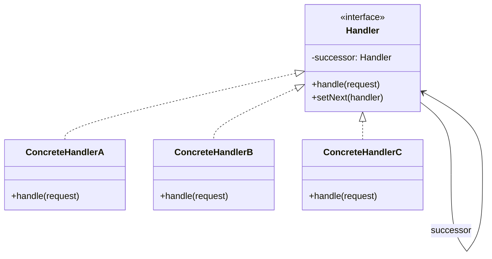

# Chain of Responsibility Pattern

> "Avoid coupling the sender of a request to its receiver by giving more than one object a chance to handle the request. Chain the receiving objects and pass the request along the chain until an object handles it."

## Intent

- Decouple sender from receiver
- Allow multiple handlers to process a request
- Add or remove handlers dynamically
- Determine handler at runtime

---

## Structure




---

## Implementation

### Basic Example

```python
from abc import ABC, abstractmethod
from typing import Optional
from dataclasses import dataclass

@dataclass
class Request:
    type: str
    amount: float
    description: str

class Handler(ABC):
    def __init__(self):
        self._next: Optional['Handler'] = None

    def set_next(self, handler: 'Handler') -> 'Handler':
        self._next = handler
        return handler

    @abstractmethod
    def handle(self, request: Request) -> Optional[str]:
        pass

class Manager(Handler):
    def handle(self, request: Request) -> Optional[str]:
        if request.amount <= 1000:
            return f"Manager approved: {request.description}"
        elif self._next:
            return self._next.handle(request)
        return None

class Director(Handler):
    def handle(self, request: Request) -> Optional[str]:
        if request.amount <= 10000:
            return f"Director approved: {request.description}"
        elif self._next:
            return self._next.handle(request)
        return None

class VP(Handler):
    def handle(self, request: Request) -> Optional[str]:
        if request.amount <= 100000:
            return f"VP approved: {request.description}"
        elif self._next:
            return self._next.handle(request)
        return None

class CEO(Handler):
    def handle(self, request: Request) -> Optional[str]:
        return f"CEO approved: {request.description}"

# Build chain
manager = Manager()
director = Director()
vp = VP()
ceo = CEO()

manager.set_next(director).set_next(vp).set_next(ceo)

# Process requests
requests = [
    Request("expense", 500, "Office supplies"),
    Request("expense", 5000, "Team building"),
    Request("expense", 50000, "Conference sponsorship"),
    Request("expense", 500000, "Acquisition"),
]

for req in requests:
    result = manager.handle(req)
    print(f"${req.amount}: {result}")
```

---

## Real-World Examples

### Example 1: HTTP Middleware Pipeline

```python
from abc import ABC, abstractmethod
from typing import Optional, Dict, Any, Callable
from dataclasses import dataclass, field
from datetime import datetime
import json
import re

@dataclass
class Request:
    method: str
    path: str
    headers: Dict[str, str] = field(default_factory=dict)
    body: Optional[str] = None
    user: Optional[Dict[str, Any]] = None
    context: Dict[str, Any] = field(default_factory=dict)

@dataclass
class Response:
    status: int
    body: Any = None
    headers: Dict[str, str] = field(default_factory=dict)

class Middleware(ABC):
    def __init__(self):
        self._next: Optional['Middleware'] = None

    def set_next(self, middleware: 'Middleware') -> 'Middleware':
        self._next = middleware
        return middleware

    @abstractmethod
    def handle(self, request: Request) -> Optional[Response]:
        pass

    def next(self, request: Request) -> Optional[Response]:
        if self._next:
            return self._next.handle(request)
        return None

class LoggingMiddleware(Middleware):
    def handle(self, request: Request) -> Optional[Response]:
        start = datetime.now()
        print(f"[{start}] {request.method} {request.path}")

        response = self.next(request)

        duration = (datetime.now() - start).total_seconds() * 1000
        status = response.status if response else 500
        print(f"[{start}] Completed {status} in {duration:.2f}ms")

        return response

class AuthenticationMiddleware(Middleware):
    def __init__(self, secret: str):
        super().__init__()
        self.secret = secret
        self.public_paths = ["/login", "/register", "/health"]

    def handle(self, request: Request) -> Optional[Response]:
        # Skip auth for public paths
        if request.path in self.public_paths:
            return self.next(request)

        auth_header = request.headers.get("Authorization", "")
        if not auth_header.startswith("Bearer "):
            return Response(401, {"error": "Missing authentication"})

        token = auth_header[7:]
        if not self._validate_token(token):
            return Response(401, {"error": "Invalid token"})

        # Add user to request
        request.user = {"id": "user123", "role": "admin"}
        return self.next(request)

    def _validate_token(self, token: str) -> bool:
        # Simplified validation
        return token == f"valid_{self.secret}"

class RateLimitMiddleware(Middleware):
    def __init__(self, max_requests: int = 100, window: int = 60):
        super().__init__()
        self.max_requests = max_requests
        self.window = window
        self.requests: Dict[str, list] = {}

    def handle(self, request: Request) -> Optional[Response]:
        client_ip = request.headers.get("X-Forwarded-For", "unknown")
        now = datetime.now().timestamp()

        # Clean old requests
        if client_ip in self.requests:
            self.requests[client_ip] = [
                t for t in self.requests[client_ip]
                if now - t < self.window
            ]
        else:
            self.requests[client_ip] = []

        # Check limit
        if len(self.requests[client_ip]) >= self.max_requests:
            return Response(429, {"error": "Rate limit exceeded"})

        self.requests[client_ip].append(now)
        return self.next(request)

class ValidationMiddleware(Middleware):
    def __init__(self):
        super().__init__()
        self.validators: Dict[str, Callable] = {}

    def add_validator(self, path_pattern: str,
                     validator: Callable[[Request], Optional[str]]) -> None:
        self.validators[path_pattern] = validator

    def handle(self, request: Request) -> Optional[Response]:
        for pattern, validator in self.validators.items():
            if re.match(pattern, request.path):
                error = validator(request)
                if error:
                    return Response(400, {"error": error})

        return self.next(request)

class CacheMiddleware(Middleware):
    def __init__(self, ttl: int = 300):
        super().__init__()
        self.cache: Dict[str, tuple] = {}
        self.ttl = ttl

    def handle(self, request: Request) -> Optional[Response]:
        # Only cache GET requests
        if request.method != "GET":
            return self.next(request)

        cache_key = f"{request.method}:{request.path}"
        now = datetime.now().timestamp()

        # Check cache
        if cache_key in self.cache:
            cached_response, timestamp = self.cache[cache_key]
            if now - timestamp < self.ttl:
                print(f"[Cache HIT] {cache_key}")
                cached_response.headers["X-Cache"] = "HIT"
                return cached_response

        # Get fresh response
        response = self.next(request)

        # Cache successful responses
        if response and response.status == 200:
            self.cache[cache_key] = (response, now)
            response.headers["X-Cache"] = "MISS"

        return response

class RouterMiddleware(Middleware):
    """Final handler - routes to appropriate endpoint"""
    def __init__(self):
        super().__init__()
        self.routes: Dict[tuple, Callable] = {}

    def add_route(self, method: str, path: str,
                  handler: Callable[[Request], Response]) -> None:
        self.routes[(method, path)] = handler

    def handle(self, request: Request) -> Optional[Response]:
        key = (request.method, request.path)
        handler = self.routes.get(key)

        if handler:
            return handler(request)

        return Response(404, {"error": "Not found"})

# Build middleware chain
logging = LoggingMiddleware()
auth = AuthenticationMiddleware("secret")
rate_limit = RateLimitMiddleware(max_requests=10)
validation = ValidationMiddleware()
cache = CacheMiddleware(ttl=60)
router = RouterMiddleware()

# Chain them
logging.set_next(auth).set_next(rate_limit).set_next(
    validation).set_next(cache).set_next(router)

# Add routes
router.add_route("GET", "/health", lambda r: Response(200, {"status": "ok"}))
router.add_route("GET", "/users", lambda r: Response(200, {"users": []}))
router.add_route("POST", "/login", lambda r: Response(200, {"token": "valid_secret"}))

# Add validators
validation.add_validator(r"/users/\d+", lambda r: None if r.user else "Auth required")

# Process requests
print("=== HTTP Pipeline Demo ===\n")

requests = [
    Request("GET", "/health"),
    Request("GET", "/users", headers={"Authorization": "Bearer valid_secret"}),
    Request("GET", "/users"),  # No auth
    Request("POST", "/login"),
]

for req in requests:
    print(f"\n--- Request: {req.method} {req.path} ---")
    response = logging.handle(req)
    print(f"Response: {response.status} {response.body}")
```

### Example 2: Support Ticket System

```python
from abc import ABC, abstractmethod
from typing import Optional, List
from dataclasses import dataclass, field
from datetime import datetime
from enum import Enum

class Priority(Enum):
    LOW = 1
    MEDIUM = 2
    HIGH = 3
    CRITICAL = 4

class TicketType(Enum):
    GENERAL = "general"
    TECHNICAL = "technical"
    BILLING = "billing"
    SECURITY = "security"

@dataclass
class Ticket:
    id: str
    type: TicketType
    priority: Priority
    subject: str
    description: str
    customer_tier: str = "standard"  # standard, premium, enterprise
    assigned_to: Optional[str] = None
    resolution: Optional[str] = None
    notes: List[str] = field(default_factory=list)

    def add_note(self, note: str) -> None:
        self.notes.append(f"[{datetime.now().strftime('%H:%M')}] {note}")

class SupportHandler(ABC):
    def __init__(self, name: str):
        self.name = name
        self._next: Optional['SupportHandler'] = None

    def set_next(self, handler: 'SupportHandler') -> 'SupportHandler':
        self._next = handler
        return handler

    def escalate(self, ticket: Ticket) -> bool:
        if self._next:
            ticket.add_note(f"Escalated from {self.name}")
            return self._next.handle(ticket)
        return False

    @abstractmethod
    def can_handle(self, ticket: Ticket) -> bool:
        pass

    @abstractmethod
    def handle(self, ticket: Ticket) -> bool:
        pass

class AutomatedSupport(SupportHandler):
    def __init__(self):
        super().__init__("Automated System")
        self.knowledge_base = {
            "password reset": "Visit /reset-password to reset your password",
            "billing cycle": "Billing occurs on the 1st of each month",
            "upgrade plan": "Visit /account/upgrade to change your plan",
        }

    def can_handle(self, ticket: Ticket) -> bool:
        # Handle low priority general inquiries
        if ticket.priority == Priority.LOW and ticket.type == TicketType.GENERAL:
            return self._find_answer(ticket) is not None
        return False

    def _find_answer(self, ticket: Ticket) -> Optional[str]:
        for keyword, answer in self.knowledge_base.items():
            if keyword in ticket.subject.lower():
                return answer
        return None

    def handle(self, ticket: Ticket) -> bool:
        if self.can_handle(ticket):
            answer = self._find_answer(ticket)
            ticket.resolution = f"[Auto] {answer}"
            ticket.add_note(f"Resolved by {self.name}")
            print(f"[{self.name}] Resolved: {ticket.id}")
            return True
        return self.escalate(ticket)

class Level1Support(SupportHandler):
    def __init__(self):
        super().__init__("Level 1 Support")
        self.handled_types = [TicketType.GENERAL, TicketType.BILLING]

    def can_handle(self, ticket: Ticket) -> bool:
        return (ticket.type in self.handled_types and
                ticket.priority in [Priority.LOW, Priority.MEDIUM])

    def handle(self, ticket: Ticket) -> bool:
        if self.can_handle(ticket):
            ticket.assigned_to = self.name
            ticket.add_note(f"Assigned to {self.name}")
            print(f"[{self.name}] Handling: {ticket.id} - {ticket.subject}")

            # Simulate resolution
            ticket.resolution = f"Issue addressed by {self.name}"
            return True
        return self.escalate(ticket)

class Level2Support(SupportHandler):
    def __init__(self):
        super().__init__("Level 2 Support")
        self.handled_types = [TicketType.TECHNICAL, TicketType.BILLING]

    def can_handle(self, ticket: Ticket) -> bool:
        return (ticket.type in self.handled_types and
                ticket.priority in [Priority.MEDIUM, Priority.HIGH])

    def handle(self, ticket: Ticket) -> bool:
        if self.can_handle(ticket):
            ticket.assigned_to = self.name
            ticket.add_note(f"Assigned to {self.name}")
            print(f"[{self.name}] Handling: {ticket.id} - {ticket.subject}")
            ticket.resolution = f"Technical issue resolved by {self.name}"
            return True
        return self.escalate(ticket)

class SecurityTeam(SupportHandler):
    def __init__(self):
        super().__init__("Security Team")

    def can_handle(self, ticket: Ticket) -> bool:
        return ticket.type == TicketType.SECURITY

    def handle(self, ticket: Ticket) -> bool:
        if self.can_handle(ticket):
            ticket.assigned_to = self.name
            ticket.add_note(f"SECURITY ALERT - Assigned to {self.name}")
            print(f"[{self.name}] URGENT: {ticket.id} - {ticket.subject}")
            ticket.resolution = f"Security issue handled by {self.name}"
            return True
        return self.escalate(ticket)

class EnterpriseSupport(SupportHandler):
    def __init__(self):
        super().__init__("Enterprise Support")

    def can_handle(self, ticket: Ticket) -> bool:
        return ticket.customer_tier == "enterprise"

    def handle(self, ticket: Ticket) -> bool:
        if self.can_handle(ticket):
            ticket.assigned_to = self.name
            ticket.add_note(f"Enterprise customer - Priority handling by {self.name}")
            print(f"[{self.name}] VIP: {ticket.id} - {ticket.subject}")
            ticket.resolution = f"Resolved with priority by {self.name}"
            return True
        return self.escalate(ticket)

class Manager(SupportHandler):
    def __init__(self):
        super().__init__("Support Manager")

    def can_handle(self, ticket: Ticket) -> bool:
        return ticket.priority == Priority.CRITICAL

    def handle(self, ticket: Ticket) -> bool:
        # Manager handles anything that reaches them
        ticket.assigned_to = self.name
        ticket.add_note(f"Escalated to management - {self.name}")
        print(f"[{self.name}] Escalation: {ticket.id} - {ticket.subject}")
        ticket.resolution = f"Handled by {self.name}"
        return True

# Build support chain
automated = AutomatedSupport()
level1 = Level1Support()
level2 = Level2Support()
security = SecurityTeam()
enterprise = EnterpriseSupport()
manager = Manager()

# Chain: automated -> security -> enterprise -> level1 -> level2 -> manager
automated.set_next(security).set_next(enterprise).set_next(
    level1).set_next(level2).set_next(manager)

# Process tickets
print("=== Support Ticket System ===\n")

tickets = [
    Ticket("T001", TicketType.GENERAL, Priority.LOW,
           "Password reset help", "How do I reset my password?"),
    Ticket("T002", TicketType.TECHNICAL, Priority.HIGH,
           "Server down", "Production server not responding"),
    Ticket("T003", TicketType.SECURITY, Priority.CRITICAL,
           "Data breach suspected", "Unauthorized access detected"),
    Ticket("T004", TicketType.BILLING, Priority.MEDIUM,
           "Invoice question", "Need itemized billing", customer_tier="enterprise"),
    Ticket("T005", TicketType.GENERAL, Priority.CRITICAL,
           "Complete outage", "Nothing is working"),
]

for ticket in tickets:
    print(f"\n--- Ticket {ticket.id}: {ticket.subject} ---")
    print(f"Type: {ticket.type.value}, Priority: {ticket.priority.name}")
    result = automated.handle(ticket)
    print(f"Resolved: {result}")
    print(f"Assigned to: {ticket.assigned_to}")
    print(f"Notes: {ticket.notes}")
```

### Example 3: Input Validation Chain

```python
from abc import ABC, abstractmethod
from typing import Optional, List, Any, Dict
from dataclasses import dataclass

@dataclass
class ValidationResult:
    valid: bool
    errors: List[str]
    warnings: List[str]

    @property
    def has_errors(self) -> bool:
        return len(self.errors) > 0

class Validator(ABC):
    def __init__(self):
        self._next: Optional['Validator'] = None

    def set_next(self, validator: 'Validator') -> 'Validator':
        self._next = validator
        return validator

    def validate(self, data: Dict[str, Any],
                result: ValidationResult) -> ValidationResult:
        # Perform validation
        self._validate(data, result)

        # Pass to next validator
        if self._next:
            return self._next.validate(data, result)
        return result

    @abstractmethod
    def _validate(self, data: Dict[str, Any],
                 result: ValidationResult) -> None:
        pass

class RequiredFieldsValidator(Validator):
    def __init__(self, required_fields: List[str]):
        super().__init__()
        self.required_fields = required_fields

    def _validate(self, data: Dict[str, Any],
                 result: ValidationResult) -> None:
        for field in self.required_fields:
            if field not in data or data[field] is None:
                result.errors.append(f"'{field}' is required")
            elif isinstance(data[field], str) and not data[field].strip():
                result.errors.append(f"'{field}' cannot be empty")

class TypeValidator(Validator):
    def __init__(self, type_specs: Dict[str, type]):
        super().__init__()
        self.type_specs = type_specs

    def _validate(self, data: Dict[str, Any],
                 result: ValidationResult) -> None:
        for field, expected_type in self.type_specs.items():
            if field in data and data[field] is not None:
                if not isinstance(data[field], expected_type):
                    result.errors.append(
                        f"'{field}' must be {expected_type.__name__}, "
                        f"got {type(data[field]).__name__}"
                    )

class RangeValidator(Validator):
    def __init__(self, ranges: Dict[str, tuple]):
        super().__init__()
        self.ranges = ranges  # {field: (min, max)}

    def _validate(self, data: Dict[str, Any],
                 result: ValidationResult) -> None:
        for field, (min_val, max_val) in self.ranges.items():
            if field in data and data[field] is not None:
                value = data[field]
                if min_val is not None and value < min_val:
                    result.errors.append(
                        f"'{field}' must be at least {min_val}"
                    )
                if max_val is not None and value > max_val:
                    result.errors.append(
                        f"'{field}' must be at most {max_val}"
                    )

class LengthValidator(Validator):
    def __init__(self, lengths: Dict[str, tuple]):
        super().__init__()
        self.lengths = lengths  # {field: (min_len, max_len)}

    def _validate(self, data: Dict[str, Any],
                 result: ValidationResult) -> None:
        for field, (min_len, max_len) in self.lengths.items():
            if field in data and data[field] is not None:
                length = len(data[field])
                if min_len is not None and length < min_len:
                    result.errors.append(
                        f"'{field}' must be at least {min_len} characters"
                    )
                if max_len is not None and length > max_len:
                    result.errors.append(
                        f"'{field}' must be at most {max_len} characters"
                    )

class PatternValidator(Validator):
    import re

    def __init__(self, patterns: Dict[str, tuple]):
        super().__init__()
        self.patterns = patterns  # {field: (pattern, message)}

    def _validate(self, data: Dict[str, Any],
                 result: ValidationResult) -> None:
        import re
        for field, (pattern, message) in self.patterns.items():
            if field in data and data[field] is not None:
                if not re.match(pattern, str(data[field])):
                    result.errors.append(f"'{field}': {message}")

class BusinessRuleValidator(Validator):
    def __init__(self, rules: List[tuple]):
        super().__init__()
        self.rules = rules  # [(condition_func, error_message)]

    def _validate(self, data: Dict[str, Any],
                 result: ValidationResult) -> None:
        for condition, message in self.rules:
            if not condition(data):
                result.errors.append(message)

class WarningValidator(Validator):
    def __init__(self, checks: List[tuple]):
        super().__init__()
        self.checks = checks  # [(condition_func, warning_message)]

    def _validate(self, data: Dict[str, Any],
                 result: ValidationResult) -> None:
        for condition, message in self.checks:
            if condition(data):
                result.warnings.append(message)

# Build validation chain for user registration
def create_user_validator() -> Validator:
    required = RequiredFieldsValidator(["username", "email", "password", "age"])

    types = TypeValidator({
        "username": str,
        "email": str,
        "password": str,
        "age": int,
    })

    lengths = LengthValidator({
        "username": (3, 20),
        "password": (8, 128),
    })

    patterns = PatternValidator({
        "email": (r"^[\w.-]+@[\w.-]+\.\w+$", "Invalid email format"),
        "username": (r"^[a-zA-Z][a-zA-Z0-9_]*$",
                    "Must start with letter, only alphanumeric and underscore"),
    })

    ranges = RangeValidator({
        "age": (13, 120),
    })

    business = BusinessRuleValidator([
        (lambda d: d.get("password", "") != d.get("username", ""),
         "Password cannot be the same as username"),
    ])

    warnings = WarningValidator([
        (lambda d: len(d.get("password", "")) < 12,
         "Consider using a longer password for better security"),
        (lambda d: d.get("age", 0) < 18,
         "Users under 18 require parental consent"),
    ])

    # Chain validators
    required.set_next(types).set_next(lengths).set_next(
        patterns).set_next(ranges).set_next(business).set_next(warnings)

    return required

# Usage
print("=== User Registration Validation ===\n")

validator = create_user_validator()

test_cases = [
    {"username": "jo", "email": "invalid", "password": "123", "age": 10},
    {"username": "john_doe", "email": "john@example.com",
     "password": "john_doe", "age": 25},
    {"username": "jane_doe", "email": "jane@example.com",
     "password": "short", "age": 16},
    {"username": "valid_user", "email": "valid@example.com",
     "password": "securePassword123!", "age": 30},
]

for i, data in enumerate(test_cases, 1):
    print(f"--- Test Case {i} ---")
    print(f"Data: {data}")

    result = validator.validate(data, ValidationResult(True, [], []))
    result.valid = not result.has_errors

    print(f"Valid: {result.valid}")
    if result.errors:
        print(f"Errors: {result.errors}")
    if result.warnings:
        print(f"Warnings: {result.warnings}")
    print()
```

---

## When to Use

✅ **Use when:**
- More than one object may handle a request
- Handler isn't known beforehand
- Want to issue request without specifying receiver
- Set of handlers should be dynamic

❌ **Don't use when:**
- Only one handler exists
- Request must be handled (no fallback)
- Performance is critical (chain traversal)

---

## Related Topics

- [[../Structural/05_composite|Composite Pattern]] - Parent as handler
- [[03_command|Command Pattern]] - Encapsulate request
- [[02_observer|Observer Pattern]] - Multiple receivers

---

**Tags**: #design-patterns #behavioral #chain-of-responsibility #middleware #pipeline
