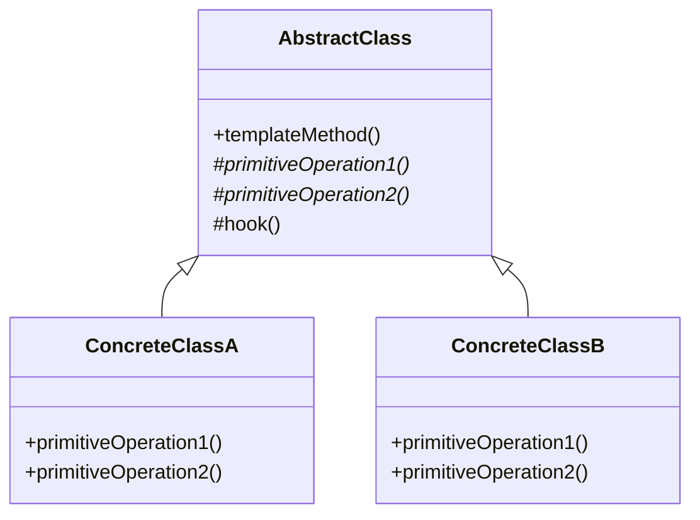

# Template Method Pattern

> "Define the skeleton of an algorithm in an operation, deferring some steps to subclasses. Template Method lets subclasses redefine certain steps of an algorithm without changing the algorithm's structure."

## Intent

- Define algorithm structure in base class
- Let subclasses implement specific steps
- Control extension points
- Avoid code duplication in similar algorithms

---

## Structure




---

## Implementation

### Basic Example

```python
from abc import ABC, abstractmethod

class DataProcessor(ABC):
    def process(self, data: str) -> str:
        """Template method - defines the algorithm"""
        # Step 1: Validate
        if not self.validate(data):
            raise ValueError("Validation failed")

        # Step 2: Transform (abstract)
        transformed = self.transform(data)

        # Step 3: Hook for optional processing
        transformed = self.post_process(transformed)

        # Step 4: Format output (abstract)
        result = self.format_output(transformed)

        return result

    @abstractmethod
    def validate(self, data: str) -> bool:
        """Abstract: must be implemented"""
        pass

    @abstractmethod
    def transform(self, data: str) -> str:
        """Abstract: must be implemented"""
        pass

    @abstractmethod
    def format_output(self, data: str) -> str:
        """Abstract: must be implemented"""
        pass

    def post_process(self, data: str) -> str:
        """Hook: optional override"""
        return data

class CSVProcessor(DataProcessor):
    def validate(self, data: str) -> bool:
        return "," in data

    def transform(self, data: str) -> str:
        # Parse CSV
        lines = data.strip().split("\n")
        return "\n".join(lines)

    def format_output(self, data: str) -> str:
        return f"CSV Output:\n{data}"

class JSONProcessor(DataProcessor):
    def validate(self, data: str) -> bool:
        return data.startswith("{") or data.startswith("[")

    def transform(self, data: str) -> str:
        # Parse JSON (simplified)
        return data.replace("{", "{\n  ").replace("}", "\n}")

    def format_output(self, data: str) -> str:
        return f"JSON Output:\n{data}"

    def post_process(self, data: str) -> str:
        # Override hook
        return data.lower()

# Usage
csv_data = "name,age\nJohn,30\nJane,25"
json_data = '{"name": "John", "age": 30}'

csv_processor = CSVProcessor()
json_processor = JSONProcessor()

print(csv_processor.process(csv_data))
print()
print(json_processor.process(json_data))
```

---

## Real-World Examples

### Example 1: Report Generator

```python
from abc import ABC, abstractmethod
from typing import List, Dict, Any
from dataclasses import dataclass
from datetime import datetime

@dataclass
class ReportData:
    title: str
    period: str
    data: List[Dict[str, Any]]
    generated_at: datetime = None

    def __post_init__(self):
        if self.generated_at is None:
            self.generated_at = datetime.now()

class ReportGenerator(ABC):
    """Template class for generating reports"""

    def generate(self, data: ReportData) -> str:
        """Template method - defines report generation algorithm"""
        # Step 1: Add header
        output = self.create_header(data)

        # Step 2: Add summary section (optional hook)
        summary = self.create_summary(data)
        if summary:
            output += summary

        # Step 3: Add main content
        output += self.create_body(data)

        # Step 4: Add charts/visualizations (optional hook)
        charts = self.create_charts(data)
        if charts:
            output += charts

        # Step 5: Add footer
        output += self.create_footer(data)

        # Step 6: Post-processing (optional hook)
        output = self.post_process(output)

        return output

    @abstractmethod
    def create_header(self, data: ReportData) -> str:
        """Abstract: Create report header"""
        pass

    @abstractmethod
    def create_body(self, data: ReportData) -> str:
        """Abstract: Create main report content"""
        pass

    @abstractmethod
    def create_footer(self, data: ReportData) -> str:
        """Abstract: Create report footer"""
        pass

    def create_summary(self, data: ReportData) -> str:
        """Hook: Optional summary section"""
        return ""

    def create_charts(self, data: ReportData) -> str:
        """Hook: Optional charts/visualizations"""
        return ""

    def post_process(self, output: str) -> str:
        """Hook: Optional post-processing"""
        return output

class TextReportGenerator(ReportGenerator):
    def create_header(self, data: ReportData) -> str:
        border = "=" * 50
        return f"""
{border}
{data.title.center(50)}
Period: {data.period}
Generated: {data.generated_at.strftime('%Y-%m-%d %H:%M')}
{border}
"""

    def create_body(self, data: ReportData) -> str:
        lines = ["\nDATA:\n", "-" * 50]
        for i, row in enumerate(data.data, 1):
            lines.append(f"{i}. {row}")
        lines.append("-" * 50)
        return "\n".join(lines) + "\n"

    def create_footer(self, data: ReportData) -> str:
        return f"\nTotal records: {len(data.data)}\n{'=' * 50}\n"

class HTMLReportGenerator(ReportGenerator):
    def create_header(self, data: ReportData) -> str:
        return f"""<!DOCTYPE html>
<html>
<head>
    <title>{data.title}</title>
    <style>
        body {{ font-family: Arial; margin: 20px; }}
        table {{ border-collapse: collapse; width: 100%; }}
        th, td {{ border: 1px solid #ddd; padding: 8px; text-align: left; }}
        th {{ background-color: #4CAF50; color: white; }}
        .summary {{ background-color: #f0f0f0; padding: 10px; margin: 10px 0; }}
    </style>
</head>
<body>
    <h1>{data.title}</h1>
    <p>Period: {data.period}</p>
    <p>Generated: {data.generated_at.strftime('%Y-%m-%d %H:%M')}</p>
"""

    def create_summary(self, data: ReportData) -> str:
        # Override hook to add summary
        total = sum(row.get('amount', 0) for row in data.data)
        return f"""
    <div class="summary">
        <strong>Summary:</strong>
        <ul>
            <li>Total Records: {len(data.data)}</li>
            <li>Total Amount: ${total:,.2f}</li>
        </ul>
    </div>
"""

    def create_body(self, data: ReportData) -> str:
        if not data.data:
            return "<p>No data available</p>"

        headers = data.data[0].keys()
        rows = ""
        for row in data.data:
            cells = "".join(f"<td>{row.get(h, '')}</td>" for h in headers)
            rows += f"<tr>{cells}</tr>\n"

        header_cells = "".join(f"<th>{h}</th>" for h in headers)
        return f"""
    <table>
        <thead><tr>{header_cells}</tr></thead>
        <tbody>{rows}</tbody>
    </table>
"""

    def create_footer(self, data: ReportData) -> str:
        return """
    <footer>
        <p><small>Report generated automatically</small></p>
    </footer>
</body>
</html>
"""

class PDFReportGenerator(ReportGenerator):
    """Simulated PDF generation"""

    def create_header(self, data: ReportData) -> str:
        return f"""[PDF HEADER]
Title: {data.title}
Period: {data.period}
Date: {data.generated_at}
---
"""

    def create_body(self, data: ReportData) -> str:
        content = "[PDF BODY]\n"
        for row in data.data:
            content += f"  • {row}\n"
        return content

    def create_footer(self, data: ReportData) -> str:
        return f"""---
[PDF FOOTER]
Page 1 of 1
Total: {len(data.data)} records
"""

    def create_charts(self, data: ReportData) -> str:
        # Override to add chart placeholder
        return "\n[CHART: Bar graph of amounts]\n"

    def post_process(self, output: str) -> str:
        # Add PDF metadata
        return f"[PDF v1.4]\n{output}\n[EOF]"

# Usage
report_data = ReportData(
    title="Sales Report",
    period="Q4 2024",
    data=[
        {"product": "Widget A", "units": 100, "amount": 2500},
        {"product": "Widget B", "units": 75, "amount": 1875},
        {"product": "Gadget X", "units": 50, "amount": 3000},
    ]
)

print("=== Text Report ===")
print(TextReportGenerator().generate(report_data))

print("\n=== HTML Report ===")
print(HTMLReportGenerator().generate(report_data))

print("\n=== PDF Report ===")
print(PDFReportGenerator().generate(report_data))
```

### Example 2: Game AI Framework

```python
from abc import ABC, abstractmethod
from typing import List, Tuple, Optional
from dataclasses import dataclass
from enum import Enum
import random

class Direction(Enum):
    UP = (0, -1)
    DOWN = (0, 1)
    LEFT = (-1, 0)
    RIGHT = (1, 0)

@dataclass
class Position:
    x: int
    y: int

    def move(self, direction: Direction) -> 'Position':
        dx, dy = direction.value
        return Position(self.x + dx, self.y + dy)

@dataclass
class GameState:
    player_pos: Position
    enemy_pos: Position
    player_health: int
    enemy_health: int
    obstacles: List[Position]
    bounds: Tuple[int, int]

class GameAI(ABC):
    """Template for game AI behavior"""

    def take_turn(self, state: GameState) -> Optional[Direction]:
        """Template method - AI decision making process"""

        # Step 1: Analyze situation
        analysis = self.analyze_situation(state)

        # Step 2: Check for danger
        if self.is_in_danger(state, analysis):
            action = self.defensive_action(state, analysis)
            if action:
                return action

        # Step 3: Look for opportunities
        if self.has_opportunity(state, analysis):
            action = self.offensive_action(state, analysis)
            if action:
                return action

        # Step 4: Default behavior
        return self.default_action(state, analysis)

    @abstractmethod
    def analyze_situation(self, state: GameState) -> dict:
        """Abstract: Analyze current game state"""
        pass

    @abstractmethod
    def is_in_danger(self, state: GameState, analysis: dict) -> bool:
        """Abstract: Determine if AI is in danger"""
        pass

    @abstractmethod
    def defensive_action(self, state: GameState,
                        analysis: dict) -> Optional[Direction]:
        """Abstract: Choose defensive action"""
        pass

    def has_opportunity(self, state: GameState, analysis: dict) -> bool:
        """Hook: Check for attack opportunity (default: always)"""
        return True

    def offensive_action(self, state: GameState,
                        analysis: dict) -> Optional[Direction]:
        """Hook: Choose offensive action"""
        return None

    def default_action(self, state: GameState,
                      analysis: dict) -> Optional[Direction]:
        """Hook: Default movement"""
        return random.choice(list(Direction))

class AggressiveAI(GameAI):
    """AI that prioritizes attacking"""

    def analyze_situation(self, state: GameState) -> dict:
        dx = state.player_pos.x - state.enemy_pos.x
        dy = state.player_pos.y - state.enemy_pos.y
        distance = abs(dx) + abs(dy)

        return {
            "distance": distance,
            "dx": dx,
            "dy": dy,
            "health_ratio": state.enemy_health / 100,
        }

    def is_in_danger(self, state: GameState, analysis: dict) -> bool:
        return analysis["health_ratio"] < 0.2  # Only retreat if critical

    def defensive_action(self, state: GameState,
                        analysis: dict) -> Optional[Direction]:
        # Run away from player
        dx, dy = analysis["dx"], analysis["dy"]
        if abs(dx) > abs(dy):
            return Direction.LEFT if dx > 0 else Direction.RIGHT
        else:
            return Direction.UP if dy > 0 else Direction.DOWN

    def has_opportunity(self, state: GameState, analysis: dict) -> bool:
        return analysis["distance"] <= 5

    def offensive_action(self, state: GameState,
                        analysis: dict) -> Optional[Direction]:
        # Move toward player
        dx, dy = analysis["dx"], analysis["dy"]
        if abs(dx) > abs(dy):
            return Direction.RIGHT if dx > 0 else Direction.LEFT
        else:
            return Direction.DOWN if dy > 0 else Direction.UP

class CautiousAI(GameAI):
    """AI that prioritizes survival"""

    def analyze_situation(self, state: GameState) -> dict:
        dx = state.player_pos.x - state.enemy_pos.x
        dy = state.player_pos.y - state.enemy_pos.y
        distance = abs(dx) + abs(dy)

        return {
            "distance": distance,
            "dx": dx,
            "dy": dy,
            "health_ratio": state.enemy_health / 100,
            "player_health_ratio": state.player_health / 100,
        }

    def is_in_danger(self, state: GameState, analysis: dict) -> bool:
        # More cautious - retreat if hurt or player is close
        return (analysis["health_ratio"] < 0.5 or
                (analysis["distance"] <= 2 and analysis["health_ratio"] < 0.8))

    def defensive_action(self, state: GameState,
                        analysis: dict) -> Optional[Direction]:
        # Run away from player
        dx, dy = analysis["dx"], analysis["dy"]
        if abs(dx) > abs(dy):
            return Direction.LEFT if dx > 0 else Direction.RIGHT
        else:
            return Direction.UP if dy > 0 else Direction.DOWN

    def has_opportunity(self, state: GameState, analysis: dict) -> bool:
        # Only attack if we have advantage
        return (analysis["distance"] <= 3 and
                analysis["health_ratio"] > analysis["player_health_ratio"])

    def offensive_action(self, state: GameState,
                        analysis: dict) -> Optional[Direction]:
        dx, dy = analysis["dx"], analysis["dy"]
        if abs(dx) > abs(dy):
            return Direction.RIGHT if dx > 0 else Direction.LEFT
        else:
            return Direction.DOWN if dy > 0 else Direction.UP

    def default_action(self, state: GameState,
                      analysis: dict) -> Optional[Direction]:
        # Maintain distance
        if analysis["distance"] < 4:
            return self.defensive_action(state, analysis)
        return random.choice(list(Direction))

class PatrolAI(GameAI):
    """AI that patrols an area"""

    def __init__(self, patrol_points: List[Position]):
        self.patrol_points = patrol_points
        self.current_target = 0

    def analyze_situation(self, state: GameState) -> dict:
        target = self.patrol_points[self.current_target]
        dx = target.x - state.enemy_pos.x
        dy = target.y - state.enemy_pos.y
        distance_to_target = abs(dx) + abs(dy)

        player_dx = state.player_pos.x - state.enemy_pos.x
        player_dy = state.player_pos.y - state.enemy_pos.y
        player_distance = abs(player_dx) + abs(player_dy)

        return {
            "target": target,
            "dx": dx,
            "dy": dy,
            "distance_to_target": distance_to_target,
            "player_distance": player_distance,
            "player_dx": player_dx,
            "player_dy": player_dy,
        }

    def is_in_danger(self, state: GameState, analysis: dict) -> bool:
        return analysis["player_distance"] <= 2

    def defensive_action(self, state: GameState,
                        analysis: dict) -> Optional[Direction]:
        # Move away from player
        dx, dy = analysis["player_dx"], analysis["player_dy"]
        if abs(dx) > abs(dy):
            return Direction.LEFT if dx > 0 else Direction.RIGHT
        else:
            return Direction.UP if dy > 0 else Direction.DOWN

    def has_opportunity(self, state: GameState, analysis: dict) -> bool:
        return False  # Patrol AI doesn't attack

    def default_action(self, state: GameState,
                      analysis: dict) -> Optional[Direction]:
        # Move toward patrol point
        if analysis["distance_to_target"] <= 1:
            self.current_target = (self.current_target + 1) % len(self.patrol_points)
            return None

        dx, dy = analysis["dx"], analysis["dy"]
        if abs(dx) > abs(dy):
            return Direction.RIGHT if dx > 0 else Direction.LEFT
        else:
            return Direction.DOWN if dy > 0 else Direction.UP

# Usage
state = GameState(
    player_pos=Position(5, 5),
    enemy_pos=Position(10, 10),
    player_health=80,
    enemy_health=60,
    obstacles=[],
    bounds=(20, 20)
)

print("=== Game AI Demo ===\n")

aggressive = AggressiveAI()
cautious = CautiousAI()
patrol = PatrolAI([Position(0, 0), Position(15, 0), Position(15, 15), Position(0, 15)])

print(f"State: Player at {state.player_pos}, Enemy at {state.enemy_pos}")
print(f"Health: Player {state.player_health}, Enemy {state.enemy_health}")

print(f"\nAggressive AI moves: {aggressive.take_turn(state)}")
print(f"Cautious AI moves: {cautious.take_turn(state)}")
print(f"Patrol AI moves: {patrol.take_turn(state)}")
```

### Example 3: Build System

```python
from abc import ABC, abstractmethod
from typing import List, Optional
from dataclasses import dataclass, field
from datetime import datetime
from enum import Enum

class BuildStatus(Enum):
    PENDING = "pending"
    RUNNING = "running"
    SUCCESS = "success"
    FAILED = "failed"

@dataclass
class BuildResult:
    status: BuildStatus
    start_time: datetime
    end_time: Optional[datetime] = None
    logs: List[str] = field(default_factory=list)
    artifacts: List[str] = field(default_factory=list)
    error: Optional[str] = None

    def log(self, message: str) -> None:
        self.logs.append(f"[{datetime.now().strftime('%H:%M:%S')}] {message}")

class BuildPipeline(ABC):
    """Template for build pipelines"""

    def build(self, project_path: str) -> BuildResult:
        """Template method - defines build pipeline"""
        result = BuildResult(
            status=BuildStatus.RUNNING,
            start_time=datetime.now()
        )

        try:
            # Step 1: Setup
            result.log("Starting build pipeline...")
            self.setup(project_path, result)

            # Step 2: Install dependencies
            result.log("Installing dependencies...")
            self.install_dependencies(project_path, result)

            # Step 3: Compile/Build
            result.log("Building project...")
            self.compile(project_path, result)

            # Step 4: Run tests (optional hook)
            if self.should_run_tests():
                result.log("Running tests...")
                self.run_tests(project_path, result)

            # Step 5: Package
            result.log("Packaging artifacts...")
            self.package(project_path, result)

            # Step 6: Deploy (optional hook)
            if self.should_deploy():
                result.log("Deploying...")
                self.deploy(project_path, result)

            # Step 7: Cleanup
            result.log("Cleaning up...")
            self.cleanup(project_path, result)

            result.status = BuildStatus.SUCCESS
            result.log("Build completed successfully!")

        except Exception as e:
            result.status = BuildStatus.FAILED
            result.error = str(e)
            result.log(f"Build failed: {e}")

        finally:
            result.end_time = datetime.now()

        return result

    @abstractmethod
    def setup(self, path: str, result: BuildResult) -> None:
        """Abstract: Setup build environment"""
        pass

    @abstractmethod
    def install_dependencies(self, path: str, result: BuildResult) -> None:
        """Abstract: Install project dependencies"""
        pass

    @abstractmethod
    def compile(self, path: str, result: BuildResult) -> None:
        """Abstract: Compile/build the project"""
        pass

    @abstractmethod
    def package(self, path: str, result: BuildResult) -> None:
        """Abstract: Package build artifacts"""
        pass

    def should_run_tests(self) -> bool:
        """Hook: Whether to run tests (default: True)"""
        return True

    def run_tests(self, path: str, result: BuildResult) -> None:
        """Hook: Run tests (default: no-op)"""
        result.log("No tests configured")

    def should_deploy(self) -> bool:
        """Hook: Whether to deploy (default: False)"""
        return False

    def deploy(self, path: str, result: BuildResult) -> None:
        """Hook: Deploy artifacts (default: no-op)"""
        pass

    def cleanup(self, path: str, result: BuildResult) -> None:
        """Hook: Cleanup (default: no-op)"""
        pass

class PythonBuildPipeline(BuildPipeline):
    def __init__(self, python_version: str = "3.11"):
        self.python_version = python_version

    def setup(self, path: str, result: BuildResult) -> None:
        result.log(f"Setting up Python {self.python_version} environment")
        result.log("Creating virtual environment...")

    def install_dependencies(self, path: str, result: BuildResult) -> None:
        result.log("pip install -r requirements.txt")
        result.log("Installing dev dependencies...")

    def compile(self, path: str, result: BuildResult) -> None:
        result.log("Running type checking with mypy...")
        result.log("Compiling Python bytecode...")

    def run_tests(self, path: str, result: BuildResult) -> None:
        result.log("pytest --cov=src tests/")
        result.log("Tests passed: 42/42")

    def package(self, path: str, result: BuildResult) -> None:
        result.log("python -m build")
        result.artifacts.append("dist/mypackage-1.0.0.tar.gz")
        result.artifacts.append("dist/mypackage-1.0.0-py3-none-any.whl")

    def cleanup(self, path: str, result: BuildResult) -> None:
        result.log("Removing __pycache__ directories")
        result.log("Removing .pytest_cache")

class JavaBuildPipeline(BuildPipeline):
    def __init__(self, java_version: str = "17"):
        self.java_version = java_version

    def setup(self, path: str, result: BuildResult) -> None:
        result.log(f"Setting up Java {self.java_version}")
        result.log("Configuring Maven...")

    def install_dependencies(self, path: str, result: BuildResult) -> None:
        result.log("mvn dependency:resolve")
        result.log("Downloaded 47 dependencies")

    def compile(self, path: str, result: BuildResult) -> None:
        result.log("mvn compile")
        result.log("Compiled 128 classes")

    def run_tests(self, path: str, result: BuildResult) -> None:
        result.log("mvn test")
        result.log("Tests run: 86, Failures: 0, Errors: 0")

    def package(self, path: str, result: BuildResult) -> None:
        result.log("mvn package -DskipTests")
        result.artifacts.append("target/myapp-1.0.0.jar")

    def should_deploy(self) -> bool:
        return True

    def deploy(self, path: str, result: BuildResult) -> None:
        result.log("Deploying to Maven Central...")
        result.log("Deployment complete")

class DockerBuildPipeline(BuildPipeline):
    def __init__(self, registry: str = "docker.io"):
        self.registry = registry

    def setup(self, path: str, result: BuildResult) -> None:
        result.log("Checking Docker daemon...")
        result.log("Logging into registry...")

    def install_dependencies(self, path: str, result: BuildResult) -> None:
        result.log("Pulling base images...")

    def compile(self, path: str, result: BuildResult) -> None:
        result.log("docker build -t myapp:latest .")
        result.log("Building layer 1/5...")
        result.log("Building layer 2/5...")
        result.log("Building layer 3/5...")
        result.log("Building layer 4/5...")
        result.log("Building layer 5/5...")

    def should_run_tests(self) -> bool:
        return False  # Tests run inside container

    def package(self, path: str, result: BuildResult) -> None:
        result.log("docker tag myapp:latest registry/myapp:latest")
        result.artifacts.append("registry/myapp:latest")

    def should_deploy(self) -> bool:
        return True

    def deploy(self, path: str, result: BuildResult) -> None:
        result.log(f"docker push {self.registry}/myapp:latest")
        result.log("Image pushed to registry")

# Usage
print("=== Build Pipeline Demo ===\n")

print("--- Python Build ---")
python_result = PythonBuildPipeline("3.11").build("/project/python")
print(f"Status: {python_result.status.value}")
print(f"Artifacts: {python_result.artifacts}")

print("\n--- Java Build ---")
java_result = JavaBuildPipeline("17").build("/project/java")
print(f"Status: {java_result.status.value}")
print(f"Artifacts: {java_result.artifacts}")

print("\n--- Docker Build ---")
docker_result = DockerBuildPipeline("gcr.io").build("/project/docker")
print(f"Status: {docker_result.status.value}")
print(f"Artifacts: {docker_result.artifacts}")
```

---

## Hooks vs Abstract Methods

| Type | Required | Purpose |
|------|----------|---------|
| **Abstract Method** | Yes | Must be implemented by subclass |
| **Hook** | No | Optional extension point |

```python
class Algorithm(ABC):
    def run(self):
        self.required_step()  # Must override
        self.optional_hook()  # Can override

    @abstractmethod
    def required_step(self):
        pass

    def optional_hook(self):
        pass  # Default implementation
```

---

## When to Use

✅ **Use when:**
- Algorithm structure is fixed but steps vary
- Want to control extension points
- Multiple classes have similar algorithms
- Need to enforce an algorithm structure

❌ **Don't use when:**
- Algorithm varies completely between classes
- Simple cases where inheritance adds overhead
- Need runtime algorithm selection (use Strategy)

---

## Related Topics

- [[01_strategy|Strategy Pattern]] - Runtime algorithm selection
- [[../Creational/02_factory|Factory Method]] - Template for object creation
- [[05_chain_of_responsibility|Chain of Responsibility]] - Alternative to hooks

---

**Tags**: #design-patterns #behavioral #template-method #inheritance #algorithm
