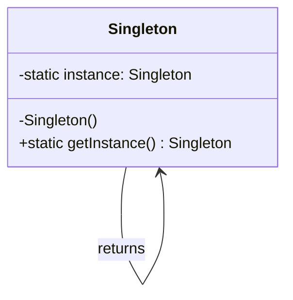

# Singleton Pattern

> Ensure a class has only one instance and provide a global point of access to it.

## Visualization




---

## When to Use

- Configuration management
- Logging
- Database connection pools
- Caches
- Thread pools

---

## Implementation

### Python

```python
class Singleton:
    _instance = None

    def __new__(cls):
        if cls._instance is None:
            cls._instance = super().__new__(cls)
        return cls._instance


# Usage
s1 = Singleton()
s2 = Singleton()
print(s1 is s2)  # True


# Thread-safe version
import threading

class ThreadSafeSingleton:
    _instance = None
    _lock = threading.Lock()

    def __new__(cls):
        if cls._instance is None:
            with cls._lock:
                if cls._instance is None:
                    cls._instance = super().__new__(cls)
        return cls._instance
```

### Java

```java
// Eager initialization
public class Singleton {
    private static final Singleton INSTANCE = new Singleton();

    private Singleton() {}

    public static Singleton getInstance() {
        return INSTANCE;
    }
}

// Lazy initialization (thread-safe)
public class Singleton {
    private static volatile Singleton instance;

    private Singleton() {}

    public static Singleton getInstance() {
        if (instance == null) {
            synchronized (Singleton.class) {
                if (instance == null) {
                    instance = new Singleton();
                }
            }
        }
        return instance;
    }
}

// Best: Enum singleton
public enum Singleton {
    INSTANCE;

    public void doSomething() {
        // ...
    }
}
```

### JavaScript/TypeScript

```typescript
class Singleton {
    private static instance: Singleton;

    private constructor() {}

    public static getInstance(): Singleton {
        if (!Singleton.instance) {
            Singleton.instance = new Singleton();
        }
        return Singleton.instance;
    }
}

// Usage
const s1 = Singleton.getInstance();
const s2 = Singleton.getInstance();
console.log(s1 === s2);  // true
```

---

## Real-World Example: Logger

```python
class Logger:
    _instance = None

    def __new__(cls):
        if cls._instance is None:
            cls._instance = super().__new__(cls)
            cls._instance._log_file = open("app.log", "a")
        return cls._instance

    def log(self, message: str):
        self._log_file.write(f"{datetime.now()}: {message}\n")
        self._log_file.flush()


# Usage throughout application
logger = Logger()
logger.log("Application started")

# Same instance used elsewhere
Logger().log("User logged in")
```

---

## Real-World Example: Configuration

```python
import json

class Config:
    _instance = None

    def __new__(cls):
        if cls._instance is None:
            cls._instance = super().__new__(cls)
            with open("config.json") as f:
                cls._instance._config = json.load(f)
        return cls._instance

    def get(self, key: str, default=None):
        return self._config.get(key, default)


# Usage
database_url = Config().get("database_url")
api_key = Config().get("api_key")
```

---

## Advantages

1. **Controlled access** to single instance
2. **Reduced memory** footprint
3. **Global access point** without global variables
4. **Lazy initialization** possible

---

## Disadvantages

1. **Violates SRP**: Controls instantiation AND provides functionality
2. **Hard to test**: Global state makes mocking difficult
3. **Hidden dependencies**: Classes silently depend on singleton
4. **Concurrency issues**: Thread safety adds complexity

---

## Better Alternative: Dependency Injection

```python
# Instead of Singleton
class OrderService:
    def process(self):
        Logger().log("Processing order")  # Hidden dependency

# Use Dependency Injection
class OrderService:
    def __init__(self, logger: Logger):
        self.logger = logger

    def process(self):
        self.logger.log("Processing order")

# Inject the same instance
logger = Logger()
order_service = OrderService(logger)
user_service = UserService(logger)
```

---

## Interview Tips

1. **Know thread-safety**: Double-checked locking pattern
2. **Discuss drawbacks**: Testing difficulty, hidden dependencies
3. **Suggest alternatives**: Dependency injection when appropriate
4. **Real examples**: Logger, Config, ConnectionPool
