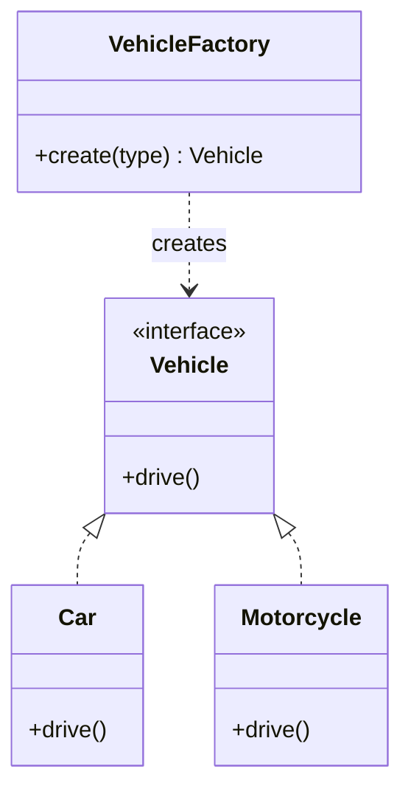

# Factory Pattern

> Define an interface for creating objects, but let subclasses decide which class to instantiate.

## Visualization




---

## When to Use

- Creating objects without specifying exact class
- Object creation logic is complex
- Need to decouple object creation from usage
- Multiple related types with common interface

---

## Simple Factory

```python
from abc import ABC, abstractmethod

# Product interface
class Vehicle(ABC):
    @abstractmethod
    def drive(self): pass

# Concrete products
class Car(Vehicle):
    def drive(self):
        return "Driving a car"

class Motorcycle(Vehicle):
    def drive(self):
        return "Riding a motorcycle"

class Truck(Vehicle):
    def drive(self):
        return "Driving a truck"

# Simple Factory
class VehicleFactory:
    @staticmethod
    def create(vehicle_type: str) -> Vehicle:
        if vehicle_type == "car":
            return Car()
        elif vehicle_type == "motorcycle":
            return Motorcycle()
        elif vehicle_type == "truck":
            return Truck()
        else:
            raise ValueError(f"Unknown vehicle type: {vehicle_type}")


# Usage
vehicle = VehicleFactory.create("car")
print(vehicle.drive())  # "Driving a car"
```

---

## Factory Method Pattern

```python
from abc import ABC, abstractmethod

# Product interface
class Document(ABC):
    @abstractmethod
    def render(self): pass

class PDFDocument(Document):
    def render(self):
        return "Rendering PDF"

class WordDocument(Document):
    def render(self):
        return "Rendering Word document"

# Creator with factory method
class DocumentCreator(ABC):
    @abstractmethod
    def create_document(self) -> Document:
        """Factory method"""
        pass

    def process(self):
        document = self.create_document()
        return document.render()

# Concrete creators
class PDFCreator(DocumentCreator):
    def create_document(self) -> Document:
        return PDFDocument()

class WordCreator(DocumentCreator):
    def create_document(self) -> Document:
        return WordDocument()


# Usage
creator = PDFCreator()
print(creator.process())  # "Rendering PDF"
```

---

## Java Implementation

```java
// Product interface
interface Vehicle {
    void drive();
}

// Concrete products
class Car implements Vehicle {
    @Override
    public void drive() {
        System.out.println("Driving a car");
    }
}

class Motorcycle implements Vehicle {
    @Override
    public void drive() {
        System.out.println("Riding a motorcycle");
    }
}

// Factory
class VehicleFactory {
    public static Vehicle create(String type) {
        switch (type.toLowerCase()) {
            case "car": return new Car();
            case "motorcycle": return new Motorcycle();
            default: throw new IllegalArgumentException("Unknown type: " + type);
        }
    }
}

// Usage
Vehicle vehicle = VehicleFactory.create("car");
vehicle.drive();
```

---

## Real-World Example: Notification Factory

```python
from abc import ABC, abstractmethod

class Notification(ABC):
    @abstractmethod
    def send(self, message: str): pass

class EmailNotification(Notification):
    def __init__(self, email: str):
        self.email = email

    def send(self, message: str):
        print(f"Sending email to {self.email}: {message}")

class SMSNotification(Notification):
    def __init__(self, phone: str):
        self.phone = phone

    def send(self, message: str):
        print(f"Sending SMS to {self.phone}: {message}")

class PushNotification(Notification):
    def __init__(self, device_token: str):
        self.device_token = device_token

    def send(self, message: str):
        print(f"Sending push to {self.device_token}: {message}")


class NotificationFactory:
    @staticmethod
    def create(channel: str, target: str) -> Notification:
        if channel == "email":
            return EmailNotification(target)
        elif channel == "sms":
            return SMSNotification(target)
        elif channel == "push":
            return PushNotification(target)
        else:
            raise ValueError(f"Unknown channel: {channel}")


# Usage
notification = NotificationFactory.create("email", "user@example.com")
notification.send("Hello!")
```

---

## Real-World Example: Database Connection

```python
class DatabaseConnection(ABC):
    @abstractmethod
    def connect(self): pass

    @abstractmethod
    def execute(self, query: str): pass

class PostgreSQLConnection(DatabaseConnection):
    def connect(self):
        return "Connected to PostgreSQL"

    def execute(self, query: str):
        return f"PostgreSQL executing: {query}"

class MySQLConnection(DatabaseConnection):
    def connect(self):
        return "Connected to MySQL"

    def execute(self, query: str):
        return f"MySQL executing: {query}"


class DatabaseFactory:
    @staticmethod
    def create(db_type: str, connection_string: str) -> DatabaseConnection:
        if db_type == "postgresql":
            return PostgreSQLConnection()
        elif db_type == "mysql":
            return MySQLConnection()
        else:
            raise ValueError(f"Unsupported database: {db_type}")


# Usage based on config
db = DatabaseFactory.create("postgresql", "localhost:5432")
db.connect()
```

---

## Advantages

1. **Decouples** creation from usage
2. **Single Responsibility**: Creation logic in one place
3. **Open/Closed**: Add new types without modifying client
4. **Flexible**: Easy to swap implementations

---

## Disadvantages

1. **More classes**: Factory adds complexity
2. **Can be overkill**: For simple object creation

---

## When to Use Factory vs Constructor

| Use Constructor | Use Factory |
|-----------------|-------------|
| Simple object creation | Complex creation logic |
| One class type | Multiple related types |
| No creation flexibility needed | Need to swap implementations |
| Obvious dependencies | Hidden dependencies |

---

## Interview Tips

1. **Draw class diagram** showing relationships
2. **Explain Open/Closed** principle benefit
3. **Real examples**: Document types, payment methods, notifications
4. **Compare**: Simple Factory vs Factory Method vs Abstract Factory
