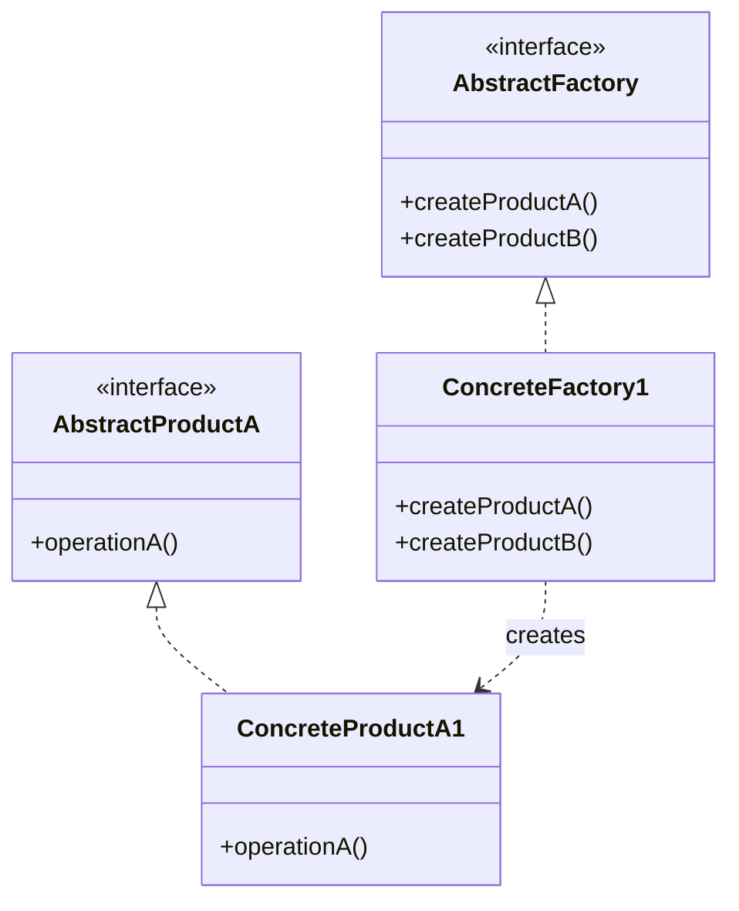

# Abstract Factory Pattern

> "Provide an interface for creating families of related objects without specifying their concrete classes."

## Intent

- Create families of related objects
- Ensure products from one family are used together
- Hide concrete classes from clients

---

## Structure




---

## Implementation

### Example: UI Component Factory

```python
from abc import ABC, abstractmethod

# Abstract Products
class Button(ABC):
    @abstractmethod
    def render(self) -> str:
        pass

    @abstractmethod
    def on_click(self, handler) -> None:
        pass

class Checkbox(ABC):
    @abstractmethod
    def render(self) -> str:
        pass

    @abstractmethod
    def on_check(self, handler) -> None:
        pass

class TextField(ABC):
    @abstractmethod
    def render(self) -> str:
        pass

    @abstractmethod
    def get_value(self) -> str:
        pass

# Concrete Products - Material Design
class MaterialButton(Button):
    def render(self) -> str:
        return "<button class='material-btn'>Click me</button>"

    def on_click(self, handler) -> None:
        print("Material button clicked")

class MaterialCheckbox(Checkbox):
    def render(self) -> str:
        return "<input type='checkbox' class='material-checkbox'/>"

    def on_check(self, handler) -> None:
        print("Material checkbox checked")

class MaterialTextField(TextField):
    def __init__(self):
        self.value = ""

    def render(self) -> str:
        return "<input type='text' class='material-input'/>"

    def get_value(self) -> str:
        return self.value

# Concrete Products - iOS Style
class IOSButton(Button):
    def render(self) -> str:
        return "<button class='ios-btn'>Tap me</button>"

    def on_click(self, handler) -> None:
        print("iOS button tapped")

class IOSCheckbox(Checkbox):
    def render(self) -> str:
        return "<input type='checkbox' class='ios-switch'/>"

    def on_check(self, handler) -> None:
        print("iOS switch toggled")

class IOSTextField(TextField):
    def __init__(self):
        self.value = ""

    def render(self) -> str:
        return "<input type='text' class='ios-input'/>"

    def get_value(self) -> str:
        return self.value

# Abstract Factory
class UIFactory(ABC):
    @abstractmethod
    def create_button(self) -> Button:
        pass

    @abstractmethod
    def create_checkbox(self) -> Checkbox:
        pass

    @abstractmethod
    def create_textfield(self) -> TextField:
        pass

# Concrete Factories
class MaterialUIFactory(UIFactory):
    def create_button(self) -> Button:
        return MaterialButton()

    def create_checkbox(self) -> Checkbox:
        return MaterialCheckbox()

    def create_textfield(self) -> TextField:
        return MaterialTextField()

class IOSUIFactory(UIFactory):
    def create_button(self) -> Button:
        return IOSButton()

    def create_checkbox(self) -> Checkbox:
        return IOSCheckbox()

    def create_textfield(self) -> TextField:
        return IOSTextField()

# Client code
class Application:
    def __init__(self, factory: UIFactory):
        self.factory = factory
        self.button = None
        self.checkbox = None

    def create_ui(self):
        self.button = self.factory.create_button()
        self.checkbox = self.factory.create_checkbox()

    def render(self):
        print(self.button.render())
        print(self.checkbox.render())

# Usage
def get_factory(os_type: str) -> UIFactory:
    if os_type == "android":
        return MaterialUIFactory()
    elif os_type == "ios":
        return IOSUIFactory()
    raise ValueError(f"Unknown OS: {os_type}")

app = Application(get_factory("ios"))
app.create_ui()
app.render()
```

---

## Real-World Examples

### Example: Database Connection Factory

```python
from abc import ABC, abstractmethod

# Abstract Products
class Connection(ABC):
    @abstractmethod
    def connect(self) -> None:
        pass

    @abstractmethod
    def execute(self, query: str) -> list:
        pass

class Transaction(ABC):
    @abstractmethod
    def begin(self) -> None:
        pass

    @abstractmethod
    def commit(self) -> None:
        pass

    @abstractmethod
    def rollback(self) -> None:
        pass

# MySQL Products
class MySQLConnection(Connection):
    def connect(self) -> None:
        print("Connecting to MySQL")

    def execute(self, query: str) -> list:
        print(f"MySQL executing: {query}")
        return []

class MySQLTransaction(Transaction):
    def begin(self) -> None:
        print("MySQL: BEGIN TRANSACTION")

    def commit(self) -> None:
        print("MySQL: COMMIT")

    def rollback(self) -> None:
        print("MySQL: ROLLBACK")

# PostgreSQL Products
class PostgreSQLConnection(Connection):
    def connect(self) -> None:
        print("Connecting to PostgreSQL")

    def execute(self, query: str) -> list:
        print(f"PostgreSQL executing: {query}")
        return []

class PostgreSQLTransaction(Transaction):
    def begin(self) -> None:
        print("PostgreSQL: BEGIN")

    def commit(self) -> None:
        print("PostgreSQL: COMMIT")

    def rollback(self) -> None:
        print("PostgreSQL: ROLLBACK")

# Abstract Factory
class DatabaseFactory(ABC):
    @abstractmethod
    def create_connection(self) -> Connection:
        pass

    @abstractmethod
    def create_transaction(self) -> Transaction:
        pass

# Concrete Factories
class MySQLFactory(DatabaseFactory):
    def create_connection(self) -> Connection:
        return MySQLConnection()

    def create_transaction(self) -> Transaction:
        return MySQLTransaction()

class PostgreSQLFactory(DatabaseFactory):
    def create_connection(self) -> Connection:
        return PostgreSQLConnection()

    def create_transaction(self) -> Transaction:
        return PostgreSQLTransaction()

# Client
class Repository:
    def __init__(self, factory: DatabaseFactory):
        self.connection = factory.create_connection()
        self.transaction = factory.create_transaction()

    def save(self, data: dict):
        self.connection.connect()
        self.transaction.begin()
        try:
            self.connection.execute(f"INSERT INTO table VALUES ({data})")
            self.transaction.commit()
        except Exception:
            self.transaction.rollback()
```

### Example: Document Export Factory

```python
from abc import ABC, abstractmethod

# Abstract Products
class DocumentHeader(ABC):
    @abstractmethod
    def create(self, title: str) -> str:
        pass

class DocumentBody(ABC):
    @abstractmethod
    def create(self, content: str) -> str:
        pass

class DocumentFooter(ABC):
    @abstractmethod
    def create(self, page_number: int) -> str:
        pass

# HTML Products
class HTMLHeader(DocumentHeader):
    def create(self, title: str) -> str:
        return f"<head><title>{title}</title></head>"

class HTMLBody(DocumentBody):
    def create(self, content: str) -> str:
        return f"<body><p>{content}</p></body>"

class HTMLFooter(DocumentFooter):
    def create(self, page_number: int) -> str:
        return f"<footer>Page {page_number}</footer>"

# PDF Products
class PDFHeader(DocumentHeader):
    def create(self, title: str) -> str:
        return f"PDF_HEADER[{title}]"

class PDFBody(DocumentBody):
    def create(self, content: str) -> str:
        return f"PDF_BODY[{content}]"

class PDFFooter(DocumentFooter):
    def create(self, page_number: int) -> str:
        return f"PDF_FOOTER[Page {page_number}]"

# Abstract Factory
class DocumentFactory(ABC):
    @abstractmethod
    def create_header(self) -> DocumentHeader:
        pass

    @abstractmethod
    def create_body(self) -> DocumentBody:
        pass

    @abstractmethod
    def create_footer(self) -> DocumentFooter:
        pass

# Concrete Factories
class HTMLDocumentFactory(DocumentFactory):
    def create_header(self) -> DocumentHeader:
        return HTMLHeader()

    def create_body(self) -> DocumentBody:
        return HTMLBody()

    def create_footer(self) -> DocumentFooter:
        return HTMLFooter()

class PDFDocumentFactory(DocumentFactory):
    def create_header(self) -> DocumentHeader:
        return PDFHeader()

    def create_body(self) -> DocumentBody:
        return PDFBody()

    def create_footer(self) -> DocumentFooter:
        return PDFFooter()

# Document Builder using factory
class DocumentBuilder:
    def __init__(self, factory: DocumentFactory):
        self.factory = factory

    def build(self, title: str, content: str) -> str:
        header = self.factory.create_header().create(title)
        body = self.factory.create_body().create(content)
        footer = self.factory.create_footer().create(1)
        return f"{header}\n{body}\n{footer}"
```

---

## Abstract Factory vs Factory Method

| Aspect | Factory Method | Abstract Factory |
|--------|---------------|------------------|
| **Creates** | One product | Family of products |
| **Inheritance** | Uses inheritance | Uses composition |
| **Flexibility** | Single product variation | Multiple product variations |
| **Complexity** | Simpler | More complex |

---

## When to Use

✅ **Use when:**
- System needs to be independent of product creation
- Products come in families that must be used together
- You want to enforce using related products together
- Configuration determines which product family to use

❌ **Don't use when:**
- Only one type of product is needed
- Products don't form families
- Simpler Factory Method suffices

---

## Related Topics

- [[02_factory|Factory Method Pattern]]
- [[04_builder|Builder Pattern]]
- [[../../SOLID_Principles/05_dependency_inversion|Dependency Inversion Principle]]

---

**Tags**: #design-patterns #creational #abstract-factory #oop
