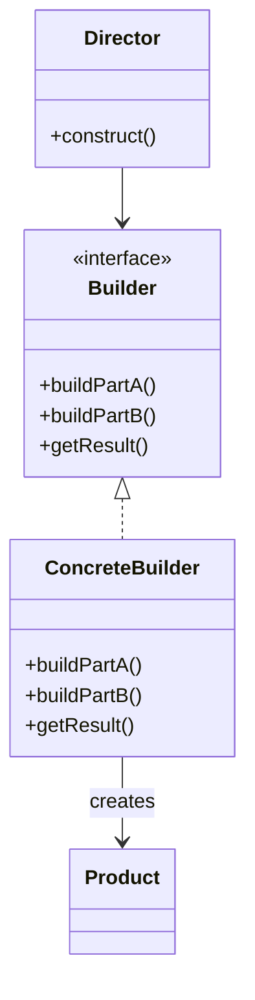
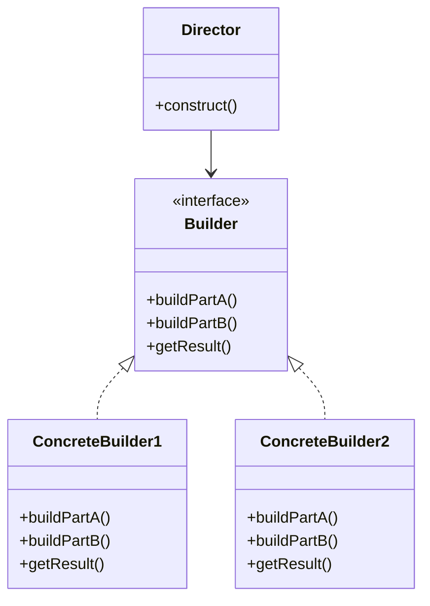

# Builder Pattern

> "Separate the construction of a complex object from its representation, allowing the same construction process to create various representations."

## Visualization



## Intent

- Construct complex objects step by step
- Same construction process can create different representations
- Isolate construction code from business logic

---

## Structure




---

## Implementation

### Example: Building Complex Objects

```python
from abc import ABC, abstractmethod
from dataclasses import dataclass, field
from typing import Optional

@dataclass
class Computer:
    cpu: str = ""
    ram: int = 0
    storage: int = 0
    gpu: Optional[str] = None
    os: str = ""
    extras: list = field(default_factory=list)

    def __str__(self):
        specs = f"CPU: {self.cpu}, RAM: {self.ram}GB, Storage: {self.storage}GB"
        if self.gpu:
            specs += f", GPU: {self.gpu}"
        specs += f", OS: {self.os}"
        if self.extras:
            specs += f", Extras: {', '.join(self.extras)}"
        return specs

# Builder Interface
class ComputerBuilder(ABC):
    @abstractmethod
    def set_cpu(self, cpu: str) -> 'ComputerBuilder':
        pass

    @abstractmethod
    def set_ram(self, ram: int) -> 'ComputerBuilder':
        pass

    @abstractmethod
    def set_storage(self, storage: int) -> 'ComputerBuilder':
        pass

    @abstractmethod
    def set_gpu(self, gpu: str) -> 'ComputerBuilder':
        pass

    @abstractmethod
    def set_os(self, os: str) -> 'ComputerBuilder':
        pass

    @abstractmethod
    def add_extra(self, extra: str) -> 'ComputerBuilder':
        pass

    @abstractmethod
    def build(self) -> Computer:
        pass

# Concrete Builder
class PCBuilder(ComputerBuilder):
    def __init__(self):
        self.reset()

    def reset(self):
        self._computer = Computer()

    def set_cpu(self, cpu: str) -> 'PCBuilder':
        self._computer.cpu = cpu
        return self

    def set_ram(self, ram: int) -> 'PCBuilder':
        self._computer.ram = ram
        return self

    def set_storage(self, storage: int) -> 'PCBuilder':
        self._computer.storage = storage
        return self

    def set_gpu(self, gpu: str) -> 'PCBuilder':
        self._computer.gpu = gpu
        return self

    def set_os(self, os: str) -> 'PCBuilder':
        self._computer.os = os
        return self

    def add_extra(self, extra: str) -> 'PCBuilder':
        self._computer.extras.append(extra)
        return self

    def build(self) -> Computer:
        computer = self._computer
        self.reset()
        return computer

# Director
class ComputerDirector:
    def __init__(self, builder: ComputerBuilder):
        self._builder = builder

    def build_gaming_pc(self) -> Computer:
        return (self._builder
                .set_cpu("Intel i9-13900K")
                .set_ram(64)
                .set_storage(2000)
                .set_gpu("NVIDIA RTX 4090")
                .set_os("Windows 11")
                .add_extra("RGB Lighting")
                .add_extra("Liquid Cooling")
                .build())

    def build_office_pc(self) -> Computer:
        return (self._builder
                .set_cpu("Intel i5-13400")
                .set_ram(16)
                .set_storage(512)
                .set_os("Windows 11")
                .build())

    def build_workstation(self) -> Computer:
        return (self._builder
                .set_cpu("AMD Threadripper 7980X")
                .set_ram(256)
                .set_storage(4000)
                .set_gpu("NVIDIA RTX 4000 Ada")
                .set_os("Ubuntu 22.04")
                .add_extra("ECC Memory")
                .build())

# Usage
builder = PCBuilder()
director = ComputerDirector(builder)

gaming_pc = director.build_gaming_pc()
print(f"Gaming PC: {gaming_pc}")

office_pc = director.build_office_pc()
print(f"Office PC: {office_pc}")

# Direct usage without director
custom_pc = (PCBuilder()
             .set_cpu("AMD Ryzen 7")
             .set_ram(32)
             .set_storage(1000)
             .set_os("Arch Linux")
             .build())
print(f"Custom PC: {custom_pc}")
```

---

## Fluent Builder Pattern

```python
from dataclasses import dataclass
from typing import Optional, List

@dataclass
class HttpRequest:
    method: str
    url: str
    headers: dict
    body: Optional[str]
    timeout: int
    retries: int

class HttpRequestBuilder:
    def __init__(self):
        self._method = "GET"
        self._url = ""
        self._headers = {}
        self._body = None
        self._timeout = 30
        self._retries = 3

    def method(self, method: str) -> 'HttpRequestBuilder':
        self._method = method
        return self

    def url(self, url: str) -> 'HttpRequestBuilder':
        self._url = url
        return self

    def header(self, key: str, value: str) -> 'HttpRequestBuilder':
        self._headers[key] = value
        return self

    def headers(self, headers: dict) -> 'HttpRequestBuilder':
        self._headers.update(headers)
        return self

    def body(self, body: str) -> 'HttpRequestBuilder':
        self._body = body
        return self

    def json(self, data: dict) -> 'HttpRequestBuilder':
        import json
        self._body = json.dumps(data)
        self._headers["Content-Type"] = "application/json"
        return self

    def timeout(self, seconds: int) -> 'HttpRequestBuilder':
        self._timeout = seconds
        return self

    def retries(self, count: int) -> 'HttpRequestBuilder':
        self._retries = count
        return self

    def build(self) -> HttpRequest:
        if not self._url:
            raise ValueError("URL is required")
        return HttpRequest(
            method=self._method,
            url=self._url,
            headers=self._headers,
            body=self._body,
            timeout=self._timeout,
            retries=self._retries
        )

# Fluent usage
request = (HttpRequestBuilder()
           .method("POST")
           .url("https://api.example.com/users")
           .header("Authorization", "Bearer token123")
           .json({"name": "John", "email": "john@example.com"})
           .timeout(60)
           .retries(5)
           .build())

print(f"Request: {request.method} {request.url}")
```

---

## Real-World Examples

### Example: SQL Query Builder

```python
class SQLQueryBuilder:
    def __init__(self):
        self._select = []
        self._from = ""
        self._joins = []
        self._where = []
        self._group_by = []
        self._having = []
        self._order_by = []
        self._limit = None
        self._offset = None

    def select(self, *columns: str) -> 'SQLQueryBuilder':
        self._select.extend(columns)
        return self

    def from_table(self, table: str) -> 'SQLQueryBuilder':
        self._from = table
        return self

    def join(self, table: str, on: str) -> 'SQLQueryBuilder':
        self._joins.append(f"JOIN {table} ON {on}")
        return self

    def left_join(self, table: str, on: str) -> 'SQLQueryBuilder':
        self._joins.append(f"LEFT JOIN {table} ON {on}")
        return self

    def where(self, condition: str) -> 'SQLQueryBuilder':
        self._where.append(condition)
        return self

    def and_where(self, condition: str) -> 'SQLQueryBuilder':
        return self.where(condition)

    def group_by(self, *columns: str) -> 'SQLQueryBuilder':
        self._group_by.extend(columns)
        return self

    def having(self, condition: str) -> 'SQLQueryBuilder':
        self._having.append(condition)
        return self

    def order_by(self, column: str, direction: str = "ASC") -> 'SQLQueryBuilder':
        self._order_by.append(f"{column} {direction}")
        return self

    def limit(self, count: int) -> 'SQLQueryBuilder':
        self._limit = count
        return self

    def offset(self, count: int) -> 'SQLQueryBuilder':
        self._offset = count
        return self

    def build(self) -> str:
        if not self._select:
            self._select = ["*"]
        if not self._from:
            raise ValueError("FROM clause is required")

        query = f"SELECT {', '.join(self._select)}"
        query += f" FROM {self._from}"

        if self._joins:
            query += " " + " ".join(self._joins)

        if self._where:
            query += " WHERE " + " AND ".join(self._where)

        if self._group_by:
            query += f" GROUP BY {', '.join(self._group_by)}"

        if self._having:
            query += " HAVING " + " AND ".join(self._having)

        if self._order_by:
            query += f" ORDER BY {', '.join(self._order_by)}"

        if self._limit:
            query += f" LIMIT {self._limit}"

        if self._offset:
            query += f" OFFSET {self._offset}"

        return query

# Usage
query = (SQLQueryBuilder()
         .select("u.id", "u.name", "COUNT(o.id) as order_count")
         .from_table("users u")
         .left_join("orders o", "u.id = o.user_id")
         .where("u.active = 1")
         .and_where("u.created_at > '2024-01-01'")
         .group_by("u.id", "u.name")
         .having("COUNT(o.id) > 5")
         .order_by("order_count", "DESC")
         .limit(10)
         .build())

print(query)
```

### Example: Email Builder

```python
from dataclasses import dataclass, field
from typing import List, Optional

@dataclass
class Email:
    sender: str
    recipients: List[str]
    cc: List[str]
    bcc: List[str]
    subject: str
    body: str
    html_body: Optional[str]
    attachments: List[str]
    priority: str

class EmailBuilder:
    def __init__(self):
        self._sender = ""
        self._recipients = []
        self._cc = []
        self._bcc = []
        self._subject = ""
        self._body = ""
        self._html_body = None
        self._attachments = []
        self._priority = "normal"

    def sender(self, email: str) -> 'EmailBuilder':
        self._sender = email
        return self

    def to(self, *emails: str) -> 'EmailBuilder':
        self._recipients.extend(emails)
        return self

    def cc(self, *emails: str) -> 'EmailBuilder':
        self._cc.extend(emails)
        return self

    def bcc(self, *emails: str) -> 'EmailBuilder':
        self._bcc.extend(emails)
        return self

    def subject(self, subject: str) -> 'EmailBuilder':
        self._subject = subject
        return self

    def body(self, body: str) -> 'EmailBuilder':
        self._body = body
        return self

    def html(self, html: str) -> 'EmailBuilder':
        self._html_body = html
        return self

    def attach(self, *files: str) -> 'EmailBuilder':
        self._attachments.extend(files)
        return self

    def high_priority(self) -> 'EmailBuilder':
        self._priority = "high"
        return self

    def low_priority(self) -> 'EmailBuilder':
        self._priority = "low"
        return self

    def build(self) -> Email:
        if not self._sender:
            raise ValueError("Sender is required")
        if not self._recipients:
            raise ValueError("At least one recipient is required")
        if not self._subject:
            raise ValueError("Subject is required")

        return Email(
            sender=self._sender,
            recipients=self._recipients,
            cc=self._cc,
            bcc=self._bcc,
            subject=self._subject,
            body=self._body,
            html_body=self._html_body,
            attachments=self._attachments,
            priority=self._priority
        )

# Usage
email = (EmailBuilder()
         .sender("sender@example.com")
         .to("user1@example.com", "user2@example.com")
         .cc("manager@example.com")
         .subject("Weekly Report")
         .body("Please find the weekly report attached.")
         .html("<h1>Weekly Report</h1><p>Please find the report attached.</p>")
         .attach("report.pdf", "data.xlsx")
         .high_priority()
         .build())
```

---

## Immutable Builder

```python
from dataclasses import dataclass

@dataclass(frozen=True)
class Configuration:
    host: str
    port: int
    timeout: int
    max_connections: int
    ssl_enabled: bool

class ConfigurationBuilder:
    def __init__(self):
        self._host = "localhost"
        self._port = 8080
        self._timeout = 30
        self._max_connections = 100
        self._ssl_enabled = False

    def host(self, host: str) -> 'ConfigurationBuilder':
        self._host = host
        return self

    def port(self, port: int) -> 'ConfigurationBuilder':
        self._port = port
        return self

    def timeout(self, timeout: int) -> 'ConfigurationBuilder':
        self._timeout = timeout
        return self

    def max_connections(self, max_conn: int) -> 'ConfigurationBuilder':
        self._max_connections = max_conn
        return self

    def ssl(self, enabled: bool = True) -> 'ConfigurationBuilder':
        self._ssl_enabled = enabled
        return self

    def build(self) -> Configuration:
        return Configuration(
            host=self._host,
            port=self._port,
            timeout=self._timeout,
            max_connections=self._max_connections,
            ssl_enabled=self._ssl_enabled
        )

# Results in immutable object
config = (ConfigurationBuilder()
          .host("production.example.com")
          .port(443)
          .ssl()
          .build())
```

---

## When to Use

✅ **Use when:**
- Object has many optional parameters
- Construction involves many steps
- Same construction process creates different representations
- You want to avoid "telescoping constructor" anti-pattern

❌ **Don't use when:**
- Object is simple with few parameters
- All parameters are required
- Immutability isn't a concern

---

## Related Topics

- [[02_factory|Factory Pattern]]
- [[03_abstract_factory|Abstract Factory Pattern]]
- [[05_prototype|Prototype Pattern]]

---

**Tags**: #design-patterns #creational #builder #fluent-interface
