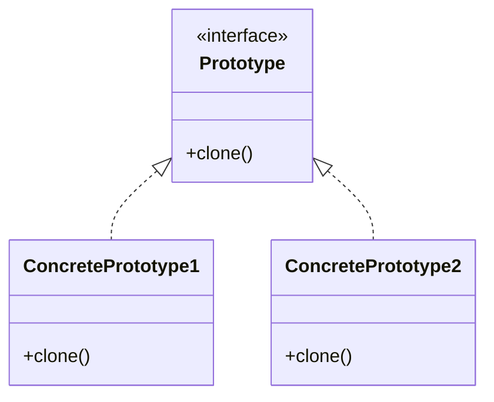

# Prototype Pattern

> "Specify the kinds of objects to create using a prototypical instance, and create new objects by copying this prototype."

## Intent

- Clone existing objects instead of creating new ones
- Avoid expensive object creation costs
- Create objects without knowing their concrete classes

---

## Structure




---

## Implementation

### Basic Implementation

```python
from abc import ABC, abstractmethod
from copy import deepcopy

class Prototype(ABC):
    @abstractmethod
    def clone(self) -> 'Prototype':
        pass

class ConcretePrototype(Prototype):
    def __init__(self, name: str, data: list):
        self.name = name
        self.data = data

    def clone(self) -> 'ConcretePrototype':
        # Deep copy to avoid shared references
        return deepcopy(self)

    def __str__(self):
        return f"Prototype(name={self.name}, data={self.data})"

# Usage
original = ConcretePrototype("Original", [1, 2, 3])
clone = original.clone()
clone.name = "Clone"
clone.data.append(4)

print(original)  # Prototype(name=Original, data=[1, 2, 3])
print(clone)     # Prototype(name=Clone, data=[1, 2, 3, 4])
```

---

## Python's Copy Protocol

```python
from copy import copy, deepcopy

class Document:
    def __init__(self, title: str, content: str, metadata: dict):
        self.title = title
        self.content = content
        self.metadata = metadata
        self.revision = 0

    def __copy__(self):
        """Shallow copy - shares nested objects"""
        cls = self.__class__
        result = cls.__new__(cls)
        result.__dict__.update(self.__dict__)
        return result

    def __deepcopy__(self, memo):
        """Deep copy - independent nested objects"""
        cls = self.__class__
        result = cls.__new__(cls)
        memo[id(self)] = result
        for key, value in self.__dict__.items():
            setattr(result, key, deepcopy(value, memo))
        return result

# Usage
original = Document(
    "Report",
    "Content here",
    {"author": "John", "tags": ["important", "review"]}
)

# Shallow copy - metadata dict is shared
shallow = copy(original)
shallow.metadata["author"] = "Jane"  # Affects original!

# Deep copy - completely independent
deep = deepcopy(original)
deep.metadata["author"] = "Bob"  # Does not affect original
```

---

## Prototype Registry

```python
from copy import deepcopy
from typing import Dict

class ShapePrototype:
    def clone(self) -> 'ShapePrototype':
        return deepcopy(self)

class Circle(ShapePrototype):
    def __init__(self, radius: float, color: str):
        self.radius = radius
        self.color = color

    def __str__(self):
        return f"Circle(radius={self.radius}, color={self.color})"

class Rectangle(ShapePrototype):
    def __init__(self, width: float, height: float, color: str):
        self.width = width
        self.height = height
        self.color = color

    def __str__(self):
        return f"Rectangle({self.width}x{self.height}, color={self.color})"

class ShapeRegistry:
    def __init__(self):
        self._shapes: Dict[str, ShapePrototype] = {}

    def register(self, name: str, shape: ShapePrototype) -> None:
        self._shapes[name] = shape

    def unregister(self, name: str) -> None:
        del self._shapes[name]

    def clone(self, name: str) -> ShapePrototype:
        if name not in self._shapes:
            raise KeyError(f"Prototype '{name}' not found")
        return self._shapes[name].clone()

# Setup registry with common shapes
registry = ShapeRegistry()
registry.register("small_red_circle", Circle(10, "red"))
registry.register("large_blue_circle", Circle(50, "blue"))
registry.register("standard_button", Rectangle(100, 40, "gray"))

# Clone and customize
circle1 = registry.clone("small_red_circle")
circle2 = registry.clone("small_red_circle")
circle2.color = "green"

button1 = registry.clone("standard_button")
button2 = registry.clone("standard_button")
button2.color = "blue"

print(circle1)  # Circle(radius=10, color=red)
print(circle2)  # Circle(radius=10, color=green)
```

---

## Real-World Examples

### Example: Game Object Cloning

```python
from copy import deepcopy
from dataclasses import dataclass, field
from typing import List, Optional

@dataclass
class Position:
    x: float
    y: float
    z: float

@dataclass
class Stats:
    health: int
    attack: int
    defense: int
    speed: int

@dataclass
class GameObject:
    name: str
    position: Position
    stats: Stats
    inventory: List[str] = field(default_factory=list)
    parent: Optional['GameObject'] = None

    def clone(self) -> 'GameObject':
        # Custom clone that resets position and parent
        cloned = deepcopy(self)
        cloned.position = Position(0, 0, 0)
        cloned.parent = None
        return cloned

    def clone_at(self, x: float, y: float, z: float) -> 'GameObject':
        cloned = self.clone()
        cloned.position = Position(x, y, z)
        return cloned

# Monster template
goblin_template = GameObject(
    name="Goblin",
    position=Position(0, 0, 0),
    stats=Stats(health=50, attack=10, defense=5, speed=15),
    inventory=["gold_coin", "rusty_dagger"]
)

# Spawn multiple goblins
goblin1 = goblin_template.clone_at(10, 0, 20)
goblin2 = goblin_template.clone_at(15, 0, 25)
goblin3 = goblin_template.clone_at(20, 0, 30)

# Each has independent stats
goblin1.stats.health = 40  # Damaged
goblin1.inventory.append("health_potion")  # Found loot

print(f"Template health: {goblin_template.stats.health}")  # 50
print(f"Goblin1 health: {goblin1.stats.health}")  # 40
print(f"Goblin1 inventory: {goblin1.inventory}")
print(f"Template inventory: {goblin_template.inventory}")
```

### Example: Configuration Cloning

```python
from copy import deepcopy
from dataclasses import dataclass, field
from typing import Dict, Any

@dataclass
class DatabaseConfig:
    host: str
    port: int
    username: str
    password: str
    options: Dict[str, Any] = field(default_factory=dict)

@dataclass
class AppConfig:
    name: str
    debug: bool
    database: DatabaseConfig
    features: Dict[str, bool] = field(default_factory=dict)

    def clone(self) -> 'AppConfig':
        return deepcopy(self)

    def with_database(self, host: str, port: int) -> 'AppConfig':
        config = self.clone()
        config.database.host = host
        config.database.port = port
        return config

    def with_feature(self, feature: str, enabled: bool) -> 'AppConfig':
        config = self.clone()
        config.features[feature] = enabled
        return config

# Base configuration
base_config = AppConfig(
    name="MyApp",
    debug=False,
    database=DatabaseConfig(
        host="localhost",
        port=5432,
        username="app",
        password="secret",
        options={"pool_size": 10}
    ),
    features={"dark_mode": True, "notifications": True}
)

# Create environment-specific configs
dev_config = (base_config
              .clone())
dev_config.debug = True

staging_config = (base_config
                  .with_database("staging-db.example.com", 5432)
                  .with_feature("beta_features", True))

prod_config = (base_config
               .with_database("prod-db.example.com", 5432)
               .with_feature("beta_features", False))
```

### Example: Document Templates

```python
from copy import deepcopy
from datetime import datetime
from typing import List

class DocumentTemplate:
    def __init__(self, template_type: str, sections: List[str],
                 styles: dict, placeholders: dict):
        self.template_type = template_type
        self.sections = sections
        self.styles = styles
        self.placeholders = placeholders
        self.created_at = None
        self.author = None

    def create_document(self, author: str) -> 'DocumentTemplate':
        """Clone template and set document-specific data"""
        doc = deepcopy(self)
        doc.created_at = datetime.now()
        doc.author = author
        return doc

    def fill_placeholder(self, key: str, value: str) -> 'DocumentTemplate':
        if key in self.placeholders:
            self.placeholders[key] = value
        return self

# Template registry
templates = {
    "invoice": DocumentTemplate(
        template_type="invoice",
        sections=["header", "items", "totals", "footer"],
        styles={"font": "Arial", "color": "black"},
        placeholders={
            "company_name": "",
            "customer_name": "",
            "invoice_number": "",
            "date": ""
        }
    ),
    "report": DocumentTemplate(
        template_type="report",
        sections=["title", "summary", "body", "conclusions"],
        styles={"font": "Times New Roman", "color": "navy"},
        placeholders={
            "title": "",
            "author": "",
            "department": ""
        }
    )
}

# Create documents from templates
invoice1 = (templates["invoice"]
            .create_document("Sales Team")
            .fill_placeholder("company_name", "ACME Corp")
            .fill_placeholder("customer_name", "John Doe")
            .fill_placeholder("invoice_number", "INV-001"))

invoice2 = (templates["invoice"]
            .create_document("Sales Team")
            .fill_placeholder("company_name", "ACME Corp")
            .fill_placeholder("customer_name", "Jane Smith")
            .fill_placeholder("invoice_number", "INV-002"))
```

---

## Shallow vs Deep Copy

```python
from copy import copy, deepcopy

class Component:
    def __init__(self, data: list):
        self.data = data

class Container:
    def __init__(self, name: str, component: Component):
        self.name = name
        self.component = component

original = Container("Original", Component([1, 2, 3]))

# Shallow copy - component is shared
shallow = copy(original)
shallow.name = "Shallow"
shallow.component.data.append(4)  # Modifies original!

print(original.component.data)  # [1, 2, 3, 4] - affected!

# Deep copy - completely independent
original2 = Container("Original2", Component([1, 2, 3]))
deep = deepcopy(original2)
deep.name = "Deep"
deep.component.data.append(4)  # Independent

print(original2.component.data)  # [1, 2, 3] - not affected
```

---

## When to Use

✅ **Use when:**
- Object creation is expensive (DB calls, file I/O, network)
- Objects have many shared configurations
- You need to hide concrete classes from client
- Objects need to be created at runtime

❌ **Don't use when:**
- Objects are simple to create
- Circular references make deep copy complex
- Objects have unique identity requirements

---

## Related Topics

- [[02_factory|Factory Pattern]]
- [[04_builder|Builder Pattern]]
- [[01_singleton|Singleton Pattern]]

---

**Tags**: #design-patterns #creational #prototype #cloning
