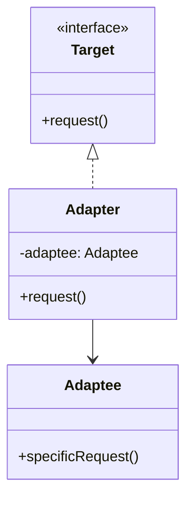
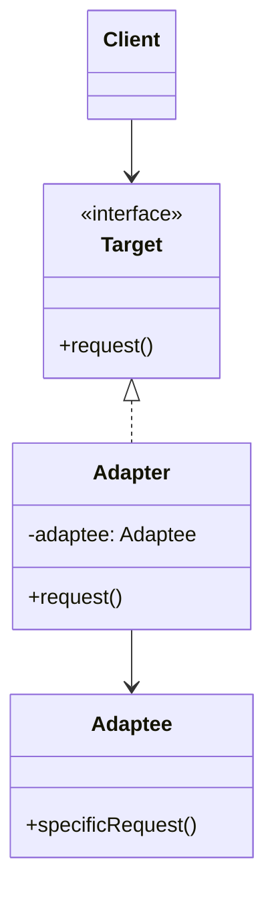

# Adapter Pattern

> "Convert the interface of a class into another interface clients expect. Adapter lets classes work together that couldn't otherwise because of incompatible interfaces."

## Visualization



## Intent

- Make incompatible interfaces work together
- Wrap an existing class with a new interface
- Allow legacy code to work with new systems

---

## Structure

### Object Adapter (Composition)



---

## Implementation

### Basic Example

```python
from abc import ABC, abstractmethod

# Target interface that client expects
class MediaPlayer(ABC):
    @abstractmethod
    def play(self, filename: str) -> None:
        pass

# Adaptee - existing class with incompatible interface
class LegacyMusicPlayer:
    def play_music(self, file_path: str, format: str) -> None:
        print(f"Playing {format} file: {file_path}")

# Adapter
class MusicPlayerAdapter(MediaPlayer):
    def __init__(self, legacy_player: LegacyMusicPlayer):
        self.legacy_player = legacy_player

    def play(self, filename: str) -> None:
        # Adapt the interface
        format = filename.split('.')[-1].upper()
        self.legacy_player.play_music(filename, format)

# Usage
legacy = LegacyMusicPlayer()
player: MediaPlayer = MusicPlayerAdapter(legacy)
player.play("song.mp3")  # Playing MP3 file: song.mp3
```

---

## Real-World Examples

### Example 1: Payment Gateway Adapter

```python
from abc import ABC, abstractmethod
from dataclasses import dataclass

@dataclass
class PaymentResult:
    success: bool
    transaction_id: str
    message: str

# Target interface
class PaymentProcessor(ABC):
    @abstractmethod
    def charge(self, amount: float, card_token: str) -> PaymentResult:
        pass

    @abstractmethod
    def refund(self, transaction_id: str) -> PaymentResult:
        pass

# Adaptee 1: Stripe (different interface)
class StripeAPI:
    def create_charge(self, amount_cents: int, source: str) -> dict:
        return {
            "id": "ch_stripe_123",
            "status": "succeeded",
            "amount": amount_cents
        }

    def create_refund(self, charge_id: str) -> dict:
        return {
            "id": "re_stripe_456",
            "status": "succeeded"
        }

# Adaptee 2: PayPal (different interface)
class PayPalSDK:
    def execute_payment(self, payment_amount: str, payer_id: str) -> dict:
        return {
            "payment_id": "PAY-paypal-789",
            "state": "approved"
        }

    def refund_payment(self, sale_id: str, amount: str) -> dict:
        return {
            "refund_id": "REF-paypal-012",
            "state": "completed"
        }

# Adapter for Stripe
class StripeAdapter(PaymentProcessor):
    def __init__(self, stripe: StripeAPI):
        self.stripe = stripe

    def charge(self, amount: float, card_token: str) -> PaymentResult:
        # Convert dollars to cents for Stripe
        amount_cents = int(amount * 100)
        result = self.stripe.create_charge(amount_cents, card_token)
        return PaymentResult(
            success=result["status"] == "succeeded",
            transaction_id=result["id"],
            message="Charge successful"
        )

    def refund(self, transaction_id: str) -> PaymentResult:
        result = self.stripe.create_refund(transaction_id)
        return PaymentResult(
            success=result["status"] == "succeeded",
            transaction_id=result["id"],
            message="Refund successful"
        )

# Adapter for PayPal
class PayPalAdapter(PaymentProcessor):
    def __init__(self, paypal: PayPalSDK):
        self.paypal = paypal

    def charge(self, amount: float, card_token: str) -> PaymentResult:
        # PayPal uses string amounts
        result = self.paypal.execute_payment(f"{amount:.2f}", card_token)
        return PaymentResult(
            success=result["state"] == "approved",
            transaction_id=result["payment_id"],
            message="Payment approved"
        )

    def refund(self, transaction_id: str) -> PaymentResult:
        result = self.paypal.refund_payment(transaction_id, "full")
        return PaymentResult(
            success=result["state"] == "completed",
            transaction_id=result["refund_id"],
            message="Refund completed"
        )

# Client code works with any payment processor
class OrderService:
    def __init__(self, payment_processor: PaymentProcessor):
        self.processor = payment_processor

    def checkout(self, amount: float, token: str) -> bool:
        result = self.processor.charge(amount, token)
        return result.success

# Usage
stripe_processor = StripeAdapter(StripeAPI())
paypal_processor = PayPalAdapter(PayPalSDK())

order_service = OrderService(stripe_processor)
order_service.checkout(99.99, "tok_visa")
```

### Example 2: Database Adapter

```python
from abc import ABC, abstractmethod
from typing import List, Dict, Any

# Target interface
class Database(ABC):
    @abstractmethod
    def connect(self) -> None:
        pass

    @abstractmethod
    def query(self, sql: str) -> List[Dict[str, Any]]:
        pass

    @abstractmethod
    def execute(self, sql: str) -> int:
        pass

    @abstractmethod
    def close(self) -> None:
        pass

# Adaptee: MongoDB (NoSQL - different paradigm)
class MongoDBClient:
    def __init__(self, connection_string: str):
        self.connection_string = connection_string
        self.db = None

    def connect_to_database(self, db_name: str):
        print(f"Connected to MongoDB: {db_name}")
        self.db = db_name

    def find(self, collection: str, filter: dict) -> list:
        print(f"MongoDB find in {collection} with filter {filter}")
        return [{"_id": "1", "name": "Item 1"}]

    def insert_one(self, collection: str, document: dict) -> str:
        print(f"MongoDB insert into {collection}")
        return "inserted_id"

    def disconnect(self):
        print("MongoDB disconnected")

# Adapter to make MongoDB work as SQL-like Database
class MongoDBAdapter(Database):
    def __init__(self, mongo_client: MongoDBClient, db_name: str):
        self.mongo = mongo_client
        self.db_name = db_name

    def connect(self) -> None:
        self.mongo.connect_to_database(self.db_name)

    def query(self, sql: str) -> List[Dict[str, Any]]:
        # Parse simple SQL and convert to MongoDB operations
        # This is simplified - real implementation would use SQL parser
        collection, filter_dict = self._parse_select(sql)
        return self.mongo.find(collection, filter_dict)

    def execute(self, sql: str) -> int:
        # Parse INSERT/UPDATE/DELETE
        if sql.upper().startswith("INSERT"):
            collection, document = self._parse_insert(sql)
            self.mongo.insert_one(collection, document)
            return 1
        return 0

    def close(self) -> None:
        self.mongo.disconnect()

    def _parse_select(self, sql: str) -> tuple:
        # Simplified parsing
        return "users", {}

    def _parse_insert(self, sql: str) -> tuple:
        return "users", {"name": "new_user"}

# Client code uses Database interface
class UserRepository:
    def __init__(self, db: Database):
        self.db = db

    def find_all(self) -> List[Dict]:
        return self.db.query("SELECT * FROM users")

# Works with both SQL and MongoDB
mongo_adapter = MongoDBAdapter(
    MongoDBClient("mongodb://localhost"),
    "myapp"
)
repo = UserRepository(mongo_adapter)
```

### Example 3: Logger Adapter

```python
from abc import ABC, abstractmethod
import json
from datetime import datetime

# Target interface
class Logger(ABC):
    @abstractmethod
    def log(self, level: str, message: str) -> None:
        pass

    @abstractmethod
    def error(self, message: str, exception: Exception = None) -> None:
        pass

# Various third-party loggers (Adaptees)
class CloudWatchLogger:
    def put_log_event(self, log_group: str, log_stream: str,
                      message: str, timestamp: int) -> None:
        print(f"CloudWatch [{log_group}/{log_stream}]: {message}")

class SlackWebhook:
    def post_message(self, webhook_url: str, payload: dict) -> None:
        print(f"Slack: {payload['text']}")

class DatadogClient:
    def send_log(self, message: str, level: str, tags: list) -> None:
        print(f"Datadog [{level}] {tags}: {message}")

# Adapters
class CloudWatchAdapter(Logger):
    def __init__(self, client: CloudWatchLogger,
                 log_group: str, log_stream: str):
        self.client = client
        self.log_group = log_group
        self.log_stream = log_stream

    def log(self, level: str, message: str) -> None:
        formatted = f"[{level}] {message}"
        timestamp = int(datetime.now().timestamp() * 1000)
        self.client.put_log_event(
            self.log_group, self.log_stream, formatted, timestamp
        )

    def error(self, message: str, exception: Exception = None) -> None:
        error_msg = message
        if exception:
            error_msg += f" | Exception: {str(exception)}"
        self.log("ERROR", error_msg)

class SlackAdapter(Logger):
    def __init__(self, webhook: SlackWebhook, webhook_url: str):
        self.webhook = webhook
        self.webhook_url = webhook_url

    def log(self, level: str, message: str) -> None:
        emoji = {"INFO": "ℹ️", "WARN": "⚠️", "ERROR": "🚨"}.get(level, "📝")
        self.webhook.post_message(
            self.webhook_url,
            {"text": f"{emoji} [{level}] {message}"}
        )

    def error(self, message: str, exception: Exception = None) -> None:
        self.log("ERROR", message)

# Composite adapter for multiple destinations
class CompositeLogger(Logger):
    def __init__(self, loggers: List[Logger]):
        self.loggers = loggers

    def log(self, level: str, message: str) -> None:
        for logger in self.loggers:
            logger.log(level, message)

    def error(self, message: str, exception: Exception = None) -> None:
        for logger in self.loggers:
            logger.error(message, exception)

# Usage
logger = CompositeLogger([
    CloudWatchAdapter(CloudWatchLogger(), "my-app", "prod"),
    SlackAdapter(SlackWebhook(), "https://hooks.slack.com/...")
])

logger.log("INFO", "Application started")
logger.error("Database connection failed", ConnectionError("timeout"))
```

---

## Class Adapter vs Object Adapter

### Object Adapter (Composition) - Preferred
```python
class Adapter:
    def __init__(self, adaptee: Adaptee):
        self.adaptee = adaptee

    def request(self):
        return self.adaptee.specific_request()
```

### Class Adapter (Inheritance)
```python
class Adapter(Target, Adaptee):
    def request(self):
        return self.specific_request()
```

| Aspect | Object Adapter | Class Adapter |
|--------|---------------|---------------|
| Flexibility | Can adapt subclasses | Only adapts specific class |
| Coupling | Loose | Tight |
| Override | Cannot override adaptee | Can override adaptee methods |
| Python support | ✓ Works well | ✓ Multiple inheritance |

---

## When to Use

✅ **Use when:**
- Integrating legacy or third-party code
- Creating reusable class that cooperates with unrelated classes
- You need to use several subclasses but impractical to adapt each

❌ **Don't use when:**
- Interfaces are similar enough to use directly
- You control both interfaces and can modify them
- Simple delegation would suffice

---

## Related Topics

- [[03_facade|Facade Pattern]] - Simplifies interface
- [[04_proxy|Proxy Pattern]] - Same interface, different purpose
- [[02_decorator|Decorator Pattern]] - Adds behavior

---

**Tags**: #design-patterns #structural #adapter #integration
