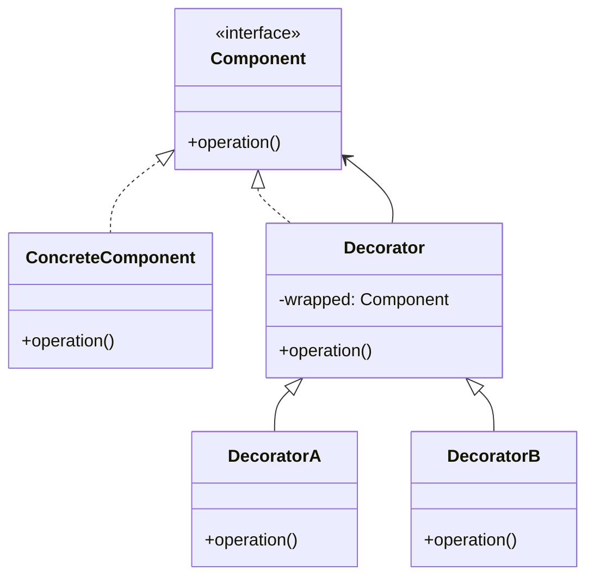

# Decorator Pattern

> "Attach additional responsibilities to an object dynamically. Decorators provide a flexible alternative to subclassing for extending functionality."

## Intent

- Add behavior to objects without modifying their class
- Extend functionality at runtime
- Stack multiple behaviors on a single object

---

## Structure




---

## Implementation

### Basic Example

```python
from abc import ABC, abstractmethod

# Component interface
class Coffee(ABC):
    @abstractmethod
    def cost(self) -> float:
        pass

    @abstractmethod
    def description(self) -> str:
        pass

# Concrete Component
class SimpleCoffee(Coffee):
    def cost(self) -> float:
        return 2.00

    def description(self) -> str:
        return "Simple coffee"

# Base Decorator
class CoffeeDecorator(Coffee):
    def __init__(self, coffee: Coffee):
        self._coffee = coffee

    def cost(self) -> float:
        return self._coffee.cost()

    def description(self) -> str:
        return self._coffee.description()

# Concrete Decorators
class MilkDecorator(CoffeeDecorator):
    def cost(self) -> float:
        return self._coffee.cost() + 0.50

    def description(self) -> str:
        return self._coffee.description() + ", with milk"

class SugarDecorator(CoffeeDecorator):
    def cost(self) -> float:
        return self._coffee.cost() + 0.20

    def description(self) -> str:
        return self._coffee.description() + ", with sugar"

class WhipDecorator(CoffeeDecorator):
    def cost(self) -> float:
        return self._coffee.cost() + 0.70

    def description(self) -> str:
        return self._coffee.description() + ", with whipped cream"

# Usage - stack decorators
coffee = SimpleCoffee()
coffee = MilkDecorator(coffee)
coffee = SugarDecorator(coffee)
coffee = WhipDecorator(coffee)

print(coffee.description())  # Simple coffee, with milk, with sugar, with whipped cream
print(f"${coffee.cost():.2f}")  # $3.40
```

---

## Real-World Examples

### Example 1: Stream Decorators

```python
from abc import ABC, abstractmethod
import gzip
import base64

class DataStream(ABC):
    @abstractmethod
    def write(self, data: bytes) -> None:
        pass

    @abstractmethod
    def read(self) -> bytes:
        pass

class FileStream(DataStream):
    def __init__(self, filename: str):
        self.filename = filename
        self._data = b""

    def write(self, data: bytes) -> None:
        self._data = data
        print(f"Writing {len(data)} bytes to {self.filename}")

    def read(self) -> bytes:
        return self._data

class StreamDecorator(DataStream):
    def __init__(self, stream: DataStream):
        self._stream = stream

    def write(self, data: bytes) -> None:
        self._stream.write(data)

    def read(self) -> bytes:
        return self._stream.read()

class CompressionDecorator(StreamDecorator):
    def write(self, data: bytes) -> None:
        compressed = gzip.compress(data)
        print(f"Compressed {len(data)} -> {len(compressed)} bytes")
        super().write(compressed)

    def read(self) -> bytes:
        compressed = super().read()
        return gzip.decompress(compressed)

class EncryptionDecorator(StreamDecorator):
    def __init__(self, stream: DataStream, key: str):
        super().__init__(stream)
        self.key = key

    def write(self, data: bytes) -> None:
        encrypted = self._encrypt(data)
        print("Data encrypted")
        super().write(encrypted)

    def read(self) -> bytes:
        encrypted = super().read()
        return self._decrypt(encrypted)

    def _encrypt(self, data: bytes) -> bytes:
        # Simple XOR encryption for demo
        key_bytes = self.key.encode()
        return bytes(d ^ key_bytes[i % len(key_bytes)]
                    for i, d in enumerate(data))

    def _decrypt(self, data: bytes) -> bytes:
        return self._encrypt(data)  # XOR is symmetric

class Base64Decorator(StreamDecorator):
    def write(self, data: bytes) -> None:
        encoded = base64.b64encode(data)
        print("Data base64 encoded")
        super().write(encoded)

    def read(self) -> bytes:
        encoded = super().read()
        return base64.b64decode(encoded)

# Usage - layer multiple transformations
stream = FileStream("data.bin")
stream = CompressionDecorator(stream)
stream = EncryptionDecorator(stream, "secret")
stream = Base64Decorator(stream)

data = b"Hello, World! This is some data to process."
stream.write(data)
result = stream.read()
print(result == data)  # True
```

### Example 2: HTTP Request Decorators

```python
from abc import ABC, abstractmethod
from typing import Dict, Any
import json
import time

class HttpClient(ABC):
    @abstractmethod
    def send(self, request: Dict[str, Any]) -> Dict[str, Any]:
        pass

class BasicHttpClient(HttpClient):
    def send(self, request: Dict[str, Any]) -> Dict[str, Any]:
        print(f"Sending {request['method']} to {request['url']}")
        return {"status": 200, "body": "OK"}

class HttpClientDecorator(HttpClient):
    def __init__(self, client: HttpClient):
        self._client = client

    def send(self, request: Dict[str, Any]) -> Dict[str, Any]:
        return self._client.send(request)

class LoggingDecorator(HttpClientDecorator):
    def send(self, request: Dict[str, Any]) -> Dict[str, Any]:
        print(f"[LOG] Request: {request['method']} {request['url']}")
        start = time.time()
        response = super().send(request)
        elapsed = time.time() - start
        print(f"[LOG] Response: {response['status']} in {elapsed:.3f}s")
        return response

class RetryDecorator(HttpClientDecorator):
    def __init__(self, client: HttpClient, max_retries: int = 3):
        super().__init__(client)
        self.max_retries = max_retries

    def send(self, request: Dict[str, Any]) -> Dict[str, Any]:
        last_exception = None
        for attempt in range(self.max_retries):
            try:
                return super().send(request)
            except Exception as e:
                last_exception = e
                print(f"[RETRY] Attempt {attempt + 1} failed: {e}")
                time.sleep(0.1 * (attempt + 1))
        raise last_exception

class AuthDecorator(HttpClientDecorator):
    def __init__(self, client: HttpClient, token: str):
        super().__init__(client)
        self.token = token

    def send(self, request: Dict[str, Any]) -> Dict[str, Any]:
        if "headers" not in request:
            request["headers"] = {}
        request["headers"]["Authorization"] = f"Bearer {self.token}"
        return super().send(request)

class CachingDecorator(HttpClientDecorator):
    def __init__(self, client: HttpClient, ttl: int = 300):
        super().__init__(client)
        self.cache = {}
        self.ttl = ttl

    def send(self, request: Dict[str, Any]) -> Dict[str, Any]:
        if request["method"] == "GET":
            cache_key = request["url"]
            cached = self.cache.get(cache_key)
            if cached and time.time() - cached["time"] < self.ttl:
                print("[CACHE] Hit")
                return cached["response"]

            response = super().send(request)
            self.cache[cache_key] = {
                "response": response,
                "time": time.time()
            }
            return response
        return super().send(request)

# Build decorated client
client = BasicHttpClient()
client = LoggingDecorator(client)
client = RetryDecorator(client, max_retries=3)
client = AuthDecorator(client, token="abc123")
client = CachingDecorator(client, ttl=60)

# Use it
response = client.send({
    "method": "GET",
    "url": "https://api.example.com/users"
})
```

### Example 3: Text Formatter Decorators

```python
from abc import ABC, abstractmethod

class TextFormatter(ABC):
    @abstractmethod
    def format(self, text: str) -> str:
        pass

class PlainTextFormatter(TextFormatter):
    def format(self, text: str) -> str:
        return text

class TextDecorator(TextFormatter):
    def __init__(self, formatter: TextFormatter):
        self._formatter = formatter

    def format(self, text: str) -> str:
        return self._formatter.format(text)

class BoldDecorator(TextDecorator):
    def format(self, text: str) -> str:
        return f"**{super().format(text)}**"

class ItalicDecorator(TextDecorator):
    def format(self, text: str) -> str:
        return f"_{super().format(text)}_"

class UnderlineDecorator(TextDecorator):
    def format(self, text: str) -> str:
        return f"<u>{super().format(text)}</u>"

class ColorDecorator(TextDecorator):
    def __init__(self, formatter: TextFormatter, color: str):
        super().__init__(formatter)
        self.color = color

    def format(self, text: str) -> str:
        return f'<span style="color:{self.color}">{super().format(text)}</span>'

class UppercaseDecorator(TextDecorator):
    def format(self, text: str) -> str:
        return super().format(text).upper()

# Chain decorators
formatter = PlainTextFormatter()
formatter = BoldDecorator(formatter)
formatter = ItalicDecorator(formatter)
formatter = ColorDecorator(formatter, "red")

result = formatter.format("Hello World")
print(result)
# <span style="color:red">_**Hello World**_</span>
```

---

## Python's Built-in Decorators

```python
# Function decorators are related but different
def logging_decorator(func):
    def wrapper(*args, **kwargs):
        print(f"Calling {func.__name__}")
        result = func(*args, **kwargs)
        print(f"Finished {func.__name__}")
        return result
    return wrapper

@logging_decorator
def greet(name):
    return f"Hello, {name}!"

# Class decorators
from functools import wraps

def retry(max_attempts: int = 3):
    def decorator(func):
        @wraps(func)
        def wrapper(*args, **kwargs):
            for attempt in range(max_attempts):
                try:
                    return func(*args, **kwargs)
                except Exception as e:
                    if attempt == max_attempts - 1:
                        raise
            return None
        return wrapper
    return decorator

@retry(max_attempts=3)
def fetch_data():
    pass
```

---

## Decorator vs Inheritance

| Aspect | Decorator | Inheritance |
|--------|-----------|-------------|
| When | Runtime | Compile time |
| Flexibility | Add/remove dynamically | Static |
| Combinations | Mix and match | Class explosion |
| Single Responsibility | Each decorator = one feature | Mixed in one class |

---

## When to Use

✅ **Use when:**
- Add responsibilities to objects dynamically
- Need to combine behaviors in various ways
- Extension by subclassing is impractical
- Want to avoid feature-laden classes

❌ **Don't use when:**
- Simple functionality that won't be combined
- Order of decorators matters critically
- Performance is critical (wrapper overhead)

---

## Related Topics

- [[01_adapter|Adapter Pattern]] - Changes interface
- [[04_proxy|Proxy Pattern]] - Controls access
- [[05_composite|Composite Pattern]] - Tree structures

---

**Tags**: #design-patterns #structural #decorator #wrapper
