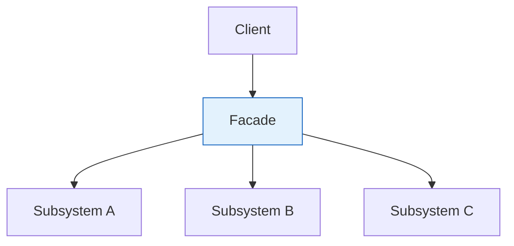

# Facade Pattern

> "Provide a unified interface to a set of interfaces in a subsystem. Facade defines a higher-level interface that makes the subsystem easier to use."

## Intent

- Simplify complex subsystem interactions
- Provide a single entry point to a group of classes
- Reduce coupling between clients and subsystem

---

## Structure




---

## Implementation

### Basic Example

```python
# Complex subsystem classes
class CPU:
    def freeze(self) -> None:
        print("CPU: Freezing processor")

    def jump(self, address: int) -> None:
        print(f"CPU: Jumping to {address}")

    def execute(self) -> None:
        print("CPU: Executing instructions")

class Memory:
    def load(self, address: int, data: bytes) -> None:
        print(f"Memory: Loading {len(data)} bytes at {address}")

class HardDrive:
    def read(self, sector: int, size: int) -> bytes:
        print(f"HardDrive: Reading {size} bytes from sector {sector}")
        return b"boot_data"

# Facade
class ComputerFacade:
    def __init__(self):
        self.cpu = CPU()
        self.memory = Memory()
        self.hard_drive = HardDrive()

    def start(self) -> None:
        """Simple interface to complex boot sequence"""
        print("=== Starting Computer ===")
        self.cpu.freeze()
        boot_data = self.hard_drive.read(sector=0, size=1024)
        self.memory.load(address=0, data=boot_data)
        self.cpu.jump(address=0)
        self.cpu.execute()
        print("=== Computer Started ===")

# Client uses simple interface
computer = ComputerFacade()
computer.start()
```

---

## Real-World Examples

### Example 1: E-Commerce Order Facade

```python
from dataclasses import dataclass
from typing import List
from enum import Enum

class PaymentStatus(Enum):
    SUCCESS = "success"
    FAILED = "failed"
    PENDING = "pending"

@dataclass
class Product:
    id: str
    name: str
    price: float
    quantity: int

@dataclass
class Order:
    id: str
    products: List[Product]
    total: float
    status: str = "pending"

# Complex subsystems
class InventorySystem:
    def __init__(self):
        self.stock = {"P001": 100, "P002": 50, "P003": 25}

    def check_availability(self, product_id: str, quantity: int) -> bool:
        available = self.stock.get(product_id, 0) >= quantity
        print(f"Inventory: {product_id} availability: {available}")
        return available

    def reserve(self, product_id: str, quantity: int) -> bool:
        if self.check_availability(product_id, quantity):
            self.stock[product_id] -= quantity
            print(f"Inventory: Reserved {quantity} of {product_id}")
            return True
        return False

    def release(self, product_id: str, quantity: int) -> None:
        self.stock[product_id] = self.stock.get(product_id, 0) + quantity
        print(f"Inventory: Released {quantity} of {product_id}")

class PaymentSystem:
    def process_payment(self, amount: float, card_token: str) -> PaymentStatus:
        print(f"Payment: Processing ${amount:.2f}")
        # Simulate payment processing
        if amount > 0:
            print("Payment: Transaction approved")
            return PaymentStatus.SUCCESS
        return PaymentStatus.FAILED

    def refund(self, transaction_id: str, amount: float) -> bool:
        print(f"Payment: Refunding ${amount:.2f} for {transaction_id}")
        return True

class ShippingSystem:
    def calculate_shipping(self, weight: float, destination: str) -> float:
        cost = weight * 0.5 + 5.0
        print(f"Shipping: Cost to {destination} = ${cost:.2f}")
        return cost

    def create_shipment(self, order_id: str, address: str) -> str:
        tracking = f"TRACK-{order_id}"
        print(f"Shipping: Created shipment {tracking}")
        return tracking

    def schedule_pickup(self, tracking_number: str) -> None:
        print(f"Shipping: Scheduled pickup for {tracking_number}")

class NotificationSystem:
    def send_email(self, to: str, subject: str, body: str) -> None:
        print(f"Email to {to}: {subject}")

    def send_sms(self, phone: str, message: str) -> None:
        print(f"SMS to {phone}: {message}")

class FraudDetectionSystem:
    def analyze(self, order: Order, user_id: str) -> bool:
        print(f"Fraud: Analyzing order {order.id} for user {user_id}")
        return True  # No fraud detected

# Facade - simplifies all interactions
class OrderFacade:
    def __init__(self):
        self.inventory = InventorySystem()
        self.payment = PaymentSystem()
        self.shipping = ShippingSystem()
        self.notification = NotificationSystem()
        self.fraud = FraudDetectionSystem()

    def place_order(self, user_id: str, products: List[Product],
                   card_token: str, address: str, email: str) -> Order:
        """
        Single method to handle entire order process:
        1. Check inventory
        2. Fraud detection
        3. Process payment
        4. Create shipment
        5. Send notifications
        """
        print("\n=== Placing Order ===")

        # Calculate total
        total = sum(p.price * p.quantity for p in products)
        order = Order(
            id=f"ORD-{hash(user_id) % 10000:04d}",
            products=products,
            total=total
        )

        # Step 1: Check inventory
        for product in products:
            if not self.inventory.check_availability(product.id, product.quantity):
                raise ValueError(f"Product {product.id} not available")

        # Step 2: Fraud detection
        if not self.fraud.analyze(order, user_id):
            raise ValueError("Order flagged for fraud")

        # Step 3: Reserve inventory
        for product in products:
            self.inventory.reserve(product.id, product.quantity)

        # Step 4: Add shipping cost
        shipping_cost = self.shipping.calculate_shipping(5.0, address)
        order.total += shipping_cost

        # Step 5: Process payment
        payment_status = self.payment.process_payment(order.total, card_token)
        if payment_status != PaymentStatus.SUCCESS:
            # Rollback inventory
            for product in products:
                self.inventory.release(product.id, product.quantity)
            raise ValueError("Payment failed")

        # Step 6: Create shipment
        tracking = self.shipping.create_shipment(order.id, address)
        self.shipping.schedule_pickup(tracking)

        # Step 7: Send notifications
        self.notification.send_email(
            email,
            f"Order Confirmed: {order.id}",
            f"Your order total: ${order.total:.2f}\nTracking: {tracking}"
        )

        order.status = "confirmed"
        print(f"=== Order {order.id} Complete ===\n")
        return order

# Client uses simple facade
facade = OrderFacade()
order = facade.place_order(
    user_id="user123",
    products=[
        Product("P001", "Widget", 29.99, 2),
        Product("P002", "Gadget", 49.99, 1)
    ],
    card_token="tok_visa",
    address="123 Main St",
    email="user@example.com"
)
```

### Example 2: Home Theater Facade

```python
class Amplifier:
    def on(self) -> None:
        print("Amplifier: ON")

    def off(self) -> None:
        print("Amplifier: OFF")

    def set_volume(self, level: int) -> None:
        print(f"Amplifier: Volume set to {level}")

    def set_surround_sound(self) -> None:
        print("Amplifier: Surround sound ON")

class DVDPlayer:
    def on(self) -> None:
        print("DVD Player: ON")

    def off(self) -> None:
        print("DVD Player: OFF")

    def play(self, movie: str) -> None:
        print(f"DVD Player: Playing '{movie}'")

    def pause(self) -> None:
        print("DVD Player: Paused")

    def stop(self) -> None:
        print("DVD Player: Stopped")

class Projector:
    def on(self) -> None:
        print("Projector: ON")

    def off(self) -> None:
        print("Projector: OFF")

    def wide_screen_mode(self) -> None:
        print("Projector: Widescreen mode")

class Lights:
    def on(self) -> None:
        print("Lights: ON")

    def off(self) -> None:
        print("Lights: OFF")

    def dim(self, level: int) -> None:
        print(f"Lights: Dimmed to {level}%")

class Screen:
    def up(self) -> None:
        print("Screen: Going up")

    def down(self) -> None:
        print("Screen: Going down")

class PopcornPopper:
    def on(self) -> None:
        print("Popcorn Popper: ON")

    def off(self) -> None:
        print("Popcorn Popper: OFF")

    def pop(self) -> None:
        print("Popcorn Popper: Popping!")

# Facade
class HomeTheaterFacade:
    def __init__(self):
        self.amp = Amplifier()
        self.dvd = DVDPlayer()
        self.projector = Projector()
        self.lights = Lights()
        self.screen = Screen()
        self.popper = PopcornPopper()

    def watch_movie(self, movie: str) -> None:
        """One method to set up everything for movie watching"""
        print("\n=== Get ready to watch a movie ===")
        self.popper.on()
        self.popper.pop()
        self.lights.dim(10)
        self.screen.down()
        self.projector.on()
        self.projector.wide_screen_mode()
        self.amp.on()
        self.amp.set_surround_sound()
        self.amp.set_volume(5)
        self.dvd.on()
        self.dvd.play(movie)
        print("=== Enjoy your movie! ===\n")

    def end_movie(self) -> None:
        """One method to shut everything down"""
        print("\n=== Shutting down theater ===")
        self.popper.off()
        self.lights.on()
        self.screen.up()
        self.projector.off()
        self.amp.off()
        self.dvd.stop()
        self.dvd.off()
        print("=== Theater shut down ===\n")

# Simple client usage
theater = HomeTheaterFacade()
theater.watch_movie("Inception")
# ... watch movie ...
theater.end_movie()
```

### Example 3: Report Generation Facade

```python
from dataclasses import dataclass
from typing import List, Dict, Any
from datetime import datetime
import json

@dataclass
class ReportConfig:
    title: str
    start_date: datetime
    end_date: datetime
    format: str  # "pdf", "excel", "html"

# Complex subsystems
class DataFetcher:
    def fetch_sales_data(self, start: datetime, end: datetime) -> List[Dict]:
        print(f"Fetching sales data from {start} to {end}")
        return [{"date": "2024-01-01", "amount": 1000}]

    def fetch_customer_data(self, customer_ids: List[str]) -> List[Dict]:
        print(f"Fetching customer data for {len(customer_ids)} customers")
        return [{"id": "C001", "name": "John"}]

    def fetch_inventory_data(self) -> List[Dict]:
        print("Fetching inventory data")
        return [{"product": "Widget", "stock": 100}]

class DataProcessor:
    def aggregate(self, data: List[Dict], by: str) -> Dict:
        print(f"Aggregating data by {by}")
        return {"total": sum(d.get("amount", 0) for d in data)}

    def filter(self, data: List[Dict], criteria: Dict) -> List[Dict]:
        print(f"Filtering data with criteria: {criteria}")
        return data

    def transform(self, data: List[Dict], mapping: Dict) -> List[Dict]:
        print("Transforming data")
        return data

class ChartGenerator:
    def create_bar_chart(self, data: Dict, title: str) -> bytes:
        print(f"Creating bar chart: {title}")
        return b"chart_data"

    def create_line_chart(self, data: List, title: str) -> bytes:
        print(f"Creating line chart: {title}")
        return b"chart_data"

    def create_pie_chart(self, data: Dict, title: str) -> bytes:
        print(f"Creating pie chart: {title}")
        return b"chart_data"

class TemplateEngine:
    def load_template(self, template_name: str) -> str:
        print(f"Loading template: {template_name}")
        return "<html>{{content}}</html>"

    def render(self, template: str, data: Dict) -> str:
        print("Rendering template")
        return template.replace("{{content}}", str(data))

class PDFGenerator:
    def create_pdf(self, html: str) -> bytes:
        print("Generating PDF")
        return b"pdf_content"

class ExcelGenerator:
    def create_workbook(self) -> "Workbook":
        print("Creating Excel workbook")
        return self

    def add_sheet(self, name: str, data: List[Dict]) -> None:
        print(f"Adding sheet: {name}")

    def save(self) -> bytes:
        print("Saving Excel file")
        return b"excel_content"

class EmailSender:
    def send(self, to: str, subject: str, body: str,
             attachments: List[bytes]) -> bool:
        print(f"Sending email to {to} with {len(attachments)} attachments")
        return True

# Facade
class ReportFacade:
    def __init__(self):
        self.data_fetcher = DataFetcher()
        self.processor = DataProcessor()
        self.chart_gen = ChartGenerator()
        self.template = TemplateEngine()
        self.pdf_gen = PDFGenerator()
        self.excel_gen = ExcelGenerator()
        self.email = EmailSender()

    def generate_sales_report(self, config: ReportConfig) -> bytes:
        """Generate complete sales report with one method call"""
        print(f"\n=== Generating Sales Report: {config.title} ===")

        # Fetch data
        sales_data = self.data_fetcher.fetch_sales_data(
            config.start_date, config.end_date
        )

        # Process data
        aggregated = self.processor.aggregate(sales_data, "month")
        filtered = self.processor.filter(sales_data, {"min_amount": 100})

        # Generate charts
        bar_chart = self.chart_gen.create_bar_chart(aggregated, "Monthly Sales")
        line_chart = self.chart_gen.create_line_chart(filtered, "Sales Trend")

        # Generate output
        if config.format == "pdf":
            template = self.template.load_template("sales_report.html")
            html = self.template.render(template, {
                "title": config.title,
                "data": aggregated,
                "charts": [bar_chart, line_chart]
            })
            return self.pdf_gen.create_pdf(html)

        elif config.format == "excel":
            workbook = self.excel_gen.create_workbook()
            self.excel_gen.add_sheet("Sales Data", filtered)
            self.excel_gen.add_sheet("Summary", [aggregated])
            return self.excel_gen.save()

        else:  # html
            template = self.template.load_template("sales_report.html")
            return self.template.render(template, {
                "title": config.title,
                "data": aggregated
            }).encode()

    def generate_and_email_report(self, config: ReportConfig,
                                  recipients: List[str]) -> bool:
        """Generate and email report in one call"""
        report = self.generate_sales_report(config)

        for recipient in recipients:
            self.email.send(
                to=recipient,
                subject=f"Report: {config.title}",
                body="Please find attached the requested report.",
                attachments=[report]
            )

        return True

# Simple usage
facade = ReportFacade()
config = ReportConfig(
    title="Q1 Sales Report",
    start_date=datetime(2024, 1, 1),
    end_date=datetime(2024, 3, 31),
    format="pdf"
)
report = facade.generate_sales_report(config)
```

---

## Facade vs Other Patterns

| Pattern | Purpose | Relationship |
|---------|---------|--------------|
| **Facade** | Simplify subsystem | Uses subsystem classes |
| **Adapter** | Convert interface | Wraps single class |
| **Mediator** | Coordinate objects | Objects know mediator |
| **Proxy** | Control access | Same interface as target |

---

## When to Use

✅ **Use when:**
- Need simple interface to complex subsystem
- Want to layer your subsystems
- Reduce dependencies on subsystem internals
- Provide entry point for external clients

❌ **Don't use when:**
- Subsystem is already simple
- Clients need fine-grained control
- Would create a "god" object

---

## Implementation Tips

### 1. Multiple Facades
```python
# Different facades for different use cases
class AdminFacade:
    """Full access facade"""
    pass

class CustomerFacade:
    """Limited access facade"""
    pass
```

### 2. Facade with Factory
```python
class SubsystemFacade:
    @classmethod
    def create_production(cls) -> "SubsystemFacade":
        return cls(RealDatabase(), RealCache())

    @classmethod
    def create_testing(cls) -> "SubsystemFacade":
        return cls(MockDatabase(), MockCache())
```

---

## Related Topics

- [[01_adapter|Adapter Pattern]] - Converts interface
- [[04_proxy|Proxy Pattern]] - Controls access
- [[../Behavioral/06_mediator|Mediator Pattern]] - Coordinates objects

---

**Tags**: #design-patterns #structural #facade #simplification
