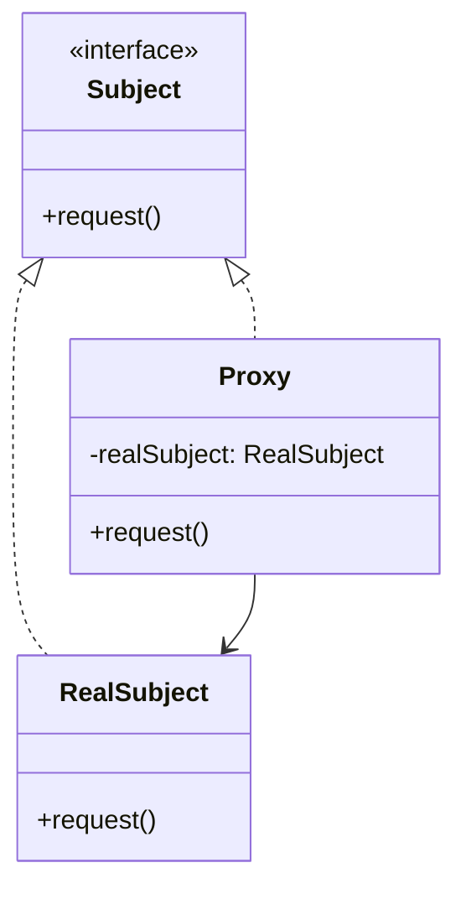

# Proxy Pattern

> "Provide a surrogate or placeholder for another object to control access to it."

## Intent

- Control access to an object
- Add functionality before/after accessing the real object
- Delay expensive object creation (lazy initialization)

---

## Types of Proxies

| Type | Purpose | Use Case |
|------|---------|----------|
| **Virtual** | Lazy initialization | Heavy resources |
| **Protection** | Access control | Security |
| **Remote** | Network abstraction | Distributed systems |
| **Caching** | Cache results | Performance |
| **Logging** | Monitor access | Debugging |
| **Smart Reference** | Reference counting | Memory management |

---

## Structure




---

## Implementation

### Basic Virtual Proxy

```python
from abc import ABC, abstractmethod

class Image(ABC):
    @abstractmethod
    def display(self) -> None:
        pass

class RealImage(Image):
    """Heavy object - expensive to create"""
    def __init__(self, filename: str):
        self.filename = filename
        self._load_from_disk()

    def _load_from_disk(self) -> None:
        print(f"Loading image: {self.filename} (expensive operation)")

    def display(self) -> None:
        print(f"Displaying: {self.filename}")

class ImageProxy(Image):
    """Lazy loading proxy"""
    def __init__(self, filename: str):
        self.filename = filename
        self._real_image: RealImage | None = None

    def display(self) -> None:
        # Create real object only when needed
        if self._real_image is None:
            self._real_image = RealImage(self.filename)
        self._real_image.display()

# Usage
image = ImageProxy("photo.jpg")  # No loading yet
print("Image proxy created")
image.display()  # Now it loads
image.display()  # Uses cached instance
```

---

## Real-World Examples

### Example 1: Protection Proxy

```python
from abc import ABC, abstractmethod
from dataclasses import dataclass
from typing import List
from enum import Enum

class Role(Enum):
    GUEST = "guest"
    USER = "user"
    ADMIN = "admin"

@dataclass
class User:
    id: str
    name: str
    role: Role

class Document(ABC):
    @abstractmethod
    def read(self) -> str:
        pass

    @abstractmethod
    def write(self, content: str) -> None:
        pass

    @abstractmethod
    def delete(self) -> None:
        pass

class RealDocument(Document):
    def __init__(self, filename: str):
        self.filename = filename
        self.content = f"Content of {filename}"

    def read(self) -> str:
        return self.content

    def write(self, content: str) -> None:
        self.content = content
        print(f"Document {self.filename} updated")

    def delete(self) -> None:
        print(f"Document {self.filename} deleted")

class ProtectionProxy(Document):
    """Controls access based on user permissions"""

    # Permission matrix
    PERMISSIONS = {
        Role.GUEST: {"read"},
        Role.USER: {"read", "write"},
        Role.ADMIN: {"read", "write", "delete"}
    }

    def __init__(self, document: RealDocument, user: User):
        self._document = document
        self._user = user

    def _check_permission(self, action: str) -> bool:
        allowed = action in self.PERMISSIONS.get(self._user.role, set())
        if not allowed:
            print(f"Access denied: {self._user.name} cannot {action}")
        return allowed

    def read(self) -> str:
        if self._check_permission("read"):
            return self._document.read()
        raise PermissionError("Read access denied")

    def write(self, content: str) -> None:
        if self._check_permission("write"):
            self._document.write(content)
        else:
            raise PermissionError("Write access denied")

    def delete(self) -> None:
        if self._check_permission("delete"):
            self._document.delete()
        else:
            raise PermissionError("Delete access denied")

# Usage
doc = RealDocument("secret.txt")
guest = User("1", "Guest", Role.GUEST)
admin = User("2", "Admin", Role.ADMIN)

guest_proxy = ProtectionProxy(doc, guest)
admin_proxy = ProtectionProxy(doc, admin)

print(guest_proxy.read())  # OK
# guest_proxy.write("hacked")  # Raises PermissionError

admin_proxy.write("Updated by admin")  # OK
admin_proxy.delete()  # OK
```

### Example 2: Caching Proxy

```python
from abc import ABC, abstractmethod
from typing import Dict, Any, Optional
import time
from dataclasses import dataclass
import hashlib

@dataclass
class CacheEntry:
    value: Any
    timestamp: float
    ttl: int

class DataService(ABC):
    @abstractmethod
    def fetch(self, query: str) -> Dict[str, Any]:
        pass

class DatabaseService(DataService):
    """Slow database operations"""
    def fetch(self, query: str) -> Dict[str, Any]:
        print(f"Executing expensive query: {query}")
        time.sleep(0.1)  # Simulate slow query
        return {"query": query, "result": [1, 2, 3], "timestamp": time.time()}

class CachingProxy(DataService):
    def __init__(self, service: DataService, default_ttl: int = 300):
        self._service = service
        self._cache: Dict[str, CacheEntry] = {}
        self._default_ttl = default_ttl
        self._hits = 0
        self._misses = 0

    def _get_cache_key(self, query: str) -> str:
        return hashlib.md5(query.encode()).hexdigest()

    def _is_valid(self, entry: CacheEntry) -> bool:
        return time.time() - entry.timestamp < entry.ttl

    def fetch(self, query: str) -> Dict[str, Any]:
        cache_key = self._get_cache_key(query)

        # Check cache
        if cache_key in self._cache:
            entry = self._cache[cache_key]
            if self._is_valid(entry):
                self._hits += 1
                print(f"Cache HIT for query: {query[:30]}...")
                return entry.value
            else:
                del self._cache[cache_key]

        # Cache miss - fetch from real service
        self._misses += 1
        print(f"Cache MISS for query: {query[:30]}...")
        result = self._service.fetch(query)

        # Store in cache
        self._cache[cache_key] = CacheEntry(
            value=result,
            timestamp=time.time(),
            ttl=self._default_ttl
        )

        return result

    def invalidate(self, query: str) -> None:
        cache_key = self._get_cache_key(query)
        if cache_key in self._cache:
            del self._cache[cache_key]
            print(f"Cache invalidated for: {query}")

    def clear(self) -> None:
        self._cache.clear()
        print("Cache cleared")

    def stats(self) -> Dict[str, Any]:
        total = self._hits + self._misses
        hit_rate = (self._hits / total * 100) if total > 0 else 0
        return {
            "hits": self._hits,
            "misses": self._misses,
            "hit_rate": f"{hit_rate:.1f}%",
            "cache_size": len(self._cache)
        }

# Usage
db = DatabaseService()
cached_db = CachingProxy(db, default_ttl=60)

# First call - cache miss
result1 = cached_db.fetch("SELECT * FROM users")

# Second call - cache hit
result2 = cached_db.fetch("SELECT * FROM users")

# Different query - cache miss
result3 = cached_db.fetch("SELECT * FROM orders")

print(cached_db.stats())
```

### Example 3: Logging Proxy

```python
from abc import ABC, abstractmethod
from typing import Any, Callable
from datetime import datetime
from functools import wraps
import time

class PaymentGateway(ABC):
    @abstractmethod
    def charge(self, amount: float, card: str) -> dict:
        pass

    @abstractmethod
    def refund(self, transaction_id: str) -> dict:
        pass

class StripeGateway(PaymentGateway):
    def charge(self, amount: float, card: str) -> dict:
        time.sleep(0.05)  # Simulate API call
        return {
            "success": True,
            "transaction_id": f"txn_{hash(card) % 10000:04d}",
            "amount": amount
        }

    def refund(self, transaction_id: str) -> dict:
        time.sleep(0.03)
        return {"success": True, "refund_id": f"ref_{transaction_id}"}

class LoggingProxy(PaymentGateway):
    def __init__(self, gateway: PaymentGateway, logger: Callable = print):
        self._gateway = gateway
        self._log = logger

    def _log_call(self, method: str, args: tuple, kwargs: dict,
                  result: Any, duration: float) -> None:
        self._log(f"""
=== Payment Gateway Call ===
Timestamp: {datetime.now().isoformat()}
Method: {method}
Args: {args}
Duration: {duration:.3f}s
Result: {result}
============================
        """.strip())

    def charge(self, amount: float, card: str) -> dict:
        start = time.time()
        # Mask card number for logging
        masked_card = f"****{card[-4:]}" if len(card) >= 4 else "****"

        try:
            result = self._gateway.charge(amount, card)
            self._log_call("charge", (amount, masked_card), {},
                          result, time.time() - start)
            return result
        except Exception as e:
            self._log_call("charge", (amount, masked_card), {},
                          f"ERROR: {e}", time.time() - start)
            raise

    def refund(self, transaction_id: str) -> dict:
        start = time.time()
        try:
            result = self._gateway.refund(transaction_id)
            self._log_call("refund", (transaction_id,), {},
                          result, time.time() - start)
            return result
        except Exception as e:
            self._log_call("refund", (transaction_id,), {},
                          f"ERROR: {e}", time.time() - start)
            raise

# Usage
gateway = LoggingProxy(StripeGateway())
result = gateway.charge(99.99, "4242424242424242")
gateway.refund(result["transaction_id"])
```

### Example 4: Smart Reference Proxy

```python
from abc import ABC, abstractmethod
from typing import Dict, Optional
import weakref

class ExpensiveResource(ABC):
    @abstractmethod
    def use(self) -> str:
        pass

    @abstractmethod
    def cleanup(self) -> None:
        pass

class DatabaseConnection(ExpensiveResource):
    def __init__(self, connection_string: str):
        self.connection_string = connection_string
        print(f"Opening connection to: {connection_string}")

    def use(self) -> str:
        return f"Using connection: {self.connection_string}"

    def cleanup(self) -> None:
        print(f"Closing connection: {self.connection_string}")

class SmartReferenceProxy(ExpensiveResource):
    """
    Manages object lifecycle with reference counting.
    Automatically cleans up when no longer referenced.
    """
    _instances: Dict[str, 'SmartReferenceProxy'] = {}
    _ref_counts: Dict[str, int] = {}

    def __init__(self, connection_string: str):
        self._connection_string = connection_string
        self._resource: Optional[DatabaseConnection] = None

    @classmethod
    def get_instance(cls, connection_string: str) -> 'SmartReferenceProxy':
        """Factory method with reference counting"""
        if connection_string not in cls._instances:
            cls._instances[connection_string] = cls(connection_string)
            cls._ref_counts[connection_string] = 0

        cls._ref_counts[connection_string] += 1
        print(f"Reference count for {connection_string}: "
              f"{cls._ref_counts[connection_string]}")

        return cls._instances[connection_string]

    def use(self) -> str:
        if self._resource is None:
            self._resource = DatabaseConnection(self._connection_string)
        return self._resource.use()

    def release(self) -> None:
        """Decrement reference count"""
        SmartReferenceProxy._ref_counts[self._connection_string] -= 1
        count = SmartReferenceProxy._ref_counts[self._connection_string]
        print(f"Released. Reference count: {count}")

        if count <= 0:
            self.cleanup()

    def cleanup(self) -> None:
        if self._resource:
            self._resource.cleanup()
            self._resource = None
            del SmartReferenceProxy._instances[self._connection_string]
            del SmartReferenceProxy._ref_counts[self._connection_string]

# Usage as context manager
class ConnectionContext:
    def __init__(self, connection_string: str):
        self.connection_string = connection_string
        self.proxy: Optional[SmartReferenceProxy] = None

    def __enter__(self) -> SmartReferenceProxy:
        self.proxy = SmartReferenceProxy.get_instance(self.connection_string)
        return self.proxy

    def __exit__(self, *args) -> None:
        if self.proxy:
            self.proxy.release()

# Usage
with ConnectionContext("db://localhost/mydb") as conn1:
    print(conn1.use())
    with ConnectionContext("db://localhost/mydb") as conn2:
        print(conn2.use())  # Same underlying connection
    # conn2 released, but conn1 still holds reference
# Both released, connection cleaned up
```

### Example 5: Remote Proxy

```python
from abc import ABC, abstractmethod
from typing import Any, Dict
import json

class MathService(ABC):
    @abstractmethod
    def add(self, a: float, b: float) -> float:
        pass

    @abstractmethod
    def multiply(self, a: float, b: float) -> float:
        pass

class LocalMathService(MathService):
    """Real implementation"""
    def add(self, a: float, b: float) -> float:
        return a + b

    def multiply(self, a: float, b: float) -> float:
        return a * b

class RemoteMathProxy(MathService):
    """
    Proxy for remote service.
    Handles serialization, network calls, error handling.
    """
    def __init__(self, service_url: str):
        self.service_url = service_url

    def _remote_call(self, method: str, params: Dict[str, Any]) -> Any:
        # Simulate remote call
        print(f"Remote call to {self.service_url}/{method}")
        print(f"Request: {json.dumps(params)}")

        # In real implementation, this would use HTTP/gRPC
        # For demo, we'll simulate response
        if method == "add":
            result = params["a"] + params["b"]
        elif method == "multiply":
            result = params["a"] * params["b"]
        else:
            raise ValueError(f"Unknown method: {method}")

        response = {"result": result, "success": True}
        print(f"Response: {json.dumps(response)}")
        return response["result"]

    def add(self, a: float, b: float) -> float:
        return self._remote_call("add", {"a": a, "b": b})

    def multiply(self, a: float, b: float) -> float:
        return self._remote_call("multiply", {"a": a, "b": b})

# Client code - same interface for local or remote
def calculate(service: MathService) -> None:
    print(f"5 + 3 = {service.add(5, 3)}")
    print(f"5 * 3 = {service.multiply(5, 3)}")

# Local
print("=== Local Service ===")
calculate(LocalMathService())

# Remote
print("\n=== Remote Service ===")
calculate(RemoteMathProxy("https://api.math-service.com"))
```

---

## Python Decorators as Proxies

```python
from functools import wraps
import time

# Function proxy using decorator
def timing_proxy(func):
    @wraps(func)
    def wrapper(*args, **kwargs):
        start = time.time()
        result = func(*args, **kwargs)
        print(f"{func.__name__} took {time.time() - start:.3f}s")
        return result
    return wrapper

def caching_proxy(func):
    cache = {}
    @wraps(func)
    def wrapper(*args):
        if args not in cache:
            cache[args] = func(*args)
        return cache[args]
    return wrapper

@timing_proxy
@caching_proxy
def fibonacci(n):
    if n < 2:
        return n
    return fibonacci(n-1) + fibonacci(n-2)

print(fibonacci(30))
```

---

## When to Use

✅ **Use when:**
- Need lazy initialization (virtual proxy)
- Need access control (protection proxy)
- Need local representation of remote object
- Need to add operations before/after accessing object
- Need caching or logging transparently

❌ **Don't use when:**
- Direct access is acceptable
- Overhead of proxy is not justified
- Simple delegation would suffice

---

## Related Topics

- [[02_decorator|Decorator Pattern]] - Adds behavior
- [[01_adapter|Adapter Pattern]] - Changes interface
- [[03_facade|Facade Pattern]] - Simplifies interface

---

**Tags**: #design-patterns #structural #proxy #access-control #lazy-loading
