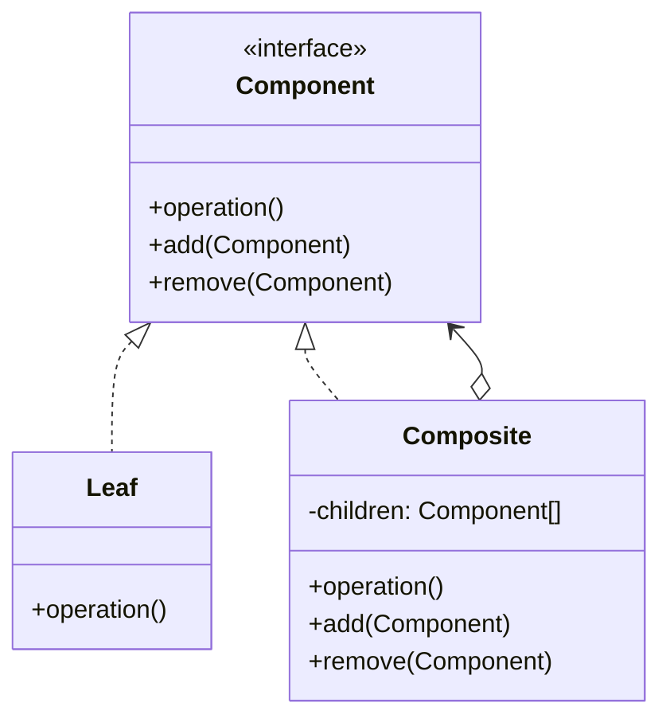

# Composite Pattern

> "Compose objects into tree structures to represent part-whole hierarchies. Composite lets clients treat individual objects and compositions of objects uniformly."

## Intent

- Build tree structures of objects
- Treat individual objects and groups the same way
- Represent part-whole hierarchies

---

## Structure




---

## Implementation

### Basic Example

```python
from abc import ABC, abstractmethod
from typing import List

class FileSystemComponent(ABC):
    def __init__(self, name: str):
        self.name = name

    @abstractmethod
    def get_size(self) -> int:
        pass

    @abstractmethod
    def display(self, indent: str = "") -> None:
        pass

class File(FileSystemComponent):
    """Leaf"""
    def __init__(self, name: str, size: int):
        super().__init__(name)
        self.size = size

    def get_size(self) -> int:
        return self.size

    def display(self, indent: str = "") -> None:
        print(f"{indent}📄 {self.name} ({self.size} bytes)")

class Directory(FileSystemComponent):
    """Composite"""
    def __init__(self, name: str):
        super().__init__(name)
        self.children: List[FileSystemComponent] = []

    def add(self, component: FileSystemComponent) -> None:
        self.children.append(component)

    def remove(self, component: FileSystemComponent) -> None:
        self.children.remove(component)

    def get_size(self) -> int:
        return sum(child.get_size() for child in self.children)

    def display(self, indent: str = "") -> None:
        print(f"{indent}📁 {self.name}/ ({self.get_size()} bytes)")
        for child in self.children:
            child.display(indent + "  ")

# Build tree structure
root = Directory("root")
src = Directory("src")
docs = Directory("docs")

src.add(File("main.py", 1500))
src.add(File("utils.py", 800))

docs.add(File("README.md", 2000))
docs.add(File("API.md", 3500))

root.add(src)
root.add(docs)
root.add(File("config.json", 500))

root.display()
print(f"\nTotal size: {root.get_size()} bytes")
```

---

## Real-World Examples

### Example 1: UI Component Tree

```python
from abc import ABC, abstractmethod
from typing import List, Optional
from dataclasses import dataclass

@dataclass
class Position:
    x: int
    y: int

@dataclass
class Size:
    width: int
    height: int

class UIComponent(ABC):
    def __init__(self, name: str, position: Position, size: Size):
        self.name = name
        self.position = position
        self.size = size
        self.parent: Optional['Container'] = None

    @abstractmethod
    def render(self, indent: str = "") -> None:
        pass

    @abstractmethod
    def handle_click(self, x: int, y: int) -> bool:
        pass

    def is_point_inside(self, x: int, y: int) -> bool:
        return (self.position.x <= x <= self.position.x + self.size.width and
                self.position.y <= y <= self.position.y + self.size.height)

class Button(UIComponent):
    """Leaf component"""
    def __init__(self, name: str, position: Position, size: Size,
                 label: str, on_click: callable = None):
        super().__init__(name, position, size)
        self.label = label
        self.on_click = on_click

    def render(self, indent: str = "") -> None:
        print(f"{indent}[Button: {self.label}] at ({self.position.x}, {self.position.y})")

    def handle_click(self, x: int, y: int) -> bool:
        if self.is_point_inside(x, y):
            print(f"Button '{self.label}' clicked!")
            if self.on_click:
                self.on_click()
            return True
        return False

class TextBox(UIComponent):
    """Leaf component"""
    def __init__(self, name: str, position: Position, size: Size,
                 text: str = ""):
        super().__init__(name, position, size)
        self.text = text

    def render(self, indent: str = "") -> None:
        print(f"{indent}[TextBox: '{self.text}'] at ({self.position.x}, {self.position.y})")

    def handle_click(self, x: int, y: int) -> bool:
        if self.is_point_inside(x, y):
            print(f"TextBox focused, current text: '{self.text}'")
            return True
        return False

class Label(UIComponent):
    """Leaf component"""
    def __init__(self, name: str, position: Position, size: Size,
                 text: str):
        super().__init__(name, position, size)
        self.text = text

    def render(self, indent: str = "") -> None:
        print(f"{indent}[Label: {self.text}]")

    def handle_click(self, x: int, y: int) -> bool:
        return False  # Labels are not clickable

class Container(UIComponent):
    """Composite component"""
    def __init__(self, name: str, position: Position, size: Size):
        super().__init__(name, position, size)
        self.children: List[UIComponent] = []

    def add(self, component: UIComponent) -> None:
        component.parent = self
        self.children.append(component)

    def remove(self, component: UIComponent) -> None:
        component.parent = None
        self.children.remove(component)

    def render(self, indent: str = "") -> None:
        print(f"{indent}[Container: {self.name}]")
        for child in self.children:
            child.render(indent + "  ")

    def handle_click(self, x: int, y: int) -> bool:
        if not self.is_point_inside(x, y):
            return False

        # Propagate to children (reverse order for z-index)
        for child in reversed(self.children):
            if child.handle_click(x, y):
                return True
        return False

class Panel(Container):
    """Specialized container with title"""
    def __init__(self, name: str, position: Position, size: Size,
                 title: str):
        super().__init__(name, position, size)
        self.title = title

    def render(self, indent: str = "") -> None:
        print(f"{indent}╔══ {self.title} ══╗")
        for child in self.children:
            child.render(indent + "║ ")
        print(f"{indent}╚{'═' * (len(self.title) + 6)}╝")

class Window(Container):
    """Top-level container"""
    def __init__(self, title: str, size: Size):
        super().__init__(title, Position(0, 0), size)
        self.title = title

    def render(self, indent: str = "") -> None:
        print(f"\n┌─ {self.title} {'─' * (self.size.width - len(self.title) - 4)}┐")
        for child in self.children:
            child.render("│ ")
        print(f"└{'─' * (self.size.width - 2)}┘\n")

# Build UI tree
window = Window("Login Form", Size(400, 300))

form_panel = Panel("form", Position(10, 10), Size(380, 200), "User Login")

form_panel.add(Label("lbl_user", Position(20, 50), Size(100, 20), "Username:"))
form_panel.add(TextBox("txt_user", Position(120, 50), Size(200, 25), ""))

form_panel.add(Label("lbl_pass", Position(20, 90), Size(100, 20), "Password:"))
form_panel.add(TextBox("txt_pass", Position(120, 90), Size(200, 25), ""))

button_container = Container("buttons", Position(20, 150), Size(300, 40))
button_container.add(Button("btn_login", Position(120, 150), Size(80, 30),
                            "Login", lambda: print("Logging in...")))
button_container.add(Button("btn_cancel", Position(220, 150), Size(80, 30),
                            "Cancel", lambda: print("Cancelled")))

form_panel.add(button_container)
window.add(form_panel)

# Render and interact
window.render()
window.handle_click(150, 155)  # Click login button
```

### Example 2: Organization Hierarchy

```python
from abc import ABC, abstractmethod
from typing import List
from dataclasses import dataclass

@dataclass
class Salary:
    base: float
    bonus: float = 0

    @property
    def total(self) -> float:
        return self.base + self.bonus

class OrganizationComponent(ABC):
    def __init__(self, name: str):
        self.name = name

    @abstractmethod
    def get_total_salary(self) -> float:
        pass

    @abstractmethod
    def get_headcount(self) -> int:
        pass

    @abstractmethod
    def display(self, indent: str = "") -> None:
        pass

class Employee(OrganizationComponent):
    """Leaf - individual contributor"""
    def __init__(self, name: str, title: str, salary: Salary):
        super().__init__(name)
        self.title = title
        self.salary = salary

    def get_total_salary(self) -> float:
        return self.salary.total

    def get_headcount(self) -> int:
        return 1

    def display(self, indent: str = "") -> None:
        print(f"{indent}👤 {self.name} ({self.title}) - ${self.salary.total:,.0f}")

class Manager(OrganizationComponent):
    """Composite - manages a team"""
    def __init__(self, name: str, title: str, salary: Salary):
        super().__init__(name)
        self.title = title
        self.salary = salary
        self.reports: List[OrganizationComponent] = []

    def add(self, component: OrganizationComponent) -> None:
        self.reports.append(component)

    def remove(self, component: OrganizationComponent) -> None:
        self.reports.remove(component)

    def get_total_salary(self) -> float:
        team_salary = sum(report.get_total_salary() for report in self.reports)
        return self.salary.total + team_salary

    def get_headcount(self) -> int:
        team_count = sum(report.get_headcount() for report in self.reports)
        return 1 + team_count

    def display(self, indent: str = "") -> None:
        direct_reports = len(self.reports)
        total_reports = self.get_headcount() - 1
        print(f"{indent}👔 {self.name} ({self.title}) - ${self.salary.total:,.0f}")
        print(f"{indent}   [{direct_reports} direct, {total_reports} total reports]")
        for report in self.reports:
            report.display(indent + "   ")

class Department(OrganizationComponent):
    """Composite - department level"""
    def __init__(self, name: str):
        super().__init__(name)
        self.members: List[OrganizationComponent] = []

    def add(self, component: OrganizationComponent) -> None:
        self.members.append(component)

    def remove(self, component: OrganizationComponent) -> None:
        self.members.remove(component)

    def get_total_salary(self) -> float:
        return sum(member.get_total_salary() for member in self.members)

    def get_headcount(self) -> int:
        return sum(member.get_headcount() for member in self.members)

    def display(self, indent: str = "") -> None:
        print(f"{indent}🏢 {self.name} Department")
        print(f"{indent}   Headcount: {self.get_headcount()}, "
              f"Budget: ${self.get_total_salary():,.0f}")
        for member in self.members:
            member.display(indent + "   ")

# Build organization
engineering = Department("Engineering")

cto = Manager("Alice", "CTO", Salary(250000, 50000))

backend_lead = Manager("Bob", "Backend Lead", Salary(180000, 20000))
backend_lead.add(Employee("Charlie", "Senior Developer", Salary(150000, 10000)))
backend_lead.add(Employee("Diana", "Developer", Salary(120000, 5000)))
backend_lead.add(Employee("Eve", "Junior Developer", Salary(90000)))

frontend_lead = Manager("Frank", "Frontend Lead", Salary(175000, 18000))
frontend_lead.add(Employee("Grace", "Senior Developer", Salary(145000, 8000)))
frontend_lead.add(Employee("Henry", "Developer", Salary(115000, 5000)))

cto.add(backend_lead)
cto.add(frontend_lead)

engineering.add(cto)

# Display and analyze
engineering.display()
print(f"\nTotal Engineering Budget: ${engineering.get_total_salary():,.0f}")
print(f"Total Headcount: {engineering.get_headcount()}")
```

### Example 3: Menu System

```python
from abc import ABC, abstractmethod
from typing import List, Callable, Optional

class MenuItem(ABC):
    def __init__(self, name: str):
        self.name = name

    @abstractmethod
    def display(self, indent: str = "") -> None:
        pass

    @abstractmethod
    def execute(self) -> None:
        pass

class MenuAction(MenuItem):
    """Leaf - executable menu item"""
    def __init__(self, name: str, action: Callable[[], None],
                 shortcut: str = None):
        super().__init__(name)
        self.action = action
        self.shortcut = shortcut

    def display(self, indent: str = "") -> None:
        shortcut_str = f" ({self.shortcut})" if self.shortcut else ""
        print(f"{indent}• {self.name}{shortcut_str}")

    def execute(self) -> None:
        print(f"Executing: {self.name}")
        self.action()

class MenuSeparator(MenuItem):
    """Leaf - visual separator"""
    def __init__(self):
        super().__init__("---")

    def display(self, indent: str = "") -> None:
        print(f"{indent}─────────────────")

    def execute(self) -> None:
        pass  # Separators don't execute

class SubMenu(MenuItem):
    """Composite - contains other menu items"""
    def __init__(self, name: str):
        super().__init__(name)
        self.items: List[MenuItem] = []

    def add(self, item: MenuItem) -> 'SubMenu':
        self.items.append(item)
        return self  # Fluent interface

    def remove(self, item: MenuItem) -> None:
        self.items.remove(item)

    def display(self, indent: str = "") -> None:
        print(f"{indent}▼ {self.name}")
        for item in self.items:
            item.display(indent + "  ")

    def execute(self) -> None:
        # Display submenu interactively
        while True:
            print(f"\n=== {self.name} ===")
            for i, item in enumerate(self.items):
                if not isinstance(item, MenuSeparator):
                    print(f"{i + 1}. {item.name}")
            print("0. Back")

            choice = input("Select: ").strip()
            if choice == "0":
                break

            try:
                index = int(choice) - 1
                if 0 <= index < len(self.items):
                    self.items[index].execute()
            except ValueError:
                print("Invalid choice")

class MenuBar(MenuItem):
    """Composite - top-level menu bar"""
    def __init__(self, name: str):
        super().__init__(name)
        self.menus: List[SubMenu] = []

    def add(self, menu: SubMenu) -> 'MenuBar':
        self.menus.append(menu)
        return self

    def display(self, indent: str = "") -> None:
        print(f"\n{'=' * 50}")
        print(" | ".join(menu.name for menu in self.menus))
        print(f"{'=' * 50}")
        for menu in self.menus:
            menu.display()

    def execute(self) -> None:
        while True:
            print(f"\n=== {self.name} ===")
            for i, menu in enumerate(self.menus):
                print(f"{i + 1}. {menu.name}")
            print("0. Exit")

            choice = input("Select menu: ").strip()
            if choice == "0":
                break

            try:
                index = int(choice) - 1
                if 0 <= index < len(self.menus):
                    self.menus[index].execute()
            except ValueError:
                print("Invalid choice")

# Build menu structure
def new_file(): print("Creating new file...")
def open_file(): print("Opening file...")
def save_file(): print("Saving file...")
def save_as(): print("Save as...")
def exit_app(): print("Exiting...")

def undo(): print("Undo...")
def redo(): print("Redo...")
def cut(): print("Cut...")
def copy(): print("Copy...")
def paste(): print("Paste...")

file_menu = SubMenu("File")
file_menu.add(MenuAction("New", new_file, "Ctrl+N"))
file_menu.add(MenuAction("Open", open_file, "Ctrl+O"))
file_menu.add(MenuSeparator())
file_menu.add(MenuAction("Save", save_file, "Ctrl+S"))
file_menu.add(MenuAction("Save As", save_as, "Ctrl+Shift+S"))
file_menu.add(MenuSeparator())
file_menu.add(MenuAction("Exit", exit_app, "Alt+F4"))

edit_menu = SubMenu("Edit")
edit_menu.add(MenuAction("Undo", undo, "Ctrl+Z"))
edit_menu.add(MenuAction("Redo", redo, "Ctrl+Y"))
edit_menu.add(MenuSeparator())
edit_menu.add(MenuAction("Cut", cut, "Ctrl+X"))
edit_menu.add(MenuAction("Copy", copy, "Ctrl+C"))
edit_menu.add(MenuAction("Paste", paste, "Ctrl+V"))

# Nested submenu
format_submenu = SubMenu("Format")
format_submenu.add(MenuAction("Bold", lambda: print("Bold"), "Ctrl+B"))
format_submenu.add(MenuAction("Italic", lambda: print("Italic"), "Ctrl+I"))
format_submenu.add(MenuAction("Underline", lambda: print("Underline"), "Ctrl+U"))
edit_menu.add(format_submenu)

menu_bar = MenuBar("Application Menu")
menu_bar.add(file_menu).add(edit_menu)

# Display menu structure
menu_bar.display()
```

### Example 4: Expression Tree

```python
from abc import ABC, abstractmethod
from typing import Dict

class Expression(ABC):
    @abstractmethod
    def evaluate(self, context: Dict[str, float] = None) -> float:
        pass

    @abstractmethod
    def __str__(self) -> str:
        pass

class Number(Expression):
    """Leaf - numeric literal"""
    def __init__(self, value: float):
        self.value = value

    def evaluate(self, context: Dict[str, float] = None) -> float:
        return self.value

    def __str__(self) -> str:
        return str(self.value)

class Variable(Expression):
    """Leaf - variable reference"""
    def __init__(self, name: str):
        self.name = name

    def evaluate(self, context: Dict[str, float] = None) -> float:
        if context is None or self.name not in context:
            raise ValueError(f"Variable '{self.name}' not defined")
        return context[self.name]

    def __str__(self) -> str:
        return self.name

class BinaryOperation(Expression):
    """Composite - binary operation"""
    def __init__(self, left: Expression, operator: str, right: Expression):
        self.left = left
        self.operator = operator
        self.right = right

    def evaluate(self, context: Dict[str, float] = None) -> float:
        l = self.left.evaluate(context)
        r = self.right.evaluate(context)

        if self.operator == '+':
            return l + r
        elif self.operator == '-':
            return l - r
        elif self.operator == '*':
            return l * r
        elif self.operator == '/':
            if r == 0:
                raise ValueError("Division by zero")
            return l / r
        elif self.operator == '^':
            return l ** r
        else:
            raise ValueError(f"Unknown operator: {self.operator}")

    def __str__(self) -> str:
        return f"({self.left} {self.operator} {self.right})"

class UnaryOperation(Expression):
    """Composite - unary operation"""
    def __init__(self, operator: str, operand: Expression):
        self.operator = operator
        self.operand = operand

    def evaluate(self, context: Dict[str, float] = None) -> float:
        val = self.operand.evaluate(context)

        if self.operator == '-':
            return -val
        elif self.operator == 'abs':
            return abs(val)
        elif self.operator == 'sqrt':
            return val ** 0.5
        else:
            raise ValueError(f"Unknown operator: {self.operator}")

    def __str__(self) -> str:
        return f"{self.operator}({self.operand})"

# Build expression: (x + 5) * (y - 2)
expr = BinaryOperation(
    BinaryOperation(Variable("x"), "+", Number(5)),
    "*",
    BinaryOperation(Variable("y"), "-", Number(2))
)

print(f"Expression: {expr}")
print(f"Result: {expr.evaluate({'x': 3, 'y': 7})}")  # (3+5) * (7-2) = 40

# Build: sqrt(a^2 + b^2)
pythagorean = UnaryOperation(
    "sqrt",
    BinaryOperation(
        BinaryOperation(Variable("a"), "^", Number(2)),
        "+",
        BinaryOperation(Variable("b"), "^", Number(2))
    )
)

print(f"\nExpression: {pythagorean}")
print(f"Result: {pythagorean.evaluate({'a': 3, 'b': 4})}")  # 5.0
```

---

## Composite vs Other Patterns

| Pattern | Purpose | Structure |
|---------|---------|-----------|
| **Composite** | Part-whole hierarchies | Tree of objects |
| **Decorator** | Add behavior | Chain of wrappers |
| **Chain of Responsibility** | Handle request | Chain of handlers |

---

## When to Use

✅ **Use when:**
- Representing part-whole hierarchies
- Clients should treat leaf and composite objects uniformly
- Tree structures are natural for the domain

❌ **Don't use when:**
- Simple flat collections suffice
- Leaf and composite behaviors differ significantly
- Performance is critical (tree traversal overhead)

---

## Implementation Tips

### 1. Child Management Location
```python
# Option A: In Component (more transparent)
class Component(ABC):
    def add(self, c): raise NotImplementedError()
    def remove(self, c): raise NotImplementedError()

# Option B: Only in Composite (type-safe)
class Composite(Component):
    def add(self, c): self.children.append(c)
    def remove(self, c): self.children.remove(c)
```

### 2. Parent Reference
```python
class Component:
    def __init__(self):
        self.parent: Optional['Composite'] = None

    def get_root(self) -> 'Component':
        if self.parent is None:
            return self
        return self.parent.get_root()
```

---

## Related Topics

- [[02_decorator|Decorator Pattern]] - Add behavior
- [[../Behavioral/05_iterator|Iterator Pattern]] - Traverse composites
- [[../Behavioral/07_visitor|Visitor Pattern]] - Operations on tree

---

**Tags**: #design-patterns #structural #composite #tree-structure #hierarchy
