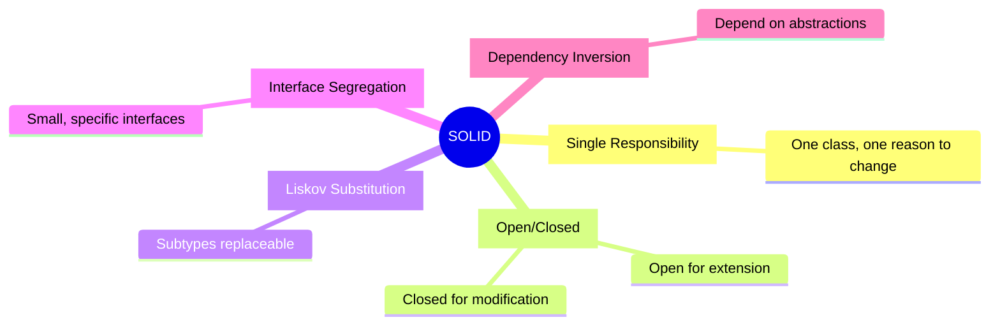

# SOLID Principles

SOLID is an acronym for five design principles that make software designs more understandable, flexible, and maintainable.

## Visualization




---

## The Five Principles

| Principle | Description |
|-----------|-------------|
| **S**ingle Responsibility | A class should have one reason to change |
| **O**pen/Closed | Open for extension, closed for modification |
| **L**iskov Substitution | Subtypes must be substitutable for base types |
| **I**nterface Segregation | Many specific interfaces > one general interface |
| **D**ependency Inversion | Depend on abstractions, not concretions |

---

## Topics in This Section

- [10.1 Single Responsibility Principle](01_single_responsibility.md)
- [10.2 Open/Closed Principle](02_open_closed.md)
- [10.3 Liskov Substitution Principle](03_liskov_substitution.md)
- [10.4 Interface Segregation Principle](04_interface_segregation.md)
- [10.5 Dependency Inversion Principle](05_dependency_inversion.md)

---

## Quick Reference

### Single Responsibility
```python
# Bad: Class does too much
class User:
    def save_to_database(self): ...
    def send_email(self): ...
    def generate_report(self): ...

# Good: Each class has one job
class User: ...
class UserRepository: def save(user): ...
class EmailService: def send(user): ...
class ReportGenerator: def generate(user): ...
```

### Open/Closed
```python
# Bad: Modify class for new shapes
class AreaCalculator:
    def calculate(self, shape):
        if shape.type == "circle":
            return 3.14 * shape.radius ** 2
        elif shape.type == "rectangle":
            return shape.width * shape.height
        # Must add new elif for each shape!

# Good: Extend without modifying
class Shape(ABC):
    @abstractmethod
    def area(self): pass

class Circle(Shape):
    def area(self): return 3.14 * self.radius ** 2

class Rectangle(Shape):
    def area(self): return self.width * self.height
```

### Liskov Substitution
```python
# Bad: Square breaks Rectangle behavior
class Rectangle:
    def set_width(self, w): self.width = w
    def set_height(self, h): self.height = h

class Square(Rectangle):
    def set_width(self, w):
        self.width = w
        self.height = w  # Unexpected side effect!

# Good: Separate abstractions
class Shape(ABC):
    @abstractmethod
    def area(self): pass
```

### Interface Segregation
```python
# Bad: Fat interface
class Worker(ABC):
    @abstractmethod
    def work(self): pass
    @abstractmethod
    def eat(self): pass

class Robot(Worker):
    def work(self): ...
    def eat(self): pass  # Robots don't eat!

# Good: Segregated interfaces
class Workable(ABC):
    @abstractmethod
    def work(self): pass

class Eatable(ABC):
    @abstractmethod
    def eat(self): pass

class Human(Workable, Eatable): ...
class Robot(Workable): ...
```

### Dependency Inversion
```python
# Bad: High-level depends on low-level
class EmailNotifier:
    def send(self, message): ...

class OrderService:
    def __init__(self):
        self.notifier = EmailNotifier()  # Tightly coupled

# Good: Both depend on abstraction
class Notifier(ABC):
    @abstractmethod
    def send(self, message): pass

class EmailNotifier(Notifier): ...
class SMSNotifier(Notifier): ...

class OrderService:
    def __init__(self, notifier: Notifier):
        self.notifier = notifier  # Injected dependency
```

---

## Why SOLID Matters

| Principle | Without It | With It |
|-----------|------------|---------|
| SRP | God classes, hard to test | Focused classes, easy to test |
| OCP | Modify existing code for changes | Add new code, existing works |
| LSP | Unexpected behavior | Predictable polymorphism |
| ISP | Forced to implement unused methods | Lean interfaces |
| DIP | Tightly coupled, hard to swap | Loosely coupled, flexible |

---

## Interview Tips

1. **Name the principle** when you apply it
2. **Show before/after** code examples
3. **Explain the benefit** of following the principle
4. **Know real-world examples** from your experience
