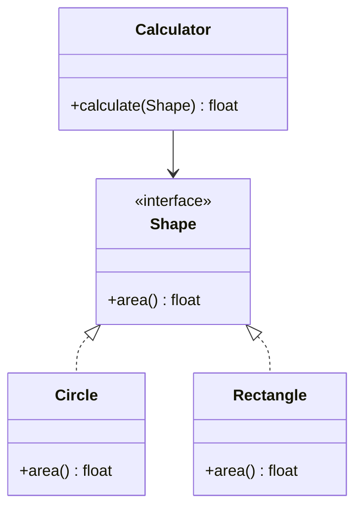

# Open/Closed Principle (OCP)

> "Software entities (classes, modules, functions) should be open for extension but closed for modification."

## Visualization




## Core Concept

- **Open for Extension**: You can add new functionality
- **Closed for Modification**: You don't change existing code

The goal is to extend behavior without modifying source code that already works.

---

## The Problem

When requirements change, we often modify existing classes:

```python
# Bad: Must modify class for each new shape
class AreaCalculator:
    def calculate(self, shape):
        if shape.type == "circle":
            return 3.14159 * shape.radius ** 2
        elif shape.type == "rectangle":
            return shape.width * shape.height
        elif shape.type == "triangle":
            return 0.5 * shape.base * shape.height
        # Must add new elif for every shape!
```

**Problems:**
- Adding new shapes requires modifying `AreaCalculator`
- Risk of breaking existing functionality
- Class grows indefinitely
- Violates Single Responsibility (knows too much about shapes)

---

## The Solution

Use abstraction and polymorphism:

```python
from abc import ABC, abstractmethod

# Abstract base class defines the contract
class Shape(ABC):
    @abstractmethod
    def area(self) -> float:
        pass

# Each shape implements its own area calculation
class Circle(Shape):
    def __init__(self, radius: float):
        self.radius = radius

    def area(self) -> float:
        return 3.14159 * self.radius ** 2

class Rectangle(Shape):
    def __init__(self, width: float, height: float):
        self.width = width
        self.height = height

    def area(self) -> float:
        return self.width * self.height

class Triangle(Shape):
    def __init__(self, base: float, height: float):
        self.base = base
        self.height = height

    def area(self) -> float:
        return 0.5 * self.base * self.height

# Calculator works with any shape - no modification needed
class AreaCalculator:
    def calculate(self, shape: Shape) -> float:
        return shape.area()

    def calculate_total(self, shapes: list[Shape]) -> float:
        return sum(shape.area() for shape in shapes)
```

**Adding a new shape:**
```python
# Just add a new class - no changes to existing code!
class Pentagon(Shape):
    def __init__(self, side: float):
        self.side = side

    def area(self) -> float:
        return 1.72 * self.side ** 2

# Works immediately with existing calculator
pentagon = Pentagon(5)
calculator = AreaCalculator()
print(calculator.calculate(pentagon))  # 43.0
```

---

## Real-World Examples

### Example 1: Payment Processing

```python
# Bad: Modification required for each payment method
class PaymentProcessor:
    def process(self, payment_type: str, amount: float):
        if payment_type == "credit_card":
            # Process credit card
            pass
        elif payment_type == "paypal":
            # Process PayPal
            pass
        elif payment_type == "crypto":
            # Process crypto - must modify!
            pass

# Good: Strategy pattern - open for extension
class PaymentStrategy(ABC):
    @abstractmethod
    def process(self, amount: float) -> bool:
        pass

class CreditCardPayment(PaymentStrategy):
    def __init__(self, card_number: str, cvv: str):
        self.card_number = card_number
        self.cvv = cvv

    def process(self, amount: float) -> bool:
        print(f"Processing ${amount} via Credit Card")
        return True

class PayPalPayment(PaymentStrategy):
    def __init__(self, email: str):
        self.email = email

    def process(self, amount: float) -> bool:
        print(f"Processing ${amount} via PayPal")
        return True

class CryptoPayment(PaymentStrategy):
    def __init__(self, wallet_address: str):
        self.wallet_address = wallet_address

    def process(self, amount: float) -> bool:
        print(f"Processing ${amount} via Crypto")
        return True

# Processor doesn't need to know about specific payment types
class PaymentProcessor:
    def process(self, strategy: PaymentStrategy, amount: float) -> bool:
        return strategy.process(amount)
```

### Example 2: Notification System

```python
# Closed for modification, open for extension
class Notifier(ABC):
    @abstractmethod
    def send(self, message: str) -> bool:
        pass

class EmailNotifier(Notifier):
    def __init__(self, email: str):
        self.email = email

    def send(self, message: str) -> bool:
        print(f"Email to {self.email}: {message}")
        return True

class SMSNotifier(Notifier):
    def __init__(self, phone: str):
        self.phone = phone

    def send(self, message: str) -> bool:
        print(f"SMS to {self.phone}: {message}")
        return True

class SlackNotifier(Notifier):
    def __init__(self, webhook_url: str):
        self.webhook_url = webhook_url

    def send(self, message: str) -> bool:
        print(f"Slack: {message}")
        return True

# Notification service works with any notifier
class NotificationService:
    def __init__(self):
        self.notifiers: list[Notifier] = []

    def add_notifier(self, notifier: Notifier):
        self.notifiers.append(notifier)

    def notify_all(self, message: str):
        for notifier in self.notifiers:
            notifier.send(message)

# Usage
service = NotificationService()
service.add_notifier(EmailNotifier("user@example.com"))
service.add_notifier(SlackNotifier("https://hooks.slack.com/..."))
service.notify_all("Server is down!")
```

### Example 3: Discount Rules

```python
from abc import ABC, abstractmethod
from dataclasses import dataclass

@dataclass
class Order:
    total: float
    customer_type: str
    items_count: int

class DiscountRule(ABC):
    @abstractmethod
    def calculate(self, order: Order) -> float:
        pass

class PercentageDiscount(DiscountRule):
    def __init__(self, percentage: float):
        self.percentage = percentage

    def calculate(self, order: Order) -> float:
        return order.total * (self.percentage / 100)

class BulkDiscount(DiscountRule):
    def __init__(self, min_items: int, discount_per_item: float):
        self.min_items = min_items
        self.discount_per_item = discount_per_item

    def calculate(self, order: Order) -> float:
        if order.items_count >= self.min_items:
            return order.items_count * self.discount_per_item
        return 0

class LoyaltyDiscount(DiscountRule):
    def calculate(self, order: Order) -> float:
        if order.customer_type == "gold":
            return order.total * 0.15
        elif order.customer_type == "silver":
            return order.total * 0.10
        return 0

# Calculator works with any combination of rules
class DiscountCalculator:
    def __init__(self):
        self.rules: list[DiscountRule] = []

    def add_rule(self, rule: DiscountRule):
        self.rules.append(rule)

    def calculate_total_discount(self, order: Order) -> float:
        return sum(rule.calculate(order) for rule in self.rules)
```

---

## Techniques to Achieve OCP

### 1. Strategy Pattern
```python
class SortStrategy(ABC):
    @abstractmethod
    def sort(self, data: list) -> list:
        pass

class QuickSort(SortStrategy):
    def sort(self, data: list) -> list:
        # Quick sort implementation
        return sorted(data)  # Simplified

class MergeSort(SortStrategy):
    def sort(self, data: list) -> list:
        # Merge sort implementation
        return sorted(data)  # Simplified

class Sorter:
    def __init__(self, strategy: SortStrategy):
        self.strategy = strategy

    def sort(self, data: list) -> list:
        return self.strategy.sort(data)
```

### 2. Template Method Pattern
```python
class DataProcessor(ABC):
    def process(self, data: str) -> str:
        parsed = self.parse(data)
        validated = self.validate(parsed)
        return self.transform(validated)

    @abstractmethod
    def parse(self, data: str) -> dict:
        pass

    @abstractmethod
    def validate(self, data: dict) -> dict:
        pass

    @abstractmethod
    def transform(self, data: dict) -> str:
        pass

class JSONProcessor(DataProcessor):
    def parse(self, data: str) -> dict:
        import json
        return json.loads(data)

    def validate(self, data: dict) -> dict:
        # JSON-specific validation
        return data

    def transform(self, data: dict) -> str:
        return str(data)
```

### 3. Decorator Pattern
```python
class Coffee(ABC):
    @abstractmethod
    def cost(self) -> float:
        pass

    @abstractmethod
    def description(self) -> str:
        pass

class SimpleCoffee(Coffee):
    def cost(self) -> float:
        return 2.0

    def description(self) -> str:
        return "Simple coffee"

class CoffeeDecorator(Coffee):
    def __init__(self, coffee: Coffee):
        self._coffee = coffee

class MilkDecorator(CoffeeDecorator):
    def cost(self) -> float:
        return self._coffee.cost() + 0.5

    def description(self) -> str:
        return self._coffee.description() + ", with milk"

class SugarDecorator(CoffeeDecorator):
    def cost(self) -> float:
        return self._coffee.cost() + 0.2

    def description(self) -> str:
        return self._coffee.description() + ", with sugar"

# Extend behavior without modifying classes
coffee = SimpleCoffee()
coffee = MilkDecorator(coffee)
coffee = SugarDecorator(coffee)
print(coffee.description())  # Simple coffee, with milk, with sugar
print(coffee.cost())  # 2.7
```

---

## Common Violations

### 1. Type Checking
```python
# Bad: Type checking indicates OCP violation
def process(item):
    if isinstance(item, TypeA):
        # Handle TypeA
        pass
    elif isinstance(item, TypeB):
        # Handle TypeB
        pass
```

### 2. Magic Strings/Constants
```python
# Bad: String comparison for behavior
def calculate_tax(country: str, amount: float):
    if country == "US":
        return amount * 0.1
    elif country == "UK":
        return amount * 0.2
```

### 3. Growing Switch Statements
```python
# Bad: Switch that grows with new types
def get_area(shape_type: str, **kwargs):
    match shape_type:
        case "circle":
            return 3.14 * kwargs["radius"] ** 2
        case "rectangle":
            return kwargs["width"] * kwargs["height"]
        # More cases added over time...
```

---

## Benefits of OCP

| Benefit | Description |
|---------|-------------|
| **Stability** | Existing code remains unchanged |
| **Testability** | New features don't affect existing tests |
| **Maintainability** | Changes are localized to new code |
| **Scalability** | Easy to add new variations |
| **Reduced Risk** | Less chance of breaking working code |

---

## When to Apply OCP

**Apply when:**
- Requirements frequently change in a specific area
- You're building a framework or library
- Multiple variations of behavior exist
- You want plugin architecture

**Don't over-apply when:**
- Code is unlikely to change
- Abstraction adds unnecessary complexity
- You're prototyping or exploring

---

## Related Topics

- [[01_single_responsibility|Single Responsibility Principle]]
- [[05_dependency_inversion|Dependency Inversion Principle]]
- [[../Design_Patterns/Behavioral/01_strategy|Strategy Pattern]]
- [[../Design_Patterns/Structural/02_decorator|Decorator Pattern]]

---

**Tags**: #solid #ocp #design-principles #oop
