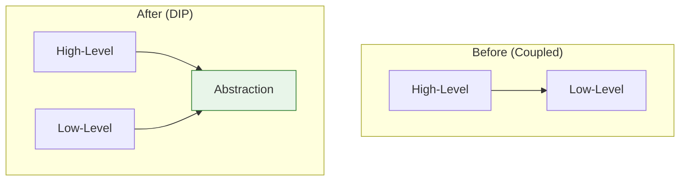

# Dependency Inversion Principle (DIP)

> "High-level modules should not depend on low-level modules. Both should depend on abstractions."
>
> "Abstractions should not depend on details. Details should depend on abstractions."

## Visualization




## Core Concept

- **High-level modules**: Business logic, orchestration
- **Low-level modules**: Implementation details (database, API, file system)
- **Inversion**: Instead of high-level depending on low-level, both depend on abstractions

---

## The Problem: Tight Coupling

```python
# Bad: High-level depends directly on low-level
class MySQLDatabase:
    def save(self, data: dict) -> None:
        print(f"Saving to MySQL: {data}")

    def fetch(self, id: int) -> dict:
        print(f"Fetching from MySQL: {id}")
        return {"id": id, "name": "Item"}

class UserService:
    def __init__(self):
        self.database = MySQLDatabase()  # Tight coupling!

    def create_user(self, name: str) -> None:
        self.database.save({"name": name})

    def get_user(self, id: int) -> dict:
        return self.database.fetch(id)
```

**Problems:**
- `UserService` can't work without `MySQLDatabase`
- Can't switch to PostgreSQL or MongoDB
- Can't mock database for testing
- Changes to `MySQLDatabase` affect `UserService`

---

## The Solution: Depend on Abstractions

```python
from abc import ABC, abstractmethod

# Abstraction (interface)
class Database(ABC):
    @abstractmethod
    def save(self, data: dict) -> None:
        pass

    @abstractmethod
    def fetch(self, id: int) -> dict:
        pass

# Low-level module implements abstraction
class MySQLDatabase(Database):
    def save(self, data: dict) -> None:
        print(f"Saving to MySQL: {data}")

    def fetch(self, id: int) -> dict:
        print(f"Fetching from MySQL: {id}")
        return {"id": id, "name": "Item"}

class PostgreSQLDatabase(Database):
    def save(self, data: dict) -> None:
        print(f"Saving to PostgreSQL: {data}")

    def fetch(self, id: int) -> dict:
        print(f"Fetching from PostgreSQL: {id}")
        return {"id": id, "name": "Item"}

class InMemoryDatabase(Database):
    def __init__(self):
        self.storage = {}
        self.counter = 0

    def save(self, data: dict) -> None:
        self.counter += 1
        self.storage[self.counter] = data

    def fetch(self, id: int) -> dict:
        return self.storage.get(id, {})

# High-level module depends on abstraction
class UserService:
    def __init__(self, database: Database):  # Dependency injection
        self.database = database

    def create_user(self, name: str) -> None:
        self.database.save({"name": name})

    def get_user(self, id: int) -> dict:
        return self.database.fetch(id)

# Usage - easy to swap implementations
user_service = UserService(MySQLDatabase())
user_service = UserService(PostgreSQLDatabase())
user_service = UserService(InMemoryDatabase())  # For testing
```

---

## Dependency Injection Methods

### 1. Constructor Injection (Recommended)

```python
class OrderService:
    def __init__(self,
                 repository: OrderRepository,
                 payment: PaymentGateway,
                 notifier: Notifier):
        self.repository = repository
        self.payment = payment
        self.notifier = notifier
```

### 2. Setter Injection

```python
class OrderService:
    def __init__(self):
        self.repository = None
        self.payment = None

    def set_repository(self, repository: OrderRepository):
        self.repository = repository

    def set_payment(self, payment: PaymentGateway):
        self.payment = payment
```

### 3. Interface Injection

```python
class RepositoryAware(ABC):
    @abstractmethod
    def set_repository(self, repository: Repository):
        pass

class OrderService(RepositoryAware):
    def set_repository(self, repository: Repository):
        self.repository = repository
```

---

## Real-World Examples

### Example 1: Notification System

```python
from abc import ABC, abstractmethod

# Abstraction
class Notifier(ABC):
    @abstractmethod
    def send(self, recipient: str, message: str) -> bool:
        pass

# Implementations
class EmailNotifier(Notifier):
    def __init__(self, smtp_server: str):
        self.smtp_server = smtp_server

    def send(self, recipient: str, message: str) -> bool:
        print(f"Email to {recipient}: {message}")
        return True

class SMSNotifier(Notifier):
    def __init__(self, api_key: str):
        self.api_key = api_key

    def send(self, recipient: str, message: str) -> bool:
        print(f"SMS to {recipient}: {message}")
        return True

class SlackNotifier(Notifier):
    def __init__(self, webhook_url: str):
        self.webhook_url = webhook_url

    def send(self, recipient: str, message: str) -> bool:
        print(f"Slack to {recipient}: {message}")
        return True

# High-level service
class AlertService:
    def __init__(self, notifiers: list[Notifier]):
        self.notifiers = notifiers

    def send_alert(self, recipient: str, message: str):
        for notifier in self.notifiers:
            notifier.send(recipient, message)

# Configuration
alert_service = AlertService([
    EmailNotifier("smtp.example.com"),
    SlackNotifier("https://hooks.slack.com/..."),
])
alert_service.send_alert("admin", "Server is down!")
```

### Example 2: Payment Processing

```python
from abc import ABC, abstractmethod
from dataclasses import dataclass

@dataclass
class PaymentResult:
    success: bool
    transaction_id: str
    message: str

class PaymentGateway(ABC):
    @abstractmethod
    def charge(self, amount: float, card_token: str) -> PaymentResult:
        pass

    @abstractmethod
    def refund(self, transaction_id: str) -> PaymentResult:
        pass

class StripeGateway(PaymentGateway):
    def __init__(self, api_key: str):
        self.api_key = api_key

    def charge(self, amount: float, card_token: str) -> PaymentResult:
        print(f"Charging ${amount} via Stripe")
        return PaymentResult(True, "stripe_123", "Success")

    def refund(self, transaction_id: str) -> PaymentResult:
        print(f"Refunding {transaction_id} via Stripe")
        return PaymentResult(True, transaction_id, "Refunded")

class PayPalGateway(PaymentGateway):
    def __init__(self, client_id: str, secret: str):
        self.client_id = client_id
        self.secret = secret

    def charge(self, amount: float, card_token: str) -> PaymentResult:
        print(f"Charging ${amount} via PayPal")
        return PaymentResult(True, "paypal_456", "Success")

    def refund(self, transaction_id: str) -> PaymentResult:
        print(f"Refunding {transaction_id} via PayPal")
        return PaymentResult(True, transaction_id, "Refunded")

# High-level order service
class OrderService:
    def __init__(self, payment_gateway: PaymentGateway):
        self.payment_gateway = payment_gateway

    def process_order(self, order_id: str, amount: float,
                     card_token: str) -> bool:
        result = self.payment_gateway.charge(amount, card_token)
        if result.success:
            print(f"Order {order_id} processed")
            return True
        return False

    def cancel_order(self, order_id: str, transaction_id: str) -> bool:
        result = self.payment_gateway.refund(transaction_id)
        return result.success

# Easy to switch payment providers
order_service = OrderService(StripeGateway("sk_test_..."))
# or
order_service = OrderService(PayPalGateway("client_id", "secret"))
```

### Example 3: Logging with DIP

```python
from abc import ABC, abstractmethod
import json
from datetime import datetime

class Logger(ABC):
    @abstractmethod
    def log(self, level: str, message: str) -> None:
        pass

class ConsoleLogger(Logger):
    def log(self, level: str, message: str) -> None:
        print(f"[{level}] {message}")

class FileLogger(Logger):
    def __init__(self, filepath: str):
        self.filepath = filepath

    def log(self, level: str, message: str) -> None:
        with open(self.filepath, "a") as f:
            f.write(f"[{datetime.now()}] [{level}] {message}\n")

class JSONLogger(Logger):
    def __init__(self, filepath: str):
        self.filepath = filepath

    def log(self, level: str, message: str) -> None:
        log_entry = {
            "timestamp": datetime.now().isoformat(),
            "level": level,
            "message": message
        }
        with open(self.filepath, "a") as f:
            f.write(json.dumps(log_entry) + "\n")

class CloudLogger(Logger):
    def __init__(self, endpoint: str, api_key: str):
        self.endpoint = endpoint
        self.api_key = api_key

    def log(self, level: str, message: str) -> None:
        # Send to cloud logging service
        print(f"Sending to cloud: [{level}] {message}")

# Application using logger
class Application:
    def __init__(self, logger: Logger):
        self.logger = logger

    def do_something(self):
        self.logger.log("INFO", "Starting operation")
        # Do work...
        self.logger.log("INFO", "Operation completed")

# Different environments
dev_app = Application(ConsoleLogger())
prod_app = Application(CloudLogger("https://logs.example.com", "key"))
```

---

## Dependency Injection Containers

### Simple DI Container

```python
class Container:
    def __init__(self):
        self._services = {}
        self._singletons = {}

    def register(self, interface, implementation, singleton=False):
        self._services[interface] = {
            'implementation': implementation,
            'singleton': singleton
        }

    def resolve(self, interface):
        if interface not in self._services:
            raise KeyError(f"Service {interface} not registered")

        service = self._services[interface]

        if service['singleton']:
            if interface not in self._singletons:
                self._singletons[interface] = service['implementation']()
            return self._singletons[interface]

        return service['implementation']()

# Usage
container = Container()
container.register(Database, MySQLDatabase, singleton=True)
container.register(Logger, ConsoleLogger)
container.register(PaymentGateway, StripeGateway)

db = container.resolve(Database)
logger = container.resolve(Logger)
```

### Factory Pattern with DI

```python
class ServiceFactory:
    def __init__(self, container: Container):
        self.container = container

    def create_user_service(self) -> UserService:
        return UserService(
            database=self.container.resolve(Database),
            logger=self.container.resolve(Logger)
        )

    def create_order_service(self) -> OrderService:
        return OrderService(
            database=self.container.resolve(Database),
            payment=self.container.resolve(PaymentGateway),
            notifier=self.container.resolve(Notifier)
        )
```

---

## Testing with DIP

```python
import unittest
from unittest.mock import Mock

class MockDatabase(Database):
    def __init__(self):
        self.data = {}
        self.save_called = False

    def save(self, data: dict) -> None:
        self.save_called = True
        self.data = data

    def fetch(self, id: int) -> dict:
        return {"id": id, "name": "Test User"}

class TestUserService(unittest.TestCase):
    def test_create_user(self):
        # Arrange
        mock_db = MockDatabase()
        service = UserService(mock_db)

        # Act
        service.create_user("John")

        # Assert
        self.assertTrue(mock_db.save_called)
        self.assertEqual(mock_db.data["name"], "John")

    def test_get_user(self):
        # Using unittest.mock
        mock_db = Mock(spec=Database)
        mock_db.fetch.return_value = {"id": 1, "name": "Jane"}

        service = UserService(mock_db)
        user = service.get_user(1)

        self.assertEqual(user["name"], "Jane")
        mock_db.fetch.assert_called_once_with(1)
```

---

## Benefits of DIP

| Benefit | Description |
|---------|-------------|
| **Testability** | Easy to mock dependencies |
| **Flexibility** | Swap implementations without code changes |
| **Maintainability** | Changes are isolated |
| **Reusability** | Components can be reused in different contexts |
| **Parallel Development** | Teams can work independently on interfaces |

---

## Common Violations

### 1. Direct Instantiation
```python
# Bad
class Service:
    def __init__(self):
        self.repo = MySQLRepository()  # Direct dependency
```

### 2. Static Dependencies
```python
# Bad
class Service:
    def do_work(self):
        Logger.log("Working...")  # Static call
```

### 3. Service Locator Anti-Pattern (Sometimes)
```python
# Can be problematic if overused
class Service:
    def do_work(self):
        repo = ServiceLocator.get(Repository)  # Hidden dependency
```

---

## Related Topics

- [[01_single_responsibility|Single Responsibility Principle]]
- [[02_open_closed|Open/Closed Principle]]
- [[../Design_Patterns/Creational/02_factory|Factory Pattern]]

---

**Tags**: #solid #dip #design-principles #oop #dependency-injection
