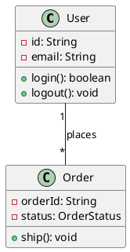

# Class Diagrams

> "Class diagrams show the static structure of a system, including classes, attributes, methods, and relationships."

## Purpose

- Model system structure
- Define class responsibilities
- Show relationships between classes
- Document design decisions

---

## Class Notation

### Basic Class

```
┌─────────────────────────────────┐
│          ClassName              │  ← Class name (bold, centered)
├─────────────────────────────────┤
│ - privateAttr: String           │  ← Attributes section
│ # protectedAttr: int            │
│ + publicAttr: bool              │
│ ~ packageAttr: List<Item>       │
├─────────────────────────────────┤
│ + publicMethod(): void          │  ← Methods section
│ - privateMethod(x: int): String │
│ # protectedMethod(): bool       │
└─────────────────────────────────┘
```

### Visibility Modifiers

| Symbol | Visibility | Meaning |
|--------|------------|---------|
| `+` | Public | Accessible from anywhere |
| `-` | Private | Only within the class |
| `#` | Protected | Class and subclasses |
| `~` | Package | Within same package |

### Abstract Class

```
┌─────────────────────────────────┐
│        <<abstract>>             │
│          Shape                  │
├─────────────────────────────────┤
│ # color: String                 │
├─────────────────────────────────┤
│ + getColor(): String            │
│ + area(): double {abstract}     │  ← Italicized = abstract
└─────────────────────────────────┘
```

### Interface

```
┌─────────────────────────────────┐
│        <<interface>>            │
│          Drawable               │
├─────────────────────────────────┤
│                                 │  ← No attributes (typically)
├─────────────────────────────────┤
│ + draw(): void                  │
│ + resize(factor: double): void  │
└─────────────────────────────────┘
```

---

## Relationships

### 1. Association

**Definition**: A "uses" or "knows about" relationship.

```
┌─────────┐         ┌─────────┐
│ Teacher │─────────│ Student │
└─────────┘         └─────────┘
     teaches ►
```

**With multiplicity:**
```
┌─────────┐  1     *  ┌─────────┐
│ Teacher │───────────│ Student │
└─────────┘           └─────────┘
   One teacher teaches many students
```

### 2. Aggregation (Has-A, Weak)

**Definition**: Whole-part relationship where parts can exist independently.

```
┌──────────┐         ┌─────────┐
│Department│◇────────│ Employee│
└──────────┘         └─────────┘
   Department has Employees (employees can exist without department)
```

### 3. Composition (Has-A, Strong)

**Definition**: Whole-part relationship where parts cannot exist without whole.

```
┌─────────┐         ┌─────────┐
│  House  │◆────────│  Room   │
└─────────┘         └─────────┘
   House owns Rooms (rooms don't exist without house)
```

### 4. Inheritance (Is-A)

**Definition**: Subclass extends superclass.

```
         ┌─────────┐
         │  Animal │
         └────△────┘
              │
    ┌─────────┴─────────┐
    │                   │
┌───┴───┐           ┌───┴───┐
│  Dog  │           │  Cat  │
└───────┘           └───────┘
```

### 5. Implementation (Realizes)

**Definition**: Class implements interface.

```
    ┌──────────────────┐
    │  <<interface>>   │
    │    Flyable       │
    └────────△─────────┘
             ┊ (dashed line)
             ┊
    ┌────────┴─────────┐
    │      Bird        │
    └──────────────────┘
```

### 6. Dependency

**Definition**: One class uses another (temporary relationship).

```
┌─────────┐           ┌─────────┐
│  Client │- - - - - ▷│ Service │
└─────────┘           └─────────┘
   Client depends on Service (uses it in a method)
```

---

## Complete Example: Library System

```
┌───────────────────────┐     ┌───────────────────────┐
│      <<abstract>>     │     │    <<interface>>      │
│      LibraryItem      │     │      Searchable       │
├───────────────────────┤     ├───────────────────────┤
│ - id: String          │     │ + matches(q): boolean │
│ - title: String       │     └───────────△───────────┘
│ - publicationYear: int│                 ┊
├───────────────────────┤                 ┊
│ + getId(): String     │                 ┊
│ + isAvailable(): bool │◄────────────────┘
└───────────△───────────┘
            │
    ┌───────┴──────────┐
    │                  │
┌───┴───────────┐  ┌───┴───────────┐
│     Book      │  │   Magazine    │
├───────────────┤  ├───────────────┤
│ - author: Str │  │ - issue: int  │
│ - isbn: String│  │ - month: int  │
├───────────────┤  ├───────────────┤
│ + getAuthor() │  │ + getIssue()  │
└───────────────┘  └───────────────┘
        │
        │ borrowed by
        ▼
┌───────────────────────┐   1     *   ┌───────────────────────┐
│       Member          │◆────────────│     BorrowRecord      │
├───────────────────────┤             ├───────────────────────┤
│ - memberId: String    │             │ - borrowDate: Date    │
│ - name: String        │             │ - dueDate: Date       │
│ - email: String       │             │ - returnDate: Date    │
├───────────────────────┤             ├───────────────────────┤
│ + borrow(item): bool  │             │ + isOverdue(): bool   │
│ + return(item): bool  │             │ + calculateFine(): $  │
└───────────────────────┘             └───────────────────────┘
```

---

## Example: E-Commerce System

```
┌─────────────────────────────────────────────────────────────────┐
│                         E-Commerce                               │
├─────────────────────────────────────────────────────────────────┤

                    ┌───────────────────┐
                    │       User        │
                    ├───────────────────┤
                    │ - id: String      │
                    │ - email: String   │
                    │ - password: String│
                    └────────△──────────┘
                             │
            ┌────────────────┴────────────────┐
            │                                 │
    ┌───────┴───────┐                ┌────────┴────────┐
    │   Customer    │                │     Admin       │
    ├───────────────┤                ├─────────────────┤
    │ - cart: Cart  │                │ - role: Role    │
    │ - addresses[] │                ├─────────────────┤
    ├───────────────┤                │ + manageProducts│
    │ + placeOrder()│                │ + viewReports() │
    └───────┬───────┘                └─────────────────┘
            │
            │ 1
            │
            ▼ 1
    ┌───────────────┐   1      *   ┌───────────────┐
    │     Cart      │◆─────────────│   CartItem    │
    ├───────────────┤              ├───────────────┤
    │ - items[]     │              │ - quantity: int│
    ├───────────────┤              │ - product     │──────┐
    │ + addItem()   │              ├───────────────┤      │
    │ + removeItem()│              │ + getSubtotal()│     │
    │ + getTotal()  │              └───────────────┘      │
    │ + checkout()  │                                     │
    └───────────────┘                                     │
            │                                             │
            │ creates                                     │
            ▼                                             │
    ┌───────────────┐   1      *   ┌───────────────┐     │
    │     Order     │◆─────────────│   OrderItem   │     │
    ├───────────────┤              ├───────────────┤     │
    │ - orderId     │              │ - quantity    │     │
    │ - status      │              │ - price       │     │
    │ - totalAmount │              │ - product ────┼─────┤
    ├───────────────┤              └───────────────┘     │
    │ + ship()      │                                    │
    │ + cancel()    │                         ┌──────────┘
    └───────────────┘                         │
            │                                 ▼
            │ payment              ┌───────────────────┐
            ▼                      │     Product       │
    ┌───────────────┐              ├───────────────────┤
    │    Payment    │              │ - productId       │
    ├───────────────┤              │ - name            │
    │ - amount      │              │ - price           │
    │ - method      │              │ - stock           │
    │ - status      │              ├───────────────────┤
    ├───────────────┤              │ + updateStock()   │
    │ + process()   │              │ + isAvailable()   │
    │ + refund()    │              └───────────────────┘
    └───────────────┘
└─────────────────────────────────────────────────────────────────┘
```

---

## Tips for Interviews

### Do's
- Start with main entities
- Use clear, meaningful names
- Show key attributes only
- Include important methods
- Label relationships

### Don'ts
- Don't include every getter/setter
- Don't overcomplicate
- Don't forget multiplicity
- Don't mix levels of detail

### Quick Drawing Order
1. Draw main classes as boxes
2. Add key attributes
3. Add key methods
4. Draw relationships
5. Add multiplicities
6. Add labels if needed

---

## PlantUML Syntax



---

## Related Topics

- [[00_uml_diagrams|UML Overview]]
- [[02_sequence_diagrams|Sequence Diagrams]]
- [[../SOLID_Principles/00_solid|SOLID Principles]]

---

**Tags**: #uml #class-diagram #lld #relationships #modeling
