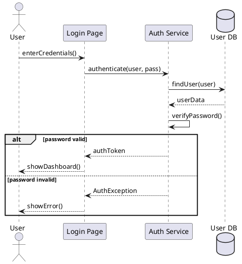

# Sequence Diagrams

> "Sequence diagrams show how objects interact in a particular scenario, arranged in time sequence."

## Purpose

- Visualize object interactions over time
- Show method calls and responses
- Document complex workflows
- Clarify system behavior

---

## Basic Elements

### Participants (Lifelines)

```
┌─────────┐  ┌─────────┐  ┌─────────┐
│  User   │  │ System  │  │Database │
└────┬────┘  └────┬────┘  └────┬────┘
     │            │            │
     │            │            │
     │            │            │
     ▼            ▼            ▼
```

### Messages

```
┌─────────┐       ┌─────────┐
│  Client │       │ Server  │
└────┬────┘       └────┬────┘
     │                 │
     │  request()      │    Synchronous call
     │────────────────▶│
     │                 │
     │    response     │    Return
     │◀────────────────│
     │                 │
     │  async()        │    Asynchronous call
     │ - - - - - - - -▶│
     │                 │
```

### Message Types

| Arrow | Meaning |
|-------|---------|
| `──────▶` | Synchronous message |
| `- - - -▶` | Asynchronous message |
| `◀──────` | Return message |
| `──────▶` (to self) | Self-call |

---

## Activation Boxes

Show when an object is active (processing):

```
┌─────────┐       ┌─────────┐
│  Client │       │ Service │
└────┬────┘       └────┬────┘
     │                 │
     │   process()     │
     │────────────────▶│
     │                 ┌┴┐  ← Activation (processing)
     │                 │ │
     │                 │ │
     │    result       │ │
     │◀────────────────┴┬┘
     │                  │
```

---

## Combined Fragments

### Alternative (if-else)

```
┌─────────┐       ┌─────────┐
│  Client │       │ Service │
└────┬────┘       └────┬────┘
     │                 │
     │   validate()    │
     │────────────────▶│
     │                 │
     ┌─────────────────┴─────────────────┐
     │ alt [valid]                       │
     ├───────────────────────────────────┤
     │    │    success    │              │
     │    │◀──────────────│              │
     ├───────────────────────────────────┤
     │ [invalid]                         │
     │    │    error      │              │
     │    │◀──────────────│              │
     └───────────────────────────────────
```

### Loop

```
┌─────────┐       ┌─────────┐
│ Handler │       │  Queue  │
└────┬────┘       └────┬────┘
     │                 │
     ┌─────────────────┴─────────────────┐
     │ loop [while messages exist]       │
     │    │                 │            │
     │    │   getMessage()  │            │
     │    │────────────────▶│            │
     │    │     message     │            │
     │    │◀────────────────│            │
     │    │                 │            │
     │    │   process()     │            │
     │    │─────┐           │            │
     │    │     │           │            │
     │    │◀────┘           │            │
     └────┴─────────────────┴────────────┘
```

### Optional (if)

```
     ┌─────────────────┴─────────────────┐
     │ opt [condition met]               │
     │    │                 │            │
     │    │   optional()    │            │
     │    │────────────────▶│            │
     └────┴─────────────────┴────────────┘
```

---

## Complete Example: User Login

```
┌──────────┐    ┌──────────┐    ┌──────────┐    ┌──────────┐
│   User   │    │LoginPage │    │AuthService│   │ Database │
└────┬─────┘    └────┬─────┘    └─────┬─────┘   └─────┬────┘
     │               │                │               │
     │ enterCredentials()             │               │
     │──────────────▶│                │               │
     │               │                │               │
     │               │ authenticate(user, pass)       │
     │               │───────────────▶│               │
     │               │                │               │
     │               │                │ findUser(user)│
     │               │                │──────────────▶│
     │               │                │               │
     │               │                │   userData    │
     │               │                │◀──────────────│
     │               │                │               │
     │               │                │ verifyPassword()
     │               │                │─────┐         │
     │               │                │     │         │
     │               │                │◀────┘         │
     │               │                │               │
     ┌───────────────┴────────────────┴───────────────┐
     │ alt [password valid]                           │
     ├────────────────────────────────────────────────┤
     │  │               │                │            │
     │  │               │ createSession()│            │
     │  │               │─────┐          │            │
     │  │               │     │          │            │
     │  │               │◀────┘          │            │
     │  │               │                │            │
     │  │               │   authToken    │            │
     │  │               │◀───────────────│            │
     │  │               │                │            │
     │  │  showDashboard()               │            │
     │  │◀──────────────│                │            │
     ├────────────────────────────────────────────────┤
     │ [password invalid]                             │
     │  │               │                │            │
     │  │               │ AuthException  │            │
     │  │               │◀───────────────│            │
     │  │               │                │            │
     │  │  showError("Invalid credentials")           │
     │  │◀──────────────│                │            │
     └────────────────────────────────────────────────┘
```

---

## Example: Order Processing

```
┌────────┐  ┌────────────┐  ┌───────────┐  ┌─────────┐  ┌─────────┐
│Customer│  │OrderService│  │ Inventory │  │ Payment │  │Notification│
└───┬────┘  └─────┬──────┘  └─────┬─────┘  └────┬────┘  └─────┬─────┘
    │             │               │             │             │
    │ placeOrder(items)           │             │             │
    │────────────▶│               │             │             │
    │             │               │             │             │
    │             │ checkStock(items)           │             │
    │             │──────────────▶│             │             │
    │             │               │             │             │
    │             │   availability│             │             │
    │             │◀──────────────│             │             │
    │             │               │             │             │
    ┌─────────────┴───────────────┴─────────────┴─────────────┐
    │ alt [items available]                                   │
    ├─────────────────────────────────────────────────────────┤
    │ │             │               │             │           │
    │ │             │ reserveStock(items)         │           │
    │ │             │──────────────▶│             │           │
    │ │             │               │             │           │
    │ │             │ processPayment(amount)      │           │
    │ │             │────────────────────────────▶│           │
    │ │             │               │             │           │
    │ │             │               │  paymentResult          │
    │ │             │◀────────────────────────────│           │
    │ │             │               │             │           │
    │ ┌─────────────┴───────────────┴─────────────┴───────────┐
    │ │ alt [payment success]                                 │
    │ ├───────────────────────────────────────────────────────┤
    │ │ │             │               │             │         │
    │ │ │             │ confirmReservation()        │         │
    │ │ │             │──────────────▶│             │         │
    │ │ │             │               │             │         │
    │ │ │             │ sendConfirmation(email)               │
    │ │ │             │────────────────────────────────────▶ │
    │ │ │             │               │             │         │
    │ │ │ orderConfirmed              │             │         │
    │ │ │◀────────────│               │             │         │
    │ ├───────────────────────────────────────────────────────┤
    │ │ [payment failed]                                      │
    │ │ │             │               │             │         │
    │ │ │             │ releaseStock(items)         │         │
    │ │ │             │──────────────▶│             │         │
    │ │ │             │               │             │         │
    │ │ │ paymentFailed               │             │         │
    │ │ │◀────────────│               │             │         │
    │ └───────────────────────────────────────────────────────┘
    ├─────────────────────────────────────────────────────────┤
    │ [items not available]                                   │
    │ │             │               │             │           │
    │ │ outOfStock  │               │             │           │
    │ │◀────────────│               │             │           │
    └─────────────────────────────────────────────────────────┘
```

---

## Example: ATM Withdrawal

```
┌──────────┐  ┌──────────┐  ┌──────────┐  ┌──────────┐
│   User   │  │    ATM   │  │   Bank   │  │  Account │
└────┬─────┘  └────┬─────┘  └────┬─────┘  └────┬─────┘
     │             │             │             │
     │ insertCard  │             │             │
     │────────────▶│             │             │
     │             │             │             │
     │ enterPIN    │             │             │
     │────────────▶│             │             │
     │             │             │             │
     │             │ validatePIN(card, pin)    │
     │             │────────────▶│             │
     │             │             │             │
     │             │             │ getAccount(card)
     │             │             │────────────▶│
     │             │             │             │
     │             │             │   account   │
     │             │             │◀────────────│
     │             │             │             │
     │             │   valid     │             │
     │             │◀────────────│             │
     │             │             │             │
     │ selectWithdraw(amount)    │             │
     │────────────▶│             │             │
     │             │             │             │
     │             │ withdraw(account, amount) │
     │             │────────────▶│             │
     │             │             │             │
     │             │             │ checkBalance()
     │             │             │────────────▶│
     │             │             │             │
     │             │             │   balance   │
     │             │             │◀────────────│
     │             │             │             │
     ┌─────────────┴─────────────┴─────────────┐
     │ alt [balance >= amount]                 │
     ├─────────────────────────────────────────┤
     │ │             │             │           │
     │ │             │             │ debit(amt)│
     │ │             │             │──────────▶│
     │ │             │             │           │
     │ │             │   success   │           │
     │ │             │◀────────────│           │
     │ │             │             │           │
     │ │ dispenseCash│             │           │
     │ │◀────────────│             │           │
     ├─────────────────────────────────────────┤
     │ [balance < amount]                      │
     │ │             │             │           │
     │ │             │ insufficientFunds       │
     │ │             │◀────────────│           │
     │ │             │             │           │
     │ │ displayError│             │           │
     │ │◀────────────│             │           │
     └─────────────────────────────────────────┘
```

---

## Tips for Interviews

### Do's
- Keep participants to 4-6 max
- Show main flow first
- Use alt/opt for conditions
- Include return messages for clarity

### Don'ts
- Don't show every detail
- Don't overcrowd the diagram
- Don't forget activation boxes for complex flows

### Drawing Order
1. Identify participants (left to right by interaction order)
2. Draw main success flow
3. Add error handling with alt fragments
4. Add loops if needed
5. Label messages clearly

---

## PlantUML Syntax



---

## Related Topics

- [[00_uml_diagrams|UML Overview]]
- [[01_class_diagrams|Class Diagrams]]
- [[03_use_case_diagrams|Use Case Diagrams]]

---

**Tags**: #uml #sequence-diagram #lld #interactions #workflows
