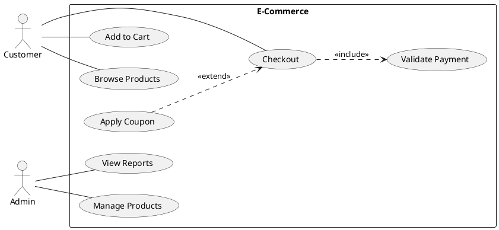

# Use Case Diagrams

> "Use case diagrams show the functionality of a system from the user's perspective, depicting actors and their interactions with the system."

## Purpose

- Capture functional requirements
- Identify system actors
- Define system boundaries
- Communicate with stakeholders

---

## Basic Elements

### Actor

```
    ┌───┐
    │ O │   ← Actor (stick figure)
    ├─┼─┤
    │   │
    └───┘
  Customer
```

Actors can be:
- **Primary**: Users who directly use the system
- **Secondary**: External systems or services
- **Offstage**: Stakeholders with interests

### Use Case

```
┌─────────────────────────────┐
│                             │
│    (     Use Case     )     │  ← Oval shape
│                             │
└─────────────────────────────┘
```

### System Boundary

```
┌─────────────────────────────────────────┐
│              System Name                 │
│  ┌─────────────────────────────────┐    │
│  │                                  │    │
│  │      (    Use Case 1     )      │    │
│  │                                  │    │
│  │      (    Use Case 2     )      │    │
│  │                                  │    │
│  └─────────────────────────────────┘    │
└─────────────────────────────────────────┘
```

---

## Relationships

### Association

Actor participates in use case:

```
    Actor ────────── (Use Case)
```

### Include

One use case always includes another:

```
    (Base Use Case) ─ ─ ─ ─ ─▷ (Included Use Case)
                    <<include>>
```

**Example**: "Place Order" always includes "Validate Payment"

### Extend

One use case optionally extends another:

```
    (Extension) ─ ─ ─ ─ ─▷ (Base Use Case)
               <<extend>>
```

**Example**: "Apply Coupon" extends "Checkout"

### Generalization

Specialized actor or use case:

```
    (Specialized) ───────△ (General)
```

---

## Complete Example: E-Commerce System

```
┌─────────────────────────────────────────────────────────────────────────┐
│                          E-Commerce System                               │
│                                                                          │
│   ┌────┐                                                    ┌────┐      │
│   │ O  │                                                    │ □  │      │
│   ├─┼──┤                                                    │    │      │
│   │    │                                                    │    │      │
│   Customer                                              Payment Gateway  │
│      │                                                         │         │
│      │         ┌─────────────────────────────────────┐        │         │
│      │         │                                     │        │         │
│      ├─────────┤      (  Browse Products  )          │        │         │
│      │         │                                     │        │         │
│      │         │                                     │        │         │
│      ├─────────┤      (  Search Products  )          │        │         │
│      │         │                                     │        │         │
│      │         │                                     │        │         │
│      ├─────────┤      (  Add to Cart      )          │        │         │
│      │         │                                     │        │         │
│      │         │                                     │        │         │
│      ├─────────┤      (    Checkout       )─ ─ ─ ─ ─ ┼ ─ ─ ─ ─┤         │
│      │         │              │ <<include>>          │        │         │
│      │         │              ▽                      │        │         │
│      │         │      ( Validate Payment  )          │        │         │
│      │         │              │ <<include>>          │        │         │
│      │         │              ▽                      │        │         │
│      │         │      ( Update Inventory  )          │        │         │
│      │         │                                     │        │         │
│      │         │                                     │        │         │
│      ├─────────┤      (   Apply Coupon    )─ ─ ─ ─ ─▷│(Checkout)        │
│      │         │              <<extend>>             │        │         │
│      │         │                                     │        │         │
│      ├─────────┤      (   View Orders     )          │        │         │
│      │         │                                     │        │         │
│      │         │                                     │        │         │
│      ├─────────┤      (   Track Order     )          │        │         │
│      │         │                                     │        │         │
│      │         │                                     │        │         │
│      └─────────┤      ( Request Refund    )          │        │         │
│                │                                     │        │         │
│                └─────────────────────────────────────┘        │         │
│                                                               │         │
│   ┌────┐                                                      │         │
│   │ O  │                                                      │         │
│   ├─┼──┤────────────────────────────────────────────────────────        │
│   │    │                                                                 │
│   Admin                                                                  │
│      │         ┌─────────────────────────────────────┐                  │
│      │         │                                     │                  │
│      ├─────────┤    ( Manage Products    )           │                  │
│      │         │                                     │                  │
│      ├─────────┤    ( Manage Inventory   )           │                  │
│      │         │                                     │                  │
│      ├─────────┤    ( Process Refunds    )           │                  │
│      │         │                                     │                  │
│      ├─────────┤    ( View Reports       )           │                  │
│      │         │                                     │                  │
│      └─────────┤    ( Manage Users       )           │                  │
│                │                                     │                  │
│                └─────────────────────────────────────┘                  │
│                                                                          │
└─────────────────────────────────────────────────────────────────────────┘
```

---

## Example: ATM System

```
┌─────────────────────────────────────────────────────────────┐
│                        ATM System                            │
│                                                              │
│   ┌────┐                                         ┌────┐     │
│   │ O  │                                         │ □  │     │
│   ├─┼──┤                                         │    │     │
│   │    │                                         └────┘     │
│  Customer                                      Bank Server   │
│      │                                              │        │
│      │         ┌───────────────────────────────┐   │        │
│      │         │                               │   │        │
│      ├─────────┤     ( Insert Card )           │   │        │
│      │         │            │                  │   │        │
│      │         │            │ <<include>>      │   │        │
│      │         │            ▽                  │   │        │
│      │         │     ( Authenticate ) ─────────┼───┤        │
│      │         │                               │   │        │
│      │         │                               │   │        │
│      ├─────────┤     ( Check Balance )─────────┼───┤        │
│      │         │                               │   │        │
│      │         │                               │   │        │
│      ├─────────┤     ( Withdraw Cash )─────────┼───┤        │
│      │         │            │                  │   │        │
│      │         │            │ <<include>>      │   │        │
│      │         │            ▽                  │   │        │
│      │         │     ( Dispense Cash )         │   │        │
│      │         │            │                  │   │        │
│      │         │            │ <<include>>      │   │        │
│      │         │            ▽                  │   │        │
│      │         │     ( Print Receipt )         │   │        │
│      │         │                               │   │        │
│      │         │                               │   │        │
│      ├─────────┤     ( Deposit Funds )─────────┼───┤        │
│      │         │                               │   │        │
│      │         │                               │   │        │
│      ├─────────┤     ( Transfer Funds )────────┼───┤        │
│      │         │                               │   │        │
│      │         │                               │   │        │
│      └─────────┤     ( Change PIN )────────────┼───┤        │
│                │                               │   │        │
│                └───────────────────────────────┘   │        │
│                                                    │        │
│   ┌────┐                                           │        │
│   │ O  │                                           │        │
│   ├─┼──┤───────────────────────────────────────────┤        │
│   │    │                                           │        │
│  Technician                                        │        │
│      │         ┌───────────────────────────────┐   │        │
│      ├─────────┤    ( Refill Cash )            │   │        │
│      ├─────────┤    ( Perform Maintenance )    │   │        │
│      └─────────┤    ( View Logs )              │   │        │
│                └───────────────────────────────┘            │
└─────────────────────────────────────────────────────────────┘
```

---

## Example: Library System

```
┌────────────────────────────────────────────────────────────────┐
│                     Library Management System                   │
│                                                                 │
│                                                                 │
│  ┌────┐                                                        │
│  │ O  │                                                        │
│  ├─┼──┤                                                        │
│  │    │                                                        │
│  Member                                                        │
│     │         ┌─────────────────────────────────────┐          │
│     │         │                                     │          │
│     ├─────────┤    ( Search Books )                 │          │
│     │         │                                     │          │
│     ├─────────┤    ( Browse Catalog )               │          │
│     │         │                                     │          │
│     ├─────────┤    ( Reserve Book )                 │          │
│     │         │           │                         │          │
│     │         │           │ <<extend>>              │          │
│     │         │           ▽                         │          │
│     │         │    ( Notify When Available )        │          │
│     │         │                                     │          │
│     ├─────────┤    ( Borrow Book )                  │          │
│     │         │           │                         │          │
│     │         │           │ <<include>>             │          │
│     │         │           ▽                         │          │
│     │         │    ( Update Member Record )         │          │
│     │         │                                     │          │
│     ├─────────┤    ( Return Book )                  │          │
│     │         │           │                         │          │
│     │         │           │ <<include>>             │          │
│     │         │           ▽                         │          │
│     │         │    ( Calculate Fine )               │          │
│     │         │                                     │          │
│     ├─────────┤    ( Renew Book )                   │          │
│     │         │                                     │          │
│     └─────────┤    ( Pay Fines )                    │          │
│               │                                     │          │
│               └─────────────────────────────────────┘          │
│                                                                 │
│  ┌────┐           △                                            │
│  │ O  │           │ (generalization)                           │
│  ├─┼──┤───────────┘                                            │
│  │    │                                                        │
│  Librarian                                                     │
│     │         ┌─────────────────────────────────────┐          │
│     ├─────────┤    ( Add Book )                     │          │
│     ├─────────┤    ( Remove Book )                  │          │
│     ├─────────┤    ( Update Book Info )             │          │
│     ├─────────┤    ( Register Member )              │          │
│     ├─────────┤    ( Issue Book )                   │          │
│     ├─────────┤    ( Receive Return )               │          │
│     └─────────┤    ( Generate Reports )             │          │
│               └─────────────────────────────────────┘          │
│                                                                 │
└────────────────────────────────────────────────────────────────┘
```

---

## Include vs Extend

| Aspect | Include | Extend |
|--------|---------|--------|
| **Direction** | Base → Included | Extension → Base |
| **Mandatory** | Always executed | Optional/conditional |
| **Dependency** | Base depends on included | Extension depends on base |
| **Example** | Login includes Authenticate | Premium Features extends Login |

### Visual Comparison

```
Include: Base ─ ─ ─ ─ ─▷ Included
         "I always need this"

Extend:  Extension ─ ─ ─ ─ ─▷ Base
         "I optionally add to this"
```

---

## Tips for Interviews

### Do's
- Identify all actors first
- Focus on user goals, not steps
- Use include for common behavior
- Use extend for optional features
- Keep use cases at appropriate level

### Don'ts
- Don't show UI details
- Don't include implementation details
- Don't have too many use cases (7±2 per actor)
- Don't overuse include/extend

### Naming Conventions
- Use case names: Verb + Noun (e.g., "Place Order")
- Actor names: Role-based (e.g., "Customer", not "John")
- Keep names short and descriptive

---

## PlantUML Syntax



---

## Related Topics

- [[00_uml_diagrams|UML Overview]]
- [[01_class_diagrams|Class Diagrams]]
- [[02_sequence_diagrams|Sequence Diagrams]]

---

**Tags**: #uml #use-case #lld #requirements #actors
