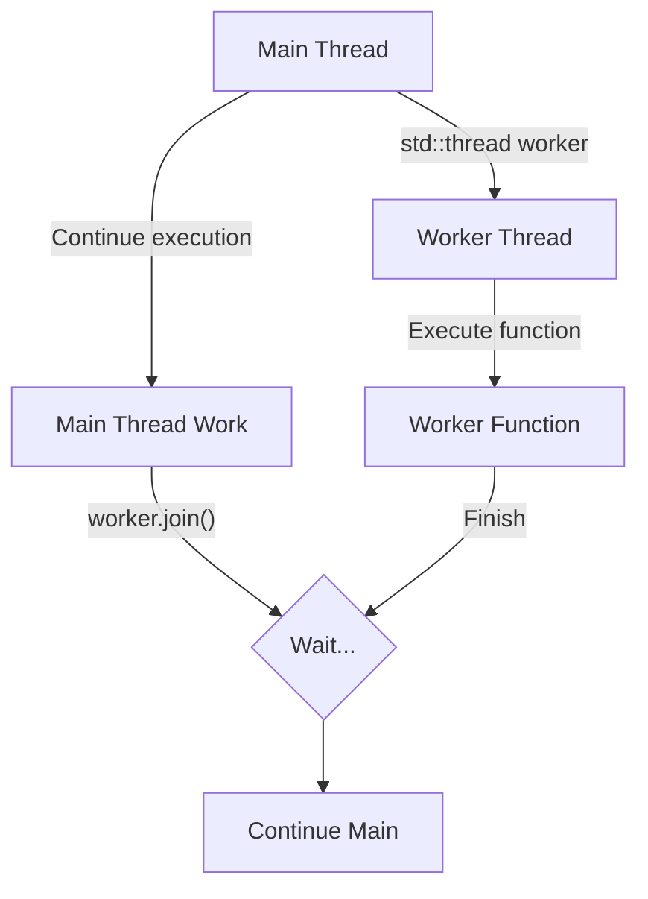

# Threads

C++11 introduced a standard library for managing threads, which allows you to run multiple parts of your program concurrently.

To use threads, you need to include the `<thread>` header.

## Creating a Thread

You can create a new thread by creating an object of the `std::thread` class. The constructor of `std::thread` takes a callable object (a function, function object, or lambda expression) that will be executed in the new thread.

### Example

```cpp
#include <iostream>
#include <thread>

void worker_function() {
    std::cout << "Worker thread started." << std::endl;
    // ... do some work ...
    std::cout << "Worker thread finished." << std::endl;
}

int main() {
    std::thread worker(worker_function);

    std::cout << "Main thread." << std::endl;

    // ... main thread can do other work ...

    // Wait for the worker thread to finish
    worker.join();

    return 0;
}
```
When you compile this, you may need to link the pthread library: `g++ my_program.cpp -o my_program -pthread`.

### Visualization




## Joining and Detaching Threads

Once a thread is started, you must decide what to do with it.

### `join()`

`worker.join()` blocks the current thread (in this case, the main thread) until the `worker` thread has finished its execution. You must call either `join()` or `detach()` on a `std::thread` object before it is destroyed.

### `detach()`

`worker.detach()` separates the thread from the `std::thread` object. The thread will continue to run in the background, and you can no longer communicate with it. If the main program exits, the detached thread will be terminated.

Detached threads can be useful for "fire and forget" tasks, but they can also be dangerous if not managed carefully. In general, it is safer to `join()` your threads.

## Passing Arguments to a Thread

You can pass arguments to the thread's function by passing them to the `std::thread` constructor.

```cpp
#include <iostream>
#include <thread>
#include <string>

void print_message(const std::string& msg, int count) {
    for (int i = 0; i < count; ++i) {
        std::cout << msg << std::endl;
    }
}

int main() {
    std::thread t(print_message, "Hello from thread", 5);
    t.join();
    return 0;
}
```
**Important:** The arguments are copied into the thread's storage. If you want to pass an argument by reference, you must use `std::ref`.

```cpp
std::thread t(my_function, std::ref(my_variable));
```

## The Dangers of Concurrency

When multiple threads access shared data, you can run into problems like **race conditions**. A race condition occurs when the result of a program depends on the relative timing of two or more threads.

To avoid race conditions, you need to use synchronization primitives like mutexes, which we will discuss in the next section.
