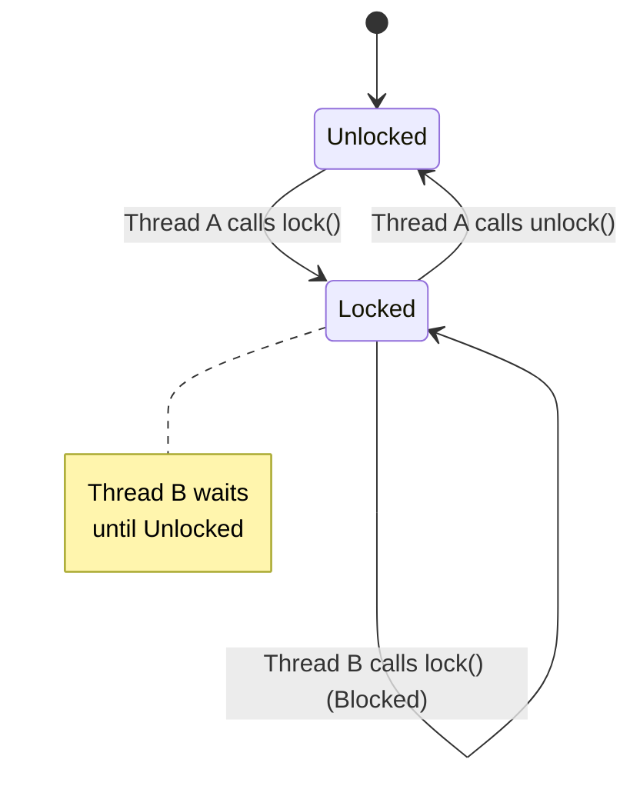

# Mutexes

A mutex (short for **mut**ual **ex**clusion) is a synchronization primitive that is used to protect shared data from being simultaneously accessed by multiple threads.

A mutex has two states: locked and unlocked. Before a thread can access a shared resource, it must lock the mutex. When it is finished with the resource, it must unlock the mutex. Only one thread can have the mutex locked at any given time.

To use mutexes, you need to include the `<mutex>` header.

### Visualization




## `std::mutex`

The `std::mutex` class provides a basic mutex.

*   `lock()`: Locks the mutex. If the mutex is already locked by another thread, the calling thread will block until it is unlocked.
*   `unlock()`: Unlocks the mutex.
*   `try_lock()`: Tries to lock the mutex. If the mutex is already locked, it returns `false` without blocking.

### Example (the wrong way)

```cpp
#include <iostream>
#include <thread>
#include <vector>
#include <mutex>

std::mutex mtx;
int shared_counter = 0;

void increment() {
    for (int i = 0; i < 10000; ++i) {
        mtx.lock();
        shared_counter++;
        mtx.unlock();
    }
}

int main() {
    std::vector<std::thread> threads;
    for (int i = 0; i < 10; ++i) {
        threads.push_back(std::thread(increment));
    }

    for (auto& th : threads) {
        th.join();
    }

    std::cout << "Final counter value: " << shared_counter << std::endl;
    return 0;
}
```
This code is correct, but manually calling `lock()` and `unlock()` is dangerous. If an exception is thrown between the `lock()` and `unlock()` calls, the mutex will never be unlocked, leading to a deadlock.

## RAII to the rescue: `std::lock_guard` and `std::unique_lock`

To solve this problem, the C++ standard library provides RAII-style wrappers for mutexes.

### `std::lock_guard`

`std::lock_guard` is a simple RAII wrapper. It locks the mutex in its constructor and unlocks it in its destructor.

```cpp
void increment() {
    for (int i = 0; i < 10000; ++i) {
        std::lock_guard<std::mutex> lock(mtx);
        shared_counter++;
    } // lock_guard goes out of scope and unlocks the mutex
}
```
This is much safer because the mutex is guaranteed to be unlocked, even if an exception is thrown.

### `std::unique_lock`

`std::unique_lock` is a more flexible RAII wrapper. It provides the same functionality as `std::lock_guard`, but also allows you to:
*   Defer locking (`std::defer_lock`).
*   Try to lock (`std::try_to_lock`).
*   Unlock the mutex before the `unique_lock` goes out of scope (`unlock()`).
*   Transfer ownership of the lock.

`std::unique_lock` is required when you are using condition variables, which we will see in the next section.

## Other types of Mutexes

*   **`std::recursive_mutex`:** A mutex that can be locked multiple times by the same thread.
*   **`std::timed_mutex`:** A mutex that can be locked with a timeout (`try_lock_for`, `try_lock_until`).
*   **`std::shared_mutex` (C++17):** A readers-writer lock. It allows multiple threads to read the data concurrently, but only one thread to write. This can be more efficient in situations where reads are much more frequent than writes.
