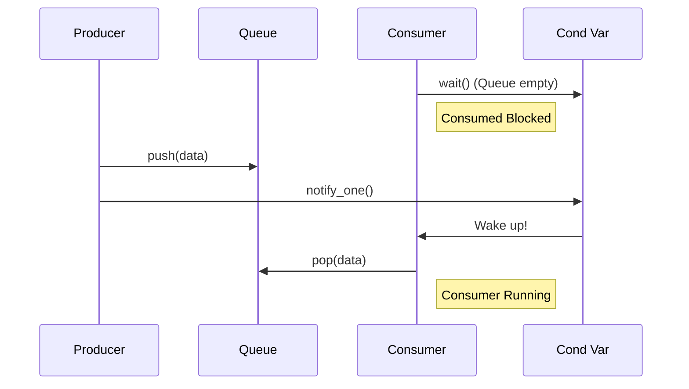

# Condition Variables

A condition variable is a synchronization primitive that allows threads to wait for a certain condition to become true.

Condition variables are used in conjunction with a mutex to control access to shared data. A thread can wait on a condition variable, which will block the thread until it is notified by another thread.

To use condition variables, you need to include the `<condition_variable>` header.

## `std::condition_variable`

The `std::condition_variable` class provides a condition variable.

*   `wait(lock, predicate)`: Waits for the condition variable to be notified. The `lock` is a `std::unique_lock` on the mutex that protects the shared data. The `predicate` is an optional callable that returns `false` if the thread should continue to wait. Using a predicate is important to avoid **spurious wakeups**.
*   `notify_one()`: Wakes up one of the waiting threads.
*   `notify_all()`: Wakes up all of the waiting threads.

### Visualization




## Producer-Consumer Problem

A classic example of using condition variables is the producer-consumer problem. In this problem, one or more "producer" threads produce data and put it into a queue, and one or more "consumer" threads take data from the queue and process it.

### Example

```cpp
#include <iostream>
#include <thread>
#include <vector>
#include <queue>
#include <mutex>
#include <condition_variable>

std::mutex mtx;
std::condition_variable cv;
std::queue<int> data_queue;
const int MAX_QUEUE_SIZE = 10;

void producer() {
    for (int i = 0; i < 20; ++i) {
        std::unique_lock<std::mutex> lock(mtx);
        cv.wait(lock, [] { return data_queue.size() < MAX_QUEUE_SIZE; });
        data_queue.push(i);
        std::cout << "Produced: " << i << std::endl;
        lock.unlock();
        cv.notify_one();
    }
}

void consumer() {
    while (true) {
        std::unique_lock<std::mutex> lock(mtx);
        cv.wait(lock, [] { return !data_queue.empty(); });
        int data = data_queue.front();
        data_queue.pop();
        std::cout << "Consumed: " << data << std::endl;
        lock.unlock();
        cv.notify_one(); // notify the producer that there is space
        if (data == 19) break; // exit condition
    }
}

int main() {
    std::thread p(producer);
    std::thread c(consumer);

    p.join();
    c.join();

    return 0;
}
```
### How it works:

1.  **Producer:**
    *   Locks the mutex.
    *   Waits on the condition variable until there is space in the queue (`data_queue.size() < MAX_QUEUE_SIZE`). `cv.wait()` automatically unlocks the mutex while it is waiting and re-locks it when it wakes up.
    *   Pushes data onto the queue.
    *   Unlocks the mutex.
    *   Notifies one of the waiting consumer threads.

2.  **Consumer:**
    *   Locks the mutex.
    *   Waits until the queue is not empty (`!data_queue.empty()`).
    *   Pops data from the queue.
    *   Unlocks the mutex.
    *   Notifies the producer that there is now space in the queue.

Condition variables are a powerful tool for building complex synchronization patterns between threads.
