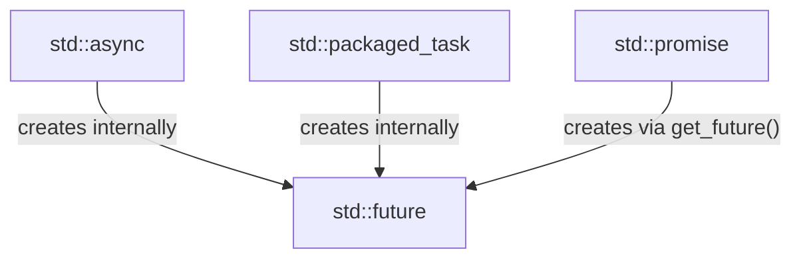
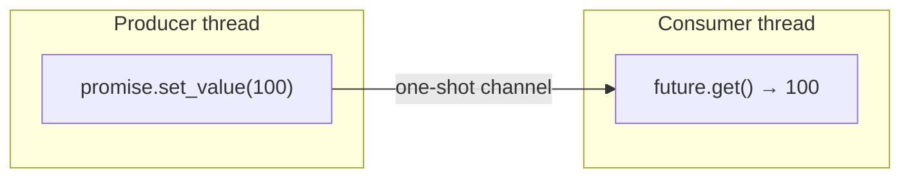

# `std::async` and `std::future`

`std::async` and `std::future` (since C++11) provide a convenient way to run a function asynchronously and get its result back. They are part of the `<future>` header.

This is a higher-level, task-based abstraction compared to `std::thread`:

| Thread-based (`std::thread`) | Task-based (`std::async`) |
|---|---|
| You manage the thread directly | The runtime manages threads for you |
| No built-in way to get a return value | Returns a `std::future` holding the result |
| Must call `join()` / `detach()` manually | Cleanup is handled automatically |

## `std::async`

You launch a function with `std::async`, which returns a `std::future`. Calling `.get()` on the future blocks until the result is ready.

```cpp
#include <iostream>
#include <future>
#include <chrono>

int calculate_something() {
    std::this_thread::sleep_for(std::chrono::seconds(2));
    return 42;
}

int main() {
    std::future<int> result_future = std::async(calculate_something);

    std::cout << "Doing other work..." << std::endl;

    int result = result_future.get(); // blocks until calculation is finished
    std::cout << "The result is: " << result << std::endl;

    return 0;
}
```

### Launch Policies

`std::async` accepts an optional launch policy as the first argument:

*   **`std::launch::async`:** Guarantees the function runs in a new thread.
*   **`std::launch::deferred`:** The function only runs when `get()` is called, on the calling thread. No parallelism at all (lazy evaluation).
*   **Default:** `std::launch::async | std::launch::deferred`. The implementation chooses. This means your code might not actually run in parallel.

> **Caveat:** If you need true concurrency, always be explicit:
> ```cpp
> auto fut = std::async(std::launch::async, calculate_something);
> ```

## Lower-level Alternatives: `std::promise` and `std::packaged_task`

`std::async` is convenient, but it controls everything for you. For more flexibility, C++ offers two lower-level tools. All three produce a `std::future`, but at different levels of control:



### `std::promise` — Manual Channel

A `std::promise` is the **write end** of a one-shot channel. You pass it as an argument into a thread, and the thread "returns" a value by calling `set_value()`. The **read end** is the `std::future` you extract from it.

Think of it as an **argument-based return** — the thread doesn't return a value normally, it writes to the promise you handed it.



```cpp
#include <iostream>
#include <thread>
#include <future>

void produce(std::promise<int> prom) {
    prom.set_value(100);
}

int main() {
    std::promise<int> my_promise;
    std::future<int> my_future = my_promise.get_future();

    std::thread t(produce, std::move(my_promise));

    std::cout << "Value received: " << my_future.get() << std::endl;

    t.join();
    return 0;
}
```

### `std::packaged_task` — Callable with a Built-in Promise

A `std::packaged_task` wraps a function and wires up a promise internally. When you invoke the task, it:
1. Calls the wrapped function
2. Takes the return value
3. Automatically calls `set_value()` on its internal promise

The key difference from `std::async`: **you** decide when and where to invoke it.

```cpp
#include <iostream>
#include <thread>
#include <future>

int calculate_something() {
    return 42;
}

int main() {
    // Wrap the function — does NOT run it yet
    std::packaged_task<int()> task(calculate_something);

    // Get the future BEFORE invoking
    std::future<int> result = task.get_future();

    // YOU decide when to run it — here, on a new thread
    std::thread t(std::move(task));

    std::cout << "Result: " << result.get() << std::endl;

    t.join();
    return 0;
}
```

This is exactly what a **thread pool** needs — you queue up packaged tasks, and worker threads pick them up and invoke them whenever they're free. The caller holds the future and waits for the result.

## When to Use What

| Scenario | Tool |
|---|---|
| Run a function, get result later | `std::async` |
| Send a value back from an existing thread | `std::promise` |
| Build a task queue / thread pool | `std::packaged_task` |
| Need fine-grained control over the thread | `std::thread` directly |
