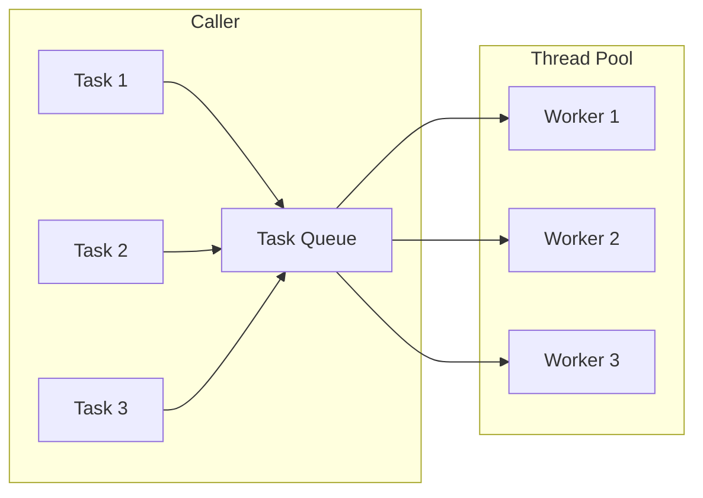
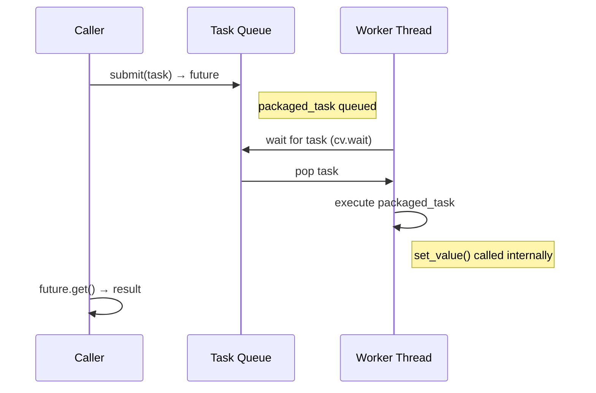

# Thread Pools

C++ has no built-in thread pool (unlike Java's `ExecutorService`). But the standard library gives you all the primitives to build one: `std::thread`, `std::mutex`, `std::condition_variable`, and `std::packaged_task`.

## Why Thread Pools?

Creating a new thread for every task is expensive — each `std::thread` involves a kernel call to allocate a stack and schedule the thread. A thread pool creates a fixed set of worker threads upfront and reuses them:



| Approach | Cost |
|---|---|
| `std::thread` per task | Thread creation + destruction every time |
| `std::async` | Implementation may or may not pool (you have no control) |
| Thread pool | Threads created once, tasks are cheap to submit |

## Building a Thread Pool

A thread pool needs three things:
1. **A task queue** — holds submitted work (thread-safe)
2. **Worker threads** — pull tasks from the queue and execute them
3. **A way to return results** — `std::packaged_task` + `std::future`

### Implementation

```cpp
#include <iostream>
#include <thread>
#include <vector>
#include <queue>
#include <mutex>
#include <condition_variable>
#include <functional>
#include <future>

class ThreadPool {
public:
    ThreadPool(size_t num_threads) : stop(false) {
        for (size_t i = 0; i < num_threads; ++i) {
            workers.emplace_back([this] { worker_loop(); });
        }
    }

    ~ThreadPool() {
        {
            std::unique_lock<std::mutex> lock(mtx);
            stop = true;
        }
        cv.notify_all();
        for (auto& worker : workers) {
            worker.join();
        }
    }

    // Submit a task and get a future for the result
    template <typename F, typename... Args>
    auto submit(F&& f, Args&&... args) -> std::future<decltype(f(args...))> {
        using ReturnType = decltype(f(args...));

        auto task = std::make_shared<std::packaged_task<ReturnType()>>(
            std::bind(std::forward<F>(f), std::forward<Args>(args)...)
        );

        std::future<ReturnType> result = task->get_future();

        {
            std::unique_lock<std::mutex> lock(mtx);
            tasks.push([task]() { (*task)(); });
        }
        cv.notify_one();

        return result;
    }

private:
    void worker_loop() {
        while (true) {
            std::function<void()> task;
            {
                std::unique_lock<std::mutex> lock(mtx);
                cv.wait(lock, [this] { return stop || !tasks.empty(); });

                if (stop && tasks.empty()) return;

                task = std::move(tasks.front());
                tasks.pop();
            }
            task();  // execute outside the lock
        }
    }

    std::vector<std::thread> workers;
    std::queue<std::function<void()>> tasks;

    std::mutex mtx;
    std::condition_variable cv;
    bool stop;
};
```

### How It Works



Step by step:
1. **`submit()`** wraps the callable in a `std::packaged_task`, pushes it onto the queue, and returns a `std::future`
2. **Worker threads** sit in `worker_loop()`, blocked on the condition variable
3. **`cv.notify_one()`** wakes one worker, which pops and executes the task
4. **`std::packaged_task`** automatically stores the return value into the future
5. **Caller** retrieves the result via `future.get()`

### Usage

```cpp
int main() {
    ThreadPool pool(4);  // 4 worker threads

    // Submit tasks and get futures
    auto f1 = pool.submit([] { return 1 + 2; });
    auto f2 = pool.submit([](int a, int b) { return a * b; }, 6, 7);
    auto f3 = pool.submit([] {
        std::this_thread::sleep_for(std::chrono::milliseconds(100));
        return std::string("done");
    });

    std::cout << "f1 = " << f1.get() << std::endl;  // 3
    std::cout << "f2 = " << f2.get() << std::endl;  // 42
    std::cout << "f3 = " << f3.get() << std::endl;  // done

    return 0;
    // ~ThreadPool() joins all workers
}
```

## Comparison with Java

| Java | C++ Equivalent |
|---|---|
| `ExecutorService` | The `ThreadPool` class above |
| `Executors.newFixedThreadPool(4)` | `ThreadPool pool(4)` |
| `executor.submit(callable)` → `Future<T>` | `pool.submit(callable)` → `std::future<T>` |
| `future.get()` | `future.get()` |
| `executor.shutdown()` | Destructor (`~ThreadPool`) |
| Built into `java.util.concurrent` | You build it yourself (or use a library) |

## Libraries

If you don't want to roll your own:

- **Intel TBB** — `tbb::task_group` for task-based parallelism, parallel algorithms
- **Boost.Asio** — `boost::asio::thread_pool` with an executor model
- **BS::thread_pool** — lightweight header-only pool, similar API to what we built above

## What's Coming: C++26 `std::execution`

The long-awaited `std::execution` (P2300) is expected in C++26. It introduces a **sender/receiver** model:

```cpp
// Future C++26 (conceptual)
auto result = std::execution::on(pool_scheduler, [] { return 42; });
```

This would finally give C++ a standard executor framework comparable to Java's.
