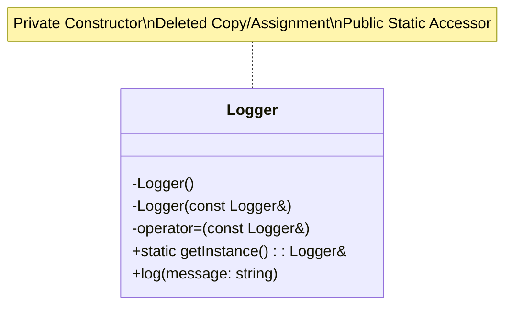

# Singleton Pattern

The Singleton pattern is a creational design pattern that ensures a class has only one instance and provides a global point of access to it.

## Use Cases

Singletons are often used for managing resources that are shared throughout the application, such as:
*   A logging facility
*   A database connection
*   A hardware interface

## Implementation

To implement the Singleton pattern, you need to:
1.  Make the constructor of the class `private` to prevent other classes from creating an instance.
2.  Delete the copy constructor and copy assignment operator to prevent copying of the instance.
3.  Provide a `static` member function that returns a reference to the single instance of the class.

A common way to implement this in C++ is with a "Meyers' Singleton", which uses a `static` variable inside the `getInstance` function. This is thread-safe in C++11 and later.

### Class Diagram




### Example

```cpp
#include <iostream>

class Logger {
public:
    // Delete copy constructor and copy assignment operator
    Logger(const Logger&) = delete;
    Logger& operator=(const Logger&) = delete;

    // Static method to get the single instance
    static Logger& getInstance() {
        static Logger instance; // The single instance
        return instance;
    }

    void log(const std::string& message) {
        std::cout << "[LOG]: " << message << std::endl;
    }

private:
    // Private constructor
    Logger() {}
};

int main() {
    // Get the logger instance
    Logger& logger1 = Logger::getInstance();
    logger1.log("This is the first message.");

    // Get the instance again (it will be the same one)
    Logger& logger2 = Logger::getInstance();
    logger2.log("This is the second message.");

    std::cout << "Address of logger1: " << &logger1 << std::endl;
    std::cout << "Address of logger2: " << &logger2 << std::endl;

    return 0;
}
```

## Drawbacks of the Singleton Pattern

While the Singleton pattern can be useful, it is also one of the most controversial design patterns and is often considered an "anti-pattern" in modern software design.

*   **Global State:** Singletons introduce global state into an application, which can make the code harder to reason about and test.
*   **Violates Single Responsibility Principle:** The class is responsible for both its own logic and for managing its own lifecycle.
*   **Tight Coupling:** Code that uses a singleton is tightly coupled to it, which makes it difficult to reuse that code in a different context.
*   **Multithreading Issues:** While the Meyers' Singleton is thread-safe, other implementations of the singleton pattern may require manual synchronization to be thread-safe.

## Alternatives to Singleton

Before using a singleton, consider if there are better alternatives:
*   **Dependency Injection:** Instead of having a class reach out to a global singleton, pass the dependency (e.g., the logger object) into the class's constructor. This makes the dependencies explicit and makes the class easier to test.
*   **Service Locator:** A service locator is an object that knows how to get all of the services that an application might need. This is still a form of global state, but it can be more flexible than a singleton.

In many cases, a singleton is a sign of a design flaw. However, for some very specific problems (like a logging facility that is truly global), it can be a simple and effective solution.
