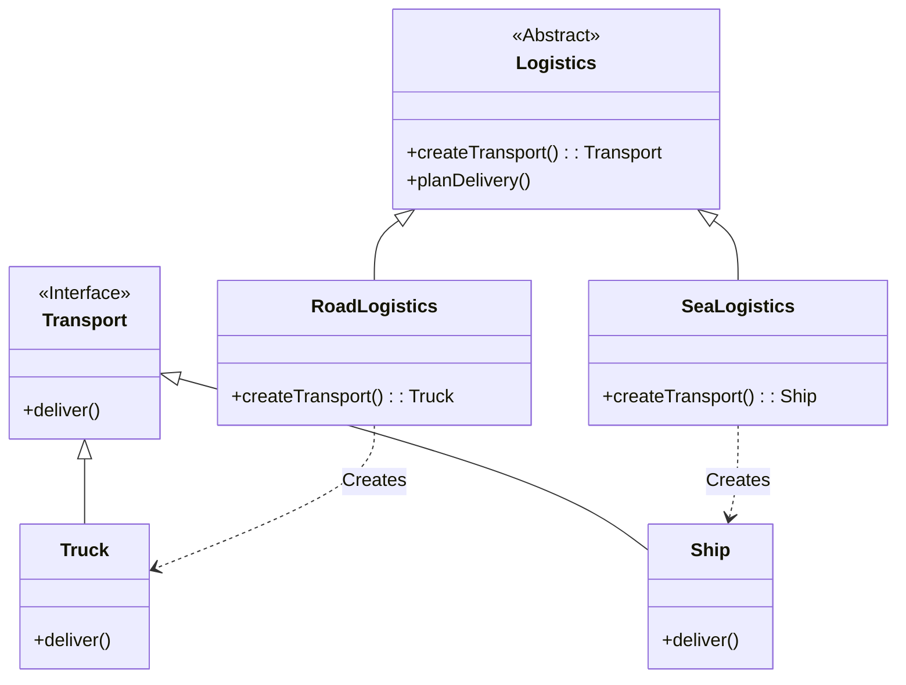

# Factory Method Pattern

The Factory Method is a creational design pattern that provides an interface for creating objects in a superclass, but allows subclasses to alter the type of objects that will be created.

## The Problem

Imagine you are creating a logistics application. In the first version, you only need to transport things by truck. You can just put the code to create a `Truck` object directly into your logistics class.

But then, the app becomes popular, and you need to add sea transportation. Now you need to add `Ship` objects. If you have the object creation code scattered all over your application, you will have to change it in many places.

## The Solution

The Factory Method pattern suggests that you replace direct object construction calls (using the `new` operator) with calls to a special "factory" method. The factory method is responsible for creating the objects.

### Structure

1.  **Product:** An interface for the objects that the factory method creates (e.g., `Transport`).
2.  **Concrete Products:** Concrete classes that implement the `Product` interface (e.g., `Truck`, `Ship`).
3.  **Creator:** A class that declares the factory method, which returns an object of type `Product`. The creator can also provide a default implementation of the factory method.
4.  **Concrete Creators:** Subclasses that override the factory method to change the type of the resulting product.

### Class Diagram




### Example

```cpp
#include <iostream>
#include <string>
#include <memory>

// 1. Product interface
class Transport {
public:
    virtual ~Transport() {}
    virtual void deliver() = 0;
};

// 2. Concrete Products
class Truck : public Transport {
public:
    void deliver() override {
        std::cout << "Delivering by truck." << std::endl;
    }
};

class Ship : public Transport {
public:
    void deliver() override {
        std::cout << "Delivering by ship." << std::endl;
    }
};

// 3. Creator
class Logistics {
public:
    virtual ~Logistics() {}
    // The factory method
    virtual std::unique_ptr<Transport> createTransport() = 0;

    void planDelivery() {
        std::unique_ptr<Transport> transport = createTransport();
        transport->deliver();
    }
};

// 4. Concrete Creators
class RoadLogistics : public Logistics {
public:
    std::unique_ptr<Transport> createTransport() override {
        return std::make_unique<Truck>();
    }
};

class SeaLogistics : public Logistics {
public:
    std::unique_ptr<Transport> createTransport() override {
        return std::make_unique<Ship>();
    }
};

int main() {
    std::unique_ptr<Logistics> logistics;
    
    // Based on some condition (e.g., user input, configuration)
    // we can choose which factory to use.
    bool use_road = true;

    if (use_road) {
        logistics = std::make_unique<RoadLogistics>();
    } else {
        logistics = std::make_unique<SeaLogistics>();
    }

    logistics->planDelivery();

    return 0;
}
```

## Abstract Factory

A related pattern is the **Abstract Factory** pattern. This pattern provides an interface for creating *families* of related or dependent objects without specifying their concrete classes. For example, you might have an `GUIFactory` interface with methods like `createButton()` and `createCheckbox()`. You could then have concrete factories like `WindowsFactory` and `MacFactory` that create Windows-style or Mac-style UI elements.

The Factory Method pattern is a powerful tool for decoupling your code from the concrete classes it needs to create, making your code more flexible and easier to maintain.
