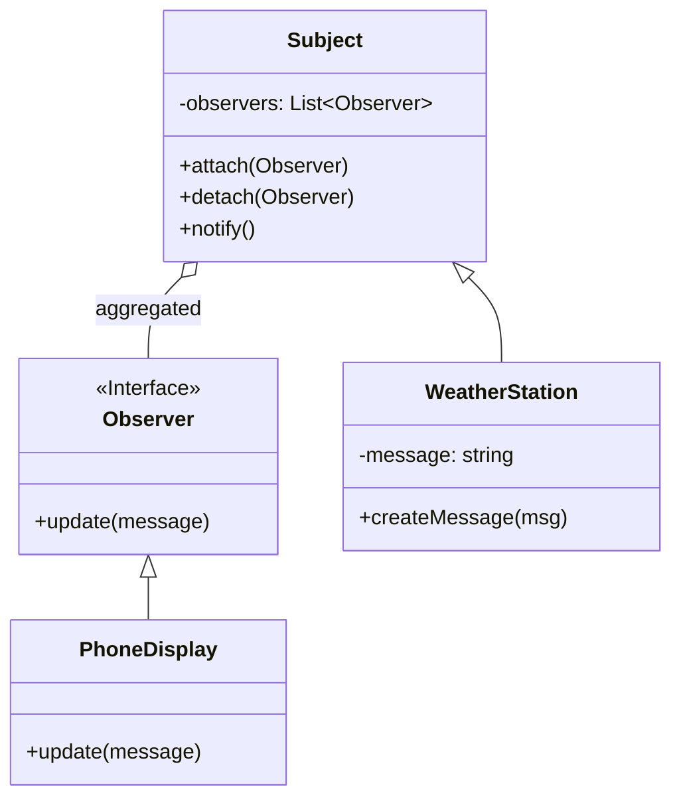

# Observer Pattern

The Observer pattern is a behavioral design pattern that lets you define a subscription mechanism to notify multiple objects about any events that happen to the object they’re observing.

## The Problem

Imagine you have a `Customer` object and a `Store` object. When a new product arrives at the store, you want to notify all interested customers.

You could have the `Store` object maintain a list of `Customer` objects and call a method on each customer when a new product arrives. But this would tightly couple the `Store` to the `Customer` class. What if you later want to notify other objects, like a `Warehouse`? You would have to modify the `Store` class.

## The Solution

The Observer pattern suggests that you have two main components:

1.  **Subject (or Observable):** The object that has some interesting state. It maintains a list of observers and notifies them when its state changes.
2.  **Observer:** An interface that defines an `update` method. All concrete observers implement this interface.

### Structure

*   The **Subject** has methods for attaching, detaching, and notifying observers.
*   When the **Subject**'s state changes, it calls the `notify` method.
*   The `notify` method iterates through the list of observers and calls the `update` method on each one.
*   The **Concrete Observer** implements the `update` method and does something in response to the notification.

### Class Diagram




### Example

```cpp
#include <iostream>
#include <vector>
#include <string>
#include <algorithm>
#include <memory>

// Forward declaration
class Subject;

// 2. Observer interface
class Observer {
public:
    virtual ~Observer() {}
    virtual void update(const std::string& message) = 0;
};

// 1. Subject
class Subject {
private:
    std::vector<Observer*> observers;
    std::string message;

public:
    virtual ~Subject() {}

    void attach(Observer* observer) {
        observers.push_back(observer);
    }

    void detach(Observer* observer) {
        observers.erase(std::remove(observers.begin(), observers.end(), observer), observers.end());
    }

    void notify() {
        for (Observer* observer : observers) {
            observer->update(message);
        }
    }

    void createMessage(const std::string& msg) {
        message = msg;
        notify();
    }
};

// Concrete Subject (e.g., a weather station)
class WeatherStation : public Subject {};

// Concrete Observer (e.g., a phone display)
class PhoneDisplay : public Observer {
public:
    void update(const std::string& message) override {
        std::cout << "Phone Display received update: " << message << std::endl;
    }
};

class TVDisplay : public Observer {
public:
    void update(const std::string& message) override {
        std::cout << "TV Display received update: " << message << std::endl;
    }
};

int main() {
    WeatherStation weatherStation;

    PhoneDisplay phone;
    TVDisplay tv;

    weatherStation.attach(&phone);
    weatherStation.attach(&tv);

    weatherStation.createMessage("Temperature is 25C");

    weatherStation.detach(&tv);

    weatherStation.createMessage("Humidity is 60%");

    return 0;
}
```
*Note: In a real-world application, you would probably want to use smart pointers (`std::weak_ptr` is often a good choice here to avoid ownership cycles) to manage the lifetime of the observers.*

The Observer pattern is very common in GUI programming, where UI elements (observers) need to be updated when the underlying data model (the subject) changes.
