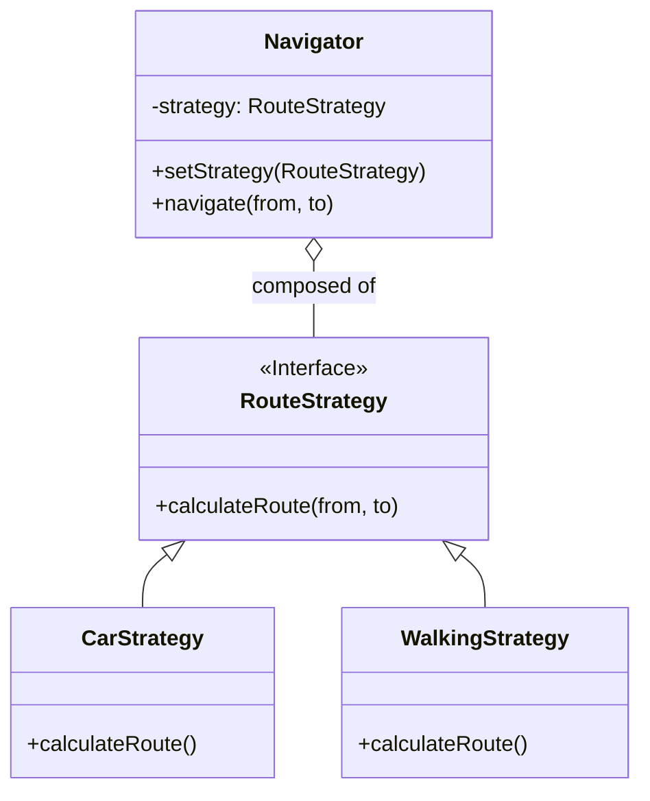

# Strategy Pattern

The Strategy pattern is a behavioral design pattern that enables selecting an algorithm at runtime. Instead of implementing a single algorithm directly, code receives run-time instructions as to which in a family of algorithms to use.

## The Problem

Imagine you are creating a navigation app. You might have several algorithms for calculating a route: the fastest route, the shortest route, the route that avoids tolls, etc.

You could implement all of these algorithms inside your `Navigator` class using a large `if-else` or `switch` statement. But this would make the `Navigator` class large and difficult to maintain. Adding a new routing algorithm would require changing the `Navigator` class.

## The Solution

The Strategy pattern suggests that you take a family of algorithms, put each of them into a separate class, and make their objects interchangeable.

### Structure

1.  **Context:** The class that has a reference to a `Strategy` object. The context delegates the work to the strategy object instead of executing it on its own. (e.g., the `Navigator` class).
2.  **Strategy:** An interface that is common to all algorithms. It declares a method that the context uses to execute the algorithm. (e.g., a `RouteStrategy` interface with a `calculateRoute` method).
3.  **Concrete Strategies:** Concrete classes that implement the `Strategy` interface, each providing a different algorithm. (e.g., `FastestRoute`, `ShortestRoute`).

### Class Diagram




### Example

```cpp
#include <iostream>
#include <string>
#include <memory>
#include <vector>

// 2. Strategy interface
class RouteStrategy {
public:
    virtual ~RouteStrategy() {}
    virtual void calculateRoute(const std::string& origin, const std::string& destination) = 0;
};

// 3. Concrete Strategies
class CarStrategy : public RouteStrategy {
public:
    void calculateRoute(const std::string& origin, const std::string& destination) override {
        std::cout << "Calculating the fastest route for a car from " << origin << " to " << destination << std::endl;
    }
};

class WalkingStrategy : public RouteStrategy {
public:
    void calculateRoute(const std::string& origin, const std::string& destination) override {
        std::cout << "Calculating the shortest walking route from " << origin << " to " << destination << std::endl;
    }
};

class PublicTransportStrategy : public RouteStrategy {
public:
    void calculateRoute(const std::string& origin, const std::string& destination) override {
        std::cout << "Calculating the route using public transport from " << origin << " to " << destination << std::endl;
    }
};

// 1. Context
class Navigator {
private:
    std::unique_ptr<RouteStrategy> strategy;

public:
    void setStrategy(std::unique_ptr<RouteStrategy> s) {
        strategy = std::move(s);
    }

    void navigate(const std::string& origin, const std::string& destination) {
        if (strategy) {
            strategy->calculateRoute(origin, destination);
        } else {
            std::cout << "No strategy set." << std::endl;
        }
    }
};

int main() {
    Navigator navigator;

    navigator.setStrategy(std::make_unique<CarStrategy>());
    navigator.navigate("Home", "Work");

    navigator.setStrategy(std::make_unique<WalkingStrategy>());
    navigator.navigate("Park", "Cafe");

    return 0;
}
```

The Strategy pattern allows you to change the behavior of an object at runtime by changing its strategy. It follows the Open/Closed Principle: you can introduce new strategies without having to modify the context class.
