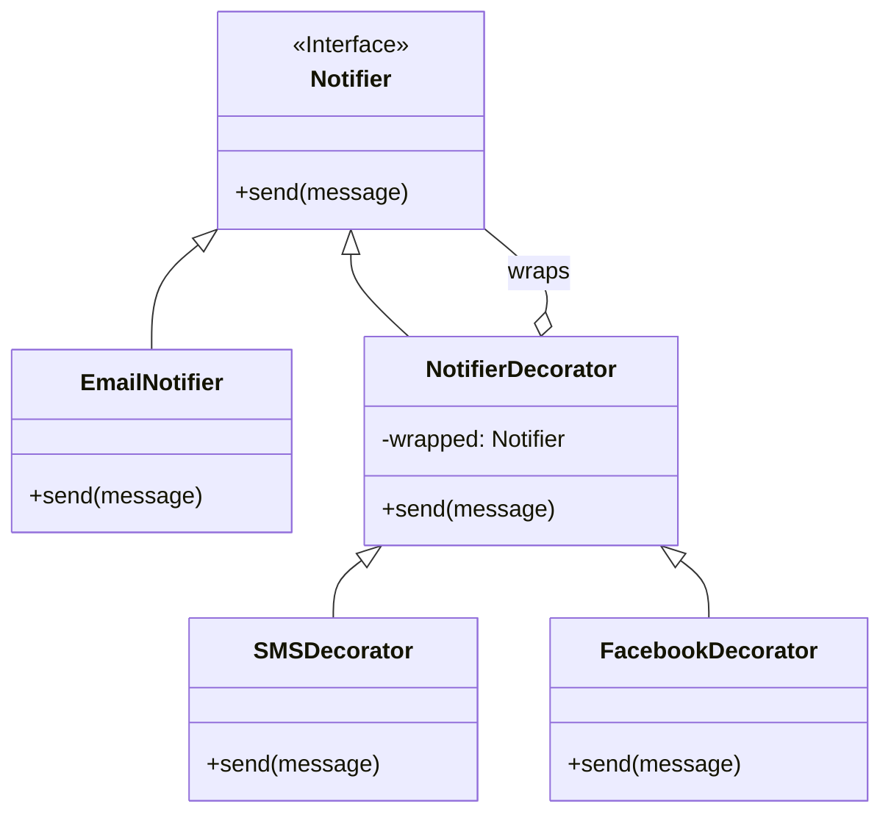

# Decorator Pattern

The Decorator pattern is a structural design pattern that lets you attach new behaviors to objects by placing these objects inside special wrapper objects that contain the behaviors.

## The Problem

Imagine you are working on a notification library. You might have a simple `Notifier` class that sends notifications by email. But now you want to add the ability to send notifications via SMS and Facebook as well.

You could create subclasses like `EmailSmsNotifier`, `EmailFacebookNotifier`, etc., but this would lead to a combinatorial explosion of subclasses.

## The Solution

The Decorator pattern suggests that you create a "wrapper" object that "decorates" the original object. The wrapper has the same interface as the original object, so it can be used in its place.

### Structure

1.  **Component:** The common interface for both wrappers and wrapped objects.
2.  **Concrete Component:** The original object that is being decorated.
3.  **Decorator:** The base class for all decorators. It has a reference to a wrapped object.
4.  **Concrete Decorators:** Classes that contain the additional behavior. A concrete decorator calls the method of the wrapped object and then adds its own behavior.

### Class Diagram




### Example

```cpp
#include <iostream>
#include <string>
#include <memory>

// 1. Component interface
class Notifier {
public:
    virtual ~Notifier() {}
    virtual void send(const std::string& message) = 0;
};

// 2. Concrete Component
class EmailNotifier : public Notifier {
public:
    void send(const std::string& message) override {
        std::cout << "Sending email: " << message << std::endl;
    }
};

// 3. Decorator base class
class NotifierDecorator : public Notifier {
protected:
    std::unique_ptr<Notifier> wrapped;

public:
    NotifierDecorator(std::unique_ptr<Notifier> n) : wrapped(std::move(n)) {}

    void send(const std::string& message) override {
        if (wrapped) {
            wrapped->send(message);
        }
    }
};

// 4. Concrete Decorators
class SMSDecorator : public NotifierDecorator {
public:
    SMSDecorator(std::unique_ptr<Notifier> n) : NotifierDecorator(std::move(n)) {}

    void send(const std::string& message) override {
        NotifierDecorator::send(message); // call the wrapped object first
        std::cout << "Sending SMS: " << message << std::endl;
    }
};

class FacebookDecorator : public NotifierDecorator {
public:
    FacebookDecorator(std::unique_ptr<Notifier> n) : NotifierDecorator(std::move(n)) {}

    void send(const std::string& message) override {
        NotifierDecorator::send(message);
        std::cout << "Sending Facebook message: " << message << std::endl;
    }
};

int main() {
    auto notifier = std::make_unique<EmailNotifier>();
    
    // Now, let's decorate it
    auto sms_and_email_notifier = std::make_unique<SMSDecorator>(std::move(notifier));
    
    // We can decorate it further
    auto all_notifiers = std::make_unique<FacebookDecorator>(std::move(sms_and_email_notifier));

    std::cout << "Sending with all notifiers:\n";
    all_notifiers->send("The new product has arrived!");

    return 0;
}
```

The Decorator pattern allows you to add responsibilities to objects dynamically, without creating a large number of subclasses. It follows the Single Responsibility Principle, as you can divide a monolithic class into a set of smaller classes, each with a single responsibility.
