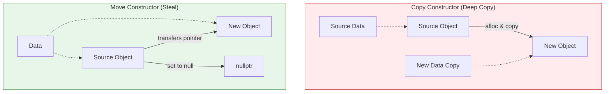

# Move Constructors and Move Assignment Operators

Move semantics is a C++11 feature that allows you to avoid unnecessary copies when working with temporary objects (rvalues). This is achieved through two special member functions: the move constructor and the move assignment operator.

## The Problem: Unnecessary Copies

Consider a class that manages a dynamically allocated resource, like an array.

```cpp
class MyString {
private:
    char* data;
    size_t size;
public:
    // Constructor
    MyString(const char* s = "") {
        size = strlen(s);
        data = new char[size + 1];
        strcpy(data, s);
    }

    // Copy Constructor
    MyString(const MyString& other) {
        size = other.size;
        data = new char[size + 1]; // expensive allocation and copy
        strcpy(data, other.data);
    }

    // Destructor
    ~MyString() {
        delete[] data;
    }
};
```

When you return a `MyString` object from a function, a copy is made.

```cpp
MyString create_string() {
    return MyString("hello"); // returns a temporary (rvalue) MyString object
}

int main() {
    MyString s = create_string(); // the temporary is copied to s
}
```
This copy involves a new memory allocation and a character-by-character copy, which can be expensive. But we know that the temporary object returned from `create_string` is about to be destroyed, so why can't we just "steal" its `data` pointer instead of copying it?

This is exactly what a move constructor does.

### Visualization (Copy vs Move)




## Move Constructor

A move constructor is a constructor that takes an rvalue reference to an object of the same class. Its job is to "steal" the resources from the source object, leaving it in a valid but empty state.

### Syntax

```cpp
MyString(MyString&& other) noexcept { // takes an rvalue reference
    // Steal the resources from 'other'
    data = other.data;
    size = other.size;

    // Leave 'other' in a valid but empty state
    other.data = nullptr;
    other.size = 0;
}
```

*   It's important to mark the move constructor as `noexcept` if it doesn't throw exceptions. This allows for certain optimizations (e.g., in `std::vector`).

Now, when you return a `MyString` from a function, the move constructor will be called instead of the copy constructor, avoiding the expensive copy.

## Move Assignment Operator

Similarly, a move assignment operator is an assignment operator that takes an rvalue reference.

### Syntax

```cpp
MyString& operator=(MyString&& other) noexcept {
    if (this != &other) {
        // Free our own resources
        delete[] data;

        // Steal the resources from 'other'
        data = other.data;
        size = other.size;

        // Leave 'other' in a valid but empty state
        other.data = nullptr;
        other.size = 0;
    }
    return *this;
}
```

## The Rule of Five

Before C++11, there was the "Rule of Three": if you define any of a copy constructor, copy assignment operator, or destructor, you should probably define all three.

With the introduction of move semantics, this has become the **"Rule of Five"**: if you define any of a copy constructor, copy assignment operator, move constructor, move assignment operator, or destructor, you should consider defining all five.

However, in modern C++, the "Rule of Zero" is often preferred: design your classes in such a way that you don't need to define any of these special member functions. This is often achieved by using RAII and smart pointers to manage resources. For example, if `MyString` had used a `std::unique_ptr<char[]>` instead of a raw pointer, the default special member functions would have worked correctly.
